# Enterprise Security Operations Lab


## Overview

This project demonstrates the deployment and operation of an enterprise-style Security Operations Center (SOC) environment built from the ground up using VirtualBox.

The lab uses primarily free and open-source cybersecurity tools to simulate security monitoring, threat detection, vulnerability management, network analysis, threat intelligence, incident response, digital forensics, SQL security analytics, and security automation.

The environment was designed around a resource-efficient five-primary-VM architecture. Compatible security services are consolidated, while resource-intensive tools are started only when needed.

The project provides hands-on experience with technologies and analyst workflows related to the CompTIA CySA+ CS0-004 certification.

The lab includes:

- VirtualBox
- OPNsense
- Suricata
- Wazuh SIEM/XDR
- Windows 11
- Microsoft Sysmon
- Ubuntu Linux
- auditd
- osquery
- Kali Linux
- Nmap
- Wireshark
- Greenbone/OpenVAS
- MISP
- DFIR-IRIS
- YARA
- Volatility 3
- Autopsy
- OWASP ZAP
- PostgreSQL
- SQL security analytics
- Python security automation

The objective is to create an integrated cybersecurity environment where security events can be generated, detected, investigated, correlated, documented, remediated, and validated.

---

# Environment

| Component | Purpose |
|---|---|
| VirtualBox | Virtualization platform |
| OPNsense | Firewall, NAT, routing, and segmentation |
| Suricata | Network IDS/IPS |
| Windows 11 | Windows enterprise endpoint |
| Sysmon | Windows endpoint telemetry |
| Ubuntu Linux | Linux endpoint and controlled target |
| auditd | Linux security auditing |
| osquery | Endpoint visibility and querying |
| Wazuh | SIEM/XDR and centralized monitoring |
| Kali Linux | SOC analyst workstation |
| Nmap | Network and service discovery |
| Wireshark | Packet capture and analysis |
| Greenbone/OpenVAS | Vulnerability management |
| MISP | Threat intelligence and IOC management |
| DFIR-IRIS | Incident response and case management |
| YARA | File identification and detection |
| Volatility 3 | Memory forensics |
| Autopsy | Disk and file forensics |
| OWASP ZAP | Web application security testing |
| PostgreSQL | Security operations database |
| Python | Security automation |

---

# Virtual Machine Architecture

The environment uses **five primary virtual machines**.

| VM | Role | Primary Tools |
|---|---|---|
| VM 1 | Network Security | OPNsense + Suricata |
| VM 2 | Windows Endpoint | Windows 11 + Sysmon + Wazuh Agent |
| VM 3 | Linux Endpoint / Target | Ubuntu + auditd + osquery + Wazuh Agent + vulnerable web application |
| VM 4 | Security Server | Wazuh + PostgreSQL + SecurityOpsDB + Python |
| VM 5 | SOC Analyst | Kali + Nmap + Wireshark + ZAP + YARA + Volatility 3 |

## Phase-Specific Tools

Some heavier tools are used only when required:

- Greenbone/OpenVAS
- MISP
- DFIR-IRIS
- Autopsy

This allows the lab to maintain broad security capabilities without requiring every service to run simultaneously.

---

# Network Topology

The environment uses separate VirtualBox network segments controlled by OPNsense.

## Security LAN

| Setting | Value |
|---|---|
| Network | `10.10.10.0/24` |
| Gateway | `10.10.10.1` |
| Firewall | OPNsense |
| IDS/IPS | Suricata |

## DMZ

| Setting | Value |
|---|---|
| Network | `10.50.20.0/24` |
| Gateway | `10.50.20.1` |
| Purpose | Controlled vulnerable services and security testing |
| Firewall | OPNsense |

## Architecture

```text
                         INTERNET
                            |
                     OPNsense VM
                 Firewall + Suricata
                            |
              +-------------+-------------+
              |                           |
        SECURITY LAN                     DMZ
        10.10.10.0/24               10.50.20.0/24
              |                           |
       +------+------+              Ubuntu Target
       |             |              + Web App
   Windows 11      Kali
   Endpoint       Analyst
       |             |
       +------+------+
              |
       Wazuh/Security VM
              |
       +------+----------------+
       |                       |
   Wazuh SIEM/XDR         PostgreSQL
                               |
                         SecurityOpsDB
                               |
                        Python Automation
```

### Architecture Snapshot


---

# Project Objectives

- Build an enterprise-style cybersecurity environment in VirtualBox
- Configure network segmentation
- Deploy a firewall
- Implement IDS/IPS monitoring
- Monitor Windows and Linux endpoints
- Deploy centralized SIEM/XDR monitoring
- Collect and correlate security logs
- Perform network discovery
- Analyze network traffic
- Conduct vulnerability assessments
- Analyze CVSS and prioritize vulnerabilities
- Perform threat intelligence analysis
- Investigate Indicators of Compromise
- Manage incident-response cases
- Perform file, memory, and disk analysis
- Test web application security
- Build a security operations SQL database
- Apply SQL skills to cybersecurity data
- Automate security operations with Python
- Conduct end-to-end SOC investigations
- Document remediation and validation

---

# Phase 1: VirtualBox Enterprise Environment

## Build the Virtual Lab

VirtualBox provides the virtualization platform for the entire project.

Five primary virtual machines were created.

### VM 1 — OPNsense

- Firewall
- Routing
- NAT
- Network segmentation
- Suricata IDS/IPS

### VM 2 — Windows 11

- Windows endpoint
- Sysmon
- Wazuh Agent
- Windows Event Logs
- PowerShell logging

### VM 3 — Ubuntu

- Linux endpoint
- auditd
- osquery
- Wazuh Agent
- Controlled vulnerable web application

### VM 4 — Security Server

- Wazuh SIEM/XDR
- PostgreSQL
- SecurityOpsDB
- Python

### VM 5 — Kali Linux

- SOC analyst workstation
- Nmap
- Wireshark
- OWASP ZAP
- YARA
- Volatility 3

## Tasks

- [x] Install VirtualBox
- [x] Create five primary VMs
- [x] Create Security LAN
- [x] Create DMZ
- [x] Configure network adapters
- [x] Configure internet connectivity
- [x] Verify communication
- [x] Verify segmentation

### Snapshot 1 — VirtualBox VM Inventory


### Snapshot 2 — VirtualBox Network Configuration


### Snapshot 3 — Windows 11 Network Configuration


At this stage of the build, the Windows 11 SOC endpoint successfully received an IP address from the OPNsense DHCP server on the internal Security LAN.

- IPv4 Address: `10.10.10.123`
- Subnet Mask: `255.255.255.0`
- Default Gateway: `10.10.10.1`

### Snapshot 4 — Windows 11 Network Validation


Connectivity testing confirmed that the Windows 11 endpoint could successfully communicate through the OPNsense security gateway.

- OPNsense gateway (`10.10.10.1`) — reachable
- Internet (`8.8.8.8`) — reachable
- DNS resolution (`google.com`) — successful
- Packet loss — `0%`

### Outcome

A segmented virtual enterprise environment provides the foundation for the security operations lab.

**Phase 1 Status: COMPLETE**

## Phase 1 Troubleshooting and Lessons Learned

Several configuration and validation issues were encountered while building the initial VirtualBox environment.

### OPNsense Initial Configuration

During the initial OPNsense installation, the LAN and DHCP configuration required correction before the internal network operated as intended.

The configuration was reviewed and corrected before continuing with the remaining virtual machines.

This reinforced the importance of validating firewall interface assignments and IP addressing before deploying additional systems.

### VirtualBox Network Configuration

The virtual machines required the correct VirtualBox network adapters to communicate through OPNsense.

Network configuration was validated before security tools were installed to ensure later connectivity problems could be separated from endpoint or security-agent problems.

### Windows Network Validation

After the Windows 11 endpoint was connected to the Security LAN, several connectivity layers were tested independently.

Validation included:

- DHCP address assignment
- Default gateway connectivity
- Internet connectivity
- DNS resolution

The Windows endpoint successfully received an address on the Security LAN and used OPNsense as its default gateway.

### Lesson Learned

Network connectivity should be validated in layers:

```text
Virtual Machine
      |
      v
Network Adapter
      |
      v
IP Configuration
      |
      v
Default Gateway
      |
      v
OPNsense
      |
      v
Internet
      |
      v
DNS Resolution
```

Testing each layer individually makes later troubleshooting easier because network problems can be separated from security-tool configuration problems.
---

# Phase 2: OPNsense Firewall and Segmentation

## Configure OPNsense

OPNsense functions as the primary firewall, router, and gateway for the lab environment.

### Tasks

- [x] Configure WAN
- [x] Configure Security LAN
- [x] Configure DMZ
- [x] Configure NAT
- [x] Configure DHCP
- [x] Create firewall rules
- [x] Restrict inter-network traffic
- [x] Enable security logging
- [x] Validate DMZ segmentation

### Snapshot 1 — OPNsense Dashboard


The OPNsense dashboard confirms that the firewall is operational and the required network interfaces are active.

- WAN: `10.0.2.15/24`
- Security LAN: `10.10.10.1/24`
- DMZ: `10.50.20.1/24`
- WAN gateway — active
- Firewall services — operational
- Internal SOC networks — operational

### Snapshot 2 — Interfaces


### Snapshot 3 — Firewall Rules


### Snapshot 4 — DMZ Segmentation Validation


Firewall logging confirms that traffic originating from the DMZ is blocked from reaching protected systems on the Security LAN.

- Source: `10.50.20.100` — Ubuntu DMZ endpoint
- Destination: `10.10.10.123` — Windows endpoint at the time of this validation
- Protocol: ICMP
- Action: Block
- Firewall rule: `Block DMZ to Security LAN`

The Ubuntu DMZ endpoint retained Internet access while direct communication to the protected Security LAN was denied.

### Outcome

Network traffic is segmented, controlled, and logged by OPNsense.

The DMZ can reach permitted services while unauthorized DMZ-to-Security-LAN communication remains blocked.

**Phase 2 Status: COMPLETE**

## Phase 2 Troubleshooting and Lessons Learned

Phase 2 demonstrated that firewall validation requires testing both permitted and denied traffic rather than relying on a single connectivity test.

### DMZ Segmentation Validation

The Ubuntu endpoint was placed on the isolated DMZ network while the Windows endpoint remained on the protected Security LAN.

Testing confirmed that the Ubuntu endpoint could retain required network connectivity while direct DMZ-to-Security-LAN communication was blocked.

OPNsense firewall logs were reviewed to verify that the failed connection was caused by the intended firewall policy rather than a network configuration failure.

### Firewall Logging

Firewall logs provided evidence showing:

- Source system
- Destination system
- Protocol
- Firewall action
- Matching firewall rule

This demonstrated the importance of using firewall logs during troubleshooting instead of assuming that unsuccessful communication indicates a broken network.

### Allowed vs. Blocked Traffic

A properly segmented network should not simply allow or block everything.

The goal is to permit required communication while denying unauthorized communication between security zones.

The validation process followed:

```text
DMZ Endpoint
     |
     +---- Required Traffic ----> Allowed
     |
     +---- Security LAN Access -> Blocked
                                   |
                                   v
                             OPNsense Log
                                   |
                                   v
                              Verification
```

### Firewall Rule Ordering

OPNsense firewall rules must be evaluated in the correct order.

Specific permitted traffic should be defined narrowly while broader segmentation rules continue to protect the Security LAN.

This became especially important later when the Ubuntu Wazuh Agent required TCP port `1514` access to the Wazuh manager without allowing unrestricted DMZ-to-Security-LAN communication.

### Lesson Learned

Network segmentation should be validated from both directions:

1. Confirm traffic that **should be allowed** succeeds.
2. Confirm traffic that **should be blocked** fails.
3. Review firewall logs to verify the reason.
4. Confirm that security controls did not unintentionally remove required connectivity.

This provides stronger evidence that the firewall policy is operating as designed.

---

# Phase 3: Endpoint Security Monitoring

Phase 3 focused on deploying and validating endpoint security monitoring across both Windows and Linux systems.

The objective was to generate detailed endpoint telemetry, configure centralized log forwarding, and verify that both endpoints could communicate with the Wazuh security server.

The two monitored endpoints are:

- **SOC-Windows11** — Windows 11 enterprise endpoint
- **SOC-Ubuntu** — Ubuntu Linux endpoint located in the isolated DMZ

---

## Windows 11 Endpoint

The Windows 11 VM represents an enterprise workstation configured to generate detailed endpoint security telemetry.

### Configuration

- [x] Microsoft Sysmon
- [x] Wazuh Agent
- [x] Windows Security auditing
- [x] Process creation auditing
- [x] Command-line process logging
- [x] PowerShell script-block logging
- [x] Windows Application log monitoring
- [x] Centralized Wazuh communication

---

## Windows Process Creation Auditing

Advanced Audit Policy was configured to record successful process creation events.

Configuration path:

`Computer Configuration → Windows Settings → Security Settings → Advanced Audit Policy Configuration → System Audit Policies → Detailed Tracking → Audit Process Creation`

Process creation auditing was enabled for successful events.

Windows was also configured to include command-line information inside process creation events:

`Computer Configuration → Administrative Templates → System → Audit Process Creation → Include command line in process creation events`

### Validation

Windows Event Viewer confirmed successful generation of:

`Security Event ID 4688`

Event ID `4688` records newly created processes and provides important endpoint telemetry for security investigations.

Validation confirmed:

- Audit Success events generated
- Event ID `4688`
- New Process Name recorded
- Creator Process Name recorded
- Process Command Line recorded

### Snapshot 1 — Windows Endpoint


### Snapshot 2 — Windows Process Creation Auditing


Security Event ID `4688` confirms that Windows process creation auditing and command-line logging are operational.

---

## Microsoft Sysmon

Microsoft Sysmon was installed on the Windows endpoint to provide enhanced endpoint telemetry beyond standard Windows logging.

Sysmon telemetry is available through:

`Applications and Services Logs → Microsoft → Windows → Sysmon → Operational`

### Sysmon Process Monitoring

Sysmon Event ID `1` was validated.

Event ID `1` records process creation and provides detailed information including:

- Process image
- Command line
- User
- Parent process
- Process ID
- Parent process ID
- File hashes
- Process GUID

### Snapshot 3 — Sysmon Events


Sysmon Event ID `1` confirms successful process creation monitoring.

---

## PowerShell Logging

PowerShell logging was configured to provide additional visibility into PowerShell activity on the Windows endpoint.

PowerShell Operational logs were reviewed through Windows Event Viewer.

### Validation

PowerShell Event ID:

`4104`

was generated and reviewed.

Event ID `4104` records PowerShell script-block activity and provides additional visibility into commands and scripts executed through PowerShell.

This telemetry can assist with detecting suspicious PowerShell activity commonly associated with administrative abuse, malware, and post-exploitation activity.

---

## Windows Wazuh Agent

The Wazuh Agent was installed on the Windows 11 endpoint and registered with the centralized Wazuh manager.

The Wazuh agent service was verified using PowerShell:

```powershell
Get-Service wazuhsvc
```

The service returned:

```text
Running
```

The Windows endpoint was configured to communicate with the Wazuh manager at:

`10.10.10.102:1514/TCP`

Agent logs confirmed:

```text
Connected to the server ([10.10.10.102]:1514/tcp).
```

Windows Application event log monitoring was also confirmed through the Wazuh agent logs:

```text
Analyzing event log: 'Application'.
```

### Windows Application Log Validation

A controlled Windows Application event was generated.

The test event contained:

- Log: `Application`
- Source: `WazuhTest`
- Event ID: `1001`
- Level: `Warning`
- Message: `SOC-LAB TEST: Windows Wazuh logging validation`

The event was verified locally in the Windows Application log.

This validated:

- Windows Application logging
- Controlled event generation
- Wazuh Application log monitoring configuration
- Wazuh Agent connectivity

### Snapshot 4 — Windows Wazuh Agent


The Windows endpoint is successfully registered with and communicating with the Wazuh manager.

---

## Ubuntu Linux Endpoint

The Ubuntu VM represents a Linux endpoint and controlled security target located inside the isolated DMZ.

### Endpoint Configuration

- [x] auditd
- [x] osquery
- [x] Wazuh Agent
- [x] Linux audit logging
- [x] System monitoring
- [x] DMZ-to-Wazuh firewall exception
- [x] Centralized Wazuh communication

The Ubuntu endpoint is assigned:

- Hostname: `soc-ubuntu`
- IP Address: `10.50.20.100`
- Network: DMZ `10.50.20.0/24`
- Gateway: `10.50.20.1`

### Snapshot 5 — Ubuntu Endpoint


The Ubuntu system information confirms that the Linux endpoint is operating inside the isolated VirtualBox DMZ.

---

## Linux Auditing with auditd

Linux auditing was configured using `auditd`.

A controlled test file was monitored using an audit rule with the key:

`audit_test`

The `ausearch` utility was used to retrieve security events associated with the monitored file.

Example:

```bash
sudo ausearch -k audit_test
```

Captured audit records included:

- SYSCALL
- PATH
- PROCTITLE
- CONFIG_CHANGE
- User information
- Process information
- File activity
- Successful system activity

### Snapshot 6 — Linux Security Monitoring


The auditd validation confirms that Linux security events are being recorded and can be queried using `ausearch`.

---

## osquery Endpoint Visibility

osquery was installed to provide additional endpoint visibility and SQL-based operating-system querying.

The default Ubuntu package repositories did not initially provide the required osquery package.

The official osquery repository was therefore added.

During installation, a malformed repository entry was identified and corrected before installation could continue successfully.

After installation, the `osqueryd` daemon initially appeared inactive and disabled.

The service was enabled and started using:

```bash
sudo systemctl enable --now osqueryd
```

Service status was then verified as:

```text
active (running)
```

osquery provides visibility into:

- Operating system configuration
- Running processes
- Users
- Network information
- Installed software
- Services
- System configuration

This provides an additional endpoint investigation capability alongside auditd and Wazuh.

---

## Ubuntu Wazuh Agent

The Wazuh Agent was installed and configured on the Ubuntu endpoint.

The Ubuntu endpoint communicates from:

`10.50.20.100`

to the Wazuh manager:

`10.10.10.102`

using:

`TCP 1514`

Because the DMZ is intentionally isolated from the Security LAN, a narrow OPNsense firewall exception was created specifically for Wazuh communication.

The rule permits:

`SOC-Ubuntu → SOC-Wazuh → TCP 1514`

while the broader DMZ-to-Security-LAN blocking policy remains in place.

---

## DMZ-to-Wazuh Connectivity Validation

Standard ICMP testing is not sufficient for validating this connection because ICMP traffic from the DMZ to the Security LAN remains intentionally blocked.

Instead, connectivity was validated against the actual Wazuh service port.

```bash
nc -vz 10.10.10.102 1514
```

Successful connectivity demonstrated that the firewall permits the required Wazuh traffic without removing the broader DMZ isolation policy.

---

## Wazuh Agent Enrollment

During initial Wazuh Agent enrollment, the Ubuntu agent temporarily reported that the Wazuh server was unavailable.

Troubleshooting included reviewing:

```bash
/var/ossec/logs/ossec.log
```

The logs initially contained connection warnings before the agent successfully authenticated with the Wazuh manager.

The enrollment process eventually:

1. Contacted the Wazuh manager
2. Authenticated the endpoint
3. Received a valid agent key
4. Established the Wazuh connection

Agent logs ultimately confirmed:

```text
Connected to the server ([10.10.10.102]:1514/tcp).
```

A message stating:

```text
No authentication password provided
```

also appeared during enrollment.

Because subsequent log entries confirmed successful key exchange, authentication, and connectivity, this message was informational in the successful enrollment sequence rather than evidence that enrollment failed.

---

## Ubuntu Security Event Validation

A controlled logging event was generated on Ubuntu:

```bash
sudo logger "SOC-LAB TEST: Ubuntu Wazuh logging validation"
```

The event successfully appeared in the centralized Wazuh environment.

This demonstrated the complete telemetry path:

```text
Ubuntu Endpoint
      |
      v
Linux Logging
      |
      v
Wazuh Agent
      |
      v
OPNsense Firewall
      |
      | TCP 1514
      v
Wazuh Manager
```

---

### Snapshot 7 — Wazuh Endpoint Telemetry

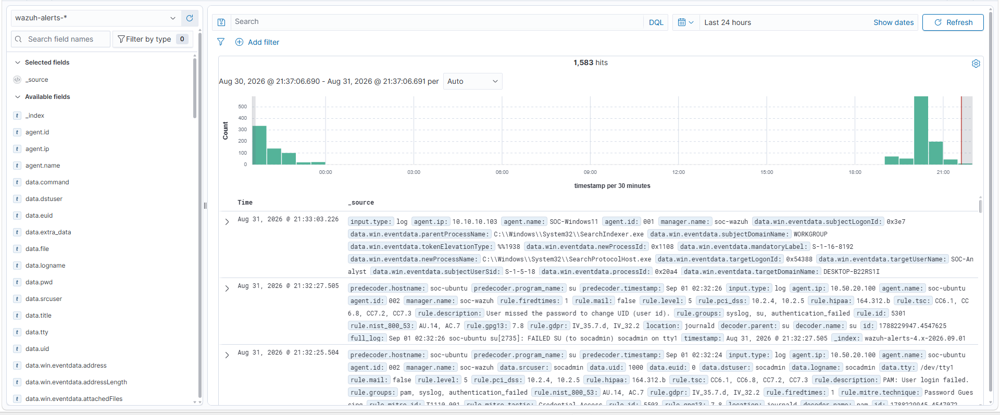

Wazuh Discover confirms that endpoint telemetry is reaching the centralized Wazuh environment.

The event stream shows telemetry associated with:

- `SOC-Windows11`
- `soc-ubuntu`
- Wazuh manager `soc-wazuh`

The Windows event shown in the evidence identifies:

- Agent: `SOC-Windows11`
- Agent IP: `10.10.10.103`

The Ubuntu events identify:

- Agent: `soc-ubuntu`
- Agent IP: `10.50.20.100`

This provides evidence that both monitored endpoints are communicating with the centralized Wazuh infrastructure.

---

## Ubuntu Authentication Failure Validation

Controlled failed authentication activity was generated on the Ubuntu endpoint.

Wazuh successfully received and processed the resulting authentication events.

### Snapshot 8 — Ubuntu Authentication Failure Detection

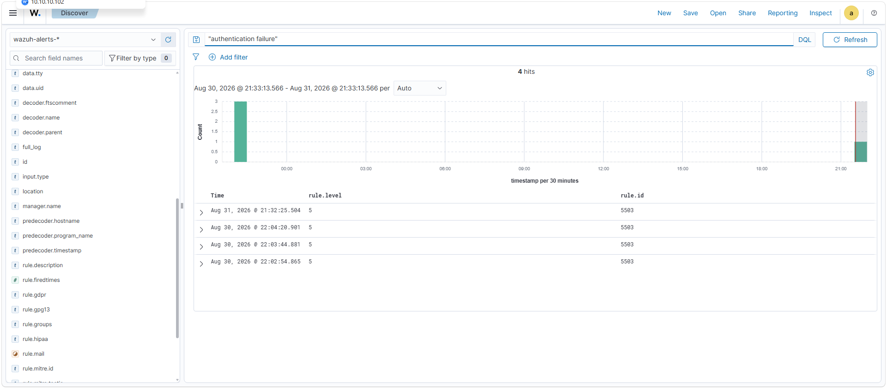

A search for:

```text
"authentication failure"
```

returned multiple matching Wazuh alerts.

The evidence confirms:

- Rule ID: `5503`
- Rule Level: `5`
- Authentication-failure telemetry
- Multiple matching events

The detailed Wazuh event identified the detection as:

```text
PAM: User login failed
```

This demonstrates that Linux authentication telemetry is reaching Wazuh and being processed by the platform's detection rules.

Detailed alert investigation and correlation are covered in Phase 4.

---

### Snapshot 9 — Ubuntu Wazuh Alert Validation

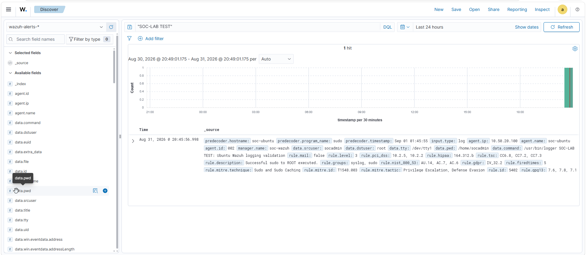

The controlled Ubuntu logging test:

```bash
sudo logger "SOC-LAB TEST: Ubuntu Wazuh logging validation"
```

was successfully located in Wazuh Discover.

The event confirms:

- Agent: `soc-ubuntu`
- Agent IP: `10.50.20.100`
- Manager: `soc-wazuh`
- Controlled test activity successfully reached Wazuh
- Wazuh rule processing occurred

The event shown in Wazuh included the command:

```text
/usr/bin/logger SOC-LAB TEST: Ubuntu Wazuh logging validation
```

This validates the complete endpoint telemetry path:

```text
Controlled Ubuntu Activity
          |
          v
      Linux Logging
          |
          v
       Wazuh Agent
          |
          v
   OPNsense Firewall
          |
      TCP 1514
          |
          v
      Wazuh Manager
          |
          v
     Wazuh Discover
```

---

## Phase 3 Troubleshooting and Lessons Learned

Several configuration and integration problems were documented during Phase 3.

### Windows Event IDs

Windows Security Event ID `4688` and Sysmon Event ID `1` both provide process-creation information but originate from different telemetry sources.

| Event | Source | Purpose |
|---|---|---|
| `4688` | Windows Security | Native process creation auditing |
| `1` | Microsoft Sysmon | Enhanced process creation telemetry |
| `4104` | PowerShell Operational | PowerShell script-block logging |

Understanding the difference between these telemetry sources is important during endpoint investigations.

### osquery Installation

Ubuntu could not initially locate the osquery package using the default repository configuration.

The official osquery repository had to be added.

A malformed repository entry was then identified and corrected before installation could proceed.

### osquery Service

After installation, `osqueryd` initially appeared inactive and disabled.

The issue was corrected using:

```bash
sudo systemctl enable --now osqueryd
```

### Wazuh Agent Connectivity

The Ubuntu Wazuh Agent initially generated server connectivity warnings.

Rather than immediately reinstalling the agent, the logs were reviewed to determine whether communication eventually succeeded.

Subsequent log entries confirmed successful authentication and connection to:

`10.10.10.102:1514/TCP`

### Firewall Validation

Because the DMZ is intentionally isolated from the Security LAN, a failed ping between Ubuntu and the Security LAN does not necessarily indicate that Wazuh communication is broken.

The actual service port should be tested:

```bash
nc -vz 10.10.10.102 1514
```

This allows the required Wazuh connection to be tested without weakening the segmentation policy.

### Firewall Rule Ordering

OPNsense evaluates firewall rules according to their configured order.

The narrow Ubuntu-to-Wazuh TCP `1514` allow rule must therefore be evaluated before the broader DMZ-to-Security-LAN blocking rule.

This allows required security telemetry while maintaining network segmentation.

---

## Endpoint Troubleshooting Methodology

A major lesson from Phase 3 was to validate each layer individually:

```text
Generate Event
      |
      v
Verify Local Log
      |
      v
Verify Security Agent
      |
      v
Verify Network Port
      |
      v
Verify Firewall Policy
      |
      v
Verify Manager Connection
      |
      v
Verify Centralized Telemetry
```

This approach makes it easier to determine whether a problem exists at the:

- Endpoint
- Logging layer
- Security agent
- Firewall
- Network
- Wazuh manager
- Centralized monitoring layer

---

# Phase 3 Outcome

Endpoint security monitoring is operational across both Windows and Linux systems.

The Windows 11 endpoint now provides:

- Windows Security auditing
- Event ID `4688` process creation telemetry
- Command-line process auditing
- Sysmon Event ID `1` telemetry
- PowerShell Event ID `4104` logging
- Windows Application event monitoring
- Wazuh Agent connectivity

The Ubuntu endpoint now provides:

- auditd security auditing
- osquery endpoint visibility
- Linux system logging
- Wazuh Agent connectivity
- Controlled DMZ-to-Wazuh communication
- Authentication-failure telemetry
- Successful centralized test-event validation

Both endpoints successfully communicate with the centralized Wazuh infrastructure while maintaining the intended network segmentation.

Phase 3 demonstrates the endpoint telemetry pipeline:

```text
Windows 11                         Ubuntu Linux
    |                                  |
    +-- Windows Security               +-- auditd
    +-- Sysmon                         +-- osquery
    +-- PowerShell Logs                +-- Linux Logs
    |                                  |
    +---------- Wazuh Agents ----------+
                    |
                    v
              OPNsense Firewall
                    |
                    v
               Wazuh Manager
```

## Phase 3 Evidence

```text
Snapshot 1 — Windows Endpoint
Snapshot 2 — Windows Process Creation Auditing
Snapshot 3 — Sysmon Events
Snapshot 4 — Windows Wazuh Agent
Snapshot 5 — Ubuntu Endpoint
Snapshot 6 — Linux Security Monitoring
Snapshot 7 — Wazuh Endpoint Telemetry
Snapshot 8 — Ubuntu Authentication Failure Detection
Snapshot 9 — Ubuntu Wazuh Alert Validation
```

**Phase 3 Status: COMPLETE**

The endpoint telemetry infrastructure is now ready for centralized SIEM/XDR monitoring, alert investigation, correlation, and SOC analyst workflows in Phase 4.

---

# Phase 4: Wazuh SIEM/XDR

## Centralized Security Monitoring and SOC Investigation

Phase 4 focused on using Wazuh as the centralized SIEM/XDR platform for security-event monitoring, detection analysis, alert investigation, MITRE ATT&CK mapping, file-integrity monitoring, and SOC analyst workflows.

Telemetry generated by the Windows and Ubuntu endpoints was collected and analyzed through the centralized Wazuh environment.

### Monitored Endpoints

| Endpoint | IP Address | Network | Role |
|---|---|---|---|
| SOC-Windows11 | `10.10.10.100` | Security LAN | Windows enterprise endpoint |
| soc-ubuntu | `10.50.20.100` | DMZ | Linux endpoint / controlled target |

---

## Wazuh Infrastructure Validation

The centralized Wazuh infrastructure was verified before performing security investigations.

The following services were confirmed operational:

- `wazuh-manager`
- `wazuh-indexer`
- `wazuh-dashboard`

The Wazuh Dashboard was accessible over HTTPS on TCP port `443`.

### Snapshot 1 — Wazuh Dashboard


The dashboard provided centralized visibility into endpoint security alerts, File Integrity Monitoring, Threat Hunting, MITRE ATT&CK mappings, and other security capabilities.

---

## Ubuntu Authentication Failure Investigation

Controlled failed-authentication activity from the Ubuntu endpoint was investigated through Wazuh Threat Hunting.

The search was filtered to:

- Agent: `soc-ubuntu`
- Manager: `soc-wazuh`
- Event: `authentication failure`

Wazuh identified the events as:

- Rule ID: `5503`
- Rule Level: `5`
- Description: `PAM: User login failed.`
- Rule Groups: `pam`, `syslog`, `authentication_failed`

### Snapshot 2 — Authentication Investigation

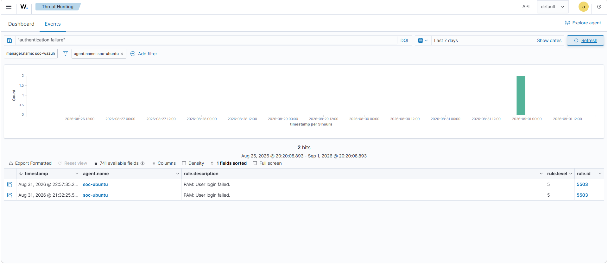

The investigation demonstrated how an analyst can filter centralized security telemetry by endpoint and detection type.

---

## MITRE ATT&CK Analysis

The Ubuntu authentication alert contained MITRE ATT&CK information that provided additional context for the detected behavior.

Wazuh mapped the event to:

- MITRE ATT&CK ID: `T1110.001`
- Tactic: `Credential Access`
- Technique: `Password Guessing`

### Snapshot 3 — Authentication MITRE ATT&CK Mapping

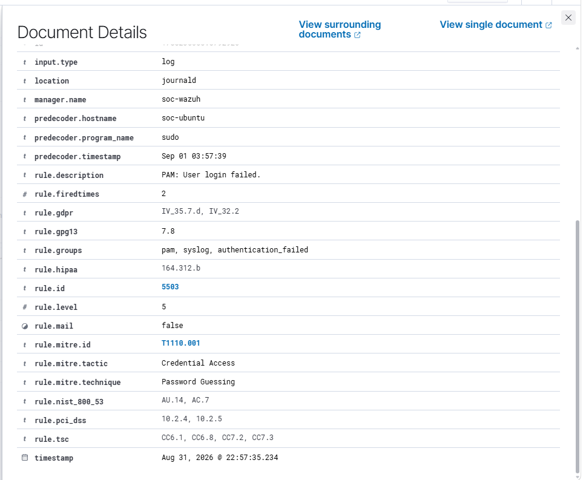

This demonstrated how SIEM detections can be enriched with MITRE ATT&CK information to help analysts understand the security behavior represented by an alert.

---

## Windows Process Investigation

Windows process-creation telemetry was investigated through the centralized Wazuh environment.

Wazuh processed Windows Security Event ID `4688` and generated process-creation alerts.

The investigation identified:

- Agent: `SOC-Windows11`
- Agent IP: `10.10.10.100`
- Rule ID: `67027`
- Rule Level: `3`
- Description: `A process was created.`

Detailed event fields provided information such as:

- Process command line
- New process name
- Parent process
- Process ID
- User context
- Windows Security channel

### Snapshot 4 — Windows Process Investigation

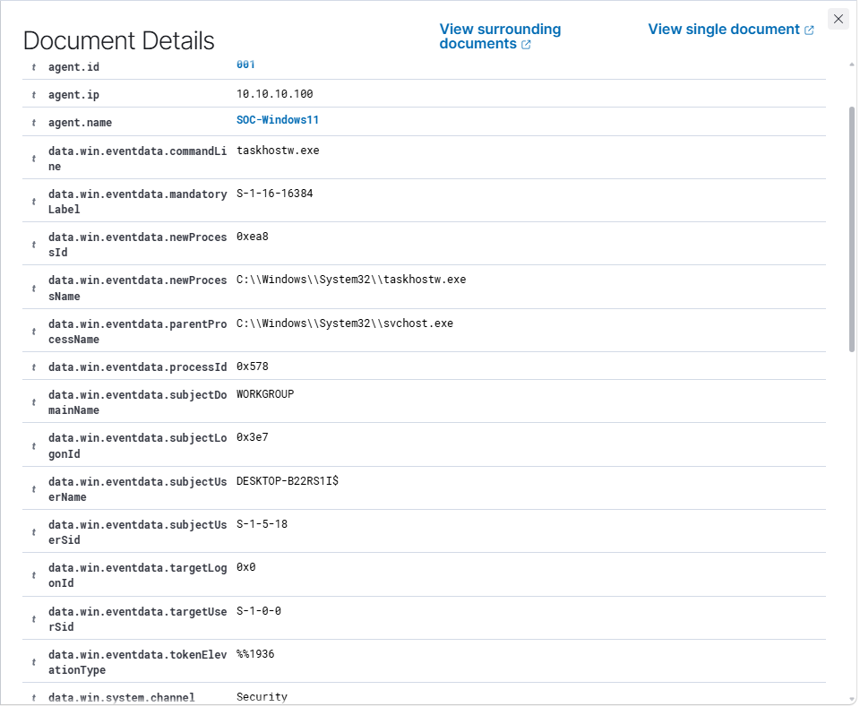

This demonstrated how centralized endpoint telemetry can be used to reconstruct Windows process activity during an investigation.

---

## Controlled File Integrity Monitoring Detection

A dedicated directory was configured on the Windows endpoint for controlled File Integrity Monitoring testing:

```text
C:\SOC-FIM-Test
```

Wazuh realtime monitoring was configured for this directory.

A controlled test file was then created:

```text
C:\SOC-FIM-Test\phase4-fim-test.txt
```

Wazuh detected the new file and generated:

- Rule ID: `554`
- Rule Level: `5`
- Description: `File added to the system.`

The file was then modified.

Wazuh detected the modification and generated:

- Rule ID: `550`
- Rule Level: `7`
- Description: `Integrity checksum changed.`

### Snapshot 5 — Controlled FIM Detection

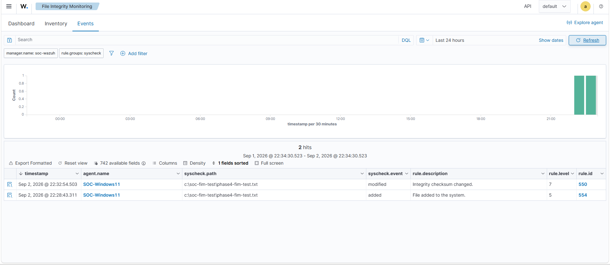

The evidence shows both the original file creation and the subsequent modification.

This validates the detection flow:

```text
Controlled File Activity
        |
        v
Windows File System
        |
        v
Wazuh Agent / Syscheck
        |
        v
Integrity Analysis
        |
        v
Wazuh Detection Rule
        |
        v
SOC Alert
```

---

## File Integrity Alert Analysis

The modified-file alert was opened in Wazuh for detailed investigation.

The event identified:

- Agent: `SOC-Windows11`
- Agent IP: `10.10.10.100`
- Decoder: `syscheck_integrity_changed`
- Location: `syscheck`
- Rule ID: `550`
- Rule Level: `7`
- Description: `Integrity checksum changed.`

Wazuh recorded changes to multiple file attributes, including:

- File size
- Modification time
- MD5
- SHA1
- SHA256

The alert was also mapped to:

- MITRE ATT&CK ID: `T1565.001`
- Tactic: `Impact`

### Snapshot 6 — FIM Alert Analysis

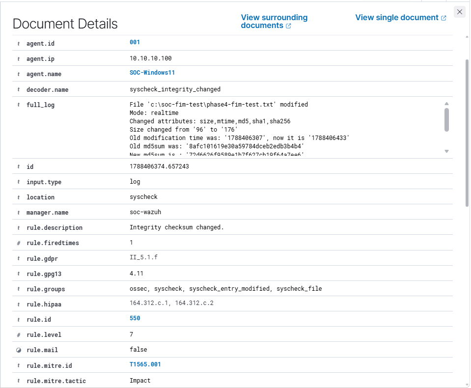

This demonstrates how File Integrity Monitoring can identify and provide forensic details about changes made to monitored files.

---

## Event Context and Correlation

Wazuh's surrounding-document functionality was used to examine events occurring near the controlled FIM detection.

### Snapshot 7 — Event Correlation

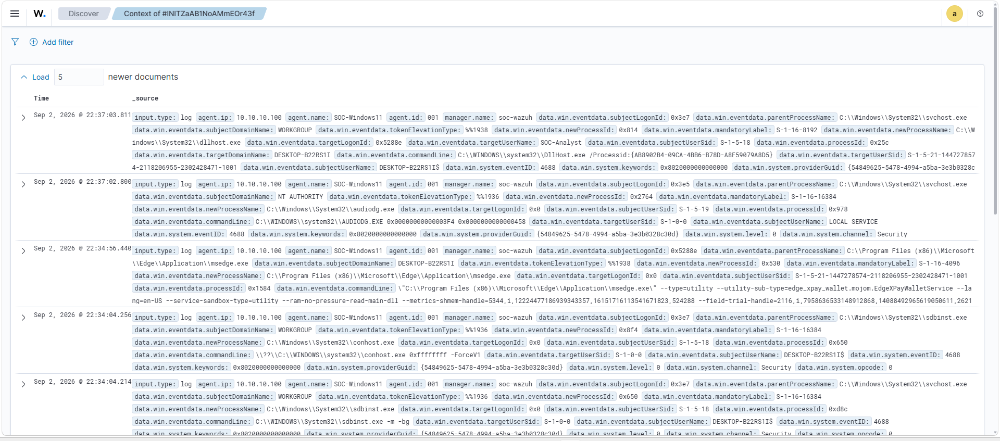

Nearby Windows process-creation events included telemetry for processes such as:

- `dllhost.exe`
- `audiodg.exe`
- `msedge.exe`
- `conhost.exe`
- `sdbinst.exe`

These surrounding events were reviewed as contextual telemetry.

They were not automatically treated as the cause of the file-integrity alert.

This demonstrates an important SOC investigation principle:

```text
Alert
  |
  v
Review Detection
  |
  v
Identify Endpoint
  |
  v
Examine Surrounding Events
  |
  v
Build Timeline
  |
  v
Determine Whether Events Are Related
```

Correlation requires evidence before concluding that two events are causally related.

---

## Phase 4 Troubleshooting and Lessons Learned

### Wazuh FIM Configuration Error

During File Integrity Monitoring configuration, a custom monitored directory was added to the Windows Wazuh Agent configuration.

The intended configuration was:

```xml
<directories realtime="yes">C:\SOC-FIM-Test</directories>
```

A malformed closing tag caused the Wazuh Agent configuration file to become invalid.

The Wazuh Agent subsequently failed to start and generated XML parsing errors in:

```text
C:\Program Files (x86)\ossec-agent\ossec.log
```

Reviewing the service log identified the configuration problem.

After correcting the XML syntax, the Wazuh Agent successfully returned to:

```text
Running
```

### Lesson Learned

Security-agent configuration files must maintain valid syntax.

A single malformed XML character can prevent a security service from starting.

When a service fails immediately after a configuration change, the troubleshooting process should be:

```text
Configuration Change
        |
        v
Service Failure
        |
        v
Review Service Status
        |
        v
Review Application Logs
        |
        v
Identify Configuration Error
        |
        v
Correct Configuration
        |
        v
Restart Service
        |
        v
Validate Telemetry
```

---

## Wazuh Dashboard Connectivity Troubleshooting

During Phase 4, the Wazuh Dashboard temporarily became unreachable from the Windows endpoint.

Troubleshooting was performed at multiple layers.

The Wazuh server network configuration confirmed:

- Wazuh server IP: `10.10.10.102`
- Interface operational
- Default gateway reachable

Wazuh services were checked and confirmed active:

- `wazuh-dashboard`
- `wazuh-indexer`
- `wazuh-manager`

TCP port `443` was also confirmed listening on the Wazuh server.

Connectivity from the Windows endpoint was validated using TCP testing against port `443`.

After connectivity recovered, the Wazuh Dashboard became accessible again.

During troubleshooting, the Wazuh VM console also displayed Linux watchdog and CPU soft-lockup messages, indicating that VM resource pressure or scheduling stalls may have contributed to the temporary loss of responsiveness.

### Lesson Learned

Application connectivity should be troubleshot in layers:

```text
Client
  |
  v
IP Connectivity
  |
  v
Server Network Interface
  |
  v
Service Status
  |
  v
Listening Port
  |
  v
TCP Connectivity
  |
  v
Web Application
```

A running application service does not by itself prove that a client can reach the application.

---

# Phase 4 Outcome

Phase 4 successfully demonstrated centralized SIEM/XDR monitoring and SOC investigation using Wazuh.

The completed work included:

- Centralized Windows and Linux security monitoring
- Wazuh service validation
- Authentication-failure investigation
- Wazuh rule and severity analysis
- MITRE ATT&CK mapping
- Windows process-creation investigation
- Controlled File Integrity Monitoring
- File creation detection
- File modification detection
- File hash and metadata analysis
- Event-context investigation
- SOC-style alert correlation
- Security-agent troubleshooting
- Layered SIEM connectivity troubleshooting

The Phase 4 workflow demonstrated:

```text
Endpoint Activity
       |
       v
Security Telemetry
       |
       v
Wazuh Agent
       |
       v
Wazuh Manager
       |
       v
Detection Rules
       |
       v
Security Alert
       |
       v
Analyst Investigation
       |
       v
MITRE ATT&CK Context
       |
       v
Event Correlation
       |
       v
Document Findings
```

## Phase 4 Evidence

```text
Snapshot 1 — Wazuh Dashboard
Snapshot 2 — Ubuntu Authentication Investigation
Snapshot 3 — Authentication MITRE ATT&CK Mapping
Snapshot 4 — Windows Process Investigation
Snapshot 5 — Controlled FIM Detection
Snapshot 6 — FIM Alert Analysis
Snapshot 7 — Event Correlation
```

**Phase 4 Status: COMPLETE**

The centralized SIEM/XDR environment is now ready to integrate network IDS/IPS telemetry during Phase 5.

---

# Phase 5: Suricata IDS/IPS

## Network Threat Detection

Phase 5 focused on deploying, configuring, troubleshooting, and validating Suricata network intrusion detection on the OPNsense firewall.

The objective was to monitor traffic entering the DMZ, generate controlled security activity from the Kali analyst workstation, and verify that Suricata could inspect network traffic and generate alerts for reconnaissance and HTTP communication.

The systems used during Phase 5 were:

| System | IP Address | Network | Role |
|---|---|---|---|
| SOC-Kali | `10.10.10.103` | Security LAN | Analyst / controlled traffic source |
| SOC-Ubuntu | `10.50.20.100` | DMZ | Linux endpoint / controlled target |
| SOC-OPNsense | `10.10.10.1` / `10.50.20.1` | LAN / DMZ | Firewall + Suricata IDS |

---

## Suricata Configuration

Suricata was enabled through the OPNsense Intrusion Detection service.

The DMZ interface was monitored so that traffic directed toward the Ubuntu target could be inspected.

Suricata provided visibility into:

- Network reconnaissance
- Port scanning
- Suspicious network connections
- HTTP communication
- IDS signatures
- Custom detection rules
- Source and destination addresses
- Source and destination ports
- Network protocols

The monitoring path was:

```text
SOC-Kali
10.10.10.103
     |
     v
OPNsense Firewall
     |
     v
Suricata IDS
     |
     v
DMZ
     |
     v
SOC-Ubuntu
10.50.20.100
```

---

## Suricata Service Validation

Before generating controlled security traffic, the Suricata configuration and service status were validated.

The Suricata configuration was tested using:

```bash
suricata -T -c /usr/local/etc/suricata/suricata.yaml
```

The command returned an exit status of:

```text
0
```

This confirmed that the Suricata configuration successfully passed validation.

The Suricata build information was also reviewed.

Netmap support was confirmed:

```text
Netmap support: yes v14+
```

This verified that the installed Suricata build supports Netmap functionality used for IPS operation.

---

## Suricata Service Troubleshooting

During configuration changes, the OPNsense interface returned:

```text
Error reconfiguring IDS
Error (1)
```

Suricata logs were reviewed to determine whether the engine was experiencing a configuration or runtime failure.

The active Suricata logs were identified under:

```text
/var/log/suricata/
```

Important log files included:

```text
eve.json
stats.log
latest.log
suricata_YYYYMMDD.log
```

The Suricata engine log showed that the engine was capable of starting:

```text
This is Suricata version 8.0.6 RELEASE running in SYSTEM mode
Threads created
Engine started.
```

The log later showed:

```text
Signal Received. Stopping engine.
```

A configuration validation test was therefore performed using:

```bash
suricata -T -c /usr/local/etc/suricata/suricata.yaml
```

The command completed successfully with exit status:

```text
0
```

This demonstrated an important distinction:

**A valid Suricata configuration does not necessarily mean that the Suricata service is currently running.**

---

## Suricata Process Validation

The running Suricata process was checked using:

```bash
pgrep -af suricata
```

During troubleshooting, this initially returned no active Suricata process.

The service status was also checked using:

```bash
service suricata status
```

and through the OPNsense configuration framework:

```bash
configctl ids status
```

These checks confirmed that Suricata was not running at that point.

The IDS service was then started using:

```bash
configctl ids start
```

OPNsense returned:

```text
OK
```

The Suricata process was checked again:

```bash
pgrep -af suricata
```

A running process was now present.

The service was independently validated using:

```bash
service suricata status
```

which confirmed that Suricata was running.

This demonstrated that service validation should include both configuration testing and runtime process verification.

---

## Packet Processing Validation

After confirming that the Suricata service was running, packet statistics were reviewed.

The Suricata statistics log was located at:

```text
/var/log/suricata/stats.log
```

Packet-processing counters including:

```text
capture.kernel_packets
decoder.pkts
```

contained non-zero values.

This confirmed that Suricata was not simply running as a process.

The engine was actively receiving and decoding network traffic.

The validation process therefore became:

```text
Suricata Configuration
        |
        v
Configuration Test
        |
        v
Service Status
        |
        v
Running Process
        |
        v
Packet Processing
        |
        v
Controlled Traffic
        |
        v
Detection
        |
        v
Alert
```

---

## Controlled Reconnaissance Testing

The Kali Linux analyst workstation was used to generate authorized reconnaissance traffic against the Ubuntu endpoint inside the isolated lab.

Before scanning, connectivity to the target was validated.

Ubuntu was reachable at:

```text
10.50.20.100
```

A controlled TCP SYN scan was then performed from Kali:

```bash
sudo nmap -sS -p 1-10000 10.50.20.100
```

The scan tested TCP ports `1-10000`.

The target exposed services including:

```text
22/tcp — SSH
80/tcp — HTTP
```

The remaining tested ports were closed.

This generated realistic reconnaissance traffic for Suricata to inspect.

---

## Custom Reconnaissance Detection

A custom Suricata detection was configured:

```text
Internal Recon - Kali to Ubuntu
```

The rule was designed to identify controlled network traffic originating from the Kali analyst workstation and targeting the Ubuntu DMZ system.

Suricata successfully detected the reconnaissance activity.

Alert information included:

- Source: `10.10.10.103`
- Destination: `10.50.20.100`
- Interface: `DMZ`
- Detection: `Internal Recon - Kali to Ubuntu`
- Action: `allowed`

Multiple alerts were generated as Nmap probed different destination ports.

This validated the network detection path:

```text
SOC-Kali
   |
   | Nmap SYN Scan
   v
OPNsense
   |
   v
Suricata Inspection
   |
   v
Custom Detection Rule
   |
   v
IDS Alert
   |
   v
SOC Analyst Review
```

### Snapshot 1 — Nmap Reconnaissance Detection

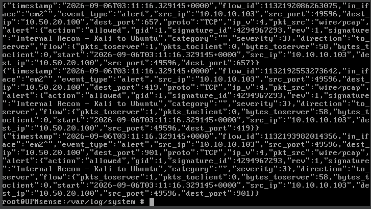

### Snapshot 2 — Suricata Nmap Alert Dashboard

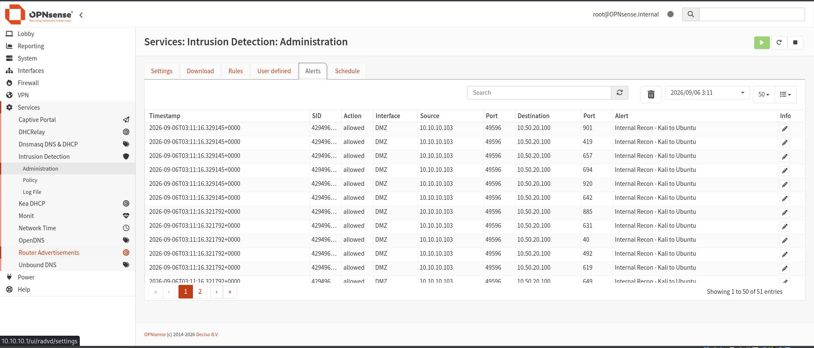

---

## Suricata EVE Alert Validation

Suricata's structured EVE event log was reviewed directly:

```text
/var/log/suricata/eve.json
```

The event records showed Suricata alerts containing information such as:

- Event type
- Source IP
- Destination IP
- Source port
- Destination port
- Network protocol
- Interface
- Detection signature
- Alert severity
- Alert action

The reconnaissance events identified:

```text
event_type: alert
src_ip: 10.10.10.103
dest_ip: 10.50.20.100
signature: Internal Recon - Kali to Ubuntu
```

This provided command-line evidence that Suricata was generating structured security events.

---

## OPNsense Alert Dashboard Validation

The same reconnaissance activity was reviewed through the OPNsense Intrusion Detection Alerts dashboard.

The dashboard displayed multiple alerts associated with the controlled Nmap scan.

The evidence showed:

- Source: `10.10.10.103`
- Destination: `10.50.20.100`
- Interface: `DMZ`
- Alert: `Internal Recon - Kali to Ubuntu`
- Action: `allowed`

This provided graphical validation of the same security activity recorded in the EVE event log.

The combination of raw event data and graphical alert review demonstrated two different methods for validating Suricata detections.

---

## Controlled HTTP Traffic Testing

Phase 5 also tested Suricata visibility into HTTP communication.

A temporary Python HTTP server was started on the Ubuntu DMZ endpoint:

```bash
sudo python3 -m http.server 80
```

The server listened on:

```text
0.0.0.0:80
```

This provided a controlled HTTP service at:

```text
http://10.50.20.100
```

The Kali analyst workstation then generated an HTTP request using:

```bash
curl http://10.50.20.100
```

Ubuntu returned an HTML directory listing.

This confirmed successful HTTP communication:

```text
SOC-Kali
10.10.10.103
      |
      | HTTP GET
      v
OPNsense / Suricata
      |
      | TCP 80
      v
SOC-Ubuntu
10.50.20.100
```

---

## Initial HTTP Detection

The HTTP request was first detected by the existing broad custom rule:

```text
Internal Recon - Kali to Ubuntu
```

The alert identified:

- Source: `10.10.10.103`
- Destination: `10.50.20.100`
- Destination Port: `80`
- Interface: `DMZ`
- Action: `allowed`

This confirmed that Suricata could see the HTTP connection.

However, it also demonstrated that a broad source-to-destination rule can detect both reconnaissance and normal application traffic.

A more descriptive custom detection was therefore created for the HTTP test.

---

## Custom HTTP Detection

A second custom Suricata detection was configured:

```text
Kali to Ubuntu Http Detection
```

Controlled HTTP traffic was generated again from Kali:

```bash
curl http://10.50.20.100
```

Suricata successfully generated the new detection.

The alert showed:

- Source: `10.10.10.103`
- Destination: `10.50.20.100`
- Destination Port: `80`
- Interface: `DMZ`
- Detection: `Kali to Ubuntu Http Detection`
- Action: `allowed`

The broader reconnaissance rule also detected the connection.

This demonstrated how multiple detection rules can match the same network activity depending on their scope.

### Snapshot 3 — HTTP Detection

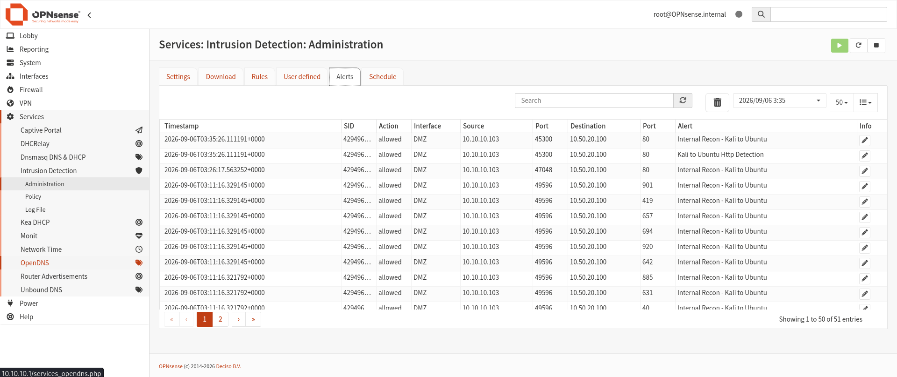

---

## Detection Engineering Observation

The custom reconnaissance rule was intentionally broad enough to identify Kali-to-Ubuntu traffic.

During HTTP testing, the same rule also generated an alert for legitimate TCP port `80` communication.

This demonstrated an important detection-engineering principle:

**A detection can technically match traffic while still being too broad to accurately describe the behavior.**

Broad rules may produce unnecessary alerts or classify normal activity as suspicious.

Detection rules should therefore be designed with sufficient context to distinguish between:

- Normal network communication
- Reconnaissance
- Administrative activity
- Application traffic
- Potentially malicious behavior

The Phase 5 testing demonstrated why detection logic should be validated against both suspicious and expected traffic.

---

## IDS vs IPS Analysis

Suricata supports both Intrusion Detection System and Intrusion Prevention System functionality.

IDS behavior follows:

```text
Network Traffic
      |
      v
Suricata Inspection
      |
      v
Signature Match
      |
      v
Alert
      |
      v
Traffic Continues
```

IPS operation adds the ability to drop traffic that matches configured prevention rules:

```text
Network Traffic
      |
      v
Suricata Inspection
      |
      v
Signature Match
      |
      v
Drop / Block
```

Netmap IPS capability was investigated during Phase 5.

The installed Suricata build reported:

```text
Netmap support: yes v14+
```

However, the completed Phase 5 validation focused on reliable **IDS detection and alert generation**.

The validated alerts therefore showed:

```text
Action: allowed
```

This confirms that the traffic was detected and logged rather than blocked.

Future IPS testing can build on this validated IDS baseline.

---

## Phase 5 Troubleshooting and Lessons Learned

Several important troubleshooting lessons were documented during the Suricata deployment and testing.

### Configuration Validation Does Not Equal Service Operation

The command:

```bash
suricata -T -c /usr/local/etc/suricata/suricata.yaml
```

returned exit status:

```text
0
```

This proved that the configuration was valid.

However, Suricata was not running at that point.

Therefore:

```text
Valid Configuration ≠ Running Security Service
```

Both conditions must be validated independently.

---

### Service Validation Requires Multiple Checks

Suricata was validated using several methods:

```bash
pgrep -af suricata
```

```bash
service suricata status
```

```bash
configctl ids status
```

Each command provided a different view of the IDS state.

After starting Suricata using:

```bash
configctl ids start
```

the process and service checks confirmed successful operation.

---

### Packet Counters Confirm Actual Inspection

A running process alone does not prove that Suricata is receiving traffic.

Reviewing:

```text
/var/log/suricata/stats.log
```

and confirming non-zero packet counters demonstrated that network traffic was actually reaching the inspection engine.

This provided stronger validation than service status alone.

---

### Logs Should Be Located Before Troubleshooting

The Suricata logs on OPNsense were identified under:

```text
/var/log/suricata/
```

Important files included:

```text
eve.json
stats.log
latest.log
suricata_YYYYMMDD.log
```

Identifying the correct log location prevented troubleshooting from relying only on generic GUI error messages.

---

### Warnings Are Not Necessarily Fatal Errors

Suricata generated flowbit-related warnings during startup.

The engine nevertheless reported:

```text
Engine started.
```

This demonstrated that warnings must be interpreted in context.

A warning does not automatically mean that the security service failed.

---

### HTTP Service Validation

During HTTP testing, the temporary Python HTTP server was accidentally stopped before a Kali request was generated.

The resulting curl request failed because TCP port `80` was no longer listening.

The server was restarted using:

```bash
sudo python3 -m http.server 80
```

and the test succeeded.

This reinforced the troubleshooting workflow:

```text
Connection Failure
       |
       v
Check Target Service
       |
       v
Check Listening Port
       |
       v
Check Network Connectivity
       |
       v
Check Firewall
       |
       v
Check IDS
```

A failed network-security test does not automatically mean that the firewall or IDS is malfunctioning.

---

### Detection Rules Must Be Tested Against Normal Traffic

The broad reconnaissance rule also matched normal HTTP traffic between the same source and destination.

This demonstrated that detection rules should be tested against:

1. Traffic that should trigger the rule.
2. Traffic that should not trigger the rule.
3. Different protocols and ports.
4. Normal application behavior.
5. Controlled suspicious behavior.

This helps identify overly broad rules and potential false positives.

---

## Phase 5 Outcome

Phase 5 successfully demonstrated network intrusion detection using Suricata integrated with OPNsense.

The completed work included:

- Suricata configuration on OPNsense
- DMZ network monitoring
- Suricata configuration validation
- Netmap capability verification
- Suricata service troubleshooting
- Process validation
- Packet-processing validation
- Controlled Kali-to-Ubuntu reconnaissance
- Nmap SYN scanning
- Custom reconnaissance detection
- Raw EVE event analysis
- OPNsense alert-dashboard validation
- Controlled HTTP traffic generation
- Custom HTTP detection
- Detection-rule behavior analysis
- IDS versus IPS analysis
- Network security troubleshooting

The final validated workflow was:

```text
SOC-Kali
10.10.10.103
      |
      | Controlled Security Traffic
      |
      +---- Nmap Reconnaissance
      |
      +---- HTTP Traffic
      |
      v
OPNsense Firewall
      |
      v
Suricata IDS
      |
      +---- Internal Recon Detection
      |
      +---- HTTP Detection
      |
      v
Security Alert
      |
      v
OPNsense Alerts Dashboard
      |
      v
SOC Analyst Validation
```

## Phase 5 Evidence

```text
Snapshot 1 — Nmap Reconnaissance Detection
Snapshot 2 — Suricata Nmap Alert Dashboard
Snapshot 3 — HTTP Detection
```

**Phase 5 Status: COMPLETE**

The Suricata IDS environment is operational and successfully detects controlled reconnaissance and HTTP traffic between the Security LAN and DMZ.

The environment is now ready for deeper network discovery and packet-level traffic analysis during Phase 6.

---

## Phase 6 — Incident Generation, Detection, and Correlation

### Objective

Phase 6 validates the end-to-end SOC detection and investigation workflow by generating controlled security activity from the Kali analyst system and correlating network-based Suricata alerts with endpoint-based Wazuh alerts.

The primary systems involved were:

| System | Role | IP Address |
|---|---|---|
| SOC-Kali | Analyst / Controlled Attack Source | `10.10.10.103` |
| SOC-OPNsense | Firewall / Suricata IDS | `10.10.10.1` |
| SOC-Ubuntu | DMZ Target / Wazuh Agent | `10.50.20.100` |
| SOC-Wazuh | SIEM / XDR Manager | `10.10.10.102` |

The investigation workflow was:

```text
SOC-Kali
10.10.10.103
     |
     | Reconnaissance / HTTP / SSH
     v
OPNsense + Suricata
Network Detection
     |
     v
SOC-Ubuntu
10.50.20.100
     |
     | Endpoint telemetry
     v
Wazuh Agent
     |
     v
SOC-Wazuh
Detection + Investigation + MITRE Mapping
```

The goal was not simply to generate traffic, but to prove that the lab could **generate, detect, investigate, correlate, and document** suspicious activity across multiple security layers.

---

### 6.1 Nmap Reconnaissance

Controlled reconnaissance was generated from SOC-Kali (`10.10.10.103`) against the SOC-Ubuntu DMZ target (`10.50.20.100`).

Connectivity to the target was first verified before Nmap was used to enumerate exposed services.

Example reconnaissance command:

```bash
sudo nmap -sS -sV 10.50.20.100
```

The scan confirmed that the Ubuntu target was reachable and identified SSH (`TCP/22`) as an exposed service.

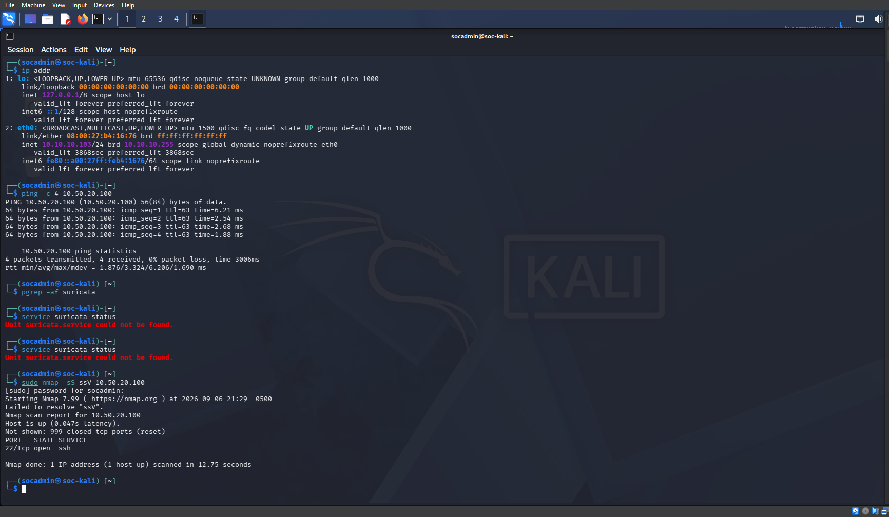

This established the reconnaissance stage of the controlled incident and generated network traffic that could be inspected by Suricata.

---

### 6.2 Suricata Reconnaissance Detection

Because traffic between the Security LAN and DMZ traverses OPNsense, Suricata was positioned to inspect traffic generated from Kali toward Ubuntu.

Suricata recorded activity with:

- **Source:** `10.10.10.103`
- **Destination:** `10.50.20.100`
- **Interface:** DMZ
- **Action:** Alert / Allowed

Custom Suricata detections generated alerts including:

- `Internal Recon - Kali to Ubuntu`
- `Kali to Ubuntu Http Detection`

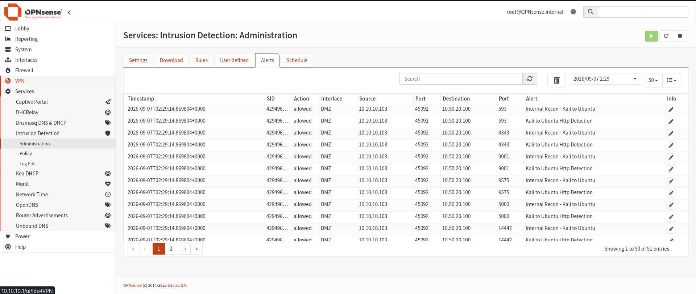

This confirmed that the IDS was actively inspecting traffic crossing the segmented lab environment.

---

### 6.3 Controlled SSH Authentication Failure

After reconnaissance identified SSH on SOC-Ubuntu, a controlled failed authentication attempt was generated from Kali.

The following SSH attempt was used:

```bash
ssh phase6test@10.50.20.100
```

The intentionally invalid username `phase6test` was used to generate authentication-failure telemetry.

The connection reached the Ubuntu SSH service, authentication failed, and the server closed the connection after the unsuccessful password attempts.

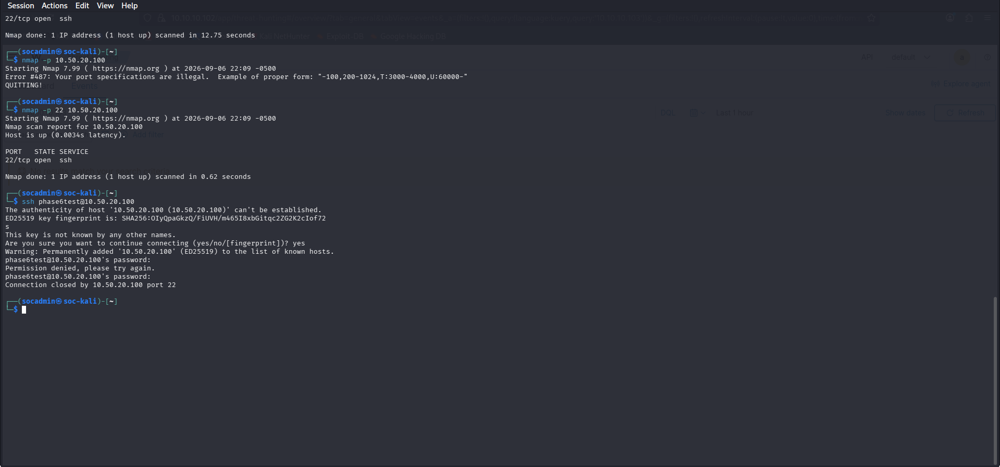

This provided endpoint authentication activity that could later be compared with Suricata's network telemetry.

---

### 6.4 Wazuh SSH Detection

The Wazuh agent installed on SOC-Ubuntu collected the authentication events generated by the failed SSH attempt and forwarded them to the Wazuh manager.

Threat Hunting showed three related events, including:

- **Rule 5710** — `sshd: Attempt to login using a non-existent user`
- **Rule 5503** — `PAM: User login failed.`
- **Rule Level:** `5`
- **Agent:** `soc-ubuntu`

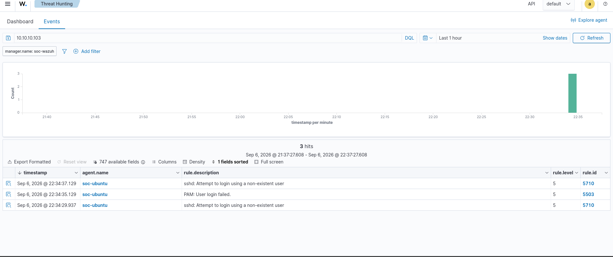

This confirmed that authentication telemetry generated on the Ubuntu endpoint successfully reached the centralized Wazuh SIEM.

---

### 6.5 Wazuh SSH Event Investigation

The SSH detection was expanded in Wazuh to examine the underlying event fields.

The event details showed:

- **Agent ID:** `002`
- **Agent Name:** `soc-ubuntu`
- **Agent IP:** `10.50.20.100`
- **Source IP:** `10.10.10.103`
- **Source User:** `phase6test`
- **Decoder:** `sshd`
- **Rule ID:** `5710`
- **Rule Level:** `5`
- **Rule Description:** `sshd: Attempt to login using a non-existent user`

The raw event also recorded:

```text
Failed password for invalid user phase6test from 10.10.10.103
```

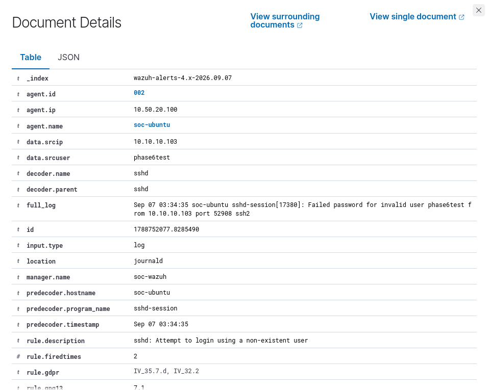

The source IP recorded by Wazuh directly matches the SOC-Kali system used to generate the controlled activity.

---

### 6.6 MITRE ATT&CK Mapping

Wazuh enriched the SSH authentication event with MITRE ATT&CK information.

The event was associated with:

- **T1110.001 — Password Guessing**
- **T1021.004 — SSH**

The corresponding tactics displayed by Wazuh included:

- **Credential Access**
- **Lateral Movement**

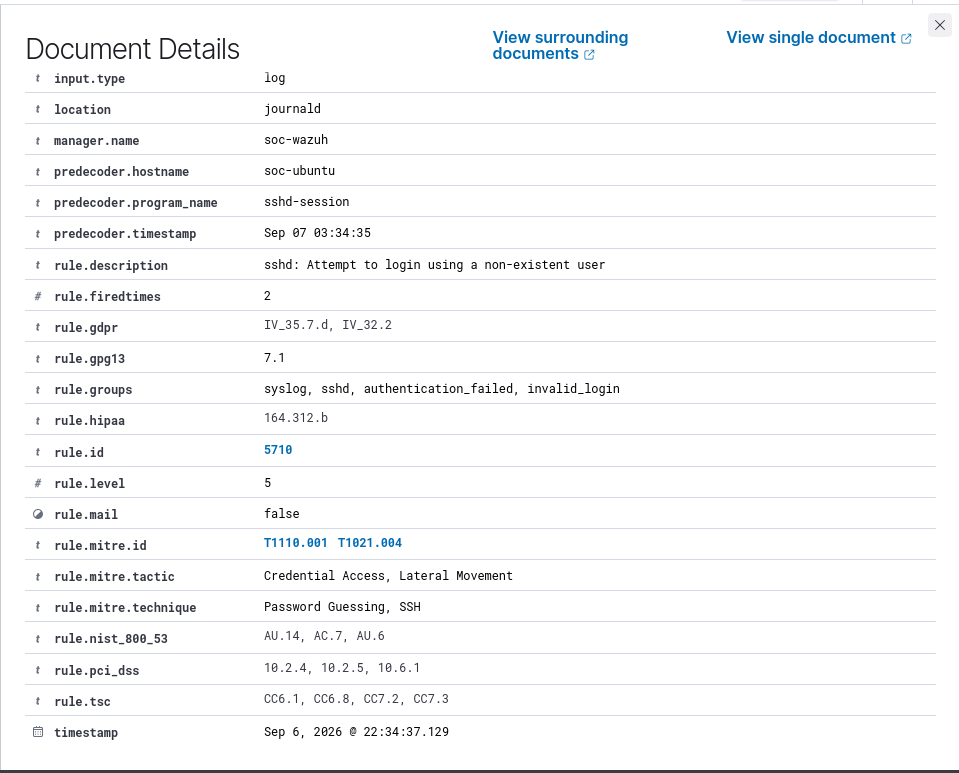

This enrichment demonstrates how SIEM telemetry can convert a raw authentication event into security context that helps an analyst understand the behavior represented by the alert.

---

### 6.7 Suricata and Wazuh SSH Correlation

Suricata network telemetry was compared with the endpoint telemetry recorded by Wazuh.

Suricata observed traffic originating from:

```text
10.10.10.103
```

and targeting:

```text
10.50.20.100
```

including traffic involving destination port `22`.

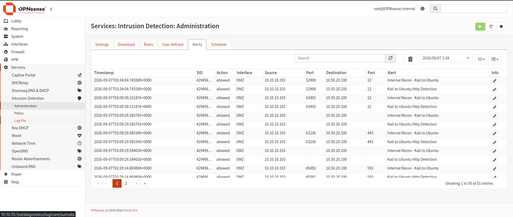

Wazuh independently recorded the failed SSH authentication from the same Kali source IP on SOC-Ubuntu.

The evidence can therefore be correlated as:

```text
10.10.10.103
SOC-Kali
     |
     | TCP/22
     v
Suricata
Network Visibility
     |
     v
10.50.20.100
SOC-Ubuntu
     |
     | Failed password
     | Invalid user: phase6test
     v
Wazuh Agent
     |
     v
Wazuh SIEM
Rule 5710 / Level 5
```

This demonstrates an important SOC investigation principle: network and endpoint telemetry can be combined to provide greater context than either data source alone.

---

### 6.8 Nmap HTTP Reconnaissance

Additional reconnaissance was performed against the HTTP service on SOC-Ubuntu.

Suricata detected the traffic generated by Nmap and recorded both custom alerts and an ET Open signature.

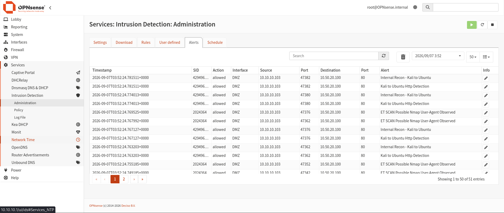

The alerts showed repeated communication between:

- **Source:** `10.10.10.103`
- **Destination:** `10.50.20.100`
- **Destination Port:** `80`
- **Interface:** DMZ

This demonstrated that Suricata could observe application-layer reconnaissance in addition to basic network scanning.

---

### 6.9 ET Open Nmap Detection

Suricata's ET Open ruleset generated the following detection:

```text
ET SCAN Possible Nmap User-Agent Observed
```

The detailed alert contained:

- **Alert SID:** `2024364`
- **Protocol:** TCP
- **Source IP:** `10.10.10.103`
- **Destination IP:** `10.50.20.100`
- **Destination Port:** `80`
- **Interface:** DMZ
- **HTTP Hostname:** `10.50.20.100`
- **HTTP URL:** `/HNAP1`
- **HTTP User-Agent:** `Mozilla/5.0 (compatible; Nmap Scripting Engine; https://nmap.org/book/nse.html)`

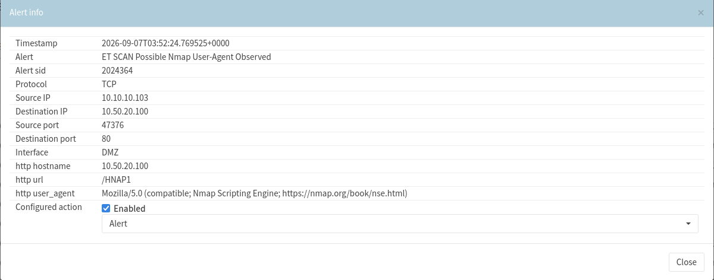

This detection provides stronger context than a generic connection alert because Suricata identified an HTTP User-Agent associated with the Nmap Scripting Engine.

---

### 6.10 Web Enumeration with Gobuster

Additional HTTP enumeration was generated against the Ubuntu web server using Gobuster.

The directory enumeration used the Kali wordlist:

```text
/usr/share/wordlists/dirb/common.txt
```

Example:

```bash
gobuster dir -u http://10.50.20.100 -w /usr/share/wordlists/dirb/common.txt
```

Gobuster generated thousands of HTTP requests while attempting to identify files and directories on the target web server.

Suricata observed the resulting traffic and generated repeated alerts between Kali and Ubuntu.

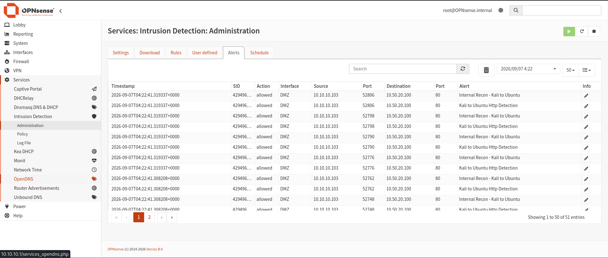

This demonstrates how automated web enumeration produces network behavior that can be detected and investigated by an IDS.

---

### 6.11 Incident Correlation in Wazuh

Wazuh Threat Hunting was used to search for activity associated with the Kali source IP:

```text
10.10.10.103
```

The search returned the SSH authentication events generated on SOC-Ubuntu.

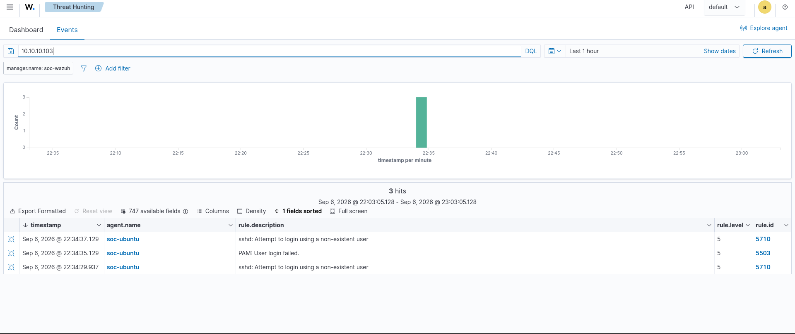

The events included:

- Attempts to authenticate using a non-existent user
- PAM authentication failure
- Wazuh rule IDs `5710` and `5503`
- Level `5` alerts
- SOC-Ubuntu as the affected endpoint

The detailed Wazuh evidence further connected the activity to the controlled Kali source.

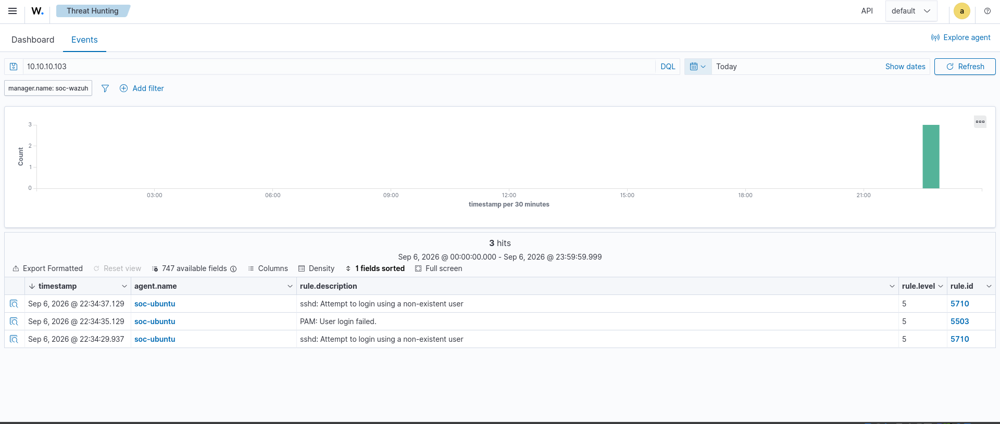

The correlation established that the same source system responsible for the network reconnaissance also generated authentication activity against the Ubuntu endpoint.

---

### 6.12 Incident Timeline

The collected evidence supports the following incident timeline:

| Stage | Activity | Evidence / Detection Source |
|---|---|---|
| 1 | Kali establishes connectivity to Ubuntu | SOC-Kali |
| 2 | Nmap reconnaissance performed | SOC-Kali |
| 3 | SSH service identified | Nmap |
| 4 | Reconnaissance traffic observed | Suricata |
| 5 | HTTP reconnaissance generated | Nmap |
| 6 | Nmap HTTP User-Agent identified | Suricata / ET Open |
| 7 | Web enumeration performed | Gobuster |
| 8 | Enumeration traffic observed | Suricata |
| 9 | SSH authentication attempted | SOC-Kali |
| 10 | Invalid user authentication fails | SOC-Ubuntu |
| 11 | Authentication event collected | Wazuh Agent |
| 12 | SSH alert generated | Wazuh |
| 13 | Event enriched with MITRE ATT&CK | Wazuh |
| 14 | Network and endpoint telemetry correlated | SOC Investigation |

---

### 6.13 Detection Analysis

Phase 6 demonstrated the different visibility provided by network and endpoint security monitoring.

#### Suricata — Network Visibility

Suricata provided information including:

- Source IP
- Destination IP
- Source and destination ports
- Network reconnaissance activity
- HTTP reconnaissance activity
- Nmap Scripting Engine identification
- Automated web enumeration traffic
- DMZ interface visibility
- Custom IDS rule detections
- ET Open signature detections

#### Wazuh — Endpoint Visibility

Wazuh provided information including:

- Failed SSH authentication
- Invalid username
- Source IP
- Affected endpoint
- Authentication-related rule IDs
- Alert severity
- Raw authentication logs
- MITRE ATT&CK technique mappings

#### Correlated SOC View

Together, the tools provided a more complete incident picture:

```text
Network Layer
     |
     | Suricata
     v
Reconnaissance / HTTP / SSH Traffic
     |
     +--------------------------+
                                |
                                v
                         Endpoint Layer
                                |
                                | Wazuh
                                v
                    Authentication Failure
                                |
                                v
                     MITRE ATT&CK Mapping
                                |
                                v
                       Analyst Correlation
```

Suricata showed **what was happening on the network**, while Wazuh showed **what happened on the endpoint**.

---

### 6.14 SOC Investigation Summary

The controlled incident originated from:

```text
SOC-Kali
10.10.10.103
```

and targeted:

```text
SOC-Ubuntu
10.50.20.100
```

The activity progressed through multiple observable stages:

```text
Reconnaissance
      ↓
Service Discovery
      ↓
HTTP Reconnaissance
      ↓
Web Enumeration
      ↓
SSH Authentication Attempt
      ↓
Endpoint Authentication Failure
      ↓
SIEM Detection
      ↓
MITRE ATT&CK Enrichment
      ↓
Network + Endpoint Correlation
```

This demonstrates a basic SOC investigation workflow where an analyst uses multiple telemetry sources rather than relying on a single alert.

---

### Lessons Learned

- A single security alert rarely provides the complete picture of an incident.
- Network IDS telemetry and endpoint telemetry complement each other during an investigation.
- Suricata can identify reconnaissance activity occurring before or alongside endpoint events.
- ET Open signatures can provide additional context beyond basic IP and port information.
- Application-layer information such as the Nmap HTTP User-Agent can help identify the tool responsible for suspicious traffic.
- Wazuh provides endpoint context that network monitoring alone cannot provide, including usernames and authentication results.
- Source IP addresses and timestamps are valuable correlation points between security platforms.
- MITRE ATT&CK mappings help translate raw security events into recognizable attacker behaviors.
- Controlled attack simulation is an effective method for validating detection controls.
- Successful traffic generation does not by itself prove that monitoring is operational; alerts must be confirmed in the corresponding security platforms.
- Network connectivity, IDS operation, endpoint logging, agent collection, and SIEM ingestion must all function correctly for end-to-end monitoring to succeed.
- Correlating Suricata and Wazuh evidence demonstrates a fundamental SOC workflow:

```text
Generate → Detect → Investigate → Correlate → Document
```

---

### Phase 6 Evidence

The following screenshots document the Phase 6 investigation:

1. `phase6-nmap-reconnaissance.png` — Nmap reconnaissance from Kali against Ubuntu.
2. `phase6-suricata-recon-detection.png` — Suricata detection of Kali-to-Ubuntu reconnaissance.
3. `phase6-ssh-failed-login.png` — Controlled failed SSH authentication.
4. `phase6-wazuh-ssh-detection.png` — Wazuh SSH authentication alerts.
5. `phase6-wazuh-ssh-event-details.png` — Detailed Wazuh SSH event information.
6. `phase6-wazuh-mitre-mapping.png` — MITRE ATT&CK mapping of the SSH event.
7. `phase6-suricata-ssh-correlation.png` — Suricata network evidence associated with SSH activity.
8. `phase6-suricata-nmap-web-recon.png` — Suricata detection of Nmap HTTP reconnaissance.
9. `phase6-incident1-suricata-nmap-details.png` — ET Open Nmap User-Agent alert details.
10. `phase6-suricata-gobuster-alerts.png` — Suricata alerts generated during Gobuster enumeration.
11. `phase6-incident1-wazuh-ssh-correlation.png` — Wazuh correlation of Kali-originated SSH activity.
12. `phase6-wazuh-ssh-attack.png` — Wazuh SSH incident evidence.

---

### Phase 6 Result

**Status: Complete ✅**

Phase 6 successfully demonstrated an end-to-end security incident generation, detection, investigation, and correlation workflow.

Controlled reconnaissance, HTTP enumeration, and SSH authentication activity were generated from SOC-Kali (`10.10.10.103`) against SOC-Ubuntu (`10.50.20.100`).

Suricata provided network-level visibility into reconnaissance and HTTP activity, including an ET Open detection identifying the Nmap Scripting Engine. Wazuh provided endpoint-level visibility into the failed SSH authentication, including the source IP, invalid username, alert severity, raw authentication event, and MITRE ATT&CK mappings.

By correlating Suricata network telemetry with Wazuh endpoint telemetry, the lab demonstrated a core SOC analyst capability:

**reconstructing suspicious activity using evidence collected from multiple security controls.**

---

# 🔐 Phase 7 — Vulnerability Assessment & Remediation

## Status: ✅ COMPLETE

Phase 7 focused on performing a structured vulnerability assessment against the Ubuntu DMZ server, analyzing discovered weaknesses, applying security updates and configuration hardening, and validating the effectiveness of the remediation.

The goal of this phase was to demonstrate a complete vulnerability-management lifecycle:

**Discover → Assess → Analyze → Remediate → Validate**

The Kali Linux analyst workstation was used to perform authorized reconnaissance and vulnerability scanning against the Ubuntu server located in the DMZ.

---

## 🎯 Objectives

The objectives of Phase 7 were to:

- Perform service discovery against the Ubuntu DMZ server
- Identify potentially vulnerable or exposed services
- Perform vulnerability scanning using Nmap NSE scripts
- Review the Ubuntu server's security and patch status
- Apply available operating-system security updates
- Analyze Apache HTTP Server configuration
- Reduce unnecessary server information disclosure
- Disable the HTTP TRACE method
- Validate Apache configuration before deployment
- Perform post-remediation scanning
- Compare the security posture before and after remediation
- Document the vulnerability-management process

---

## 🖥️ Systems Used

| System | Role | IP Address |
|---|---|---|
| SOC-Kali | Security analyst / vulnerability scanner | Security LAN |
| SOC-Ubuntu | DMZ target server | `10.50.20.100` |
| OPNsense | Firewall / network segmentation | Security gateway |
| Apache HTTP Server | Web service under assessment | TCP/80 |

The Ubuntu server remained isolated within the DMZ while Kali was used as the authorized security-testing workstation.

---

## 🔎 Step 1 — Service Discovery

The assessment began by identifying the service exposed by the Ubuntu DMZ server.

From Kali Linux, Nmap service detection was performed against TCP port 80:

```bash
sudo nmap -sV -p 80 10.50.20.100
```

### Command Breakdown

- `sudo` — executes Nmap with elevated privileges
- `nmap` — network reconnaissance and scanning utility
- `-sV` — performs service/version detection
- `-p 80` — limits the scan to TCP port 80
- `10.50.20.100` — Ubuntu DMZ target

The scan confirmed that TCP port **80** was open and that an Apache HTTP service was accessible.

This established the externally observable attack surface before remediation.

### 📸 Snapshot 1 — Nmap Service Discovery

Initial service enumeration of the Ubuntu DMZ server from the Kali analyst workstation.

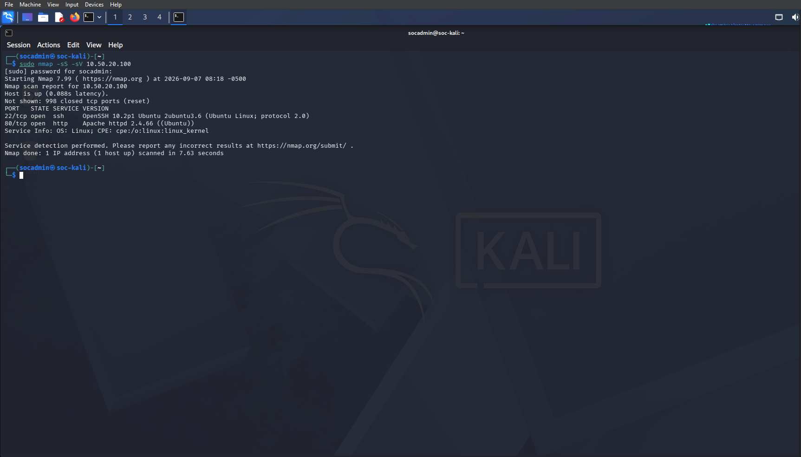

---

## 🛡️ Step 2 — Vulnerability Assessment

After identifying the exposed web service, Nmap NSE vulnerability scripts were used to identify potential security weaknesses.

```bash
sudo nmap -sV --script vuln 10.50.20.100
```

### Command Breakdown

- `-sV` — performs service/version detection
- `--script vuln` — executes Nmap NSE scripts categorized for vulnerability detection
- `10.50.20.100` — Ubuntu DMZ target

The scan produced vulnerability-related findings and references for further analysis.

An important part of this assessment was recognizing that automated scanner output represents **potential findings**. A scanner result does not automatically prove that a vulnerability is exploitable.

Findings should be correlated with:

- Actual installed package versions
- Security updates
- Host configuration
- Service exposure
- Vendor patches
- Manual validation

### 📸 Snapshot 2 — Nmap Vulnerability Scan

Nmap vulnerability scanning was used to identify potential weaknesses associated with the Ubuntu DMZ server.

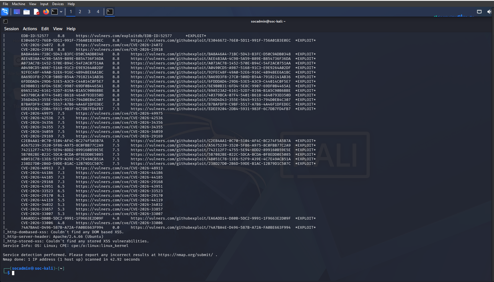

---

## 🐧 Step 3 — Ubuntu Security Assessment

The Ubuntu server was reviewed directly to determine its operating-system security status.

Host-level inspection provided additional context for interpreting the results generated by the network vulnerability scan.

The assessment included reviewing:

- Installed packages
- Available package updates
- Security updates
- Current patch status
- Running services
- Apache configuration

This reinforced an important vulnerability-management principle:

> Network scanner findings should be correlated with host-level evidence before remediation decisions are made.

### 📸 Snapshot 3 — Ubuntu Security Status

Ubuntu security information was reviewed to evaluate the current security posture of the DMZ server.

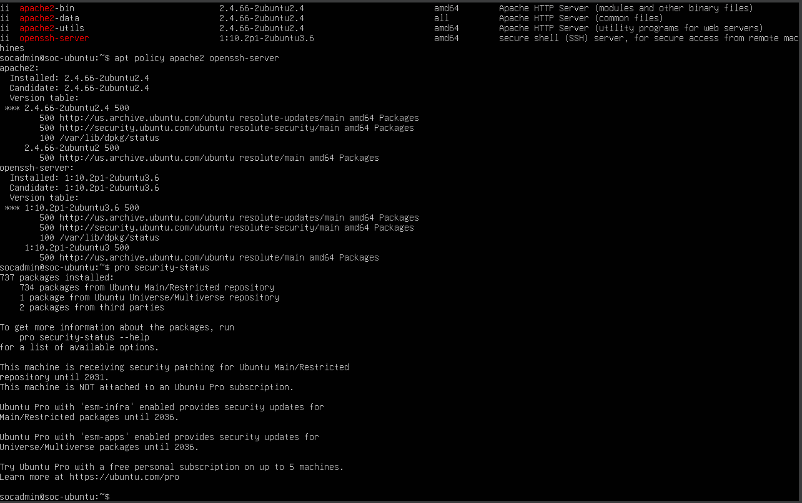

---

## 🔄 Step 4 — Ubuntu Patch Assessment

The Ubuntu server's package state was reviewed to determine whether operating-system or security updates were available.

Patch management reduces exposure to known vulnerabilities for which software vendors have already released fixes.

This represents an important component of the vulnerability-management lifecycle:

```text
Identify Vulnerability
        ↓
Check Patch Status
        ↓
Apply Remediation
        ↓
Validate System
```

### 📸 Snapshot 4 — Ubuntu Patch Status

The Ubuntu server was evaluated for packages requiring security and system updates.

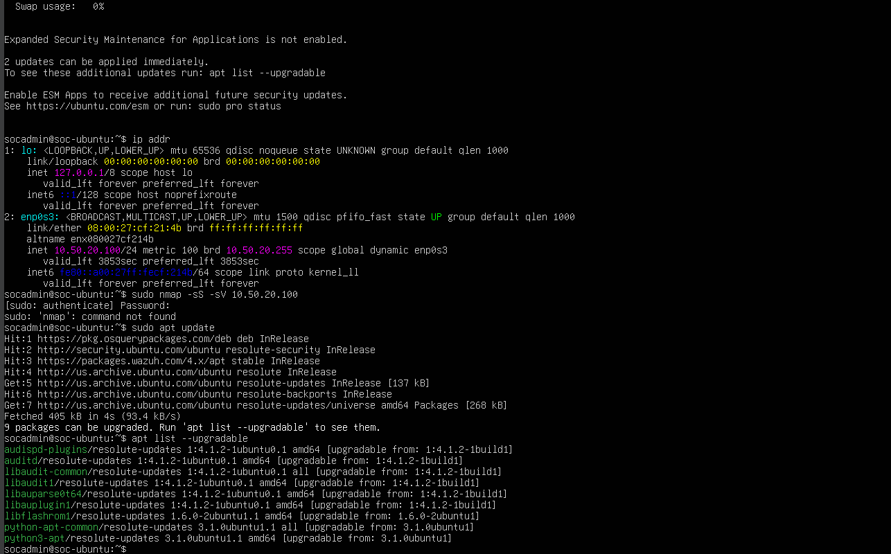

---

## 🔧 Step 5 — System Remediation

After reviewing the Ubuntu system, applicable package updates were addressed and the package state was validated.

The package index can be refreshed using:

```bash
sudo apt update
```

This retrieves current package information from the configured Ubuntu repositories.

Available updates can then be applied using:

```bash
sudo apt upgrade
```

The purpose of remediation was not simply to execute an update command.

The system also needed to be checked afterward to confirm that the expected patch state had been reached.

### 📸 Snapshot 5 — Ubuntu Package Validation

Installed packages and updates were validated after remediation.

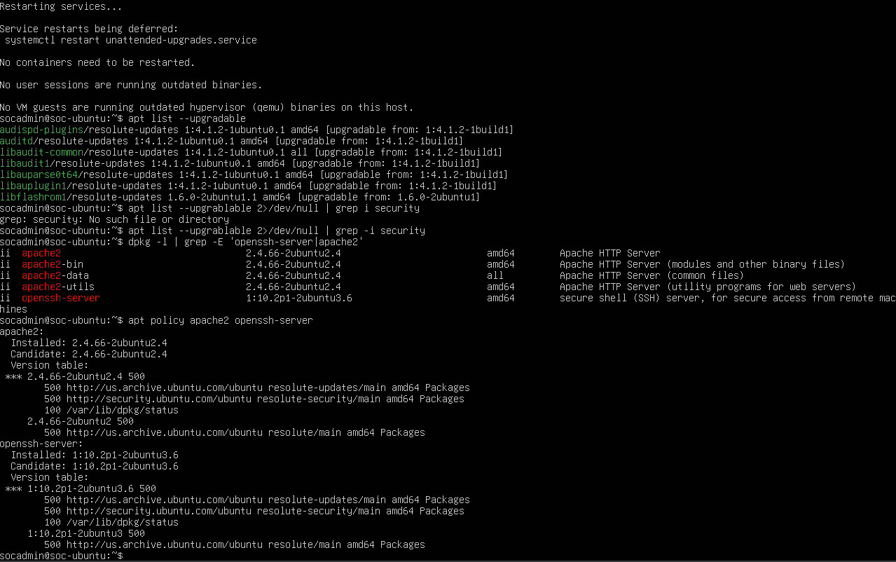

---

## 🌐 Step 6 — Apache HTTP Server Assessment

The Apache HTTP Server configuration was reviewed as another component of the vulnerability assessment.

Before hardening, an HTTP HEAD request exposed detailed server information similar to:

```text
Server: Apache/2.4.66 (Ubuntu)
```

This information can assist attacker reconnaissance.

Knowing the exact server software, version, and operating-system family can help an attacker research:

- Known CVEs
- Public exploits
- Version-specific weaknesses
- Misconfiguration techniques

The goal was therefore to reduce unnecessary technical information exposed to remote clients.

---

## 🔐 Step 7 — Apache Information Disclosure Hardening

Apache's security configuration was modified to reduce server information disclosure.

The Apache security configuration was located under:

```text
/etc/apache2/conf-available/security.conf
```

During the configuration process, the active Apache configuration and symbolic links were inspected to determine how the security configuration was being loaded.

### ServerTokens

The following directive was configured:

```apache
ServerTokens Prod
```

`ServerTokens` controls the amount of server information returned through the HTTP `Server` header.

Before hardening, the server exposed information similar to:

```text
Server: Apache/2.4.66 (Ubuntu)
```

After configuring:

```apache
ServerTokens Prod
```

the server returned only:

```text
Server: Apache
```

This reduces useful reconnaissance information.

### ServerSignature

The following directive was also configured:

```apache
ServerSignature Off
```

This reduces server information displayed on Apache-generated pages such as error documents.

The resulting hardening configuration included:

```apache
ServerTokens Prod
ServerSignature Off
```

### Configuration Validation

Before reloading Apache, the configuration syntax was tested:

```bash
sudo apache2ctl configtest
```

The successful result was:

```text
Syntax OK
```

Apache was then reloaded:

```bash
sudo systemctl reload apache2
```

Using a configuration test before reloading the service helps prevent configuration errors from disrupting the web server.

### 📸 Snapshot 6 — Apache Hardening Validation

Apache HTTP Server hardening was validated after reducing server information disclosure.

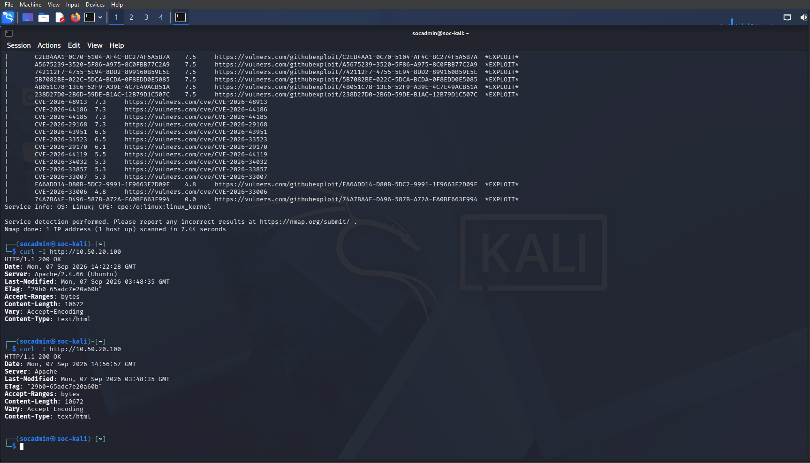

---

## 🚫 Step 8 — Disable HTTP TRACE

The HTTP TRACE method was evaluated and disabled as an additional Apache hardening measure.

The following directive was configured:

```apache
TraceEnable Off
```

TRACE is primarily a diagnostic HTTP method and was unnecessary for the role of this DMZ web server.

Reducing unnecessary functionality follows the principle of minimizing the attack surface.

After modifying the configuration, Apache syntax was validated again:

```bash
sudo apache2ctl configtest
```

Expected result:

```text
Syntax OK
```

The configuration was then activated:

```bash
sudo systemctl reload apache2
```

From Kali, TRACE behavior was tested against the Ubuntu web server.

A disabled TRACE method returned:

```text
HTTP/1.1 405 Method Not Allowed
```

This demonstrated that the hardening control was active.

### 📸 Snapshot 7 — HTTP TRACE Disabled Validation

Validation confirmed that HTTP TRACE requests were rejected after hardening.

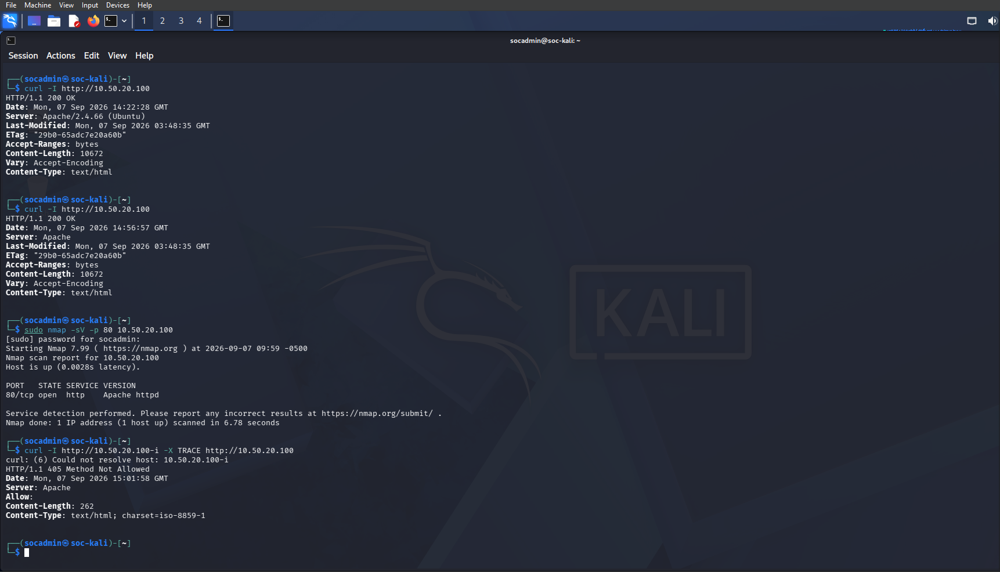

---

## 🧪 Step 9 — Validate Apache Functionality

After applying the security changes, Apache was tested to ensure that legitimate HTTP functionality remained operational.

From Ubuntu:

```bash
curl -I http://127.0.0.1
```

The server successfully returned:

```text
HTTP/1.1 200 OK
```

The response also demonstrated the change in server information disclosure.

### Before Hardening

```text
Server: Apache/2.4.66 (Ubuntu)
```

### After Hardening

```text
Server: Apache
```

This provided direct evidence that the configuration change reduced exposed information without disabling the required HTTP service.

---

## 🔁 Step 10 — Post-Remediation Service Scan

Kali was used again to assess the Ubuntu DMZ server after remediation.

The Nmap service scan was repeated:

```bash
sudo nmap -sV -p 80 10.50.20.100
```

The purpose of the post-remediation scan was to verify that:

- TCP port 80 remained accessible
- Apache remained operational
- Required web functionality was preserved
- Hardening did not unnecessarily disrupt the service
- Exposed service information had been reduced

This demonstrated an important security principle:

> Remediation should reduce security exposure while preserving required functionality.

### 📸 Snapshot 8 — Post-Remediation Nmap Scan

A second Nmap service scan was performed after remediation.

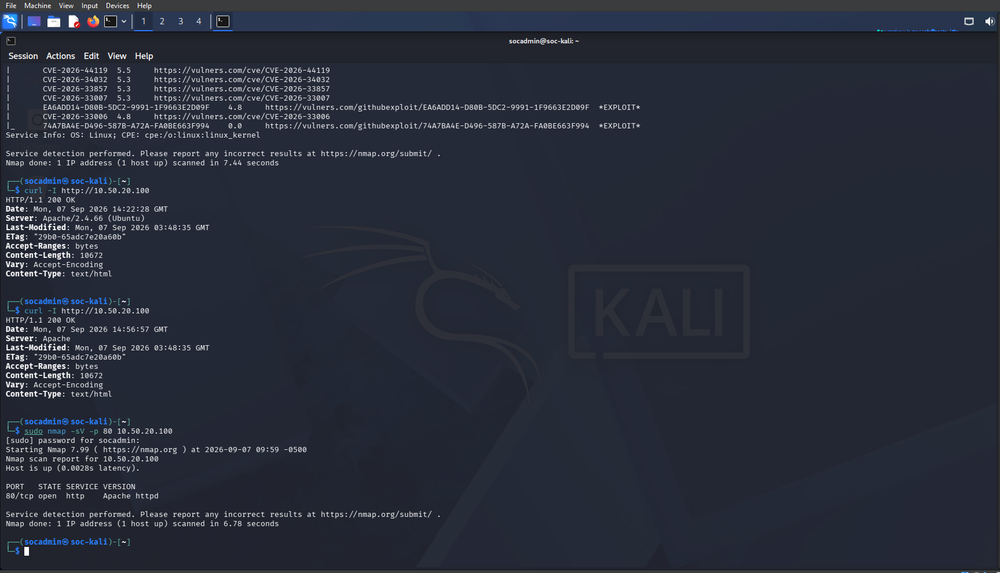

---

## 🔍 Step 11 — Post-Remediation Vulnerability Scan

The vulnerability assessment was repeated after remediation.

```bash
sudo nmap -sV --script vuln 10.50.20.100
```

Repeating the assessment provided a method for comparing the system's security posture before and after:

- Ubuntu package remediation
- Security updates
- Apache information-disclosure hardening
- HTTP TRACE restriction

This represents the **Validate** stage of the vulnerability-management lifecycle.

Applying a patch or configuration change does not automatically prove that remediation was successful.

The environment must be tested again.

### 📸 Snapshot 9 — Post-Remediation Vulnerability Scan

The vulnerability scan was repeated after remediation to compare the resulting security posture.

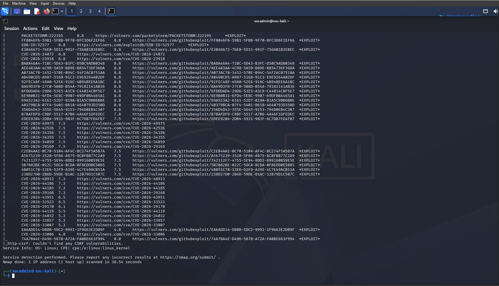

---

## ✅ Step 12 — Final Patch Validation

The Ubuntu server's patch state was reviewed again following remediation.

This final validation provided host-level evidence of the resulting package and security-update state.

The host-level results could then be correlated with the post-remediation network assessment.

### 📸 Snapshot 10 — Post-Remediation Patch Status

Final patch validation documented the Ubuntu server's post-remediation update state.

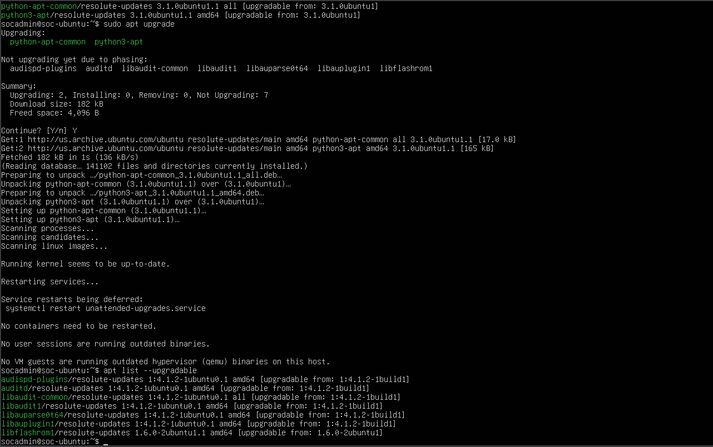

---

## 🔄 Vulnerability Management Workflow

Phase 7 demonstrated the following operational security workflow:

```text
SOC-Kali
Security Analyst
     |
     v
Service Discovery
     |
     v
Nmap Vulnerability Scan
     |
     v
Analyze Findings
     |
     v
SOC-Ubuntu
Host Validation
     |
     v
Patch Assessment
     |
     v
System Remediation
     |
     v
Apache Hardening
     |
     v
Configuration Testing
     |
     v
Post-Remediation Scan
     |
     v
Validate Results
```

The complete process can be summarized as:

**Discover → Assess → Analyze → Remediate → Validate**

---

## 🧠 Lessons Learned

Phase 7 demonstrated that vulnerability management involves significantly more than running an automated vulnerability scanner.

Several important lessons were reinforced during this phase:

- Vulnerability scanners identify potential weaknesses, but findings require analysis.
- Automated scanner output should not automatically be treated as proof of exploitability.
- Network findings should be correlated with host-level evidence.
- Service enumeration provides important context for vulnerability analysis.
- Patch management is only one component of vulnerability remediation.
- Configuration weaknesses can exist even when software is patched.
- Apache version disclosure can provide useful reconnaissance information to an attacker.
- `ServerTokens Prod` reduces information exposed through HTTP response headers.
- `ServerSignature Off` reduces unnecessary information on Apache-generated pages.
- `TraceEnable Off` disables unnecessary HTTP TRACE functionality.
- `apache2ctl configtest` should be used before activating Apache configuration changes.
- A successful syntax test proves that the configuration is syntactically valid, but does not prove that the intended security control is functioning.
- Security controls should be tested directly after implementation.
- Functional testing is necessary to ensure that hardening does not break legitimate services.
- Post-remediation scanning is essential for determining whether the system's exposure actually changed.
- Comparing pre-remediation and post-remediation evidence creates a defensible record of remediation.

### Troubleshooting Lesson — Apache Configuration Paths

One important troubleshooting issue occurred while working with the Apache security configuration.

The expected configuration file location and the enabled configuration did not initially match the assumed path.

The Apache directories and symbolic links had to be inspected to determine how the security configuration was actually being loaded.

This reinforced an important Linux administration principle:

> Never assume a configuration file is located where expected. Verify the file, determine how the service loads it, and validate the active configuration before making changes.

The configuration was ultimately validated using:

```bash
sudo apache2ctl configtest
```

before Apache was reloaded.

---

## 🔗 Connection to Previous Phases

Phase 7 builds directly on the defensive architecture established throughout the previous phases.

### OPNsense

Provides firewall enforcement and segmentation between the Security LAN and DMZ.

### Suricata

Provides network-based intrusion detection for traffic moving through the monitored environment.

### Wazuh

Provides centralized endpoint monitoring, security-event collection, and investigation capabilities.

### SOC-Kali

Provides the authorized analyst workstation used for:

- Reconnaissance
- Service discovery
- Vulnerability scanning
- Security validation

### SOC-Ubuntu

Provides the DMZ workload used for:

- Vulnerability assessment
- Linux security administration
- Patch management
- Apache hardening
- Remediation validation

Together, the environment now supports:

```text
                   SOC Analyst
                       |
                    SOC-Kali
                       |
                       v
                    OPNsense
                  /          \
                 /            \
        Security LAN          DMZ
             |                 |
           Wazuh          SOC-Ubuntu
             ^                 |
             |               Apache
             |                 |
             +---- Security ---+
                   Telemetry
```

Phase 7 adds **vulnerability management and remediation** to the enterprise security operations architecture.

---

## 🏆 Skills Demonstrated

Phase 7 provided hands-on experience with:

- Vulnerability management
- Vulnerability assessment
- Network reconnaissance
- Nmap
- Nmap NSE
- Service enumeration
- Vulnerability analysis
- Linux security administration
- Ubuntu package management
- Patch management
- Apache HTTP Server administration
- Web-server security hardening
- Information-disclosure reduction
- HTTP method restriction
- Configuration validation
- System remediation
- Post-remediation testing
- Security control validation
- Attack-surface reduction
- Pre/post remediation comparison
- Technical troubleshooting
- Security documentation

---

## 📸 Phase 7 Evidence Summary

| Snapshot | Evidence |
|---|---|
| 1 | Nmap Service Discovery |
| 2 | Nmap Vulnerability Scan |
| 3 | Ubuntu Security Status |
| 4 | Ubuntu Patch Status |
| 5 | Ubuntu Package Validation |
| 6 | Apache Hardening Validation |
| 7 | HTTP TRACE Disabled Validation |
| 8 | Post-Remediation Nmap Scan |
| 9 | Post-Remediation Vulnerability Scan |
| 10 | Post-Remediation Patch Status |

### Screenshot Files

```text
images/phase7-nmap-service-discovery.png
images/phase7-nmap-vulnerability-scan.png
images/phase7-ubuntu-security-status.png
images/phase7-ubuntu-patch-status.png
images/phase7-ubuntu-package-validation.png
images/phase7-apache-hardening-validation.png
images/phase7-trace-disabled-validation.png
images/phase7-post-remediation-nmap.png
images/phase7-post-remediation-vulnerability-scan.png
images/phase7-post-remediation-patch-status.png
```

---

## ✅ Phase 7 Completion Summary

Phase 7 successfully demonstrated an end-to-end vulnerability assessment and remediation workflow against the Ubuntu DMZ server.

The assessment began with service discovery and vulnerability scanning from the Kali analyst workstation.

Potential weaknesses were then analyzed against the Ubuntu host's actual configuration and security status.

Remediation and hardening activities included:

- Reviewing Ubuntu security status
- Reviewing package and patch status
- Applying applicable system remediation
- Validating package status
- Assessing Apache information disclosure
- Configuring `ServerTokens Prod`
- Configuring `ServerSignature Off`
- Configuring `TraceEnable Off`
- Testing Apache configuration syntax
- Reloading the Apache configuration
- Verifying HTTP service availability
- Validating reduced Apache information disclosure
- Validating HTTP TRACE restrictions
- Repeating Nmap service discovery
- Repeating vulnerability scanning
- Performing final post-remediation patch validation

The final validation demonstrated that required HTTP functionality remained operational while unnecessary server information and functionality were reduced.

Phase 7 connected vulnerability scanning with Linux administration, patch management, web-server hardening, remediation, and security-control validation.

**Phase 7 Status: ✅ COMPLETE**

---

## ➡️ Next Phase

With vulnerability assessment and remediation complete, the lab is ready to proceed to:

### Phase 8 — Security Automation & Response

Phase 8 will build on the telemetry, detection, investigation, and vulnerability-management capabilities established throughout the project by introducing automation into the SOC workflow.

---

# Phase 8 — Security Automation & Response

## Status: ✅ COMPLETE

Phase 8 focused on integrating PostgreSQL security data with Python automation to create a basic automated SOC incident-response workflow.

The objective was to move beyond manually querying security data and demonstrate how Python can retrieve incidents from the SecurityOpsDB database, evaluate incident severity, automatically update incident status, and create an audit trail documenting the actions performed by the automation.

The completed workflow was:

```text
Security Incident
       |
       v
PostgreSQL SecurityOpsDB
       |
       v
Python Automation
       |
       v
Retrieve Incident
       |
       v
Evaluate Severity
       |
       +---- High ------> Escalated
       |
       +---- Medium ----> Reviewed
       |
       +---- Low -------> Reviewed
       |
       v
Update Incident Record
       |
       v
Create Automation Log
       |
       v
Validate Database Changes
```

---

## Objectives

The objectives of Phase 8 were to:

- Use PostgreSQL as a security operations data store
- Create and query security incident records
- Connect Python to PostgreSQL
- Retrieve incidents programmatically
- Evaluate incident severity using Python logic
- Automatically determine an incident response action
- Update incident status in PostgreSQL
- Record automated actions in an audit table
- Generate security information from database records
- Validate automated database modifications
- Troubleshoot Python, PostgreSQL, permissions, and application logic
- Demonstrate a basic Security Orchestration, Automation, and Response workflow

---

## Systems and Technologies Used

| Component | Purpose |
|---|---|
| SOC-Wazuh | Security server and automation host |
| PostgreSQL | Security operations database |
| SecurityOpsDB | Stores incident and automation information |
| Python 3 | Security-response automation |
| psycopg | PostgreSQL connectivity from Python |
| Linux CLI | Script execution and validation |

---

# Step 1 — PostgreSQL Incident Records

Security incident records were stored inside the PostgreSQL `SecurityOpsDB` database.

The incident data represented security activity previously demonstrated throughout the lab, including:

- SSH brute-force activity
- Network reconnaissance
- Security severity
- Incident status
- Detection source

Example incident information included:

```text
Incident 1
Type: SSH Brute Force
Severity: High
Detected By: Wazuh + Suricata

Incident 2
Type: Network Reconnaissance
Severity: Medium
Detected By: Suricata
```

These records provided structured security data that could be processed by the Python automation script.

### Snapshot 1 — PostgreSQL Incident Records

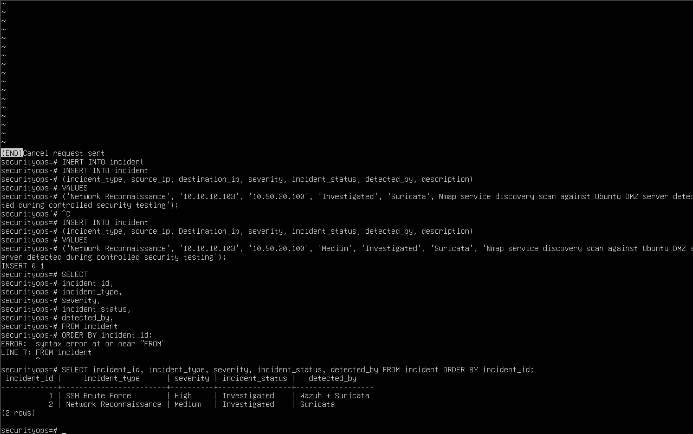

This establishes the incident data used by the automation workflow.

---

# Step 2 — SecurityOpsDB Incident Query

The PostgreSQL incident table was queried to review the security incidents before automation.

The query returned:

- Incident ID
- Incident type
- Severity
- Incident status
- Detection source

This demonstrated how SQL can retrieve structured security information for analyst review or automated processing.

### Snapshot 2 — SecurityOpsDB Incident Query

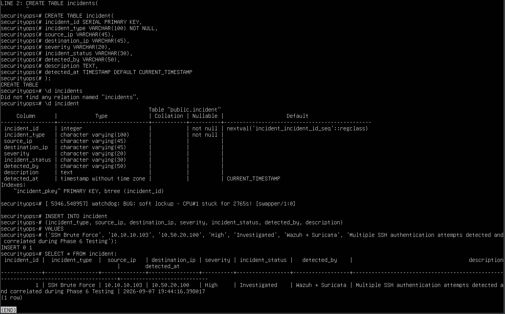

The database query provided the input data that would later be processed automatically using Python.

---

# Step 3 — Python Security Automation Script

A Python script named:

```text
securityops_automation.py
```

was created to interact directly with PostgreSQL.

The script established a connection to the SecurityOpsDB database and retrieved security incidents requiring processing.

The automation workflow was:

```text
Connect to SecurityOpsDB
        |
        v
Query Incident Table
        |
        v
Retrieve Incidents
        |
        v
Process Each Incident
        |
        v
Evaluate Severity
        |
        v
Determine Response
        |
        v
Update Database
        |
        v
Create Audit Record
```

The script used Python conditional logic to determine the appropriate response based on incident severity.

Example:

```python
if severity == "High":
    priority = "IMMEDIATE REVIEW"
    new_status = "Escalated"

elif severity == "Medium":
    priority = "STANDARD REVIEW"
    new_status = "Reviewed"

else:
    priority = "LOW PRIORITY"
    new_status = "Reviewed"
```

This demonstrates how automation logic can translate security-event characteristics into repeatable SOC response actions.

### Snapshot 3 — Python Security Automation

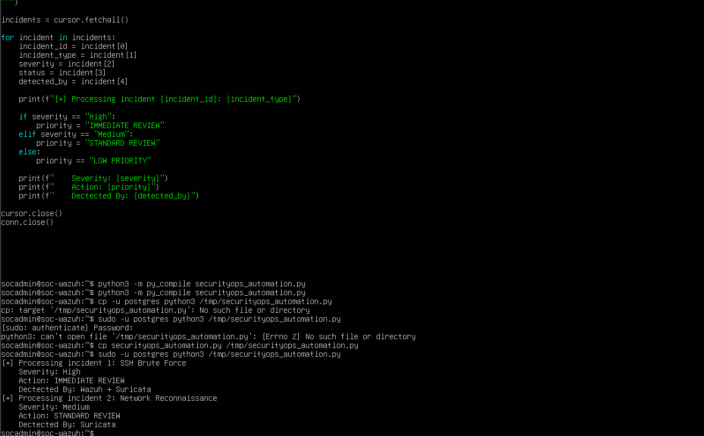

---

# Step 4 — Automated Incident Processing

The Python script was executed against the incident records stored in PostgreSQL.

During execution, the script processed each incident and displayed:

- Incident ID
- Incident type
- Severity
- Response action
- Detection source

Example output:

```text
[+] Processing incident 1: SSH Brute Force
    Severity: High
    Action: IMMEDIATE REVIEW
    Detected By: Wazuh + Suricata

[+] Processing incident 2: Network Reconnaissance
    Severity: Medium
    Action: STANDARD REVIEW
    Detected By: Suricata
```

High-severity activity received an immediate-review response while medium-severity activity received a standard-review response.

### Snapshot 4 — Python Automation Processing

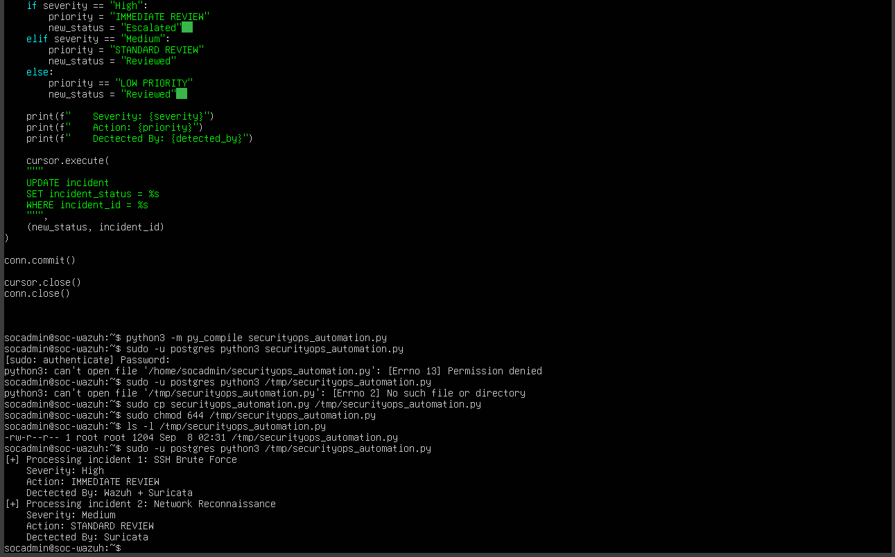

This confirmed that Python successfully retrieved and processed security incidents stored in PostgreSQL.

---

# Step 5 — Automated Incident Status Changes

The Python automation modified the PostgreSQL incident records according to the severity logic.

The automated response produced:

| Incident | Severity | Automated Action | New Status |
|---|---|---|---|
| SSH Brute Force | High | IMMEDIATE REVIEW | Escalated |
| Network Reconnaissance | Medium | STANDARD REVIEW | Reviewed |

The workflow demonstrated:

```text
Security Detection
       |
       v
Severity Evaluation
       |
       v
Automated Decision
       |
       v
Incident Status Change
```

Instead of requiring an analyst to manually update every incident, predefined logic performed the initial triage.

---

# Step 6 — Automation Audit Logging

Automated security actions should be traceable.

An `automation_log` table was used to record changes made by the Python script.

The audit records included:

- Log ID
- Incident ID
- Previous status
- New status
- Action taken
- Processing timestamp

The workflow was:

```text
Incident Status
Investigated
      |
      v
Python Automation
      |
      +---- High Severity
      |          |
      |          v
      |      Escalated
      |
      +---- Medium Severity
                 |
                 v
              Reviewed
      |
      v
automation_log
      |
      v
Permanent Audit Record
```

### Snapshot 5 — Python Automation Audit Log

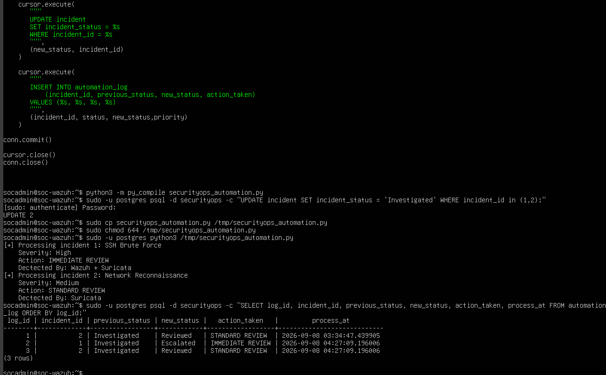

The audit log demonstrated that automated actions were recorded inside PostgreSQL rather than occurring without documentation.

---

# Step 7 — Incident Status Verification

After the Python automation completed, the PostgreSQL incident table was queried again.

The resulting records confirmed:

```text
Incident 1
SSH Brute Force
High
Escalated
Wazuh + Suricata

Incident 2
Network Reconnaissance
Medium
Reviewed
Suricata
```

### Snapshot 6 — Incident Status Automation Verified

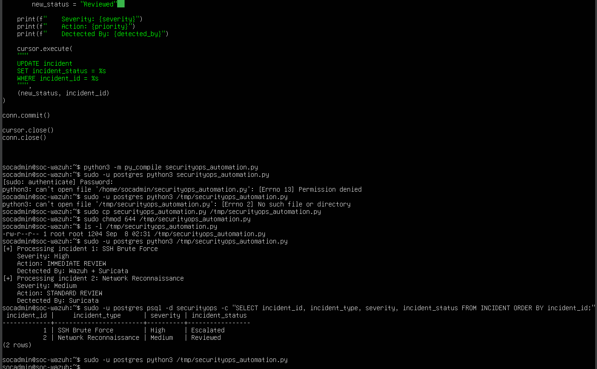

This validation was important because successful script execution alone does not prove that the expected database changes occurred.

The resulting database state must also be verified.

---

# Step 8 — Python and PostgreSQL Security Reporting

The incident information stored inside PostgreSQL could also be queried and presented as security operations data.

Combining Python and PostgreSQL creates a foundation for future automation capabilities such as:

- Incident summaries
- Severity statistics
- Detection-source statistics
- Automated SOC reports
- Vulnerability reports
- IOC correlation
- Alert enrichment
- Security metrics

### Snapshot 7 — Python PostgreSQL Report

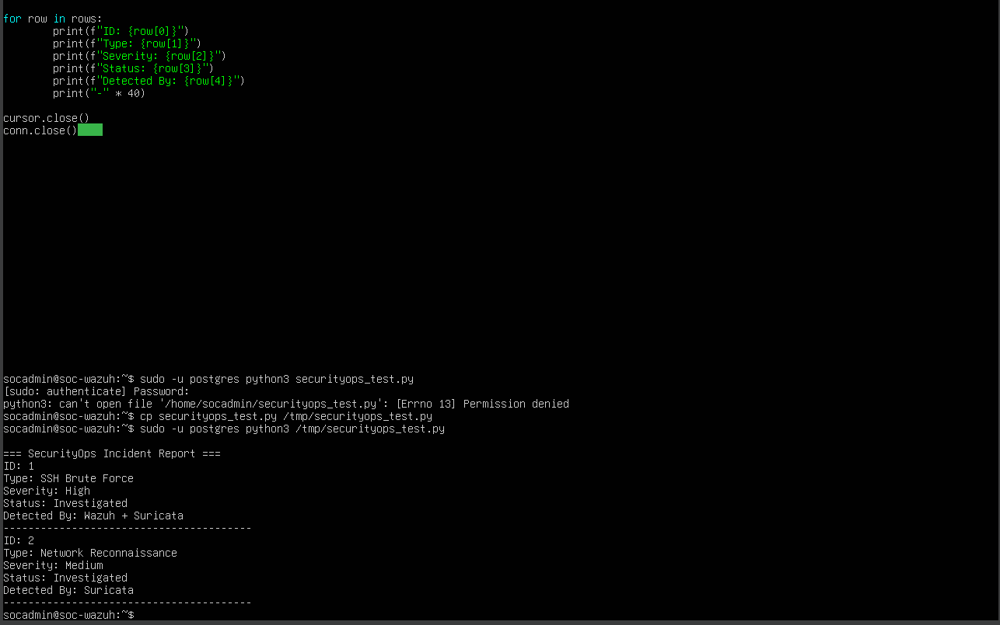

This demonstrates how structured security data can be transformed into information useful for SOC analysis and reporting.

---

# Step 9 — End-to-End Automation Validation

The final validation compared the automation audit trail with the current incident records.

The `automation_log` demonstrated status transitions such as:

```text
Investigated → Escalated
Investigated → Reviewed
```

The incident table independently confirmed the resulting statuses:

```text
SSH Brute Force
High
Escalated

Network Reconnaissance
Medium
Reviewed
```

### Snapshot 8 — End-to-End Automation Validation

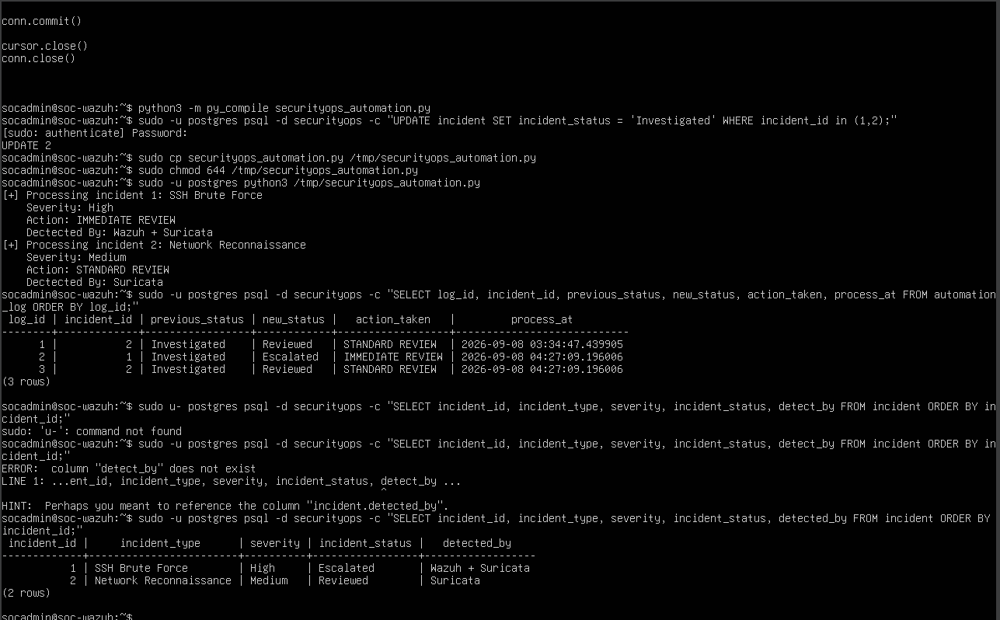

This provided evidence that the complete automation workflow operated successfully:

```text
PostgreSQL Incident
        |
        v
Python Processing
        |
        v
Severity Evaluation
        |
        v
Automated Response
        |
        v
Database UPDATE
        |
        v
Automation Audit Log
        |
        v
PostgreSQL Validation
```

---

# Security Automation Architecture

Phase 8 connected database-driven security operations with automated response logic.

```text
        Security Telemetry
               |
        +------+------+
        |             |
      Wazuh        Suricata
        |             |
        +------+------+
               |
               v
        Security Incident
               |
               v
      PostgreSQL SecurityOpsDB
               |
               v
        Python Automation
               |
        +------+------+
        |             |
        v             v
 Severity Logic   Incident Data
        |
        v
 Automated Decision
        |
   +----+---------+
   |              |
   v              v
Escalated       Reviewed
   |              |
   +------+-------+
          |
          v
     Incident Table
          |
          v
    Automation Log
          |
          v
      SOC Validation
```

---

# Troubleshooting and Lessons Learned

Phase 8 included several important troubleshooting scenarios involving Python, PostgreSQL, Linux permissions, and automation logic.

## Python Syntax Validation

Before executing the automation against PostgreSQL, Python syntax was validated using:

```bash
python3 -m py_compile securityops_automation.py
```

No output indicated that Python successfully compiled the script.

However:

```text
Valid Python Syntax ≠ Correct Automation Logic
```

A script can pass syntax validation while still contain logical, database, or runtime problems.

---

## Python Indentation and Processing Logic

During development, indentation problems affected the location of database operations inside the incident-processing loop.

The final structure ensured that each incident independently performed:

1. Severity evaluation
2. Incident status update
3. Automation-log insertion

This demonstrated that Python indentation affects program logic, not simply formatting.

---

## PostgreSQL Column Name Validation

During database validation, an incorrect column name was referenced:

```text
detect_by
```

PostgreSQL returned an error and suggested the actual column:

```text
detected_by
```

After correcting the query, the incident records were successfully returned.

### Lesson Learned

Database schemas should be verified rather than relying on assumed column names.

PostgreSQL error messages can provide useful troubleshooting information when a query references an invalid field.

---

## File Permission and Execution Context

The automation script was copied to `/tmp` and executed under the PostgreSQL operating-system account.

```bash
sudo cp securityops_automation.py /tmp/securityops_automation.py
sudo chmod 644 /tmp/securityops_automation.py
sudo -u postgres python3 /tmp/securityops_automation.py
```

This allowed the script to execute with the required PostgreSQL access while maintaining controlled file permissions.

This demonstrated the importance of understanding:

- Linux file permissions
- User execution context
- Database authentication
- Application access requirements

---

## Database State Reset During Testing

During repeated automation testing, incident statuses were returned to:

```text
Investigated
```

before rerunning the automation.

This created a known starting condition:

```text
Investigated
     |
     +---- High ----> Escalated
     |
     +---- Medium --> Reviewed
```

Testing automation from a known baseline made it easier to determine whether the script produced the expected results.

---

# Validation Methodology

Phase 8 reinforced the importance of validating automation at multiple layers.

```text
Python Source Code
       |
       v
Syntax Validation
       |
       v
Script Execution
       |
       v
Console Output
       |
       v
Incident Table
       |
       v
Automation Log
       |
       v
Final Database Query
```

A successful automation should not be considered validated simply because the script finishes without an error.

Validation confirmed:

1. The script executed.
2. The expected records were processed.
3. The correct decisions were made.
4. The intended database records changed.
5. Audit records were generated.
6. The final database state matched the expected result.

---

# Lessons Learned

Phase 8 demonstrated several important security-automation principles:

- SQL databases can provide structured storage for security operations data.
- Python can retrieve and process security incidents directly from PostgreSQL.
- Incident severity can drive automated response decisions.
- High-severity incidents can be automatically escalated for analyst attention.
- Medium-severity incidents can be automatically routed for standard review.
- Automated actions should create an audit trail.
- Database changes should always be independently verified.
- Successful Python compilation proves syntax validity but not logical correctness.
- Python indentation can significantly alter automation behavior.
- Database schemas should be verified before writing queries.
- PostgreSQL error messages can assist with troubleshooting incorrect queries.
- Automation should be tested from a known initial state.
- Security automation should be deterministic and auditable.
- Automation should assist analysts rather than eliminate human investigation.
- High-risk response actions should remain subject to appropriate analyst review.
- End-to-end validation is required before trusting automated security workflows.

> **Key Lesson:** Automation is only valuable when its actions can be verified and audited.

---

# Skills Demonstrated

Phase 8 provided hands-on experience with:

- Python
- PostgreSQL
- SQL
- Security automation
- SOC automation
- Incident triage
- Severity-based decision logic
- Database connectivity
- Database queries
- SQL UPDATE operations
- SQL INSERT operations
- Python conditional logic
- Python loops
- PostgreSQL audit logging
- Linux permissions
- Linux execution contexts
- Script debugging
- Database troubleshooting
- Automation validation
- Incident-response workflows
- Security reporting
- Security operations engineering

---

# Phase 8 Evidence Summary

| Snapshot | Evidence | Screenshot |
|---|---|---|
| 1 | PostgreSQL Incident Records | `phase8-postgresql-incident-records.png` |
| 2 | SecurityOpsDB Incident Query | `phase8-securityops-incident-query.png` |
| 3 | Python Security Automation | `phase8-python-automation.png` |
| 4 | Python Automation Processing | `phase8-python-automation-processing.png` |
| 5 | Python Automation Audit Log | `phase8-python-automation-audit-log.png` |
| 6 | Incident Status Automation Verified | `phase8-incident-status-automation-verified.png` |
| 7 | Python PostgreSQL Report | `phase8-python-postgresql-report.png` |
| 8 | End-to-End Automation Validation | `phase8-automation-validation.png` |

---

# Phase 8 Completion Summary

Phase 8 successfully demonstrated a database-driven security automation and response workflow using PostgreSQL and Python.

Security incidents representing SSH brute-force and network reconnaissance activity were stored inside the SecurityOpsDB database.

Python automation retrieved the incident records and evaluated their severity.

The automation applied predefined response logic:

```text
High Severity
     |
     v
IMMEDIATE REVIEW
     |
     v
Escalated

Medium Severity
     |
     v
STANDARD REVIEW
     |
     v
Reviewed
```

The script then updated the PostgreSQL incident records and inserted corresponding entries into the automation audit log.

Final database queries confirmed both the automated incident-status changes and the audit records documenting those actions.

The completed Phase 8 workflow demonstrated:

**Store → Query → Analyze → Decide → Update → Audit → Validate**

This phase extends the Enterprise Security Operations Lab beyond security monitoring and investigation by introducing repeatable and auditable security-response automation.

## Phase 8 Status: ✅ COMPLETE

---

# Next Phase

## Phase 9 — Threat Intelligence

The next phase will extend the security operations environment with threat-intelligence and IOC analysis capabilities.

---

# Phase 9: Threat Intelligence with MISP

## Threat Intelligence

MISP is used as a phase-specific threat intelligence platform.

### IOC Types

- IP addresses
- Domains
- URLs
- File hashes
- Threat indicators

## Workflow

```text
Security Event
      |
      v
Indicator Identified
      |
      v
     MISP
      |
      v
IOC Correlation
      |
      v
Investigation
```

### Snapshot 1 — MISP Dashboard


### Snapshot 2 — IOC


### Snapshot 3 — IOC Correlation


### Outcome

Threat intelligence is used to enrich and correlate security investigations.

---

# Phase 10: Incident Response with DFIR-IRIS

## Incident Case Management

DFIR-IRIS is used during the incident-response phase.

### Case Information

- Incident description
- Severity
- Affected systems
- IOCs
- Evidence
- Investigation notes
- Timeline
- Containment
- Remediation
- Resolution

## Incident Lifecycle

```text
Detection
   |
   v
Analysis
   |
   v
Investigation
   |
   v
Containment
   |
   v
Eradication
   |
   v
Recovery
   |
   v
Lessons Learned
```

### Snapshot 1 — DFIR-IRIS Dashboard


### Snapshot 2 — Incident Case


### Snapshot 3 — Timeline


### Outcome

Security investigations are documented and managed as structured incident-response cases.

---

# Phase 11: Digital Forensics and File Analysis

## YARA

YARA rules are created to identify suspicious controlled test files.

### Snapshot 1 — YARA Rule


### Snapshot 2 — YARA Detection


---

## Volatility 3

Volatility 3 is used for memory analysis.

### Analysis

- Processes
- Network connections
- Memory artifacts
- Suspicious activity

### Snapshot 3 — Volatility


---

## Autopsy

Autopsy is used when disk or file-system forensic analysis is required.

### Analysis

- File systems
- Deleted files
- Metadata
- Timeline information
- Evidence artifacts

### Snapshot 4 — Autopsy Investigation


### Outcome

Multiple forensic techniques are used to analyze endpoint evidence.

---

# Phase 12: Web Application Security

## OWASP ZAP

A deliberately vulnerable web application is hosted inside the isolated lab environment.

OWASP ZAP is used from Kali to analyze the application.

### Testing

- Application discovery
- Passive scanning
- Controlled active scanning
- HTTP analysis
- Security header analysis
- Vulnerability identification

### Snapshot 1 — Vulnerable Web Application


### Snapshot 2 — ZAP Scan


### Snapshot 3 — Findings


### Outcome

Web application security findings are incorporated into the broader security-analysis workflow.

---

# Phase 13: Python Security Automation

## Automation

Python is used to automate repetitive security-analysis tasks.

### Tasks

- Parse logs
- Process JSON
- Process CSV
- Import vulnerability results
- Import security events
- Search IOCs
- Query PostgreSQL
- Generate reports
- Calculate security statistics

## Automation Flow

```text
Wazuh / Suricata / OpenVAS
            |
            v
      Security Data
            |
            v
          Python
            |
            v
     Parse / Normalize
            |
            v
      SecurityOpsDB
            |
            v
       SQL Analysis
            |
            v
      Security Report
```

### Snapshot 1 — Python Script


### Snapshot 2 — Script Execution


### Snapshot 3 — SQL Import


### Outcome

Python connects security data sources with SQL analysis and reduces repetitive analyst work.

---

# Phase 14: Enterprise SOC Investigation

## End-to-End Security Scenario

The final phase integrates the tools and skills demonstrated throughout the project.

Controlled security events are generated only against systems owned and isolated inside the VirtualBox environment.

## Example Events

- Failed authentication
- Network reconnaissance
- Port scanning
- Suspicious PowerShell activity
- Unexpected network connections
- File integrity changes
- Suspicious test files
- IOC matches
- Vulnerability findings
- Web application security findings

## Investigation Workflow

```text
Controlled Security Event
          |
          v
Endpoint / Network Telemetry
          |
          v
Suricata + Sysmon + auditd
          |
          v
        Wazuh
          |
          v
       SOC Alert
          |
          v
Analyst Investigation
          |
          +--> Nmap
          +--> Wireshark
          +--> YARA
          +--> Volatility
          +--> Autopsy
          +--> ZAP
          |
          v
      SQL Analysis
          |
          v
     SecurityOpsDB
          |
          v
     MISP Correlation
          |
          v
    DFIR-IRIS Case
          |
          v
      Containment
          |
          v
      Remediation
          |
          v
    OpenVAS Rescan
          |
          v
       Validation
          |
          v
   Final Incident Report
```

### Snapshot 1 — Security Event


### Snapshot 2 — Wazuh Detection


### Snapshot 3 — Suricata Detection


### Snapshot 4 — Investigation


### Snapshot 5 — SQL Correlation


### Snapshot 6 — MISP Correlation


### Snapshot 7 — DFIR-IRIS Case


### Snapshot 8 — Remediation


### Snapshot 9 — Validation


### Outcome

The final scenario demonstrates a complete security operations workflow:

**Detect → Analyze → Investigate → Correlate → Respond → Remediate → Validate → Report**

---

# CySA+ CS0-004 Skills Demonstrated

## Security Operations

- SIEM/XDR monitoring
- Endpoint telemetry
- Network monitoring
- IDS/IPS analysis
- Firewall analysis
- Log analysis
- IOC analysis
- Threat intelligence
- Security automation

## Vulnerability Management

- Asset discovery
- Vulnerability scanning
- CVSS analysis
- Risk prioritization
- Remediation
- Rescanning
- Validation

## Incident Response

- Detection
- Analysis
- Investigation
- Containment
- Eradication
- Recovery
- Evidence analysis
- Incident documentation
- Lessons learned

## Security Analysis

- Network discovery
- Packet analysis
- Endpoint analysis
- Log correlation
- SQL security analytics
- Threat intelligence correlation
- File analysis
- Memory analysis
- Disk forensics
- Web application analysis

---

# Technology Stack

```text
VirtualBox
|
+-- VM 1: OPNsense
|   +-- Firewall
|   +-- NAT
|   +-- Segmentation
|   +-- Suricata
|
+-- VM 2: Windows 11
|   +-- Sysmon
|   +-- Wazuh Agent
|
+-- VM 3: Ubuntu
|   +-- auditd
|   +-- osquery
|   +-- Wazuh Agent
|   +-- Vulnerable Web Application
|
+-- VM 4: Security Server
|   +-- Wazuh
|   +-- PostgreSQL
|   +-- SecurityOpsDB
|   +-- Python
|
+-- VM 5: Kali Analyst
    +-- Nmap
    +-- Wireshark
    +-- OWASP ZAP
    +-- YARA
    +-- Volatility 3

Phase-Specific Tools
|
+-- Greenbone/OpenVAS
+-- MISP
+-- DFIR-IRIS
+-- Autopsy
```

---

# Repository Structure

```text
enterprise-security-operations-lab/
|
+-- README.md
|
+-- images/
|   +-- diagram.png
|   +-- arch2.png
|   +-- phase1-vm-inventory.png
|   +-- phase1-network-kali.png
|   +-- windows11-opnsense-network-config.png
|   +-- windows11-network-validation.png
|   +-- phase1-opnsense-dashboard.png
|   +-- phase2-interfaces.png
|   +-- phase2-firewall-rules.png
|   +-- phase2-segmentation-validation.png
|   +-- phase3-windows.png
|   +-- phase3-windows-process-auditing.png
|   +-- phase3-sysmon.png
|   +-- phase3-windows-wazuh.png
|   +-- phase3-ubuntu.png
|   +-- phase3-linux-monitoring.png
|   +-- phase3-ubuntu-wazuh-failed-auth-detection.png
|   +-- phase3-wazuh-ubuntu-authentication-failure.png
|   +-- ubuntu-wazuh-alert-validation.png
|   +-- phase4-dashboard.png
|   +-- phase4-agents.png
|   +-- phase4-alerts.png
|   +-- phase5-suricata.png
|   +-- phase5-alert.png
|   +-- phase5-wazuh.png
|   +-- phase6-nmap.png
|   +-- phase6-wireshark.png
|   +-- phase6-packet-analysis.png
|   +-- phase7-scan.png
|   +-- phase7-results.png
|   +-- phase7-detail.png
|   +-- phase7-rescan.png
|   +-- phase8-database.png
|   +-- phase8-tables.png
|   +-- phase8-join.png
|   +-- phase8-analytics.png
|   +-- phase8-audit.png
|   +-- phase9-misp.png
|   +-- phase9-ioc.png
|   +-- phase9-correlation.png
|   +-- phase10-dfir.png
|   +-- phase10-case.png
|   +-- phase10-timeline.png
|   +-- phase11-yara-rule.png
|   +-- phase11-yara-detection.png
|   +-- phase11-volatility.png
|   +-- phase11-autopsy.png
|   +-- phase12-webapp.png
|   +-- phase12-zap.png
|   +-- phase12-findings.png
|   +-- phase13-python.png
|   +-- phase13-execution.png
|   +-- phase13-import.png
|   +-- phase14-event.png
|   +-- phase14-wazuh.png
|   +-- phase14-suricata.png
|   +-- phase14-investigation.png
|   +-- phase14-sql.png
|   +-- phase14-misp.png
|   +-- phase14-dfir.png
|   +-- phase14-remediation.png
|   +-- phase14-validation.png
|
+-- sql/
|   +-- schema.sql
|   +-- security-queries.sql
|   +-- views.sql
|   +-- triggers.sql
|
+-- scripts/
|   +-- security-automation.py
|
+-- yara/
|   +-- detection-rules.yar
|
+-- reports/
    +-- incident-reports/
```

---

# Key Takeaways

This project demonstrates the construction and operation of an enterprise-style cybersecurity environment using a resource-efficient five-primary-VM architecture.

The lab integrates network security, Windows and Linux endpoint monitoring, SIEM/XDR, IDS/IPS, vulnerability management, threat intelligence, incident response, digital forensics, web application security, SQL analytics, and Python automation.

Instead of assigning every security application its own permanent VM, compatible services are consolidated and resource-intensive tools are used only when required.

This approach provides hands-on experience with a broad security toolset while maintaining reasonable CPU and memory requirements.

SQL and Python are integrated directly into the security operations workflow for data analysis, automation, correlation, reporting, and incident investigation.

---

# Disclaimer

This project is intended for educational and defensive cybersecurity training purposes only.

All scanning, testing, traffic generation, vulnerability assessment, and security analysis documented in this repository is performed against systems owned and isolated within the VirtualBox lab environment.

---

# Current Project Status

| Phase | Status |
|---|---|
| Phase 1 — VirtualBox Enterprise Environment | ✅ Complete |
| Phase 2 — OPNsense Firewall and Segmentation | ✅ Complete |
| Phase 3 — Endpoint Security Monitoring | ✅ Complete |
| Phase 4 — Wazuh SIEM/XDR | ✅ Complete |
| Phase 5 — Suricata IDS/IPS | ✅ Complete |
| Phase 6 — Network Security Analysis |✅ Complete |
| Phase 7 — Vulnerability Management | ✅ Complete |
| Phase 8 — Security Operations SQL Database | ✅ Complete |
| Phase 9 — Threat Intelligence | 🔄 Next |
| Phase 10 — Incident Response | ⏳ Planned |
| Phase 11 — Digital Forensics | ⏳ Planned |
| Phase 12 — Web Application Security | ⏳ Planned |
| Phase 13 — Python Security Automation | ⏳ Planned |
| Phase 14 — Enterprise SOC Investigation | ⏳ Planned |

---

# Final Project Goal

The completed Enterprise Security Operations Lab will demonstrate an integrated defensive security environment using:

**VirtualBox + OPNsense + Suricata + Windows 11 + Sysmon + Ubuntu + auditd + osquery + Wazuh + Kali Linux + Nmap + Wireshark + Greenbone/OpenVAS + MISP + DFIR-IRIS + YARA + Volatility 3 + Autopsy + OWASP ZAP + PostgreSQL + SQL + Python**

The completed environment will demonstrate the full security operations lifecycle:

**Detect → Analyze → Investigate → Correlate → Respond → Remediate → Validate → Report**
