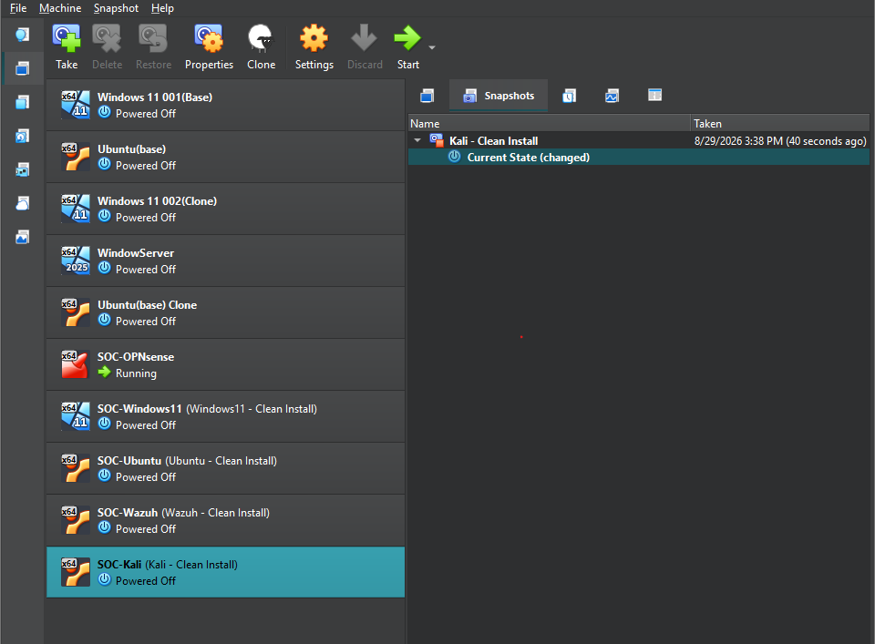
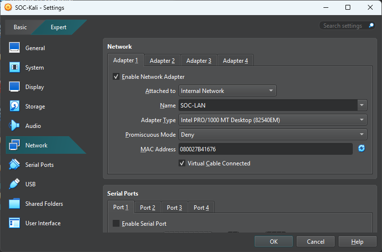
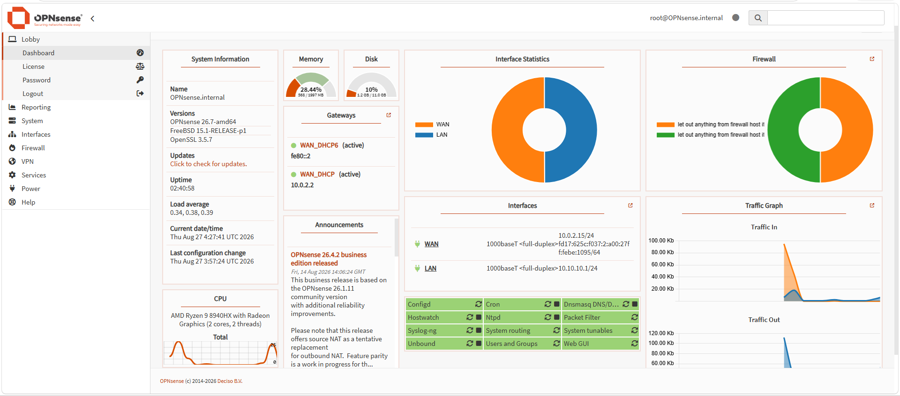
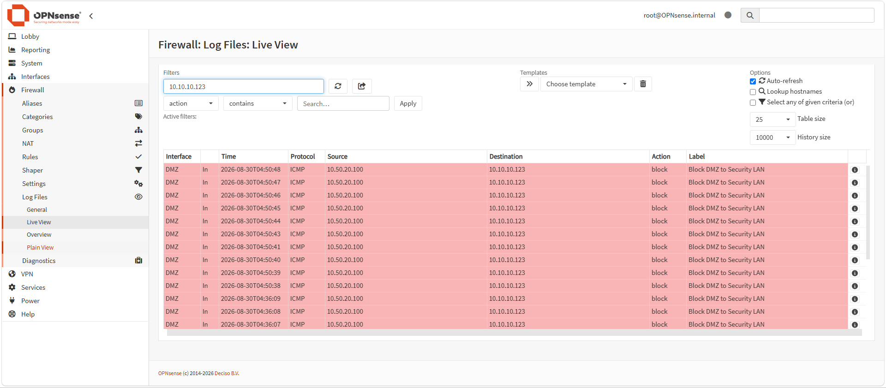
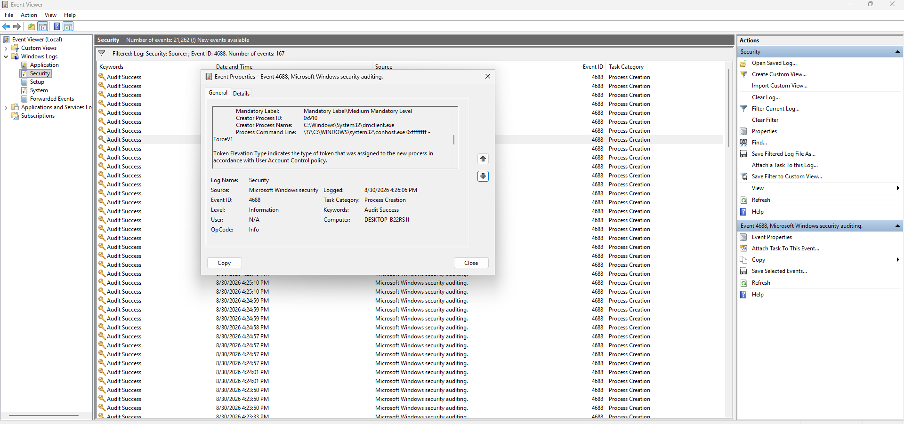

# Enterprise Security Operations Lab


## Overview

This project demonstrates the deployment and operation of an enterprise-style Security Operations Center (SOC) environment built from the ground up using VirtualBox.

The lab uses primarily free and open-source cybersecurity tools to simulate security monitoring, threat detection, vulnerability management, network analysis, threat intelligence, incident response, digital forensics, SQL security analytics, and security automation.

The environment was designed around a resource-efficient five-primary-VM architecture. Compatible security services are consolidated, while resource-intensive tools are started only when needed.

The project provides hands-on experience with technologies and analyst workflows related to the CompTIA CySA+ CS0-004 certification.

The lab includes:

- VirtualBox
- OPNsense
- Suricata
- Wazuh SIEM/XDR
- Windows 11
- Microsoft Sysmon
- Ubuntu Linux
- auditd
- osquery
- Kali Linux
- Nmap
- Wireshark
- Greenbone/OpenVAS
- MISP
- DFIR-IRIS
- YARA
- Volatility 3
- Autopsy
- OWASP ZAP
- PostgreSQL
- SQL security analytics
- Python security automation

The objective is to create an integrated cybersecurity environment where security events can be generated, detected, investigated, correlated, documented, remediated, and validated.

---

# Environment

| Component | Purpose |
|---|---|
| VirtualBox | Virtualization platform |
| OPNsense | Firewall, NAT, routing, and segmentation |
| Suricata | Network IDS/IPS |
| Windows 11 | Windows enterprise endpoint |
| Sysmon | Windows endpoint telemetry |
| Ubuntu Linux | Linux endpoint and controlled target |
| auditd | Linux security auditing |
| osquery | Endpoint visibility and querying |
| Wazuh | SIEM/XDR and centralized monitoring |
| Kali Linux | SOC analyst workstation |
| Nmap | Network and service discovery |
| Wireshark | Packet capture and analysis |
| Greenbone/OpenVAS | Vulnerability management |
| MISP | Threat intelligence and IOC management |
| DFIR-IRIS | Incident response and case management |
| YARA | File identification and detection |
| Volatility 3 | Memory forensics |
| Autopsy | Disk and file forensics |
| OWASP ZAP | Web application security testing |
| PostgreSQL | Security operations database |
| Python | Security automation |

---

# Virtual Machine Architecture

The environment uses **five primary virtual machines**.

| VM | Role | Primary Tools |
|---|---|---|
| VM 1 | Network Security | OPNsense + Suricata |
| VM 2 | Windows Endpoint | Windows 11 + Sysmon + Wazuh Agent |
| VM 3 | Linux Endpoint / Target | Ubuntu + auditd + osquery + Wazuh Agent + vulnerable web application |
| VM 4 | Security Server | Wazuh + PostgreSQL + SecurityOpsDB + Python |
| VM 5 | SOC Analyst | Kali + Nmap + Wireshark + ZAP + YARA + Volatility 3 |

## Phase-Specific Tools

Some heavier tools are used only when required:

- Greenbone/OpenVAS
- MISP
- DFIR-IRIS
- Autopsy

This allows the lab to maintain broad security capabilities without requiring every service to run simultaneously.

---

# Network Topology

The environment uses separate VirtualBox network segments controlled by OPNsense.

## Security LAN

| Setting | Value |
|---|---|
| Network | `10.10.10.0/24` |
| Gateway | `10.10.10.1` |
| Firewall | OPNsense |
| IDS/IPS | Suricata |

## DMZ

| Setting | Value |
|---|---|
| Network | `10.50.20.0/24` |
| Gateway | `10.50.20.1` |
| Purpose | Controlled vulnerable services and security testing |
| Firewall | OPNsense |

## Architecture

```text
                         INTERNET
                            |
                     OPNsense VM
                 Firewall + Suricata
                            |
              +-------------+-------------+
              |                           |
        SECURITY LAN                     DMZ
        10.10.10.0/24               10.50.20.0/24
              |                           |
       +------+------+              Ubuntu Target
       |             |              + Web App
   Windows 11      Kali
   Endpoint       Analyst
       |             |
       +------+------+
              |
       Wazuh/Security VM
              |
       +------+----------------+
       |                       |
   Wazuh SIEM/XDR         PostgreSQL
                               |
                         SecurityOpsDB
                               |
                        Python Automation
```

### Architecture Snapshot


---

# Project Objectives

- Build an enterprise-style cybersecurity environment in VirtualBox
- Configure network segmentation
- Deploy a firewall
- Implement IDS/IPS monitoring
- Monitor Windows and Linux endpoints
- Deploy centralized SIEM/XDR monitoring
- Collect and correlate security logs
- Perform network discovery
- Analyze network traffic
- Conduct vulnerability assessments
- Analyze CVSS and prioritize vulnerabilities
- Perform threat intelligence analysis
- Investigate Indicators of Compromise
- Manage incident-response cases
- Perform file, memory, and disk analysis
- Test web application security
- Build a security operations SQL database
- Apply SQL skills to cybersecurity data
- Automate security operations with Python
- Conduct end-to-end SOC investigations
- Document remediation and validation

---

# Phase 1: VirtualBox Enterprise Environment

## Build the Virtual Lab

VirtualBox provides the virtualization platform for the entire project.

Five primary virtual machines were created.

### VM 1 — OPNsense

- Firewall
- Routing
- NAT
- Network segmentation
- Suricata IDS/IPS

### VM 2 — Windows 11

- Windows endpoint
- Sysmon
- Wazuh Agent
- Windows Event Logs
- PowerShell logging

### VM 3 — Ubuntu

- Linux endpoint
- auditd
- osquery
- Wazuh Agent
- Controlled vulnerable web application

### VM 4 — Security Server

- Wazuh SIEM/XDR
- PostgreSQL
- SecurityOpsDB
- Python

### VM 5 — Kali Linux

- SOC analyst workstation
- Nmap
- Wireshark
- OWASP ZAP
- YARA
- Volatility 3

## Tasks

- [x] Install VirtualBox
- [x] Create five primary VMs
- [x] Create Security LAN
- [x] Create DMZ
- [x] Configure network adapters
- [x] Configure internet connectivity
- [x] Verify communication
- [x] Verify segmentation

### Snapshot 1 — VirtualBox VM Inventory



### Snapshot 2 — VirtualBox Network Configuration



### Snapshot 3 — Windows 11 Network Configuration


The Windows 11 SOC endpoint successfully received an IP address from the OPNsense DHCP server on the internal Security LAN.

- IPv4 Address: `10.10.10.123`
- Subnet Mask: `255.255.255.0`
- Default Gateway: `10.10.10.1`

### Snapshot 4 — Windows 11 Network Validation


Connectivity testing confirmed that the Windows 11 endpoint could successfully communicate through the OPNsense security gateway.

- OPNsense gateway (`10.10.10.1`) — reachable
- Internet (`8.8.8.8`) — reachable
- DNS resolution (`google.com`) — successful
- Packet loss — `0%`

### Outcome

A segmented virtual enterprise environment provides the foundation for the security operations lab.

**Phase 1 Status: COMPLETE**

---

# Phase 2: OPNsense Firewall and Segmentation

## Configure OPNsense

OPNsense functions as the primary firewall, router, and gateway for the lab environment.

### Tasks

- [x] Configure WAN
- [x] Configure Security LAN
- [x] Configure DMZ
- [x] Configure NAT
- [x] Configure DHCP
- [x] Create firewall rules
- [x] Restrict inter-network traffic
- [x] Enable security logging
- [x] Validate DMZ segmentation

### Snapshot 1 — OPNsense Dashboard



The OPNsense dashboard confirms that the firewall is operational and the required network interfaces are active.

- WAN: `10.0.2.15/24`
- Security LAN: `10.10.10.1/24`
- DMZ: `10.50.20.1/24`
- WAN gateway — active
- Firewall services — operational
- Internal SOC networks — operational

### Snapshot 2 — Interfaces


### Snapshot 3 — Firewall Rules


### Snapshot 4 — DMZ Segmentation Validation



Firewall logging confirms that traffic originating from the DMZ is blocked from reaching protected systems on the Security LAN.

- Source: `10.50.20.100` — Ubuntu DMZ endpoint
- Destination: `10.10.10.123` — Windows 11 Security LAN endpoint
- Protocol: ICMP
- Action: Block
- Firewall rule: `Block DMZ to Security LAN`

The Ubuntu DMZ endpoint retained Internet access while direct communication to the protected Security LAN was denied, validating network segmentation.

### Outcome

Network traffic is segmented, controlled, and logged by OPNsense.

The DMZ can reach permitted services while unauthorized DMZ-to-Security-LAN communication remains blocked.

**Phase 2 Status: COMPLETE**

---

# Phase 3: Endpoint Security Monitoring

Phase 3 focused on deploying, configuring, and validating endpoint security monitoring across Windows and Linux systems.

The objective was to generate detailed endpoint telemetry, configure security logging, deploy Wazuh agents, and verify communication with the centralized Wazuh security server.

The monitored endpoints are:

- **SOC-Windows11** — Windows 11 enterprise endpoint
- **SOC-Ubuntu** — Ubuntu Linux endpoint located in the isolated DMZ

---

## Windows 11 Endpoint

The Windows 11 VM represents an enterprise workstation configured to generate detailed endpoint security telemetry.

### Configuration

- [x] Microsoft Sysmon
- [x] Wazuh Agent
- [x] Windows Security auditing
- [x] Process creation auditing
- [x] Command-line process logging
- [x] PowerShell script-block logging
- [x] Windows Application log monitoring
- [x] Centralized Wazuh communication

---

## Windows Process Creation Auditing

Advanced Audit Policy was configured to record successful process creation events.

Configuration path:

`Computer Configuration → Windows Settings → Security Settings → Advanced Audit Policy Configuration → System Audit Policies → Detailed Tracking → Audit Process Creation`

Process creation auditing was enabled for successful events.

Windows was also configured to include command-line information inside process creation events:

`Computer Configuration → Administrative Templates → System → Audit Process Creation → Include command line in process creation events`

### Validation

Windows Event Viewer confirmed successful generation of:

`Security Event ID 4688`

Event ID `4688` records newly created processes and provides important endpoint telemetry for security investigations.

Validation confirmed:

- Audit Success events generated
- Event ID `4688`
- New Process Name recorded
- Creator Process Name recorded
- Process Command Line recorded

### Snapshot 1 — Windows Endpoint


### Snapshot 2 — Windows Process Creation Auditing



Security Event ID `4688` confirms that Windows process creation auditing and command-line logging are operational.

---

## Microsoft Sysmon

Microsoft Sysmon was installed on the Windows endpoint to provide enhanced endpoint telemetry beyond standard Windows logging.

Sysmon telemetry was verified in:

`Applications and Services Logs → Microsoft → Windows → Sysmon → Operational`

### Sysmon Process Monitoring

Sysmon Event ID `1` was successfully generated and reviewed.

Event ID `1` records process creation and can provide:

- Process image
- Command line
- User
- Parent process
- Process ID
- Parent process ID
- Process GUID
- File hashes
- Additional process metadata

### Snapshot 3 — Sysmon Events


Sysmon Event ID `1` confirms successful process creation monitoring.

---

## PowerShell Logging

PowerShell logging was configured to provide additional visibility into PowerShell activity.

PowerShell Operational logs were reviewed through:

`Applications and Services Logs → Microsoft → Windows → PowerShell → Operational`

### Validation

PowerShell Event ID:

`4104`

was successfully generated and reviewed.

Event ID `4104` records PowerShell script-block activity.

This provides additional visibility into commands and scripts executed through PowerShell and can assist with investigations involving suspicious scripting or administrative activity.

---

## Windows Wazuh Agent

The Wazuh Agent was installed on the Windows 11 endpoint and registered with the centralized Wazuh manager.

The service was verified using:

```powershell
Get-Service wazuhsvc
```

The service returned:

```text
Running
```

The endpoint communicates with the Wazuh manager at:

```text
10.10.10.102:1514/TCP
```

Agent logs confirmed:

```text
Connected to the server ([10.10.10.102]:1514/tcp).
```

Windows Application event log monitoring was also confirmed through the agent logs:

```text
Analyzing event log: 'Application'.
```

### Snapshot 4 — Windows Wazuh Agent


The Windows endpoint is successfully registered with and communicating with the Wazuh manager.

---

## Windows Application Log Validation

A controlled Windows Application event was generated to verify local Windows event logging.

A custom event source was registered using:

```powershell
New-EventLog -LogName Application -Source "WazuhTest"
```

A controlled test event was generated:

```powershell
Write-EventLog -LogName Application -Source "WazuhTest" -EventId 1001 -EntryType Warning -Message "SOC-LAB TEST: Windows Wazuh logging validation"
```

The event contained:

| Field | Value |
|---|---|
| Log | Application |
| Source | `WazuhTest` |
| Event ID | `1001` |
| Level | Warning |
| Message | `SOC-LAB TEST: Windows Wazuh logging validation` |

PowerShell verification confirmed that the event existed locally in the Windows Application log.

This validated:

- Windows Application logging
- Controlled event generation
- Wazuh Application log monitoring configuration
- Wazuh Agent connectivity

Whether a collected event becomes a Wazuh security alert depends on Wazuh rule matching and alert thresholds. Centralized detection and rule analysis are addressed in Phase 4.

---

## Ubuntu Linux Endpoint

Ubuntu represents a Linux endpoint and controlled security target located within the isolated DMZ.

### Endpoint Configuration

- [x] auditd
- [x] osquery
- [x] Wazuh Agent
- [x] Linux audit logging
- [x] System monitoring
- [x] DMZ-to-Wazuh firewall exception
- [x] Centralized Wazuh communication

| Setting | Value |
|---|---|
| Hostname | `soc-ubuntu` |
| IP Address | `10.50.20.100` |
| Network | `10.50.20.0/24` |
| Gateway | `10.50.20.1` |
| Network Zone | DMZ |

### Snapshot 5 — Ubuntu Endpoint


---

## Linux Auditing with auditd

Linux auditing was configured using `auditd`.

A controlled test file was monitored using an audit rule associated with the key:

```text
audit_test
```

The `ausearch` utility successfully retrieved records associated with the monitored activity.

Example:

```bash
sudo ausearch -k audit_test -i
```

Captured audit records included:

- SYSCALL
- PATH
- PROCTITLE
- CONFIG_CHANGE
- User information
- Process information
- File activity
- Successful system activity

### Snapshot 6 — Linux Security Monitoring


The auditd validation confirms that Linux security events are being recorded and can be queried during investigations.

---

## osquery Endpoint Visibility

osquery was installed to provide additional endpoint visibility and SQL-based operating-system querying.

The initial installation attempt could not locate the package through the currently configured Ubuntu repositories.

The official osquery repository was therefore added.

During configuration, a malformed repository entry caused an additional package-management issue.

The repository configuration was corrected, the package index was refreshed, and osquery was successfully installed.

After installation, the `osqueryd` service initially appeared inactive/disabled.

The service was enabled and started using:

```bash
sudo systemctl enable --now osqueryd
```

Service status was then verified as:

```text
active (running)
```

osquery provides visibility into information such as:

- Operating system information
- Running processes
- Users
- Network information
- Installed software
- Services
- System configuration

---

## Ubuntu Wazuh Agent

The Wazuh Agent was installed and configured on the Ubuntu endpoint.

The endpoint communicates with the Wazuh manager at:

```text
10.10.10.102:1514/TCP
```

The agent successfully authenticated with the Wazuh manager, received a valid key, and established communication.

Agent logs ultimately confirmed:

```text
Connected to the server ([10.10.10.102]:1514/tcp).
```

---

## DMZ-to-Wazuh Firewall Communication

SOC-Ubuntu resides inside the DMZ:

```text
10.50.20.100
```

The Wazuh manager resides inside the Security LAN:

```text
10.10.10.102
```

General DMZ-to-Security-LAN communication remains blocked.

A narrow OPNsense firewall exception was therefore configured to permit only the required Wazuh communication:

```text
SOC-Ubuntu
10.50.20.100
      |
      | TCP 1514
      v
   OPNsense
      |
      v
SOC-Wazuh
10.10.10.102
```

The narrow allow rule must be evaluated before the broader DMZ-to-Security-LAN blocking rule.

---

## DMZ-to-Wazuh Connectivity Validation

ICMP ping was intentionally not used as the primary validation method because ICMP from the DMZ to the Security LAN remains blocked by the segmentation policy.

Instead, the actual Wazuh service port was tested:

```bash
nc -vz 10.10.10.102 1514
```

The connection succeeded.

This confirmed that the required Wazuh traffic could traverse the firewall without weakening the broader DMZ isolation policy.

---

## Ubuntu Security Event Validation

A controlled Linux logging event was generated:

```bash
sudo logger "SOC-LAB TEST: Ubuntu Wazuh logging validation"
```

The event successfully appeared in the centralized Wazuh environment.

This demonstrated the telemetry path:

```text
Ubuntu Endpoint
      |
      v
Linux Logging
      |
      v
Wazuh Agent
      |
      v
OPNsense Firewall
      |
      | TCP 1514
      v
Wazuh Manager
```

---

## Authentication Failure Validation

A controlled failed authentication attempt was generated on the Ubuntu endpoint.

Wazuh successfully processed the event.

The observed detection included:

| Field | Value |
|---|---|
| Endpoint | `soc-ubuntu` |
| Endpoint IP | `10.50.20.100` |
| Event Type | Authentication Failure |
| Rule ID | `5503` |
| Rule Level | `5` |
| Description | `PAM: User login failed` |

This provided additional validation that Ubuntu telemetry was successfully reaching the centralized monitoring infrastructure.

Detailed Wazuh alert analysis and correlation are covered in Phase 4.

---

## Phase 3 Troubleshooting and Lessons Learned

Several configuration and integration problems were encountered during endpoint deployment.

Documenting these issues demonstrates the troubleshooting process used to build and validate the environment.

### Windows Event IDs

Windows Security Event ID `4688` and Sysmon Event ID `1` both record process creation activity but originate from different telemetry sources.

| Event | Source | Purpose |
|---|---|---|
| `4688` | Windows Security | Process creation auditing |
| `1` | Microsoft Sysmon | Enhanced process creation telemetry |
| `4104` | PowerShell Operational | PowerShell script-block logging |

An important lesson was to distinguish native Windows Security auditing from Sysmon telemetry.

### osquery Installation

Ubuntu initially could not locate the osquery package.

The official osquery repository had to be added before installation.

A malformed repository entry also had to be corrected before package installation could proceed.

### osquery Service

After installation, `osqueryd` initially appeared inactive/disabled.

The issue was corrected using:

```bash
sudo systemctl enable --now osqueryd
```

### Wazuh Agent Connectivity

The Ubuntu Wazuh Agent temporarily reported the server as unavailable during enrollment.

The complete log sequence was reviewed rather than treating the initial warning as a final failure.

Subsequent entries confirmed:

- Authentication request
- Valid key received
- Successful connection
- Communication with `10.10.10.102:1514/TCP`

The message:

```text
No authentication password provided
```

was informational in this successful enrollment context because subsequent entries confirmed successful authentication and connection.

### ICMP vs TCP Testing

A failed ping from the DMZ does not necessarily indicate that Wazuh communication is unavailable.

The correct service-level test was:

```bash
nc -vz 10.10.10.102 1514
```

This validated the actual Wazuh TCP service.

### Firewall Rule Ordering

OPNsense firewall rule ordering matters.

The narrow Ubuntu-to-Wazuh TCP `1514` allow rule must be evaluated before the broader DMZ-to-Security-LAN deny rule.

This maintains segmentation while permitting required security telemetry.

---

## Endpoint Troubleshooting Methodology

Phase 3 reinforced the importance of validating each layer individually.

```text
Generate Event
      |
      v
Verify Local Log
      |
      v
Verify Security Agent
      |
      v
Verify Network Connectivity
      |
      v
Verify Firewall Policy
      |
      v
Verify TCP Service Port
      |
      v
Verify Manager Connection
      |
      v
Verify Centralized Telemetry
```

This helps determine whether a problem exists at the:

- Endpoint
- Logging layer
- Security agent
- Network
- Firewall
- Wazuh manager
- Centralized monitoring layer

---

## Phase 3 Outcome

Endpoint security monitoring is operational across both Windows and Linux systems.

### Windows 11

The Windows endpoint now provides:

- Windows Security auditing
- Event ID `4688` process telemetry
- Command-line process auditing
- Sysmon Event ID `1` telemetry
- PowerShell Event ID `4104` logging
- Windows Application log monitoring
- Wazuh Agent connectivity

### Ubuntu Linux

The Ubuntu endpoint now provides:

- auditd security auditing
- osquery endpoint visibility
- Linux system logging
- Wazuh Agent connectivity
- Controlled DMZ-to-Wazuh communication
- Authentication-failure telemetry

The endpoint telemetry architecture is:

```text
Windows 11                         Ubuntu Linux
    |                                  |
    +-- Windows Security               +-- auditd
    +-- Sysmon                         +-- osquery
    +-- PowerShell Logs                +-- Linux Logs
    |                                  |
    +---------- Wazuh Agents ----------+
                    |
                    v
              OPNsense Firewall
                    |
                    v
               Wazuh Manager
```

**Phase 3 Status: COMPLETE**

The endpoint telemetry infrastructure is now ready for centralized SIEM/XDR monitoring and alert analysis in Phase 4.

---

# Phase 4: Wazuh SIEM/XDR

## Centralized Security Monitoring

Wazuh is deployed on the Security Server to provide centralized security monitoring, detection, and analysis.

### Data Sources

- Windows Event Logs
- Sysmon
- PowerShell logs
- Linux logs
- auditd
- osquery
- OPNsense
- Suricata

### Monitoring

- Authentication events
- Process activity
- File integrity
- Endpoint telemetry
- Network events
- Security alerts
- Log correlation
- Detection rules
- MITRE ATT&CK mapping

### Planned Tasks

- Validate connected Windows and Ubuntu agents
- Review centralized security events
- Analyze Wazuh detection rules
- Generate controlled security events
- Investigate authentication alerts
- Analyze rule IDs and severity levels
- Review MITRE ATT&CK mappings
- Validate Windows telemetry in Wazuh
- Document SOC analyst workflows

### Snapshot 1 — Wazuh Dashboard


### Snapshot 2 — Connected Agents


### Snapshot 3 — Security Alerts


### Outcome

Security events from multiple systems can be monitored, detected, analyzed, and correlated from a centralized platform.

---

# Phase 5: Suricata IDS/IPS

## Network Threat Detection

Suricata runs with OPNsense to monitor network traffic.

### Detection Capabilities

- Port scans
- Reconnaissance
- Suspicious connections
- Protocol anomalies
- IDS signatures
- Known malicious traffic patterns

## Detection Flow

```text
Network Traffic
      |
      v
   OPNsense
      |
      v
   Suricata
      |
      v
     Wazuh
      |
      v
   SOC Alert
```

### Snapshot 1 — Suricata


### Snapshot 2 — IDS Alert


### Snapshot 3 — Alert in Wazuh


### Outcome

Network detections can be correlated with endpoint telemetry in Wazuh.

---

# Phase 6: Network Security Analysis

## Nmap

Nmap is used from the Kali analyst workstation for authorized discovery of the Security LAN.

### Tasks

- Host discovery
- Port identification
- Service identification
- Version detection
- Asset documentation

Example Security LAN scan:

```bash
nmap -sV 10.10.10.0/24
```

The DMZ can be analyzed separately when required:

```bash
nmap -sV 10.50.20.0/24
```

### Snapshot 1 — Nmap Results


---

## Wireshark

Wireshark provides packet-level network analysis.

### Analysis

- TCP/IP
- DNS
- HTTP
- Network connections
- Protocol behavior
- Suspicious traffic

### Snapshot 2 — Packet Capture


### Snapshot 3 — Packet Analysis


### Outcome

Network discovery and packet captures provide evidence for security investigations.

---

# Phase 7: Vulnerability Management

## Greenbone/OpenVAS

Greenbone/OpenVAS is brought online during vulnerability-management activities.

It does not need to remain running throughout the entire project.

## Vulnerability Lifecycle

```text
Asset Discovery
      |
      v
Vulnerability Scan
      |
      v
Analyze Findings
      |
      v
CVSS / Risk Priority
      |
      v
Remediation
      |
      v
Rescan
      |
      v
Validation
```

### Tasks

1. Identify assets
2. Configure scan targets
3. Perform scans
4. Review vulnerabilities
5. Analyze CVSS
6. Prioritize findings
7. Remediate
8. Rescan
9. Validate remediation

### Snapshot 1 — OpenVAS Scan


### Snapshot 2 — Findings


### Snapshot 3 — Vulnerability Detail


### Snapshot 4 — Rescan


### Outcome

The complete vulnerability-management lifecycle is demonstrated.

---

# Phase 8: Security Operations SQL Database

## PostgreSQL SecurityOpsDB

PostgreSQL is installed on the Security Server.

The custom `SecurityOpsDB` database stores security information generated throughout the project.

## Tables

```text
Assets
Users
SecurityEvents
Alerts
Vulnerabilities
Incidents
Indicators
NetworkConnections
ScanResults
RemediationActions
IncidentAudit
```

## SQL Skills Demonstrated

- CREATE TABLE
- INSERT
- UPDATE
- DELETE
- SELECT
- WHERE
- JOIN
- GROUP BY
- ORDER BY
- COUNT
- SUM
- AVG
- Date/time functions
- Views
- Triggers
- Functions
- Audit tables

## Example — Critical Vulnerabilities

```sql
SELECT
    Assets.Hostname,
    COUNT(Vulnerabilities.VulnerabilityID) AS CriticalFindings
FROM Assets
JOIN Vulnerabilities
    ON Assets.AssetID = Vulnerabilities.AssetID
WHERE Vulnerabilities.Severity = 'Critical'
GROUP BY Assets.Hostname
ORDER BY CriticalFindings DESC;
```

## Example — Security Events by Source

```sql
SELECT
    SourceIP,
    COUNT(*) AS EventCount
FROM SecurityEvents
GROUP BY SourceIP
ORDER BY EventCount DESC;
```

### Snapshot 1 — SecurityOpsDB


### Snapshot 2 — Tables


### Snapshot 3 — JOIN Analysis


### Snapshot 4 — Security Analytics


### Snapshot 5 — Trigger / Audit


### Outcome

SQL is used directly for cybersecurity data storage, correlation, investigation, and reporting.

---

# Phase 9: Threat Intelligence with MISP

## Threat Intelligence

MISP is used as a phase-specific threat intelligence platform.

### IOC Types

- IP addresses
- Domains
- URLs
- File hashes
- Threat indicators

## Workflow

```text
Security Event
      |
      v
Indicator Identified
      |
      v
     MISP
      |
      v
IOC Correlation
      |
      v
Investigation
```

### Snapshot 1 — MISP Dashboard


### Snapshot 2 — IOC


### Snapshot 3 — IOC Correlation


### Outcome

Threat intelligence is used to enrich and correlate security investigations.

---

# Phase 10: Incident Response with DFIR-IRIS

## Incident Case Management

DFIR-IRIS is used during the incident-response phase.

### Case Information

- Incident description
- Severity
- Affected systems
- IOCs
- Evidence
- Investigation notes
- Timeline
- Containment
- Remediation
- Resolution

## Incident Lifecycle

```text
Detection
   |
   v
Analysis
   |
   v
Investigation
   |
   v
Containment
   |
   v
Eradication
   |
   v
Recovery
   |
   v
Lessons Learned
```

### Snapshot 1 — DFIR-IRIS Dashboard


### Snapshot 2 — Incident Case


### Snapshot 3 — Timeline


### Outcome

Security investigations are documented and managed as structured incident-response cases.

---

# Phase 11: Digital Forensics and File Analysis

## YARA

YARA rules are created to identify suspicious controlled test files.

### Snapshot 1 — YARA Rule


### Snapshot 2 — YARA Detection


---

## Volatility 3

Volatility 3 is used for memory analysis.

### Analysis

- Processes
- Network connections
- Memory artifacts
- Suspicious activity

### Snapshot 3 — Volatility


---

## Autopsy

Autopsy is used when disk or file-system forensic analysis is required.

### Analysis

- File systems
- Deleted files
- Metadata
- Timeline information
- Evidence artifacts

### Snapshot 4 — Autopsy Investigation


### Outcome

Multiple forensic techniques are used to analyze endpoint evidence.

---

# Phase 12: Web Application Security

## OWASP ZAP

A deliberately vulnerable web application is hosted inside the isolated lab environment.

OWASP ZAP is used from Kali to analyze the application.

### Testing

- Application discovery
- Passive scanning
- Controlled active scanning
- HTTP analysis
- Security header analysis
- Vulnerability identification

### Snapshot 1 — Vulnerable Web Application


### Snapshot 2 — ZAP Scan


### Snapshot 3 — Findings


### Outcome

Web application security findings are incorporated into the broader security-analysis workflow.

---

# Phase 13: Python Security Automation

## Automation

Python is used to automate repetitive security-analysis tasks.

### Tasks

- Parse logs
- Process JSON
- Process CSV
- Import vulnerability results
- Import security events
- Search IOCs
- Query PostgreSQL
- Generate reports
- Calculate security statistics

## Automation Flow

```text
Wazuh / Suricata / OpenVAS
            |
            v
      Security Data
            |
            v
          Python
            |
            v
     Parse / Normalize
            |
            v
      SecurityOpsDB
            |
            v
       SQL Analysis
            |
            v
      Security Report
```

### Snapshot 1 — Python Script


### Snapshot 2 — Script Execution


### Snapshot 3 — SQL Import


### Outcome

Python connects security data sources with SQL analysis and reduces repetitive analyst work.

---

# Phase 14: Enterprise SOC Investigation

## End-to-End Security Scenario

The final phase integrates the tools and skills demonstrated throughout the project.

Controlled security events are generated only against systems owned and isolated inside the VirtualBox environment.

## Example Events

- Failed authentication
- Network reconnaissance
- Port scanning
- Suspicious PowerShell activity
- Unexpected network connections
- File integrity changes
- Suspicious test files
- IOC matches
- Vulnerability findings
- Web application security findings

## Investigation Workflow

```text
Controlled Security Event
          |
          v
Endpoint / Network Telemetry
          |
          v
Suricata + Sysmon + auditd
          |
          v
        Wazuh
          |
          v
       SOC Alert
          |
          v
Analyst Investigation
          |
          +--> Nmap
          +--> Wireshark
          +--> YARA
          +--> Volatility
          +--> Autopsy
          +--> ZAP
          |
          v
      SQL Analysis
          |
          v
     SecurityOpsDB
          |
          v
     MISP Correlation
          |
          v
    DFIR-IRIS Case
          |
          v
      Containment
          |
          v
      Remediation
          |
          v
    OpenVAS Rescan
          |
          v
       Validation
          |
          v
   Final Incident Report
```

### Snapshot 1 — Security Event


### Snapshot 2 — Wazuh Detection


### Snapshot 3 — Suricata Detection


### Snapshot 4 — Investigation


### Snapshot 5 — SQL Correlation


### Snapshot 6 — MISP Correlation


### Snapshot 7 — DFIR-IRIS Case


### Snapshot 8 — Remediation


### Snapshot 9 — Validation


### Outcome

The final scenario demonstrates a complete security operations workflow:

**Detect → Analyze → Investigate → Correlate → Respond → Remediate → Validate → Report**

---

# CySA+ CS0-004 Skills Demonstrated

## Security Operations

- SIEM/XDR monitoring
- Endpoint telemetry
- Network monitoring
- IDS/IPS analysis
- Firewall analysis
- Log analysis
- IOC analysis
- Threat intelligence
- Security automation

## Vulnerability Management

- Asset discovery
- Vulnerability scanning
- CVSS analysis
- Risk prioritization
- Remediation
- Rescanning
- Validation

## Incident Response

- Detection
- Analysis
- Investigation
- Containment
- Eradication
- Recovery
- Evidence analysis
- Incident documentation
- Lessons learned

## Security Analysis

- Network discovery
- Packet analysis
- Endpoint analysis
- Log correlation
- SQL security analytics
- Threat intelligence correlation
- File analysis
- Memory analysis
- Disk forensics
- Web application analysis

---

# Technology Stack

```text
VirtualBox
|
+-- VM 1: OPNsense
|   +-- Firewall
|   +-- NAT
|   +-- Segmentation
|   +-- Suricata
|
+-- VM 2: Windows 11
|   +-- Sysmon
|   +-- Wazuh Agent
|
+-- VM 3: Ubuntu
|   +-- auditd
|   +-- osquery
|   +-- Wazuh Agent
|   +-- Vulnerable Web Application
|
+-- VM 4: Security Server
|   +-- Wazuh
|   +-- PostgreSQL
|   +-- SecurityOpsDB
|   +-- Python
|
+-- VM 5: Kali Analyst
    +-- Nmap
    +-- Wireshark
    +-- OWASP ZAP
    +-- YARA
    +-- Volatility 3

Phase-Specific Tools
|
+-- Greenbone/OpenVAS
+-- MISP
+-- DFIR-IRIS
+-- Autopsy
```

---

# Repository Structure

```text
enterprise-security-operations-lab/
|
+-- README.md
|
+-- images/
|   +-- diagram.png
|   +-- arch2.png
|   +-- phase1-vm-inventory.png
|   +-- phase1-network-kali.png
|   +-- windows11-opnsense-network-config.png
|   +-- windows11-network-validation.png
|   +-- phase1-opnsense-dashboard.png
|   +-- phase2-interfaces.png
|   +-- phase2-firewall-rules.png
|   +-- phase2-segmentation-validation.png
|   +-- phase3-windows.png
|   +-- phase3-windows-process-auditing.png
|   +-- phase3-sysmon.png
|   +-- phase3-windows-wazuh.png
|   +-- phase3-ubuntu.png
|   +-- phase3-linux-monitoring.png
|   +-- phase4-dashboard.png
|   +-- phase4-agents.png
|   +-- phase4-alerts.png
|   +-- phase5-suricata.png
|   +-- phase5-alert.png
|   +-- phase5-wazuh.png
|   +-- phase6-nmap.png
|   +-- phase6-wireshark.png
|   +-- phase6-packet-analysis.png
|   +-- phase7-scan.png
|   +-- phase7-results.png
|   +-- phase7-detail.png
|   +-- phase7-rescan.png
|   +-- phase8-database.png
|   +-- phase8-tables.png
|   +-- phase8-join.png
|   +-- phase8-analytics.png
|   +-- phase8-audit.png
|   +-- phase9-misp.png
|   +-- phase9-ioc.png
|   +-- phase9-correlation.png
|   +-- phase10-dfir.png
|   +-- phase10-case.png
|   +-- phase10-timeline.png
|   +-- phase11-yara-rule.png
|   +-- phase11-yara-detection.png
|   +-- phase11-volatility.png
|   +-- phase11-autopsy.png
|   +-- phase12-webapp.png
|   +-- phase12-zap.png
|   +-- phase12-findings.png
|   +-- phase13-python.png
|   +-- phase13-execution.png
|   +-- phase13-import.png
|   +-- phase14-event.png
|   +-- phase14-wazuh.png
|   +-- phase14-suricata.png
|   +-- phase14-investigation.png
|   +-- phase14-sql.png
|   +-- phase14-misp.png
|   +-- phase14-dfir.png
|   +-- phase14-remediation.png
|   +-- phase14-validation.png
|
+-- sql/
|   +-- schema.sql
|   +-- security-queries.sql
|   +-- views.sql
|   +-- triggers.sql
|
+-- scripts/
|   +-- security-automation.py
|
+-- yara/
|   +-- detection-rules.yar
|
+-- reports/
    +-- incident-reports/
```

---

# Key Takeaways

This project demonstrates the construction and operation of an enterprise-style cybersecurity environment using a resource-efficient five-primary-VM architecture.

The lab integrates network security, Windows and Linux endpoint monitoring, SIEM/XDR, IDS/IPS, vulnerability management, threat intelligence, incident response, digital forensics, web application security, SQL analytics, and Python automation.

Instead of assigning every security application its own permanent VM, compatible services are consolidated and resource-intensive tools are used only when required.

This approach provides hands-on experience with a broad security toolset while maintaining reasonable CPU and memory requirements.

SQL and Python are integrated directly into the security operations workflow for data analysis, automation, correlation, reporting, and incident investigation.

---

# Disclaimer

This project is intended for educational and defensive cybersecurity training purposes only.

All scanning, testing, traffic generation, vulnerability assessment, and security analysis documented in this repository is performed against systems owned and isolated within the VirtualBox lab environment.

---

# Current Project Status

| Phase | Status |
|---|---|
| Phase 1 — VirtualBox Enterprise Environment | ✅ Complete |
| Phase 2 — OPNsense Firewall and Segmentation | ✅ Complete |
| Phase 3 — Endpoint Security Monitoring | ✅ Complete |
| Phase 4 — Wazuh SIEM/XDR | 🔄 Next |
| Phase 5 — Suricata IDS/IPS | ⏳ Planned |
| Phase 6 — Network Security Analysis | ⏳ Planned |
| Phase 7 — Vulnerability Management | ⏳ Planned |
| Phase 8 — Security Operations SQL Database | ⏳ Planned |
| Phase 9 — Threat Intelligence | ⏳ Planned |
| Phase 10 — Incident Response | ⏳ Planned |
| Phase 11 — Digital Forensics | ⏳ Planned |
| Phase 12 — Web Application Security | ⏳ Planned |
| Phase 13 — Python Security Automation | ⏳ Planned |
| Phase 14 — Enterprise SOC Investigation | ⏳ Planned |

---

# Final Project Goal

**Enterprise Security Operations Lab**

**5 Primary Virtual Machines + Phase-Specific Security Tools**

**VirtualBox + OPNsense + Suricata + Windows 11 + Sysmon + Ubuntu + auditd + osquery + Wazuh + Kali Linux + Nmap + Wireshark + Greenbone/OpenVAS + MISP + DFIR-IRIS + YARA + Volatility 3 + Autopsy + OWASP ZAP + PostgreSQL + SQL + Python**

The completed environment will demonstrate the full security operations lifecycle:

**Detect → Analyze → Investigate → Correlate → Respond → Remediate → Validate → Report**
