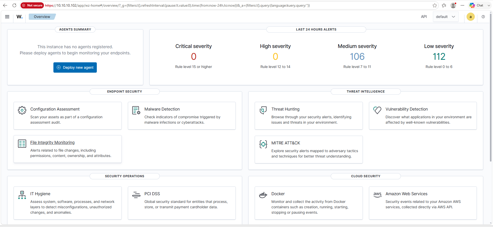

# 🛡️ Phase 04 — Wazuh SIEM/XDR

> **Objective:** Validate centralized SIEM/XDR monitoring with Wazuh by investigating Windows and Linux security events, analyzing detection rules and severity, mapping activity to MITRE ATT&CK, validating File Integrity Monitoring, and correlating endpoint activity from multiple security telemetry sources.

[← Phase 03](phase-03-endpoint-monitoring.md) | [🏠 Main Project](../README.md) | [Phase 05 →](phase-05-suricata-ids.md)

---

## 📑 Table of Contents

- [Phase Summary](#-phase-summary)
- [Overview](#-overview)
- [SIEM Architecture](#️-siem-architecture)
- [Phase Objectives](#-phase-objectives)
- [Wazuh Platform Validation](#️-wazuh-platform-validation)
- [Connected Agents](#-connected-agents)
- [Ubuntu Authentication Investigation](#-ubuntu-authentication-investigation)
- [MITRE ATT&CK Analysis](#-mitre-attck-analysis)
- [Windows Process Investigation](#-windows-process-investigation)
- [File Integrity Monitoring](#-file-integrity-monitoring)
- [Event Correlation](#-event-correlation)
- [Commands Used](#-commands-used)
- [Validation](#-validation)
- [Troubleshooting](#-troubleshooting)
- [Lessons Learned](#-lessons-learned)
- [Skills Demonstrated](#-skills-demonstrated)
- [Evidence Summary](#-evidence-summary)
- [Phase Outcome](#-phase-outcome)

---

# 📊 Phase Summary

| Category | Details |
|---|---|
| **Status** | ✅ Complete |
| **Platform** | Wazuh SIEM/XDR |
| **Wazuh Server** | SOC-Wazuh |
| **Manager IP** | `10.10.10.102` |
| **Windows Endpoint** | SOC-Windows11 |
| **Linux Endpoint** | soc-ubuntu |
| **Authentication Detection** | Rule `5503` — Level `5` |
| **Windows Process Detection** | Rule `67027` |
| **FIM Detection** | Rule `554` |
| **Security Framework** | MITRE ATT&CK |
| **Focus** | Detection, investigation, correlation & endpoint monitoring |
| **Next Phase** | Suricata IDS/IPS |

---

# 📋 Overview

Phase 4 moved the Enterprise Security Operations Lab from endpoint telemetry collection into centralized **SIEM/XDR monitoring and SOC investigation**.

Phase 3 established telemetry from Windows and Linux endpoints.

Phase 4 used that telemetry to investigate security activity through Wazuh.

```text
SOC-Windows11                  SOC-Ubuntu
      │                            │
      ▼                            ▼
Windows Telemetry             Linux Telemetry
      │                            │
      ▼                            ▼
 Wazuh Agent                  Wazuh Agent
      │                            │
      └────────────┬───────────────┘
                   │
                   ▼
               SOC-Wazuh
               SIEM/XDR
                   │
                   ▼
          Detection & Analysis
                   │
                   ▼
           SOC Investigation
```

The phase included:

- Wazuh platform validation
- Agent connectivity validation
- Ubuntu authentication-failure investigation
- Wazuh rule analysis
- Alert severity analysis
- MITRE ATT&CK mapping
- Windows process investigation
- File Integrity Monitoring
- Controlled file-change detection
- FIM alert analysis
- Event correlation
- Wazuh Dashboard troubleshooting

The goal was to move beyond simply collecting logs.

The SOC workflow became:

```text
Event
  │
  ▼
Detection
  │
  ▼
Alert
  │
  ▼
Investigation
  │
  ▼
Context
  │
  ▼
Correlation
  │
  ▼
Finding
```

---

# 🏗️ SIEM Architecture

```text
                    SOC-Windows11
                          │
                          │
                     Wazuh Agent
                          │
                          ▼
                  ┌───────────────┐
                  │               │
                  │   SOC-Wazuh   │
                  │   SIEM/XDR    │
                  │ 10.10.10.102  │
                  │               │
                  └───────────────┘
                          ▲
                          │
                     Wazuh Agent
                          │
                          │
                     SOC-Ubuntu
                    10.50.20.100
```

The security-event processing workflow is:

```text
Endpoint Activity
       │
       ▼
Operating System Logs
       │
       ▼
Wazuh Agent
       │
       ▼
Wazuh Manager
       │
       ▼
Decoder
       │
       ▼
Detection Rule
       │
       ▼
Security Alert
       │
       ▼
Wazuh Dashboard
       │
       ▼
SOC Analyst
```

---

# 🎯 Phase Objectives

- [x] Validate Wazuh SIEM/XDR operation
- [x] Validate Wazuh Dashboard
- [x] Validate Wazuh Manager
- [x] Validate Wazuh Indexer
- [x] Validate Filebeat
- [x] Confirm Windows Agent connectivity
- [x] Confirm Ubuntu Agent connectivity
- [x] Investigate Ubuntu authentication failures
- [x] Analyze Wazuh rule IDs
- [x] Analyze alert severity
- [x] Review MITRE ATT&CK context
- [x] Investigate Windows process telemetry
- [x] Validate File Integrity Monitoring
- [x] Generate controlled file activity
- [x] Analyze FIM alerts
- [x] Review file metadata and hashes
- [x] Correlate related security events
- [x] Troubleshoot Wazuh Dashboard connectivity

---

# ⚙️ Wazuh Platform Validation

The dedicated **SOC-Wazuh** virtual machine provides centralized SIEM/XDR services for the lab.

Core components include:

```text
Wazuh Dashboard
       │
       ▼
Wazuh Manager
       │
       ▼
Wazuh Indexer
       ▲
       │
    Filebeat
```

The Wazuh Dashboard is accessed through:

```text
https://10.10.10.102
```

The lab environment uses a self-signed certificate.

---

## 📸 Evidence — Wazuh Dashboard


The dashboard provides centralized access to endpoint security telemetry, alerts, agent information, and investigation data.

**Result:** ✅ Wazuh SIEM/XDR dashboard operational.

---

## 📸 Evidence — Wazuh Security Dashboard



This additional dashboard view demonstrates the operational Wazuh security environment used during Phase 4 investigations.

**Result:** ✅ Centralized security-monitoring interface validated.

---

# 🔗 Connected Agents

Both monitored endpoints were connected to Wazuh.

The Wazuh environment showed:

```text
Active:           2
Pending:          0
Disconnected:     0
Never Connected:  0
```

Connected endpoints:

```text
SOC-Windows11
      │
      └── ACTIVE

soc-ubuntu
      │
      └── ACTIVE
```

This validated the endpoint monitoring infrastructure established in Phase 3.

---

## 📸 Evidence — Connected Wazuh Agents


**Result:** ✅ Windows and Ubuntu endpoints successfully connected to Wazuh.

---

# 🚨 Ubuntu Authentication Investigation

Controlled authentication failures were generated on SOC-Ubuntu and investigated through Wazuh.

The monitored endpoint was:

```text
Hostname: soc-ubuntu
IP:       10.50.20.100
```

The resulting Wazuh detection included:

```text
Rule ID:     5503
Rule Level:  5
Description: PAM: User login failed
```

The detection path was:

```text
Authentication Failure
        │
        ▼
Linux PAM
        │
        ▼
Linux Authentication Log
        │
        ▼
Wazuh Agent
        │
        ▼
Wazuh Manager
        │
        ▼
Rule 5503
        │
        ▼
Level 5 Alert
        │
        ▼
SOC Investigation
```

The alert was expanded and investigated instead of relying only on the alert title.

The investigation included:

- Agent name
- Endpoint IP
- Rule ID
- Rule severity
- Rule description
- Authentication information
- Event timestamp
- Associated security context

---

## 📸 Evidence — Authentication Investigation


This evidence demonstrates investigation of the Linux authentication event inside Wazuh.

**Result:** ✅ Linux authentication failures detected and investigated.

---

# 🗺️ MITRE ATT&CK Analysis

The authentication event was also reviewed using its associated MITRE ATT&CK context.

MITRE ATT&CK provides a standardized way to categorize behaviors associated with adversary tactics and techniques.

The investigation process became:

```text
Raw Authentication Event
          │
          ▼
     Wazuh Detection
          │
          ▼
     Rule / Severity
          │
          ▼
   MITRE ATT&CK Context
          │
          ▼
    Analyst Analysis
```

MITRE ATT&CK context helps answer:

```text
What happened?
      +
What type of security behavior
could this activity represent?
```

MITRE mapping does not automatically prove malicious activity.

The analyst still evaluates the event using the surrounding context.

---

## 📸 Evidence — MITRE ATT&CK Mapping


The authentication detection was reviewed alongside its MITRE ATT&CK information to add standardized security context.

**Result:** ✅ MITRE ATT&CK context successfully incorporated into the investigation.

---

# 🪟 Windows Process Investigation

Windows process telemetry configured during Phase 3 was investigated through Wazuh.

The Windows endpoint provided telemetry from:

```text
Windows Security Auditing
          +
       Sysmon
          +
PowerShell Logging
          +
     Wazuh Agent
```

A Windows process event was investigated using Wazuh detection telemetry associated with:

```text
Rule 67027
```

The investigation included:

- Endpoint
- User
- Process
- Parent process
- Command line
- Timestamp
- Wazuh rule
- Associated event context

This demonstrated the difference between:

```text
Collecting Logs
```

and:

```text
Analyzing Endpoint Activity
```

---

## 📸 Evidence — Windows Process Investigation


This evidence demonstrates investigation of Windows process activity through the centralized Wazuh platform.

**Result:** ✅ Windows process telemetry successfully investigated.

---

# 📁 File Integrity Monitoring

Wazuh File Integrity Monitoring was validated using controlled file activity.

FIM provides visibility into changes made to monitored files and directories.

The controlled test followed this workflow:

```text
Create File
    │
    ▼
Wazuh FIM
    │
    ▼
Detect File
    │
    ▼
Generate Alert
    │
    ▼
Modify File
    │
    ▼
Detect Change
    │
    ▼
Analyze Metadata
```

The FIM event was associated with:

```text
Rule ID: 554
```

The investigation included:

- File path
- File event type
- Modification information
- File metadata
- Hash information
- Rule information

---

## 📸 Evidence — Controlled FIM Detection


This evidence demonstrates that Wazuh detected the controlled file activity.

**Result:** ✅ Controlled file changes successfully detected.

---

## 📸 Evidence — FIM Alert Analysis


The FIM alert was expanded and analyzed to review detailed information associated with the file change.

This provided visibility into:

```text
File
  │
  ├── Path
  ├── Event
  ├── Metadata
  ├── Hash
  └── Wazuh Rule
```

**Result:** ✅ File Integrity Monitoring alert successfully investigated.

---

# 🔗 Event Correlation

Phase 4 also demonstrated the value of correlating multiple security events.

Instead of investigating each event independently, related telemetry was reviewed together.

```text
Authentication Activity
          +
Windows Process Activity
          +
File Integrity Activity
          │
          ▼
       Wazuh SIEM
          │
          ▼
    Event Correlation
          │
          ▼
   Analyst Investigation
```

Correlation included reviewing:

- Event timestamps
- Agent information
- Rule IDs
- Severity
- Event descriptions
- MITRE ATT&CK context
- Process information
- File information
- Related endpoint activity

This provides a more complete understanding of endpoint behavior.

---

## 📸 Evidence — Event Correlation


The correlated Wazuh telemetry demonstrates how multiple events can be reviewed together during a SOC investigation.

**Result:** ✅ Multiple security events successfully correlated.

---

# 💻 Commands Used

The following commands were used during Phase 4 to validate, troubleshoot, and recover Wazuh services.

---

## Check Wazuh Indexer

```bash
sudo systemctl status wazuh-indexer
```

Expected:

```text
active (running)
```

The Wazuh Indexer stores and indexes security-event data.

---

## Check Wazuh Manager

```bash
sudo systemctl status wazuh-manager
```

Expected:

```text
active (running)
```

The Wazuh Manager receives and analyzes telemetry from connected agents.

---

## Check Wazuh Dashboard

```bash
sudo systemctl status wazuh-dashboard
```

Expected:

```text
active (running)
```

This validates the web interface used by the analyst.

---

## Check Filebeat

```bash
sudo systemctl status filebeat
```

Expected:

```text
active (running)
```

Filebeat participates in the Wazuh event-processing pipeline.

---

## Test Filebeat Output

```bash
sudo filebeat test output
```

This validates the Filebeat communication path.

The test checks:

```text
URL Parsing
     │
     ▼
Host Parsing
     │
     ▼
DNS Lookup
     │
     ▼
TCP Connection
     │
     ▼
TLS Handshake
     │
     ▼
Server Communication
```

---

## Check Wazuh API Port

```bash
sudo ss -lntp | grep 55000
```

Command breakdown:

```text
ss            Display sockets
-l            Listening sockets
-n            Numeric addresses/ports
-t            TCP sockets
-p            Process information
grep 55000    Filter Wazuh API port
```

The Wazuh API port:

```text
55000
```

was confirmed listening during troubleshooting.

---

## Restart Wazuh Dashboard

```bash
sudo systemctl restart wazuh-dashboard
```

Only the affected dashboard service was restarted instead of rebooting the entire Wazuh server.

---

## Command Reference

| Purpose | Command |
|---|---|
| Check Wazuh Indexer | `sudo systemctl status wazuh-indexer` |
| Check Wazuh Manager | `sudo systemctl status wazuh-manager` |
| Check Wazuh Dashboard | `sudo systemctl status wazuh-dashboard` |
| Check Filebeat | `sudo systemctl status filebeat` |
| Test Filebeat output | `sudo filebeat test output` |
| Check Wazuh API | `sudo ss -lntp \| grep 55000` |
| Restart Dashboard | `sudo systemctl restart wazuh-dashboard` |

---

# 🧪 Validation

Phase 4 validated multiple detection and investigation capabilities.

| Test | Result |
|---|---|
| Wazuh Dashboard | ✅ Operational |
| Windows Agent | ✅ Active |
| Ubuntu Agent | ✅ Active |
| Linux Authentication Detection | ✅ Rule `5503` |
| MITRE ATT&CK Context | ✅ Validated |
| Windows Process Detection | ✅ Rule `67027` |
| File Integrity Monitoring | ✅ Rule `554` |
| Event Correlation | ✅ Validated |
| SIEM Troubleshooting | ✅ Completed |

The complete validation workflow demonstrated:

```text
Generate Activity
       │
       ▼
Collect Telemetry
       │
       ▼
Forward to Wazuh
       │
       ▼
Apply Detection Rule
       │
       ▼
Generate Alert
       │
       ▼
Investigate Alert
       │
       ▼
Add Security Context
       │
       ▼
Correlate Events
       │
       ▼
Document Finding

       ✅
```

---

# 🔧 Troubleshooting

Phase 4 included troubleshooting of the Wazuh platform itself.

This was important because Wazuh consists of multiple interconnected services.

---

## Wazuh Dashboard Error

At one point, the Wazuh Dashboard displayed:

```text
Something went wrong.
```

Instead of reinstalling the entire Wazuh platform, each component was checked independently.

### Indexer

```bash
sudo systemctl status wazuh-indexer
```

Result:

```text
active (running)
```

### Dashboard

```bash
sudo systemctl status wazuh-dashboard
```

Result:

```text
active (running)
```

### Manager

```bash
sudo systemctl status wazuh-manager
```

Result:

```text
active (running)
```

### Filebeat

```bash
sudo systemctl status filebeat
```

Result:

```text
active (running)
```

This demonstrated that the underlying Wazuh services remained operational even though the web interface displayed an error.

---

## Filebeat Pipeline Validation

The data pipeline was then tested:

```bash
sudo filebeat test output
```

The test successfully validated:

- URL parsing
- Host parsing
- DNS lookup
- TCP connectivity
- TLS handshake
- Server communication

This showed that Filebeat could still communicate with the Wazuh Indexer.

---

## API Port Validation

The Wazuh API port was checked using:

```bash
sudo ss -lntp | grep 55000
```

Port:

```text
55000
```

was listening.

This provided additional evidence that the Wazuh environment remained operational.

---

## Targeted Dashboard Recovery

Instead of rebooting the entire server, only the dashboard service was restarted:

```bash
sudo systemctl restart wazuh-dashboard
```

The dashboard recovered.

The endpoint page initially continued to display an error, but after waiting and retrying, the interface loaded and displayed both active agents.

---

## Troubleshooting Workflow

```text
Dashboard Error
      │
      ▼
Check Indexer
      │
      ▼
Check Manager
      │
      ▼
Check Dashboard
      │
      ▼
Check Filebeat
      │
      ▼
Test Filebeat Pipeline
      │
      ▼
Check API Port
      │
      ▼
Restart Affected Service
      │
      ▼
Validate Dashboard
```

This avoided unnecessary reinstallation of the platform.

---

# 💡 Lessons Learned

## 1. A Dashboard Error Does Not Mean the SIEM Failed

A problem with the Wazuh Dashboard did not mean that the Manager, Indexer, Filebeat, or endpoint agents had failed.

Each component must be validated independently.

---

## 2. Troubleshoot Complex Security Platforms by Layer

```text
Dashboard
    │
    ▼
Manager
    │
    ▼
Indexer
    │
    ▼
Filebeat
    │
    ▼
Network
    │
    ▼
Endpoint Agent
```

Checking one layer at a time makes complex SIEM troubleshooting more manageable.

---

## 3. Alerts Require Investigation

An alert is the beginning of the analyst workflow, not the end.

```text
Alert
  │
  ▼
Rule
  │
  ▼
Severity
  │
  ▼
Endpoint
  │
  ▼
Raw Event
  │
  ▼
Context
  │
  ▼
Finding
```

---

## 4. MITRE ATT&CK Provides Context

MITRE ATT&CK helps categorize behavior using standardized tactics and techniques.

It does not automatically prove malicious intent.

The analyst must evaluate the evidence.

---

## 5. Different Telemetry Answers Different Questions

```text
Authentication Logs
        │
        ▼
Who attempted access?


Process Telemetry
        │
        ▼
What executed?


File Integrity Monitoring
        │
        ▼
What changed?
```

Combining these sources provides stronger investigation context.

---

## 6. Controlled Testing Proves Detection Capability

A configured feature does not prove that the detection works.

The stronger approach is:

```text
Configure
   │
   ▼
Generate Controlled Activity
   │
   ▼
Detect
   │
   ▼
Investigate
   │
   ▼
Validate Evidence
```

---

## 7. Correlation Improves Investigation Quality

Individual alerts can provide limited information.

Correlating related events helps analysts understand the broader activity occurring on an endpoint.

---

# 🧭 SOC Investigation Methodology

Phase 4 established a repeatable SOC investigation process:

```text
Alert
  │
  ▼
Identify Endpoint
  │
  ▼
Review Rule
  │
  ▼
Review Severity
  │
  ▼
Inspect Raw Event
  │
  ▼
Review MITRE Context
  │
  ▼
Search Related Events
  │
  ▼
Correlate Activity
  │
  ▼
Document Findings
```

This methodology became the foundation for later incident-response phases.

---

# 🧠 Skills Demonstrated

| Skill | Application |
|---|---|
| **SIEM Administration** | Operated centralized Wazuh infrastructure |
| **XDR Monitoring** | Investigated endpoint security telemetry |
| **Linux Authentication Analysis** | Investigated PAM authentication failures |
| **Windows Event Analysis** | Investigated Windows process activity |
| **Detection Analysis** | Reviewed Wazuh rule IDs and severity |
| **MITRE ATT&CK** | Added standardized security context |
| **File Integrity Monitoring** | Detected controlled file changes |
| **Hash Analysis** | Reviewed file-change metadata |
| **Event Correlation** | Connected related security telemetry |
| **SOC Investigation** | Followed alert-to-investigation workflow |
| **Linux Administration** | Validated Wazuh services |
| **Network Troubleshooting** | Checked Wazuh API connectivity |
| **Pipeline Validation** | Tested Filebeat output |
| **Service Recovery** | Recovered Wazuh Dashboard |
| **Troubleshooting** | Diagnosed a multi-component SIEM platform |

---

# 📸 Evidence Summary

Phase 4 contains **nine original screenshots** documenting the SIEM/XDR investigation workflow.

| # | Evidence | Screenshot |
|---|---|---|
| 1 | Connected Wazuh Agents | `phase4-agents.png` |
| 2 | Authentication Investigation | `phase4-authentication-investigation.png` |
| 3 | MITRE ATT&CK Authentication Analysis | `phase4-authentication-mitre.png` |
| 4 | Wazuh Dashboard | `phase4-dashboard.png` |
| 5 | Event Correlation | `phase4-event-correlation.png` |
| 6 | FIM Alert Analysis | `phase4-fim-alert-analysis.png` |
| 7 | Controlled FIM Detection | `phase4-fim-controlled-detection.png` |
| 8 | Wazuh Security Dashboard | `phase4-wazuh-dashboard.png` |
| 9 | Windows Process Investigation | `phase4-windows-process-investigation.png` |

All evidence uses the existing `/images` directory.

No screenshots were renamed or duplicated.

---

# 🏁 Phase Outcome

## ✅ Phase 4 Complete

Phase 4 successfully demonstrated centralized SIEM/XDR monitoring and SOC investigation using Wazuh.

The completed work included:

- Centralized Windows monitoring
- Centralized Linux monitoring
- Wazuh platform validation
- Agent connectivity validation
- Linux authentication investigation
- Rule and severity analysis
- MITRE ATT&CK analysis
- Windows process investigation
- File Integrity Monitoring
- Controlled FIM testing
- FIM alert analysis
- Event correlation
- Wazuh service troubleshooting
- Filebeat pipeline validation
- Wazuh API validation
- Targeted dashboard recovery

The complete Phase 4 workflow was:

```text
Endpoint Activity
       │
       ▼
Security Telemetry
       │
       ▼
Wazuh Agent
       │
       ▼
Wazuh Manager
       │
       ▼
Detection Rule
       │
       ▼
Security Alert
       │
       ▼
SOC Investigation
       │
       ├─────────────┐
       ▼             ▼
MITRE Context    Related Events
       │             │
       └──────┬──────┘
              │
              ▼
        Event Correlation
              │
              ▼
       Analyst Finding

             ✅
```

Phase 4 moved the project beyond log collection into **centralized security detection, analysis, investigation, and correlation**.

The SIEM/XDR environment was now ready to incorporate network-based intrusion detection.

---

# ➡️ Next Phase

## Phase 05 — Suricata IDS/IPS

Phase 5 expands the SOC environment from endpoint-based detection into network-based intrusion detection.

The next phase includes:

- Suricata deployment on OPNsense
- ET Open rules
- IDS/IPS monitoring
- Controlled Nmap reconnaissance
- Kali-to-Ubuntu traffic generation
- Custom Suricata rules
- HTTP detection
- Reconnaissance detection
- Alert validation
- Suricata service troubleshooting

---

[← Phase 03](phase-03-endpoint-monitoring.md) | [🏠 Back to Main Project](../README.md) | [Phase 05 →](phase-05-suricata-ids.md)

---

### Enterprise Security Operations Lab

**SOC Operations • SIEM/XDR • Detection Engineering • Endpoint Security • MITRE ATT&CK • Incident Response**
