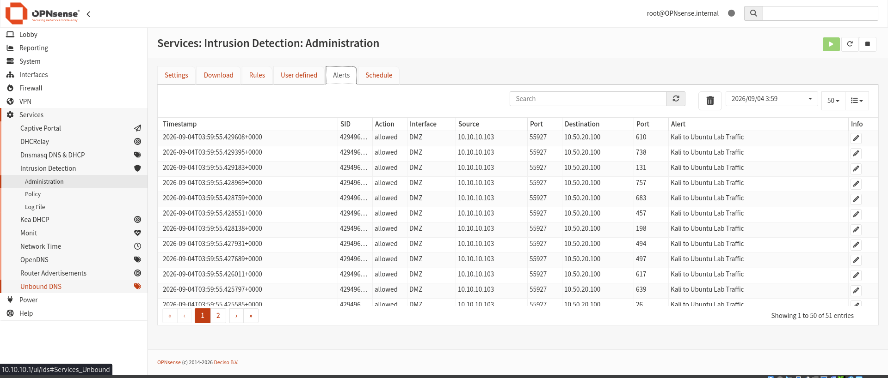
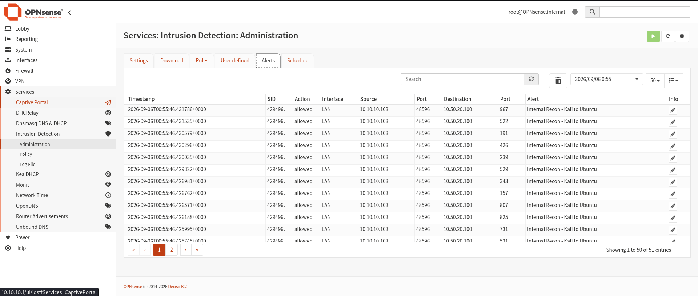
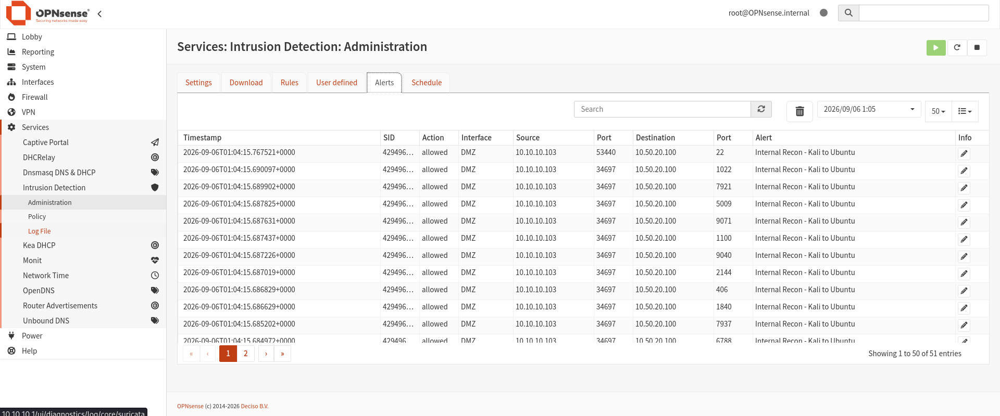
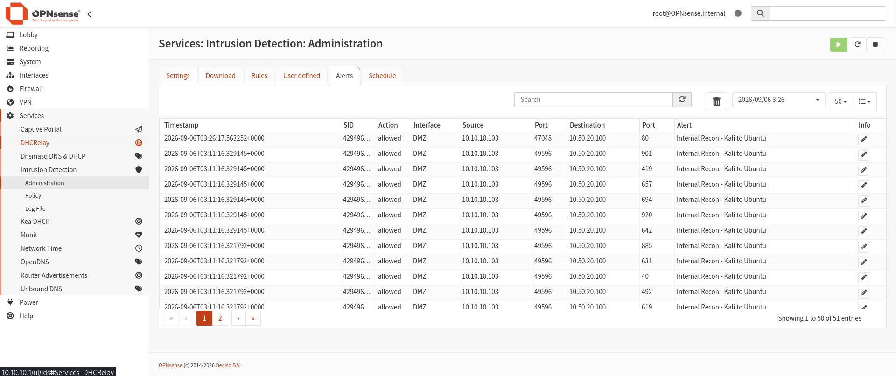

# 🛡️ Phase 05 — Suricata IDS/IPS

> **Objective:** Deploy, configure, troubleshoot, and validate Suricata network intrusion detection on OPNsense using controlled reconnaissance and HTTP traffic between SOC-Kali and the Ubuntu DMZ target.

[← Phase 04](phase-04-wazuh-siem.md) | [🏠 Main Project](../README.md) | [Phase 06 →](phase-06-security-monitoring.md)

---

## 📑 Table of Contents

- [Phase Summary](#-phase-summary)
- [Overview](#-overview)
- [Network Detection Architecture](#️-network-detection-architecture)
- [Phase Objectives](#-phase-objectives)
- [Suricata Configuration](#️-suricata-configuration)
- [Service Validation](#-service-validation)
- [Controlled Reconnaissance](#-controlled-reconnaissance)
- [Custom Reconnaissance Detection](#-custom-reconnaissance-detection)
- [HTTP Detection](#-http-detection)
- [EVE Event Analysis](#-eve-event-analysis)
- [Commands Used](#-commands-used)
- [Validation](#-validation)
- [Troubleshooting](#-troubleshooting)
- [Lessons Learned](#-lessons-learned)
- [Skills Demonstrated](#-skills-demonstrated)
- [Evidence Summary](#-evidence-summary)
- [Phase Outcome](#-phase-outcome)

---

# 📊 Phase Summary

| Category | Details |
|---|---|
| **Status** | ✅ Complete |
| **IDS/IPS Platform** | Suricata `8.0.6` |
| **Firewall** | OPNsense |
| **Monitored Zone** | DMZ |
| **Traffic Source** | SOC-Kali `10.10.10.103` |
| **Controlled Target** | SOC-Ubuntu `10.50.20.100` |
| **LAN Gateway** | `10.10.10.1` |
| **DMZ Gateway** | `10.50.20.1` |
| **Rules** | ET Open + Custom Rules |
| **Testing** | Nmap + HTTP |
| **Logging** | EVE JSON + Suricata Logs |
| **Focus** | Network threat detection |
| **Next Phase** | Security Monitoring & Correlation |

---

# 📋 Overview

Phase 5 expanded the Enterprise Security Operations Lab from endpoint-based monitoring into **network intrusion detection**.

Suricata was deployed through OPNsense and configured to inspect traffic entering the DMZ.

Controlled security traffic was generated from:

```text
SOC-Kali
10.10.10.103
```

against:

```text
SOC-Ubuntu
10.50.20.100
```

The phase validated Suricata's ability to inspect and detect:

- Network reconnaissance
- Port scanning
- Suspicious network connections
- HTTP communication
- IDS signatures
- Custom detection rules
- Source and destination addresses
- Source and destination ports
- Network protocols

The testing methodology followed:

```text
Generate Traffic
       │
       ▼
OPNsense Firewall
       │
       ▼
Suricata IDS
       │
       ▼
Inspect Packets
       │
       ▼
Match Detection Rule
       │
       ▼
Generate Alert
       │
       ▼
Review Evidence
```

---

# 🏗️ Network Detection Architecture

```text
               SECURITY LAN
              10.10.10.0/24
                     │
                     │
                 SOC-Kali
                10.10.10.103
                     │
                     │
             Controlled Traffic
                     │
                     ▼
              ┌──────────────┐
              │   OPNsense   │
              │   Firewall   │
              │      +       │
              │   Suricata   │
              │   IDS/IPS    │
              └──────┬───────┘
                     │
                     │
                     ▼
                    DMZ
              10.50.20.0/24
                     │
                     ▼
                SOC-Ubuntu
               10.50.20.100
```

### Systems

| System | IP Address | Network | Role |
|---|---|---|---|
| SOC-Kali | `10.10.10.103` | Security LAN | Analyst / controlled traffic source |
| SOC-Ubuntu | `10.50.20.100` | DMZ | Linux endpoint / controlled target |
| SOC-OPNsense | `10.10.10.1` / `10.50.20.1` | LAN / DMZ | Firewall + Suricata IDS |

---

# 🎯 Phase Objectives

- [x] Enable Suricata through OPNsense
- [x] Monitor DMZ network traffic
- [x] Validate Suricata configuration
- [x] Verify Netmap support
- [x] Validate Suricata process status
- [x] Validate Suricata service status
- [x] Confirm packet inspection
- [x] Identify Suricata log locations
- [x] Generate controlled Nmap reconnaissance
- [x] Detect Kali-to-Ubuntu reconnaissance
- [x] Create custom reconnaissance detection
- [x] Analyze raw EVE events
- [x] Generate controlled HTTP traffic
- [x] Validate HTTP detection
- [x] Analyze custom-rule behavior
- [x] Identify potential false positives
- [x] Troubleshoot Suricata runtime issues

---

# ⚙️ Suricata Configuration

Suricata was enabled through the OPNsense **Intrusion Detection** service.

The DMZ interface was monitored so traffic directed toward SOC-Ubuntu could be inspected.

Suricata provided visibility into:

```text
Network Traffic
      │
      ├── Source IP
      ├── Destination IP
      ├── Source Port
      ├── Destination Port
      ├── Protocol
      ├── Signature
      └── Alert
```

The primary monitoring path was:

```text
SOC-Kali
10.10.10.103
     │
     ▼
OPNsense
     │
     ▼
Suricata
     │
     ▼
DMZ
     │
     ▼
SOC-Ubuntu
10.50.20.100
```

---

# 🔍 Service Validation

Before generating controlled security traffic, Suricata itself was validated.

## Configuration Validation

The configuration was tested using:

```bash
suricata -T -c /usr/local/etc/suricata/suricata.yaml
```

The test returned:

```text
Exit Status: 0
```

This demonstrated that the Suricata configuration passed syntax/configuration validation.

However:

> A successful configuration test does not prove that the Suricata service is currently running.

That distinction became one of the major lessons from this phase.

---

## Netmap Support

The Suricata build information was reviewed.

Netmap support was confirmed:

```text
Netmap support: yes v14+
```

This verified that the installed Suricata build supported Netmap functionality used for IPS operation.

---

## Process Validation

The Suricata process was checked using:

```bash
pgrep -af suricata
```

This provided direct visibility into whether a Suricata process was actually running.

---

## Service Validation

Suricata was also checked using:

```bash
service suricata status
```

and:

```bash
configctl ids status
```

These commands provided different views of IDS operation.

When Suricata needed to be started, the following command was used:

```bash
configctl ids start
```

The process and service checks were then repeated.

---

## Packet Processing Validation

A running process alone does not prove that Suricata is receiving traffic.

Packet-processing statistics were therefore reviewed through:

```text
/var/log/suricata/stats.log
```

Non-zero packet counters demonstrated that network traffic was reaching the Suricata inspection engine.

The validation methodology became:

```text
Valid Configuration
       │
       ▼
Running Process
       │
       ▼
Running Service
       │
       ▼
Packet Counters
       │
       ▼
Generated Traffic
       │
       ▼
Security Alert
```

---

# 🔎 Controlled Reconnaissance

SOC-Kali was used as the controlled reconnaissance source.

```text
Source:
SOC-Kali
10.10.10.103

Target:
SOC-Ubuntu
10.50.20.100
```

Nmap reconnaissance was generated against the Ubuntu target.

The traffic crossed OPNsense and entered the monitored DMZ path.

```text
SOC-Kali
     │
     │ Nmap
     ▼
OPNsense
     │
     ▼
Suricata
     │
     ▼
SOC-Ubuntu
```

Suricata inspected the traffic and generated reconnaissance-related alerts.

---

## 📸 Evidence — Suricata Detection



This evidence demonstrates Suricata detecting controlled network activity generated from SOC-Kali.

**Result:** ✅ Network detection operational.

---

## 📸 Evidence — Nmap Detection


The Nmap-generated traffic was successfully observed by Suricata.

**Result:** ✅ Controlled reconnaissance visible to the IDS.

---

## 📸 Evidence — Nmap Alert


The corresponding alert provided security context for the reconnaissance traffic.

**Result:** ✅ Nmap reconnaissance generated Suricata alert evidence.

---

# 🚨 Custom Reconnaissance Detection

A custom detection was used to identify traffic originating from SOC-Kali and directed toward SOC-Ubuntu.

The resulting alert included:

```text
Internal Recon - Kali to Ubuntu
```

The custom rule provided a clear way to validate that traffic between the controlled source and target was being inspected.

Detection path:

```text
SOC-Kali
10.10.10.103
      │
      │ Controlled Recon
      ▼
Suricata
      │
      │ Custom Rule Match
      ▼
Internal Recon
Kali to Ubuntu
      │
      ▼
Alert
```

---

## 📸 Evidence — Internal Recon Alert



This evidence demonstrates the custom Kali-to-Ubuntu reconnaissance detection.

**Result:** ✅ Custom Suricata rule successfully generated an alert.

---

## 📸 Evidence — Recon Alert



The alert view provided additional context for the controlled reconnaissance traffic.

---

# 🌐 HTTP Detection

Controlled HTTP traffic was also generated to validate application-layer network monitoring.

A temporary HTTP server was used on SOC-Ubuntu.

The server was started using:

```bash
sudo python3 -m http.server 80
```

The resulting traffic path was:

```text
SOC-Kali
      │
      │ HTTP Request
      ▼
OPNsense
      │
      ▼
Suricata
      │
      ▼
SOC-Ubuntu
TCP 80
```

A custom HTTP detection generated:

```text
Kali to Ubuntu Http Detection
```

This provided a second controlled detection scenario beyond reconnaissance.

---

## 📸 Evidence — HTTP Detection


**Result:** ✅ Controlled HTTP communication detected.

---

## 📸 Evidence — HTTP Alert



The HTTP alert confirmed that Suricata was inspecting traffic associated with the controlled web request.

**Result:** ✅ HTTP detection successfully generated alert evidence.

---

# 📄 EVE Event Analysis

Suricata EVE JSON logs were reviewed to validate raw detection events.

The primary event log was:

```text
/var/log/suricata/eve.json
```

EVE events provide detailed machine-readable security telemetry.

Useful fields can include:

```text
timestamp
src_ip
src_port
dest_ip
dest_port
proto
event_type
alert
signature
severity
```

The analysis path was:

```text
Packet
  │
  ▼
Suricata Inspection
  │
  ▼
Rule Match
  │
  ▼
EVE JSON
  │
  ▼
Alert Dashboard
  │
  ▼
SOC Analysis
```

Reviewing both raw events and dashboard alerts provided stronger validation than relying on only one interface.

---

# 💻 Commands Used

The following commands were used during Phase 5 for configuration validation, runtime validation, traffic generation, service testing, and troubleshooting.

---

## OPNsense — Validate Suricata Configuration

```bash
suricata -T -c /usr/local/etc/suricata/suricata.yaml
```

Purpose:

```text
Validate Suricata configuration
without assuming the service is running.
```

Successful result:

```text
Exit Status: 0
```

---

## OPNsense — Check Suricata Process

```bash
pgrep -af suricata
```

Purpose:

```text
Determine whether a Suricata process
is actually running.
```

---

## OPNsense — Check Suricata Service

```bash
service suricata status
```

Purpose:

```text
Check Suricata service state.
```

---

## OPNsense — Check IDS Status

```bash
configctl ids status
```

Purpose:

```text
Check OPNsense IDS status.
```

---

## OPNsense — Start IDS

```bash
configctl ids start
```

Purpose:

```text
Start the Suricata IDS service
through OPNsense.
```

---

## OPNsense — Review Suricata Logs

Suricata logs were located under:

```text
/var/log/suricata/
```

Important files included:

```text
eve.json
stats.log
latest.log
suricata_YYYYMMDD.log
```

---

## OPNsense — Review Packet Statistics

```text
/var/log/suricata/stats.log
```

Non-zero packet counters demonstrated that Suricata was actively receiving traffic.

---

## OPNsense — Review Raw EVE Events

```text
/var/log/suricata/eve.json
```

EVE JSON provided raw event details for Suricata detections.

---

## Ubuntu — Start Temporary HTTP Server

```bash
sudo python3 -m http.server 80
```

This provided a controlled HTTP service for Suricata testing.

---

## Kali — Controlled Reconnaissance

Nmap was used from SOC-Kali against:

```text
10.50.20.100
```

This generated controlled reconnaissance traffic for Suricata detection validation.

---

## 📋 Command Reference

| Purpose | Command / Location |
|---|---|
| Validate Suricata configuration | `suricata -T -c /usr/local/etc/suricata/suricata.yaml` |
| Check process | `pgrep -af suricata` |
| Check service | `service suricata status` |
| Check IDS status | `configctl ids status` |
| Start IDS | `configctl ids start` |
| Suricata log directory | `/var/log/suricata/` |
| Raw events | `/var/log/suricata/eve.json` |
| Packet statistics | `/var/log/suricata/stats.log` |
| Start HTTP test server | `sudo python3 -m http.server 80` |
| Controlled target | `10.50.20.100` |

---

# 🧪 Validation

Phase 5 validated multiple layers of Suricata operation.

| Validation | Result |
|---|---|
| Configuration syntax | ✅ Valid |
| Netmap capability | ✅ Supported |
| Suricata process | ✅ Validated |
| Suricata service | ✅ Validated |
| Packet processing | ✅ Validated |
| Nmap reconnaissance | ✅ Detected |
| Custom recon rule | ✅ Alert generated |
| HTTP communication | ✅ Detected |
| Custom HTTP detection | ✅ Alert generated |
| EVE logging | ✅ Validated |

The complete validation process was:

```text
Configuration
      │
      ▼
Service
      │
      ▼
Process
      │
      ▼
Packet Inspection
      │
      ▼
Controlled Traffic
      │
      ▼
Detection Rule
      │
      ▼
EVE Event
      │
      ▼
Suricata Alert

      ✅
```

---

# 🔧 Troubleshooting

Phase 5 included several important troubleshooting scenarios.

---

## Error Reconfiguring IDS

During configuration changes, OPNsense returned:

```text
Error reconfiguring IDS
Error (1)
```

Instead of relying only on the GUI error, Suricata logs were reviewed.

The logs were located under:

```text
/var/log/suricata/
```

Important files included:

```text
eve.json
stats.log
latest.log
suricata_YYYYMMDD.log
```

The engine log showed:

```text
This is Suricata version 8.0.6 RELEASE running in SYSTEM mode
Threads created
Engine started.
```

It later showed:

```text
Signal Received. Stopping engine.
```

The configuration was then independently tested:

```bash
suricata -T -c /usr/local/etc/suricata/suricata.yaml
```

The command returned:

```text
0
```

This proved the configuration was valid even though the service was not necessarily running.

---

## Configuration Valid ≠ Service Running

This was one of the most important lessons from Phase 5.

```text
suricata -T
     │
     ▼
Configuration Valid
```

does **not** automatically mean:

```text
Suricata Service Running
```

Both conditions must be validated independently.

Service validation therefore used:

```bash
pgrep -af suricata
```

```bash
service suricata status
```

```bash
configctl ids status
```

After starting Suricata:

```bash
configctl ids start
```

the process and service checks confirmed successful operation. :contentReference[oaicite:1]{index=1}

---

## Packet Counters Confirm Actual Inspection

A running process still does not prove that packets are being inspected.

The file:

```text
/var/log/suricata/stats.log
```

was reviewed.

Non-zero packet counters demonstrated that traffic was actually reaching Suricata.

This created three separate validation requirements:

```text
Valid Configuration
        +
Running Service
        +
Packets Processed
        =
Operational IDS
```

---

## Flowbit Warnings

Suricata generated flowbit-related warnings during startup.

However, the engine also reported:

```text
Engine started.
```

The warnings therefore had to be interpreted in context.

### Lesson

```text
Warning
   ≠
Fatal Error
```

Warnings should be investigated, but they do not automatically mean a security service failed.

---

## HTTP Service Failure

During HTTP testing, the temporary Python HTTP server was accidentally stopped before the Kali request was generated.

The resulting request failed because:

```text
TCP 80
```

was no longer listening.

The HTTP server was restarted:

```bash
sudo python3 -m http.server 80
```

The test then succeeded.

The troubleshooting workflow was:

```text
Connection Failure
       │
       ▼
Check Target Service
       │
       ▼
Check Listening Port
       │
       ▼
Check Network Connectivity
       │
       ▼
Check Firewall
       │
       ▼
Check IDS
```

A failed security test does not automatically mean that the firewall or IDS is malfunctioning. :contentReference[oaicite:2]{index=2}

---

## Broad Reconnaissance Rule

The broad reconnaissance rule also matched normal HTTP communication between the same source and destination.

This demonstrated a potential false-positive problem.

A detection rule should be tested against:

1. Traffic that **should trigger** it.
2. Traffic that **should not trigger** it.
3. Different protocols.
4. Different ports.
5. Normal application behavior.
6. Controlled suspicious behavior.

This provides a basic detection-engineering feedback loop:

```text
Create Rule
    │
    ▼
Generate Suspicious Traffic
    │
    ▼
Confirm Detection
    │
    ▼
Generate Normal Traffic
    │
    ▼
Check False Positives
    │
    ▼
Refine Detection
```

---

# 💡 Lessons Learned

## 1. Configuration Validation and Runtime Validation Are Different

A configuration can be valid while the service is stopped.

Both must be tested independently.

---

## 2. A Running Process Does Not Prove Packet Inspection

Service status must be combined with packet statistics and controlled traffic.

```text
Process Running
      +
Packet Counters
      +
Detection Alert
      =
Stronger Validation
```

---

## 3. Logs Are Critical During IDS Troubleshooting

The OPNsense GUI provides useful information, but raw Suricata logs provide deeper runtime evidence.

Important locations include:

```text
/var/log/suricata/eve.json
/var/log/suricata/stats.log
/var/log/suricata/latest.log
```

---

## 4. Warnings Must Be Interpreted in Context

A warning is not automatically a fatal error.

The surrounding service and engine state must also be reviewed.

---

## 5. Validate the Target Service Before Blaming the Network

When the HTTP test failed, the problem was the stopped web server—not OPNsense or Suricata.

The correct order is:

```text
Application
    ↓
Listening Port
    ↓
Network
    ↓
Firewall
    ↓
IDS
```

---

## 6. Detection Rules Can Generate False Positives

A rule that successfully detects suspicious traffic may still be too broad.

Detection engineering requires testing both malicious-like and normal traffic.

---

## 7. Controlled Traffic Provides Repeatable Validation

Using known source and destination systems makes IDS testing easier to document and reproduce.

```text
Known Source
     +
Known Target
     +
Known Activity
     =
Controlled Detection Test
```

---

# 🧠 Skills Demonstrated

| Skill | Application |
|---|---|
| **IDS/IPS Administration** | Configured Suricata on OPNsense |
| **Network Security Monitoring** | Inspected traffic entering the DMZ |
| **Suricata Administration** | Validated configuration and runtime |
| **Detection Engineering** | Tested custom reconnaissance and HTTP detections |
| **Nmap** | Generated controlled reconnaissance |
| **HTTP Testing** | Generated controlled application traffic |
| **EVE JSON Analysis** | Reviewed raw Suricata events |
| **Packet Analysis** | Validated packet-processing counters |
| **Firewall Integration** | Combined OPNsense and Suricata monitoring |
| **Service Troubleshooting** | Diagnosed IDS runtime problems |
| **False-Positive Analysis** | Identified broad-rule behavior |
| **SOC Validation** | Generated and confirmed controlled detections |

---

# 📸 Evidence Summary

The existing Phase 5 evidence files are reused in this reorganized documentation.

| # | Evidence | Existing Screenshot |
|---|---|---|
| 1 | Suricata Detection | `phase5-suricata-detection.png` |
| 2 | HTTP Alert | `phase5-suricata-http-alert.png` |
| 3 | HTTP Detection | `phase5-suricata-http-detection.png` |
| 4 | Internal Recon Alert | `phase5-suricata-internal-recon-alert.png` |
| 5 | Nmap Alert | `phase5-suricata-nmap-alert.png` |
| 6 | Nmap Detection | `phase5-suricata-nmap-detection.png` |
| 7 | Recon Alert | `phase5-suricata-recon-alert.png` |

These filenames match the Phase 5 evidence visible in your GitHub `/images` directory.

No duplicate screenshots are required.

---

# 🏁 Phase Outcome

## ✅ Phase 5 Complete

Phase 5 successfully demonstrated network intrusion detection using Suricata integrated with OPNsense.

The completed work included:

- Suricata configuration on OPNsense
- DMZ network monitoring
- Suricata configuration validation
- Netmap capability verification
- Suricata service troubleshooting
- Process validation
- Packet-processing validation
- Controlled Kali-to-Ubuntu reconnaissance
- Nmap scanning
- Custom reconnaissance detection
- Raw EVE event analysis
- OPNsense alert validation
- Controlled HTTP traffic generation
- Custom HTTP detection
- Detection-rule behavior analysis
- False-positive analysis
- IDS versus IPS analysis
- Network-security troubleshooting

The final validated workflow was:

```text
SOC-Kali
10.10.10.103
      │
      │
      │ Controlled Security Traffic
      ▼
SOC-OPNsense
      │
      ▼
Suricata IDS
      │
      ├──── Inspect Packets
      │
      ├──── Apply Signatures
      │
      ├──── Apply Custom Rules
      │
      ▼
Security Detection
      │
      ▼
EVE JSON
      │
      ▼
Suricata Alert
      │
      ▼
SOC Analysis

      ✅
```

Phase 5 expanded the lab from endpoint visibility into **network-based threat detection**.

The SOC environment now had:

```text
Endpoint Detection
       +
Network Detection
       =
Broader Security Visibility
```

This prepared the environment for the next phase, where network and endpoint telemetry could be investigated together.

---

# ➡️ Next Phase

## Phase 06 — Security Monitoring & Correlation

Phase 6 builds on Suricata and Wazuh by correlating network and endpoint security evidence.

The next phase includes:

- Controlled reconnaissance
- Suricata network detection
- SSH authentication testing
- Wazuh endpoint detection
- MITRE ATT&CK mapping
- Nmap HTTP reconnaissance
- Gobuster activity
- Cross-platform event correlation
- SOC investigation workflow

---

[← Phase 04](phase-04-wazuh-siem.md) | [🏠 Back to Main Project](../README.md) | [Phase 06 →](phase-06-security-monitoring.md)

---

### Enterprise Security Operations Lab

**SOC Operations • Suricata IDS/IPS • Network Security Monitoring • Detection Engineering • OPNsense • Incident Detection**
