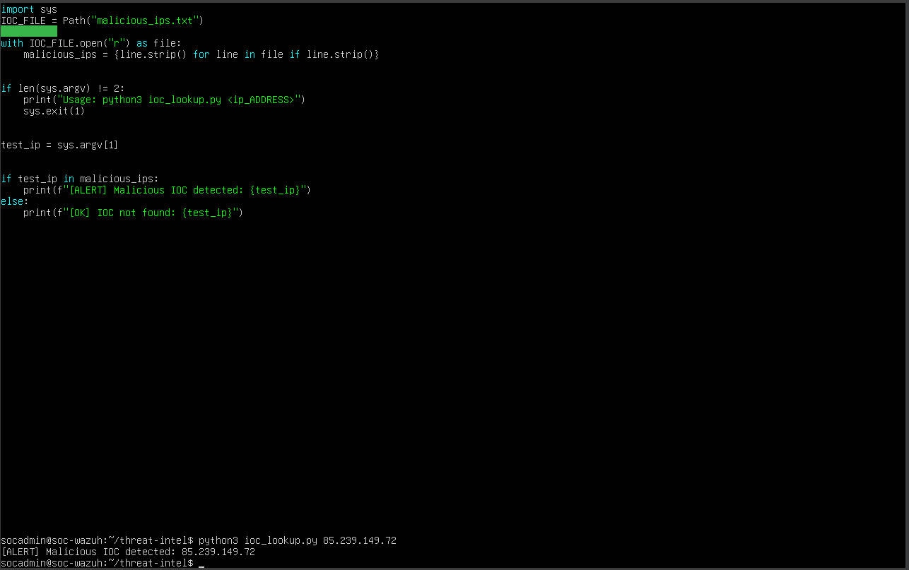
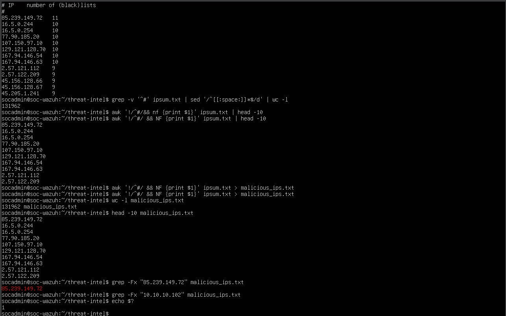
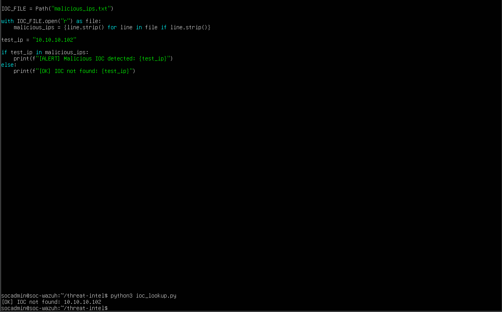
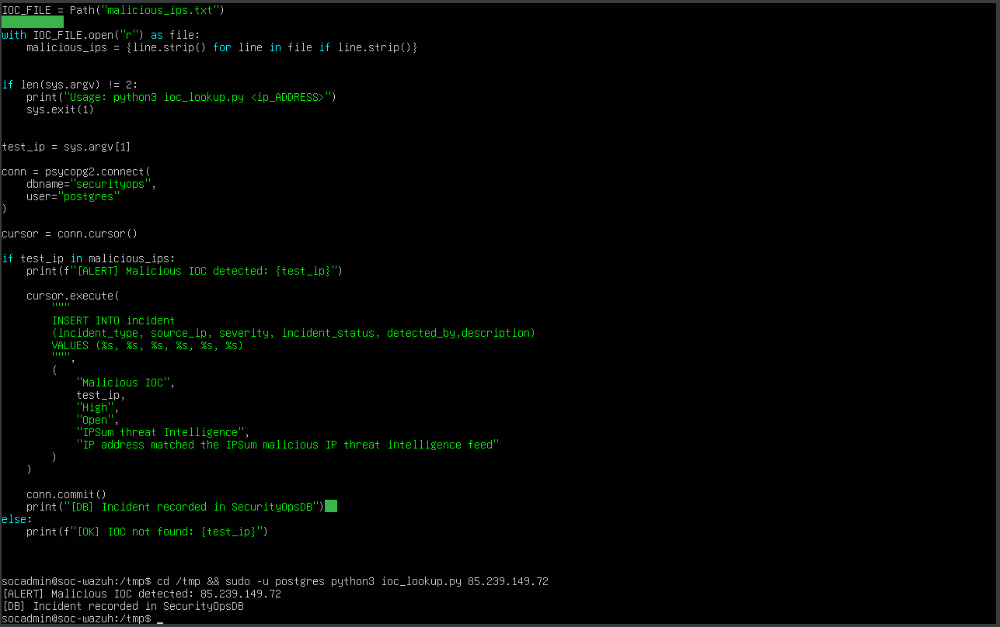
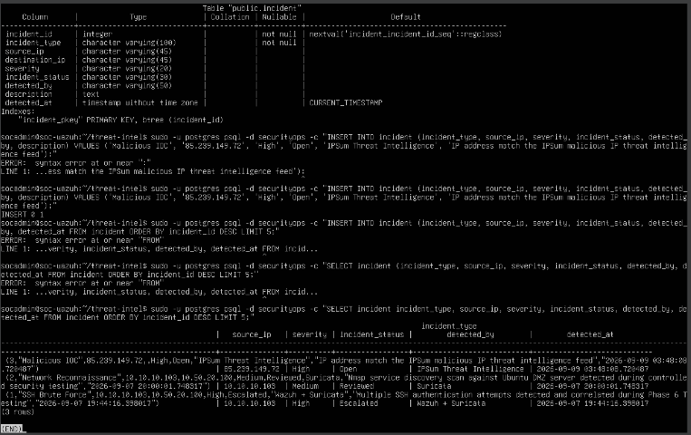
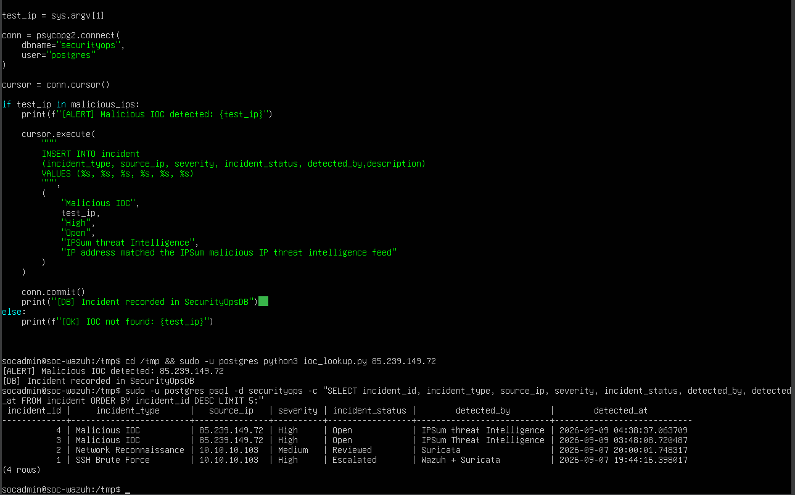

# 🌐 Phase 09 — Threat Intelligence & IOC Correlation

> **Objective:** Integrate external threat-intelligence data with Python and PostgreSQL to identify malicious Indicators of Compromise (IOCs), distinguish IOC matches from non-matches, and automatically create security incidents inside SecurityOpsDB.

[← Phase 08](phase-08-security-automation.md) | [🏠 Main Project](../README.md) | [Phase 10 →](phase-10-centralized-logging.md)

---

## 📑 Table of Contents

- [Phase Summary](#-phase-summary)
- [Overview](#-overview)
- [Threat Intelligence Architecture](#️-threat-intelligence-architecture)
- [Phase Objectives](#-phase-objectives)
- [Threat Intelligence Feed](#-threat-intelligence-feed)
- [IOC Feed Processing](#️-ioc-feed-processing)
- [IOC Dataset Validation](#-ioc-dataset-validation)
- [Python IOC Lookup](#-python-ioc-lookup)
- [Positive IOC Validation](#-positive-ioc-validation)
- [Negative IOC Validation](#-negative-ioc-validation)
- [PostgreSQL Integration](#️-postgresql-integration)
- [Automated Incident Creation](#-automated-incident-creation)
- [Database Verification](#-database-verification)
- [Commands Used](#-commands-used)
- [Troubleshooting](#-troubleshooting)
- [Validation Methodology](#-validation-methodology)
- [Lessons Learned](#-lessons-learned)
- [Skills Demonstrated](#-skills-demonstrated)
- [Evidence Summary](#-evidence-summary)
- [Phase Outcome](#-phase-outcome)

---

# 📊 Phase Summary

| Category | Details |
|---|---|
| **Status** | ✅ Complete |
| **Processing Host** | SOC-Wazuh |
| **Threat Intelligence Source** | IPSum |
| **IOC Type** | IPv4 Addresses |
| **Raw Feed** | `ipsum.txt` |
| **Processed IOC Dataset** | `malicious_ips.txt` |
| **Automation Language** | Python 3 |
| **Database** | PostgreSQL |
| **Security Database** | SecurityOpsDB |
| **Python DB Integration** | psycopg2 |
| **Known IOC Test** | `85.239.149.72` |
| **IOC Match Result** | ALERT |
| **No-Match Result** | OK |
| **Automated Incident Type** | Malicious IOC |
| **Automated Severity** | High |
| **Primary Skill** | Threat Intelligence / IOC Correlation |
| **Workflow** | Collect → Process → Search → Detect → Correlate → Record → Validate |

---

# 📋 Overview

Phase 9 expanded the Enterprise Security Operations Lab by integrating **external threat intelligence** into the existing SOC automation and PostgreSQL environment.

Previous phases established:

- Wazuh endpoint monitoring
- Suricata network detection
- Event correlation
- Vulnerability management
- PostgreSQL SecurityOpsDB
- Python security automation

Phase 9 introduced external malicious-IP intelligence.

The objective was to transform a raw threat-intelligence feed into information that could be consumed automatically by the SOC environment.

The completed workflow was:

```text
Threat Intelligence Feed
        │
        ▼
      IPSum
        │
        ▼
   Raw IOC Feed
    ipsum.txt
        │
        ▼
 Linux Processing
        │
        ▼
malicious_ips.txt
        │
        ▼
 Python IOC Lookup
        │
   ┌────┴────┐
   │         │
No Match   IOC Match
   │         │
   ▼         ▼
  [OK]    [ALERT]
             │
             ▼
      PostgreSQL INSERT
             │
             ▼
       SecurityOpsDB
             │
             ▼
        SOC Incident
```

This moved the lab beyond simple IOC searching by connecting threat intelligence directly to an automated security-incident workflow.

---

# 🏗️ Threat Intelligence Architecture

Phase 9 integrated external intelligence with the security operations infrastructure.

```text
                 External
          Threat Intelligence
                  │
                  ▼
                IPSum
                  │
                  ▼
             ipsum.txt
                  │
                  ▼
          Linux Processing
             awk / grep
                  │
                  ▼
         malicious_ips.txt
                  │
                  ▼
          Python IOC Engine
                  │
           ┌──────┴──────┐
           │             │
           ▼             ▼
       No Match        IOC Match
           │             │
           ▼             ▼
          OK           ALERT
                         │
                         ▼
                  PostgreSQL
                         │
                         ▼
                  SecurityOpsDB
                         │
                         ▼
                 Malicious IOC
                    Incident
                         │
                         ▼
                  SOC Validation
```

### SOC-Wazuh

Used as the threat-intelligence processing and database host.

### IPSum

Provided the external malicious-IP threat-intelligence feed.

### Linux CLI

Used to process and validate the raw threat-intelligence data.

### Python

Used to:

- Accept an IP address
- Search the local IOC dataset
- Identify IOC matches
- Distinguish matches from non-matches
- Connect to PostgreSQL
- Create security incidents

### PostgreSQL / SecurityOpsDB

Stored incidents created from threat-intelligence matches.

---

# 🎯 Phase Objectives

- [x] Obtain external threat-intelligence data
- [x] Process a malicious-IP intelligence feed
- [x] Extract usable IP indicators
- [x] Create a local IOC dataset
- [x] Validate IOC data with Linux tools
- [x] Develop a Python IOC lookup script
- [x] Accept IP addresses through command-line arguments
- [x] Test a known malicious IOC
- [x] Test a non-matching IP address
- [x] Distinguish `ALERT` from `OK`
- [x] Integrate Python with PostgreSQL
- [x] Automatically create an incident after an IOC match
- [x] Record threat-intelligence attribution
- [x] Verify the generated incident in SecurityOpsDB
- [x] Troubleshoot PostgreSQL authentication
- [x] Troubleshoot Linux permissions
- [x] Validate the complete workflow
- [x] Document the evidence

---

# 🌍 Threat Intelligence Feed

An **IPSum malicious-IP threat-intelligence feed** was used as the external IOC source.

The raw feed contained IP addresses along with threat-intelligence information about those addresses.

Example indicators included:

```text
85.239.149.72
16.5.0.244
16.5.0.254
77.90.185.20
107.150.97.10
129.121.128.70
167.94.146.54
167.94.146.63
2.57.121.112
2.57.122.209
```

The raw feed contained more than 100,000 entries.

Rather than having Python process unnecessary comments and additional fields, the feed was transformed into a clean local IOC dataset.

---

# ⚙️ IOC Feed Processing

The raw threat-intelligence feed was processed with `awk`.

```bash
awk '!/^#/ && NF {print $1}' ipsum.txt > malicious_ips.txt
```

### Command Breakdown

```text
awk
 │
 ├── !/^#/      Ignore comment lines
 │
 ├── NF         Ignore empty lines
 │
 ├── {print $1} Extract the first field
 │
 ├── ipsum.txt  Raw intelligence feed
 │
 └── malicious_ips.txt
                Clean IOC dataset
```

The resulting file:

```text
malicious_ips.txt
```

contained only IP addresses that could be consumed directly by the Python IOC lookup process.

The transformation workflow was:

```text
ipsum.txt
    │
    ▼
Remove Comments
    │
    ▼
Remove Empty Lines
    │
    ▼
Extract IP Field
    │
    ▼
malicious_ips.txt
```

**Result:** ✅ Raw threat intelligence successfully transformed into a usable IOC dataset.

---

# 🔎 IOC Dataset Validation

Before developing the automated IOC lookup, the dataset was validated using standard Linux tools.

A known indicator could be searched using `grep`.

```bash
grep "85.239.149.72" malicious_ips.txt
```

A matching result demonstrated that the IOC existed inside the processed threat-intelligence dataset.

This provided an important validation step:

```text
External Feed
     │
     ▼
Processed File
     │
     ▼
grep Validation
     │
     ▼
Known IOC Confirmed
```

The known IOC used during testing was:

```text
85.239.149.72
```

---

# 🐍 Python IOC Lookup

A Python IOC lookup script was developed to automate the manual search process.

The script accepted an IP address through the command line and compared it against:

```text
malicious_ips.txt
```

The logic followed:

```text
User Supplies IP
       │
       ▼
Python Reads Argument
       │
       ▼
Load IOC Dataset
       │
       ▼
Search IP
       │
   ┌───┴────┐
   │        │
 Match    No Match
   │        │
   ▼        ▼
 ALERT      OK
```

This converted the threat-intelligence dataset into a reusable security-analysis capability.

## 📸 Evidence — Python IOC Command-Line Test



**Result:** ✅ Python successfully accepted IOC values from the command line.

---

# 🚨 Positive IOC Validation

The known malicious indicator:

```text
85.239.149.72
```

was supplied to the Python IOC lookup.

The address existed inside the processed IPSum dataset.

The resulting logic was:

```text
85.239.149.72
      │
      ▼
Python IOC Lookup
      │
      ▼
malicious_ips.txt
      │
      ▼
MATCH
      │
      ▼
ALERT
```

## 📸 Evidence — IOC Match Validation



This confirmed that the script could identify a known threat-intelligence indicator.

**Result:** 🚨 Known IOC successfully detected.

---

# ✅ Negative IOC Validation

A negative test was also performed using an IP address that did not match the IOC dataset.

This validated that the script did not treat every supplied IP as malicious.

```text
Test IP
   │
   ▼
Python IOC Lookup
   │
   ▼
No Dataset Match
   │
   ▼
  [OK]
```

This was important for validating both decision paths:

```text
Known IOC
    │
    ▼
  ALERT

No IOC Match
      │
      ▼
     OK
```

## 📸 Evidence — Python IOC Negative Test



**Result:** ✅ Non-matching IP correctly returned the negative path.

---

# 🗄️ PostgreSQL Integration

After the IOC lookup logic was validated, Python was integrated with PostgreSQL.

The purpose was to move beyond simply printing:

```text
ALERT
```

and instead create an actionable security record.

The integration workflow became:

```text
IOC Supplied
     │
     ▼
Python Lookup
     │
     ▼
IOC Match
     │
     ▼
PostgreSQL Connection
     │
     ▼
SecurityOpsDB
     │
     ▼
INSERT Incident
```

Python used PostgreSQL connectivity through:

```text
psycopg2
```

This connected the Phase 9 threat-intelligence capability with the security operations database developed in the previous automation phase.

---

# 🚨 Automated Incident Creation

When the known IOC:

```text
85.239.149.72
```

was detected, Python automatically created a security incident inside SecurityOpsDB.

The resulting incident was recorded as:

```text
Incident Type: Malicious IOC
Severity: High
Threat Intelligence: IPSum
```

The automated workflow was:

```text
85.239.149.72
      │
      ▼
 IOC Match
      │
      ▼
    ALERT
      │
      ▼
PostgreSQL INSERT
      │
      ▼
 SecurityOpsDB
      │
      ▼
 Malicious IOC
      │
      ▼
High-Severity Incident
```

## 📸 Evidence — IOC Automated Database Insert



This demonstrated that external threat intelligence could trigger an automated database action.

**Result:** ✅ IOC match successfully created a security incident.

---

# 🔍 Database Verification

The automation was not considered complete simply because the Python script reported success.

PostgreSQL was queried independently to confirm that the incident actually existed inside SecurityOpsDB.

## Threat Intelligence Database Verification

## 📸 Evidence



The database evidence confirmed that threat-intelligence information was incorporated into the security operations workflow.

---

## Automated IOC Database Verification

A final database query verified the incident generated by the Python automation.

## 📸 Evidence



This confirmed the complete chain:

```text
External IOC
     │
     ▼
Python Detection
     │
     ▼
PostgreSQL INSERT
     │
     ▼
SecurityOpsDB
     │
     ▼
Verified Incident
```

**Result:** ✅ Automated IOC incident independently verified in PostgreSQL.

---

# 💻 Commands Used

The Phase 9 workflow included threat-feed processing, IOC validation, Python testing, and PostgreSQL verification.

## Process IPSum Feed

```bash
awk '!/^#/ && NF {print $1}' ipsum.txt > malicious_ips.txt
```

Purpose:

```text
Remove comments and empty lines while extracting
the IP-address field from the raw intelligence feed.
```

---

## Search for Known IOC

```bash
grep "85.239.149.72" malicious_ips.txt
```

Purpose:

```text
Confirm that the known malicious indicator exists
inside the processed IOC dataset.
```

---

## Python IOC Testing

The Python IOC script was executed with an IP address supplied through the command line.

The workflow was:

```text
python3
   │
   ▼
IOC Script
   │
   ▼
IP Argument
   │
   ▼
Dataset Search
```

Positive and negative tests were performed to verify both execution paths.

---

## PostgreSQL Validation

After the automated IOC insert, SecurityOpsDB was queried to confirm that the new incident existed.

The database validation checked the incident information created by the threat-intelligence automation.

---

# 🔧 Troubleshooting

Phase 9 included troubleshooting across Linux, Python, PostgreSQL, and authentication boundaries.

## PostgreSQL Authentication

Connecting the Python IOC automation to PostgreSQL required the correct database authentication context.

The troubleshooting process included verifying:

- PostgreSQL connectivity
- Database access
- Python database library configuration
- Execution context
- Authentication method

This reinforced that application code can be logically correct while still failing because of database authentication.

---

## Linux Permissions

File and execution permissions also had to be considered.

The Python process required access to:

```text
malicious_ips.txt
```

as well as the ability to execute the IOC-processing workflow.

This reinforced the relationship between:

```text
Python
   │
   ▼
Linux Permissions
   │
   ▼
Threat Intelligence File
   │
   ▼
Database Connectivity
```

---

## Validate the Dataset Before Debugging Python

The IOC dataset was validated separately using tools such as:

```bash
grep "85.239.149.72" malicious_ips.txt
```

This helped separate:

```text
Feed Processing Problem
```

from:

```text
Python Logic Problem
```

If the indicator was missing from the local file, changing Python would not solve the underlying data problem.

---

## Positive and Negative Testing

Only testing a known IOC would not prove that the lookup logic worked correctly.

Both paths were validated:

```text
Known Malicious IP
        │
        ▼
      ALERT
```

and:

```text
Non-Matching IP
        │
        ▼
        OK
```

This reduced the possibility that the script was simply returning the same result for every input.

---

## Database Validation

The Python console output was not treated as final proof.

The database itself was queried afterward.

```text
Python Says INSERT Worked
          │
          ▼
Query PostgreSQL
          │
          ▼
Confirm Incident
```

This provided independent verification of the automation.

---

# 🧪 Validation Methodology

Phase 9 used layered validation.

```text
External Feed
     │
     ▼
Raw Data
     │
     ▼
Processed IOC Dataset
     │
     ▼
grep Validation
     │
     ▼
Python Positive Test
     │
     ▼
Python Negative Test
     │
     ▼
PostgreSQL Integration
     │
     ▼
Automated INSERT
     │
     ▼
Independent DB Query
     │
     ▼
Verified SOC Incident
```

The workflow was considered successful only after each layer had been validated.

---

# 💡 Lessons Learned

## 1. Raw Threat Intelligence Must Be Processed

External feeds are not always immediately suitable for automation.

The raw IPSum data first had to be transformed into:

```text
malicious_ips.txt
```

before it could be efficiently consumed by the Python script.

---

## 2. Linux Text-Processing Tools Are Valuable for Security Work

The command:

```bash
awk '!/^#/ && NF {print $1}' ipsum.txt > malicious_ips.txt
```

demonstrated how standard Linux tools can transform raw security data into structured analyst-ready information.

---

## 3. Validate Intelligence Before Automating It

The processed dataset was checked before integrating it into Python.

This helped verify that the input data itself was correct.

---

## 4. Threat Intelligence Requires Context

An IP address alone is simply an indicator.

Its security value comes from context such as:

- Intelligence source
- Match status
- Incident severity
- Detection time
- Related security activity

---

## 5. Positive and Negative Tests Are Both Required

A security detection should prove that it can:

```text
Detect What Should Match
```

and:

```text
Ignore What Should Not Match
```

---

## 6. IOC Matching Can Trigger Security Automation

Phase 9 demonstrated that a threat-intelligence match can become an automated SOC action.

```text
IOC Match
   │
   ▼
ALERT
   │
   ▼
Incident Creation
```

---

## 7. Threat Intelligence Can Enrich Incident Records

Recording the intelligence source helps analysts understand why an incident was created.

In this phase, attribution to:

```text
IPSum
```

provided context for the automated incident.

---

## 8. Python Connects Security Data Sources

Python provided the integration layer between:

```text
Threat Intelligence
       +
Local IOC Dataset
       +
PostgreSQL
```

---

## 9. Database Authentication Is Part of Automation Security

A script needs more than correct Python logic.

It also requires appropriate access to the systems it interacts with.

---

## 10. File Permissions Matter

Security automation frequently crosses multiple trust boundaries.

Linux file permissions can determine whether automation can access its required data.

---

## 11. Console Output Is Not Final Validation

An automation script reporting success does not independently prove that a database operation succeeded.

The resulting database state must be verified.

---

## 12. IOC Detection Should Produce Actionable Results

Simply identifying:

```text
85.239.149.72
```

as a match would provide limited operational value.

Creating a structured incident made the detection actionable inside the SOC workflow.

---

## 13. External Intelligence Can Be Integrated With Internal Security Operations

Phase 9 demonstrated how external information can be connected to internal incident management.

```text
External Intelligence
         │
         ▼
Internal Detection
         │
         ▼
SOC Incident
```

---

## 14. Threat Intelligence Is Part of a Larger Investigation

An IOC match should support investigation rather than automatically prove compromise.

The indicator provides evidence and context that an analyst can correlate with endpoint, network, and SIEM telemetry.

---

## 15. Threat Intelligence Becomes More Valuable When Automated

The completed Phase 9 workflow demonstrated:

```text
COLLECT
   │
   ▼
PROCESS
   │
   ▼
SEARCH
   │
   ▼
DETECT
   │
   ▼
CORRELATE
   │
   ▼
RECORD
   │
   ▼
VALIDATE
```

---

# 🧠 Skills Demonstrated

| Skill | Application |
|---|---|
| **Threat Intelligence** | Integrated external malicious-IP intelligence |
| **IOC Analysis** | Evaluated IPv4 indicators |
| **Linux CLI** | Processed and validated intelligence data |
| **awk** | Extracted IOC fields from raw feed |
| **grep** | Validated indicator presence |
| **Python** | Automated IOC lookup |
| **Command-Line Arguments** | Supplied indicators dynamically |
| **Detection Logic** | Distinguished match from non-match |
| **PostgreSQL** | Stored IOC-generated incidents |
| **SecurityOpsDB** | Integrated intelligence with SOC records |
| **psycopg2** | Connected Python with PostgreSQL |
| **Security Automation** | Automatically created incidents |
| **Incident Enrichment** | Preserved threat-intelligence attribution |
| **Database Validation** | Independently verified automated inserts |
| **Troubleshooting** | Resolved permissions/authentication issues |
| **SOC Workflow Design** | Connected intelligence to incident handling |

---

# 📸 Evidence Summary

Phase 9 contains **6 original screenshots** documenting the threat-intelligence and IOC-correlation workflow. :contentReference[oaicite:1]{index=1}

| # | Evidence | Screenshot |
|---|---|---|
| 1 | IOC Match Validation | `phase9-ioc-match-validation.png` |
| 2 | Python IOC Command-Line Test | `phase9-python-ioc-command-line-test.png` |
| 3 | Python IOC Negative Test | `phase9-python-ioc-negative-test.png` |
| 4 | IOC Automated Database Insert | `phase9-ioc-automated-database-insert.png` |
| 5 | Threat Intelligence Database Verification | `phase9-threat-intel-database-verification.png` |
| 6 | Automated IOC Database Verification | `phase9-automated-ioc-database-verification.png` |

Because this document is stored under:

```text
/docs/
```

the screenshots use:

```text
../images/<filename>
```

No existing Phase 9 screenshots need to be renamed.

---

# 🏁 Phase Outcome

## ✅ Phase 9 Complete

Phase 9 successfully demonstrated an integrated threat-intelligence and IOC-correlation workflow.

External threat intelligence was collected from:

```text
IPSum
```

The raw feed was processed into:

```text
malicious_ips.txt
```

Python then evaluated supplied IP addresses against the local intelligence dataset.

The two primary validation paths were:

```text
Known IOC
    │
    ▼
  MATCH
    │
    ▼
  ALERT
```

and:

```text
Unknown / Non-Matching IP
          │
          ▼
       NO MATCH
          │
          ▼
          OK
```

The known malicious indicator:

```text
85.239.149.72
```

successfully triggered the IOC-detection workflow.

Python then integrated the result with PostgreSQL:

```text
85.239.149.72
      │
      ▼
     IPSum
      │
      ▼
malicious_ips.txt
      │
      ▼
 Python Lookup
      │
      ▼
    MATCH
      │
      ▼
    ALERT
      │
      ▼
PostgreSQL INSERT
      │
      ▼
 SecurityOpsDB
      │
      ▼
 Malicious IOC
      │
      ▼
High Severity
      │
      ▼
DB Validation

      ✅
```

PostgreSQL queries independently confirmed that the IOC-generated incident was successfully recorded.

Phase 9 therefore connected:

**External Threat Intelligence → Linux Processing → IOC Analysis → Python Automation → PostgreSQL → Security Incident Management**

The Enterprise Security Operations Lab now combines:

```text
Wazuh Endpoint Detection
          +
Suricata Network Detection
          +
External Threat Intelligence
          +
Python Security Automation
          +
PostgreSQL SecurityOpsDB
          │
          ▼
Integrated SOC Workflow
```

This moved the lab beyond basic IOC lookup by converting external threat intelligence into an actionable and auditable SOC incident.

---

# ➡️ Next Phase

## Phase 10 — Centralized Network Security Logging & Correlation

Phase 10 extends the SOC's centralized visibility by forwarding OPNsense network-security telemetry into Wazuh.

The next phase includes:

- OPNsense remote syslog
- UDP port `514`
- Wazuh centralized network logging
- Firewall telemetry
- Network activity validation
- Kali-generated activity
- Cross-system correlation
- Centralized investigation

---

[← Phase 08](phase-08-security-automation.md) | [🏠 Back to Main Project](../README.md) | [Phase 10 →](phase-10-centralized-logging.md)

---

### Enterprise Security Operations Lab

**Threat Intelligence • IOC Analysis • IPSum • Python • PostgreSQL • Security Automation • Incident Correlation**
