# 🚨 Phase 11 — Incident Response & Case Management with DFIR-IRIS

> **Objective:** Deploy DFIR-IRIS as an incident-response case-management platform and use it to formally investigate, correlate, document, assess, and close a controlled Kali-to-Ubuntu reconnaissance incident.

[← Phase 10](phase-10-centralized-logging.md) | [🏠 Main Project](../README.md) | [Phase 12 →](phase-12-web-security.md)

---

## 📑 Table of Contents

- [Phase Summary](#-phase-summary)
- [Overview](#-overview)
- [Incident Response Architecture](#️-incident-response-architecture)
- [Phase Objectives](#-phase-objectives)
- [DFIR-IRIS Deployment](#-dfir-iris-deployment)
- [DFIR-IRIS Interface](#-dfir-iris-interface)
- [Incident Case Creation](#-incident-case-creation)
- [Incident Classification](#-incident-classification)
- [Affected Assets](#️-affected-assets)
- [Indicators of Compromise](#-indicators-of-compromise)
- [Suricata Evidence](#️-suricata-evidence)
- [Wazuh and OPNsense Evidence](#-wazuh-and-opnsense-evidence)
- [Incident Timeline](#️-incident-timeline)
- [Investigation Findings](#-investigation-findings)
- [Incident Response Tasks](#️-incident-response-tasks)
- [Containment Assessment](#-containment-assessment)
- [Remediation Assessment](#-remediation-assessment)
- [Recovery Assessment](#-recovery-assessment)
- [Case Closure](#-case-closure)
- [Commands Used](#-commands-used)
- [Troubleshooting](#-troubleshooting)
- [Lessons Learned](#-lessons-learned)
- [Skills Demonstrated](#-skills-demonstrated)
- [Evidence Summary](#-evidence-summary)
- [VirtualBox Snapshot](#-virtualbox-snapshot)
- [Phase Outcome](#-phase-outcome)

---

# 📊 Phase Summary

| Category | Details |
|---|---|
| **Status** | ✅ Complete |
| **Case Platform** | DFIR-IRIS |
| **Version** | DFIR-IRIS v2.4.29 |
| **IRIS Host** | SOC-Kali |
| **Deployment** | Docker |
| **Case** | Kali-to-Ubuntu Reconnaissance Detection |
| **SOC ID** | `SOC-2026-001` |
| **Severity** | Medium |
| **Classification** | `information-gathering:scanner` |
| **Source** | SOC-Kali `10.10.10.103` |
| **Target** | SOC-Ubuntu `10.50.20.100` |
| **Firewall** | SOC-OPNsense `10.10.10.1` |
| **SIEM** | SOC-Wazuh `10.10.10.102` |
| **IDS** | Suricata |
| **Assets Documented** | 4 |
| **Timeline Events** | 3 |
| **IR Tasks** | 5 Completed |
| **Final Status** | Closed |
| **Primary Skill** | Incident Response & Case Management |

---

# 📋 Overview

Phase 11 moved the Enterprise Security Operations Lab from **detection and correlation into formal incident response**.

Earlier phases had already demonstrated:

- Network reconnaissance detection
- Suricata IDS alerts
- OPNsense firewall telemetry
- Wazuh SIEM correlation
- Centralized security logging

Phase 11 answered the next question:

> What happens after the SOC detects and validates suspicious activity?

DFIR-IRIS was deployed on SOC-Kali to provide a centralized platform for:

- Case management
- Asset tracking
- IOC documentation
- Evidence preservation
- Timeline reconstruction
- Investigation notes
- Response tasks
- Containment assessment
- Remediation assessment
- Recovery assessment
- Formal case closure

The incident investigated in this phase was controlled reconnaissance generated from:

```text
SOC-Kali
10.10.10.103
```

against:

```text
SOC-Ubuntu
10.50.20.100
```

The completed response workflow was:

```text
Security Activity
       │
       ▼
Suricata Detection
       │
       ▼
OPNsense / Wazuh Correlation
       │
       ▼
DFIR-IRIS Case
       │
       ▼
Assets + IOCs + Evidence
       │
       ▼
Incident Timeline
       │
       ▼
Investigation
       │
       ▼
Response Tasks
       │
       ▼
Containment Assessment
       │
       ▼
Remediation / Recovery
       │
       ▼
Case Closure
```

---

# 🏗️ Incident Response Architecture

The Phase 11 investigation involved four systems.

```text
                SOC-Kali
             10.10.10.103
                   │
                   │
          Controlled Nmap
           Reconnaissance
                   │
                   ▼
             SOC-OPNsense
              10.10.10.1
          Firewall + Suricata
                   │
          ┌────────┴────────┐
          │                 │
          ▼                 ▼
   Firewall Telemetry   Suricata IDS
          │                 │
          └────────┬────────┘
                   │
                   ▼
               SOC-Wazuh
             10.10.10.102
                   │
             Detection and
               Correlation
                   │
                   ▼
              DFIR-IRIS
                   │
        ┌──────────┼──────────┐
        ▼          ▼          ▼
      Assets      IOCs     Evidence
        │          │          │
        └──────────┼──────────┘
                   │
                   ▼
                Timeline
                   │
                   ▼
             Investigation
                   │
                   ▼
        Containment Assessment
                   │
                   ▼
          Remediation / Recovery
                   │
                   ▼
               Case Closure
```

DFIR-IRIS provided the case-management layer that connected the security evidence into a formal investigation.

---

# 🎯 Phase Objectives

- [x] Deploy DFIR-IRIS
- [x] Run DFIR-IRIS on SOC-Kali
- [x] Validate the DFIR-IRIS web interface
- [x] Create a formal incident case
- [x] Assign SOC ticket ID `SOC-2026-001`
- [x] Classify the reconnaissance incident
- [x] Add incident tags
- [x] Register four affected/supporting assets
- [x] Register source and destination IOCs
- [x] Preserve Suricata evidence
- [x] Preserve Wazuh/OPNsense evidence
- [x] Build a three-event incident timeline
- [x] Document investigation findings
- [x] Create incident-response tasks
- [x] Complete five response tasks
- [x] Assess containment requirements
- [x] Assess remediation requirements
- [x] Assess recovery requirements
- [x] Document final investigation results
- [x] Close the incident case
- [x] Preserve the completed environment

---

# 🐳 DFIR-IRIS Deployment

DFIR-IRIS was deployed on:

```text
SOC-Kali
```

using Docker.

The deployed version was:

```text
DFIR-IRIS v2.4.29
```

Containerization allowed the incident-response platform and its supporting services to run together on the existing SOC analyst workstation.

This preserved the resource-efficient architecture of the lab instead of requiring another permanent virtual machine.

The deployment provided access to:

- Cases
- Alerts
- Assets
- IOCs
- Evidence
- Timelines
- Notes
- Tasks

## 📸 Evidence — DFIR-IRIS Deployment


**Result:** ✅ DFIR-IRIS successfully deployed on SOC-Kali.

---

# 🖥️ DFIR-IRIS Interface

After the containers were operational, the DFIR-IRIS web interface was accessed from SOC-Kali.

## Login Interface

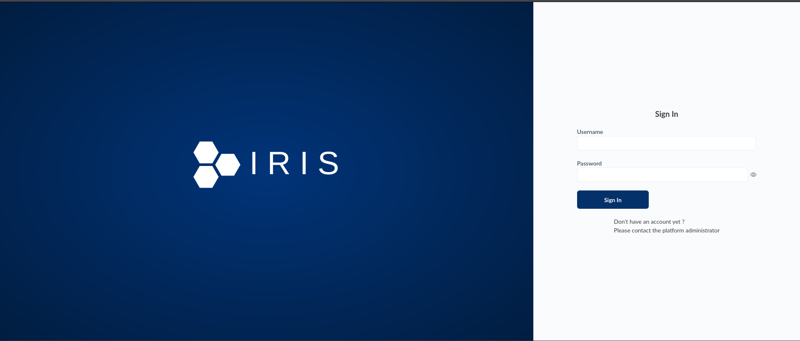

The login interface confirmed that the application was reachable.

---

## Dashboard

After authentication, the DFIR-IRIS dashboard provided centralized access to the incident-response environment.

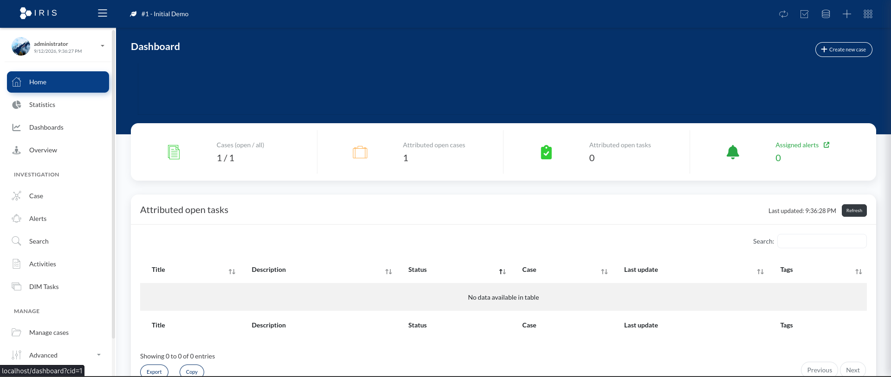

**Result:** ✅ DFIR-IRIS application and dashboard operational.

---

# 📁 Incident Case Creation

A formal incident case was created for the controlled reconnaissance activity.

## Case Name

```text
Kali-to-Ubuntu Reconnaissance Detection
```

## SOC Ticket ID

```text
SOC-2026-001
```

## Description

```text
Controlled Kali reconnaissance against SOC-Ubuntu detected and correlated by Suricata, OPNsense, and Wazuh.
```

## Severity

```text
Medium
```

The case transformed security telemetry into a formal investigation record.

```text
Security Alert
      │
      ▼
Validate Activity
      │
      ▼
Create IR Case
      │
      ▼
SOC-2026-001
```

## 📸 Evidence — Incident Case Creation

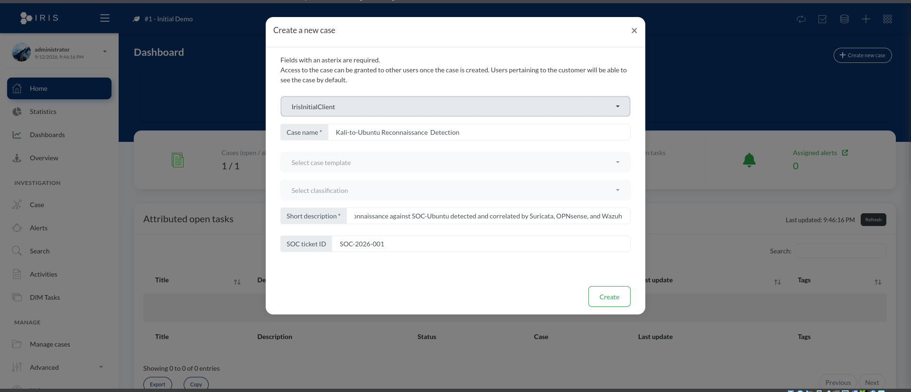

DFIR-IRIS successfully created the case.

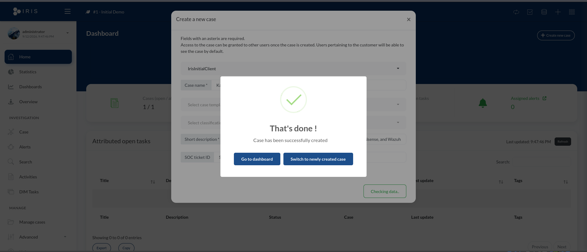

**Result:** ✅ Formal SOC incident case created.

---

# 🏷️ Incident Classification

The incident was classified as:

```text
information-gathering:scanner
```

The classification represented the reconnaissance/scanning behavior generated during the controlled Nmap activity.

The case was tagged with:

```text
reconnaissance
nmap
suricata
wazuh
opnsense
```

These tags made the case easier to categorize and search.

## 📸 Evidence — Incident Classification

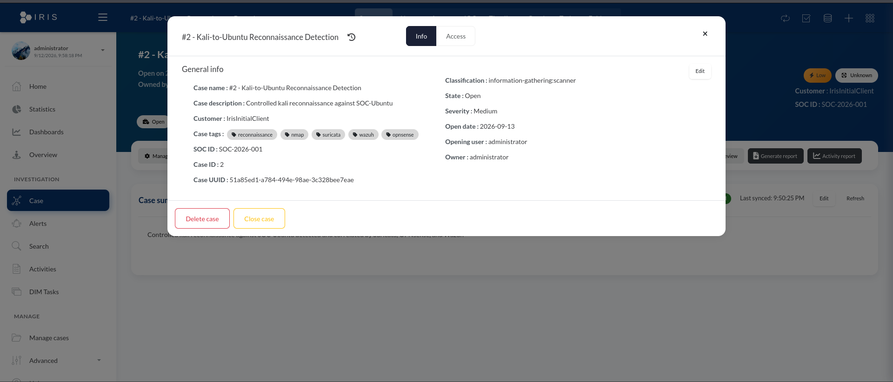

**Result:** ✅ Incident classified and tagged.

---

# 📝 Incident Case Summary

The investigation focused on reconnaissance originating from:

```text
SOC-Kali
10.10.10.103
```

and targeting:

```text
SOC-Ubuntu
10.50.20.100
```

The controlled Nmap reconnaissance targeted:

```text
22  - SSH
80  - HTTP
443 - HTTPS
```

The purpose of the activity was to validate the lab's ability to:

```text
Detect
   ↓
Correlate
   ↓
Investigate
   ↓
Document
   ↓
Respond
```

## 📸 Evidence — Case Summary

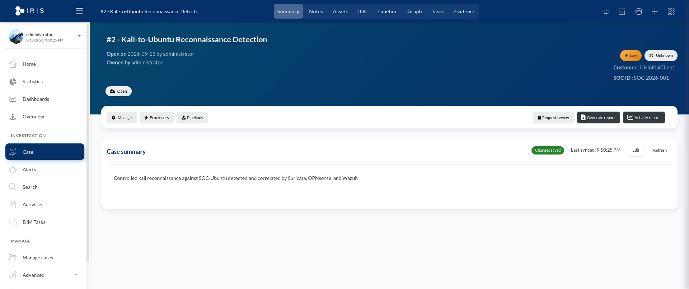

---

# 🖥️ Affected Assets

Four systems associated with the investigation were registered as assets in DFIR-IRIS.

| Asset | Role | IP Address |
|---|---|---|
| **SOC-Kali** | Analyst / Reconnaissance Source | `10.10.10.103` |
| **SOC-Ubuntu** | Target Linux Server | `10.50.20.100` |
| **SOC-OPNsense** | Firewall / Network Security | `10.10.10.1` |
| **SOC-Wazuh** | SIEM / XDR Server | `10.10.10.102` |

The asset relationship was:

```text
SOC-Kali
    │
    ▼
SOC-OPNsense / Suricata
    │
    ▼
SOC-Ubuntu
    │
    ▼
SOC-Wazuh
    │
    ▼
DFIR-IRIS
```

Registering the systems as case assets preserved the infrastructure context of the incident.

## 📸 Evidence — Incident Assets

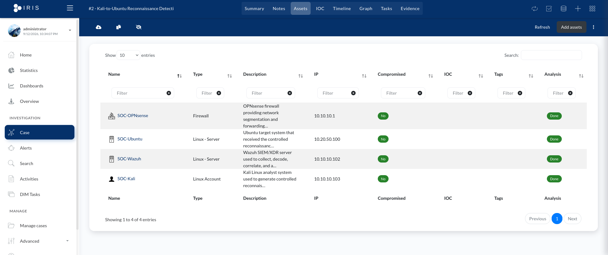

**Result:** ✅ Four investigation assets documented.

---

# 🔎 Indicators of Compromise

Network indicators associated with the investigation were registered as IOCs.

## Source IOC

```text
10.10.10.103
```

Type:

```text
ip-src
```

This address identified SOC-Kali as the system generating the controlled reconnaissance.

## 📸 Evidence — Source IOC

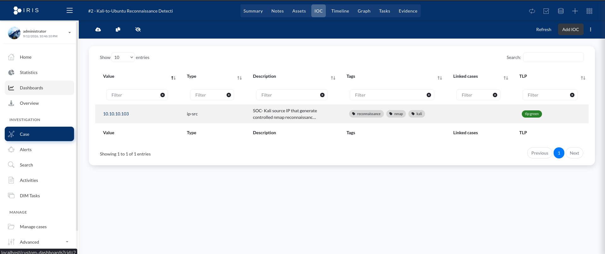

---

## Destination IOC

```text
10.50.20.100
```

Type:

```text
ip-dst
```

This address identified SOC-Ubuntu as the destination of the reconnaissance.

The indicators were associated with the case so they could be correlated with:

- Assets
- Evidence
- Timeline events
- Investigation findings

## 📸 Evidence — IOC Correlation

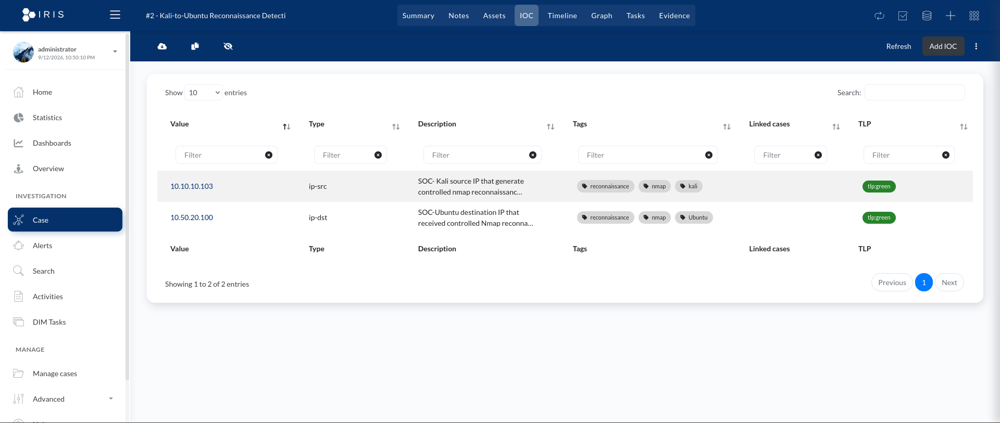

**Result:** ✅ Source and destination indicators documented.

---

# 🛡️ Suricata Evidence

Suricata detected the controlled reconnaissance generated by SOC-Kali.

Relevant detections included:

```text
Internal Recon - Kali to Ubuntu
```

and:

```text
ET SCAN Possible Nmap User-Agent Observed
```

The detection path was:

```text
SOC-Kali
10.10.10.103
     │
     ▼
Reconnaissance
     │
     ▼
Suricata
     │
     ▼
IDS Alert
     │
     ▼
DFIR-IRIS Evidence
```

The Suricata detection was registered as evidence inside the case.

## 📸 Evidence — Suricata Detection

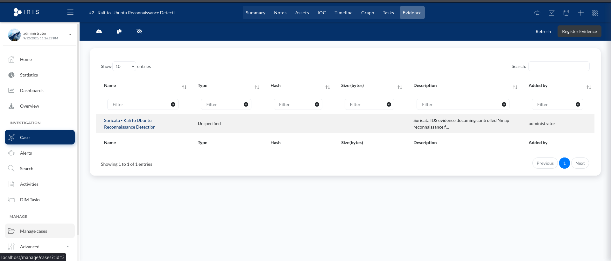

**Result:** ✅ IDS detection preserved as case evidence.

---

# 📡 Wazuh and OPNsense Evidence

OPNsense firewall telemetry associated with the reconnaissance was forwarded to Wazuh.

Wazuh decoded OPNsense:

```text
filterlog
```

events using the:

```text
pf
```

decoder.

The telemetry provided fields including:

- Source IP
- Destination IP
- Protocol
- Source port
- Destination port
- Firewall action

This gave the investigation a second source of evidence independent of the Suricata alert.

```text
Suricata IDS
      \
       \
        ─────► DFIR-IRIS Incident
       /
      /
Wazuh / OPNsense
```

## 📸 Evidence — Wazuh / OPNsense Correlation

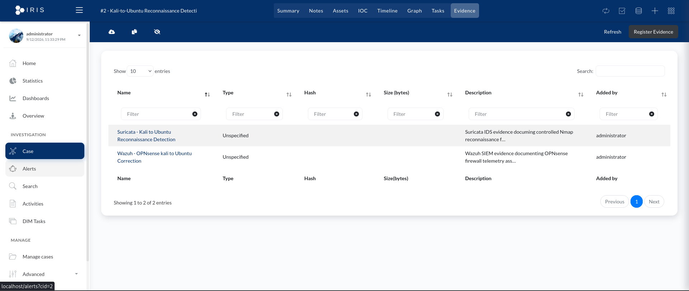

**Result:** ✅ Firewall/SIEM evidence registered in the incident case.

---

# ⏱️ Incident Timeline

A three-event timeline was created to reconstruct the incident.

The timeline represented the progression from reconnaissance through detection and centralized correlation.

```text
Event 1
Controlled Reconnaissance
        │
        ▼
Event 2
Suricata IDS Detection
        │
        ▼
Event 3
Wazuh / OPNsense Correlation
```

The timeline helped organize the investigation chronologically rather than reviewing isolated alerts independently.

## 📸 Evidence — Incident Timeline

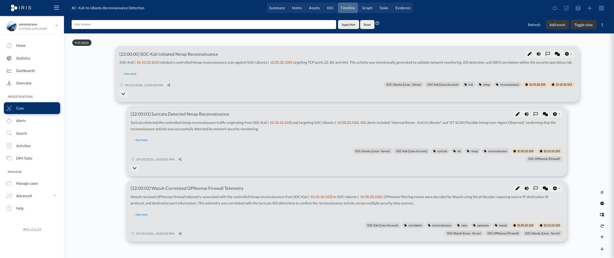

**Result:** ✅ Three-event incident timeline documented.

---

# 🔍 Investigation Findings

The investigation correlated evidence from multiple security controls.

The findings established that:

```text
Source
10.10.10.103
SOC-Kali
      │
      ▼
Controlled Nmap Reconnaissance
      │
      ▼
Target
10.50.20.100
SOC-Ubuntu
```

The activity was visible through:

```text
Suricata
   +
OPNsense
   +
Wazuh
```

The evidence supported the same source, target, and reconnaissance context.

The investigation determined that the activity was:

- Controlled
- Authorized
- Generated for lab validation
- Successfully detected
- Successfully correlated
- Not evidence of unauthorized compromise

This distinction was important because a security alert does not automatically mean a system has been compromised.

---

# ☑️ Incident Response Tasks

Five incident-response tasks were created and completed during the investigation.

The tasks tracked the analyst's progression through the case.

The response workflow included:

```text
Validate Detection
       │
       ▼
Review Evidence
       │
       ▼
Correlate Telemetry
       │
       ▼
Assess Response Requirements
       │
       ▼
Complete Investigation
```

DFIR-IRIS provided a structured method for tracking work instead of relying on informal notes.

## 📸 Evidence — Incident Response Tasks


**Result:** ✅ Five incident-response tasks completed.

---

# 🔒 Containment Assessment

The investigation included an explicit containment assessment.

The detected reconnaissance was generated intentionally from SOC-Kali as part of authorized lab testing.

The analyst therefore determined that immediate containment was not required.

```text
Detection
    │
    ▼
Validate Context
    │
    ▼
Authorized Test?
    │
    ├── Yes ──► No Containment Required
    │
    └── No ───► Evaluate Containment
```

This demonstrated an important incident-response principle:

> Detection alone does not justify containment. The analyst must determine whether the activity is malicious, unauthorized, or has caused compromise.

**Assessment:** No containment action required.

---

# 🛠️ Remediation Assessment

The investigation found no evidence that SOC-Ubuntu was compromised.

Because the reconnaissance was controlled and authorized:

- No malicious persistence was identified
- No unauthorized access was identified
- No malicious configuration change was identified
- No compromised account was identified

Therefore, no incident-specific remediation was required.

**Assessment:** No remediation required.

---

# ♻️ Recovery Assessment

Because the target system remained operational and uncompromised, no recovery action was required.

There was no need to:

- Restore the system
- Rebuild the host
- Recover files
- Reset compromised credentials
- Restore a service from backup

The environment could remain operational after the investigation.

**Assessment:** No recovery action required.

---

# 🔐 Case Closure

After:

- Reviewing the evidence
- Correlating telemetry
- Documenting assets
- Recording IOCs
- Building the timeline
- Completing response tasks
- Assessing containment
- Assessing remediation
- Assessing recovery

the case was formally closed.

The final status was:

```text
Closed
```

The completed investigation demonstrated the full lifecycle:

```text
Detection
    │
    ▼
Validation
    │
    ▼
Correlation
    │
    ▼
Case Creation
    │
    ▼
Asset Identification
    │
    ▼
IOC Documentation
    │
    ▼
Evidence Registration
    │
    ▼
Timeline Reconstruction
    │
    ▼
Investigation
    │
    ▼
Response Tasks
    │
    ▼
Containment Assessment
    │
    ▼
Remediation Assessment
    │
    ▼
Recovery Assessment
    │
    ▼
Case Closure

    ✅
```

## 📸 Evidence — Closed Incident


**Result:** ✅ Case formally closed.

---

# 💻 Commands Used

Phase 11 relied heavily on DFIR-IRIS case-management workflows, but Docker was used to host the platform on SOC-Kali.

## Docker Environment

DFIR-IRIS was deployed through Docker Compose.

The containerized environment hosted the components required by DFIR-IRIS while allowing the platform to run on the existing SOC-Kali VM.

Docker container status was used during deployment and troubleshooting to verify that the required services were operational.

---

## Controlled Reconnaissance

The case investigated controlled Nmap reconnaissance from:

```text
10.10.10.103
```

against:

```text
10.50.20.100
```

targeting:

```text
22/tcp
80/tcp
443/tcp
```

The resulting telemetry was then investigated through Suricata, OPNsense, Wazuh, and DFIR-IRIS.

> The original Phase 11 documentation preserves the incident workflow and evidence but does not record every exact Docker/Nmap command used during deployment. Commands not preserved in the original evidence are intentionally not reconstructed here.

---

# 🔧 Troubleshooting

Phase 11 included troubleshooting during the DFIR-IRIS deployment and incident-response workflow.

## DFIR-IRIS Deployment

The first validation point was the Docker environment.

The troubleshooting process followed:

```text
Docker Deployment
       │
       ▼
Container Status
       │
       ▼
DFIR-IRIS Services
       │
       ▼
Web Interface
       │
       ▼
Authentication
       │
       ▼
Dashboard
```

Rather than assuming that successful deployment meant the application was ready, the web interface and authentication workflow were validated separately.

---

## Initial Administrative Access

During deployment, progress temporarily paused while administrative login access to DFIR-IRIS was resolved.

Once access was established, the case-management workflow continued.

This reinforced that application deployment and application access are separate validation steps.

---

## Evidence Correlation

Suricata and Wazuh/OPNsense provided different perspectives on the same controlled activity.

The investigation therefore compared:

- Source IP
- Destination IP
- Network activity
- IDS detection
- Firewall telemetry
- SIEM data

The workflow was:

```text
Suricata Alert
      │
      ├────► Source IP
      ├────► Destination IP
      │
      ▼
Compare
      ▲
      │
      ├────► OPNsense Firewall Data
      └────► Wazuh SIEM Data
```

This prevented the investigation from relying on a single detection source.

---

## Response Decision

A major analytical step was determining whether the alert required containment.

The event was correctly detected, but the investigation confirmed that it was generated by authorized lab activity.

Therefore:

```text
Successful Detection
        ≠
Confirmed Compromise
```

This prevented unnecessary containment or remediation actions.

---

# 💡 Lessons Learned

## 1. Detection Is Only the Beginning

An IDS or SIEM alert does not complete an incident-response process.

A security event still requires:

```text
Validation
   ↓
Correlation
   ↓
Investigation
   ↓
Response Decision
   ↓
Documentation
```

---

## 2. Multiple Data Sources Increase Investigation Confidence

Suricata provided IDS detection.

OPNsense and Wazuh provided supporting network telemetry.

Together:

```text
Suricata
   +
OPNsense
   +
Wazuh
```

provided stronger evidence than a single alert.

---

## 3. Case Management Preserves Investigation Context

DFIR-IRIS provided one location for:

- Assets
- IOCs
- Evidence
- Timeline events
- Investigation notes
- Tasks

This kept the investigation structured and reproducible.

---

## 4. IOCs Connect Evidence to Infrastructure

Recording:

```text
10.10.10.103
```

and:

```text
10.50.20.100
```

made it easier to connect security evidence with the systems involved.

---

## 5. Incident Timelines Improve Investigation Clarity

The three-event timeline reconstructed the progression:

```text
Reconnaissance
      ↓
IDS Detection
      ↓
Firewall / SIEM Correlation
```

Chronological organization makes an investigation easier to understand.

---

## 6. Not Every Detection Requires Containment

The reconnaissance was intentionally generated for security validation.

Although defensive controls correctly detected it, containment was unnecessary because the activity was authorized.

---

## 7. Detection Does Not Automatically Mean Compromise

An analyst must establish context before making a response decision.

```text
Alert
  │
  ▼
Investigate
  │
  ▼
Determine Context
  │
  ├── Authorized
  │      ▼
  │   Document
  │
  └── Unauthorized
         ▼
     Respond
```

---

## 8. Incident Response Includes Negative Findings

Determining:

```text
No compromise
No containment required
No remediation required
No recovery required
```

is still a meaningful investigation result when supported by evidence.

---

## 9. Response Tasks Improve Accountability

Tracking analyst work through explicit tasks makes it easier to determine:

- What has been investigated
- What remains outstanding
- Whether response requirements were assessed
- Whether the case is ready for closure

---

## 10. Case Closure Should Be Evidence-Based

A case should not be closed merely because alerts stop appearing.

Closure followed:

```text
Evidence Review
      ↓
Correlation
      ↓
Investigation
      ↓
Response Assessment
      ↓
Task Completion
      ↓
Final Documentation
      ↓
Case Closure
```

---

# 🧠 Skills Demonstrated

| Skill | Application |
|---|---|
| **Incident Response** | Investigated a controlled security incident |
| **DFIR-IRIS** | Managed the complete incident case |
| **Case Management** | Created and formally closed `SOC-2026-001` |
| **Docker** | Hosted DFIR-IRIS on SOC-Kali |
| **IOC Management** | Documented source/destination IP indicators |
| **Asset Management** | Registered four investigation systems |
| **Evidence Preservation** | Registered IDS and SIEM/firewall evidence |
| **Suricata Analysis** | Investigated reconnaissance detections |
| **Wazuh Analysis** | Used centralized SIEM telemetry |
| **OPNsense Analysis** | Correlated firewall telemetry |
| **Timeline Reconstruction** | Created a three-event incident timeline |
| **Event Correlation** | Compared multiple independent telemetry sources |
| **Containment Assessment** | Determined containment was unnecessary |
| **Remediation Assessment** | Determined no remediation was required |
| **Recovery Assessment** | Determined no recovery action was required |
| **Task Management** | Completed five incident-response tasks |
| **Case Closure** | Formally completed the investigation |
| **SOC Documentation** | Preserved the full investigation lifecycle |

---

# 📸 Evidence Summary

Phase 11 preserves the following original DFIR-IRIS investigation evidence:

| # | Evidence | Screenshot |
|---|---|---|
| 1 | DFIR-IRIS Deployment | `phase11-dfir-iris-deployment.png` |
| 2 | DFIR-IRIS Login | `phase11-dfir-iris-login.png` |
| 3 | DFIR-IRIS Dashboard | `phase11-dfir-iris-dashboard.png` |
| 4 | Incident Case Creation | `phase11-iris-incident-case-creation.png` |
| 5 | Case Created | `phase11-iris-case-created.png` |
| 6 | Case Classification | `phase11-iris-case-classification.png` |
| 7 | Case Summary | `phase11-iris-case-summary.png` |
| 8 | Incident Assets | `phase11-iris-incident-assets.png` |
| 9 | Source IOC | `phase11-iris-source-ioc.png` |
| 10 | IOC Correlation | `phase11-iris-ioc-correlation.png` |
| 11 | Suricata Evidence | `phase11-iris-suricata-evidence.png` |
| 12 | Wazuh / OPNsense Evidence | `phase11-dfir-iris-incident-evidence.png` |
| 13 | Incident Timeline | `phase11-iris-incident-timeline.png` |
| 14 | Incident Response Tasks | `phase11-iris-incident-response-tasks.png` |
| 15 | Closed Incident | `phase11-iris-closed-incident.png` |

Because this file is stored under:

```text
/docs/
```

the screenshots are referenced with:

```text
../images/<filename>
```

---

# 💾 VirtualBox Snapshot

After completing and closing the investigation, a final snapshot was taken of:

```text
SOC-Kali
```

SOC-Kali was the primary system modified during Phase 11 because Docker and DFIR-IRIS were deployed there.

## Snapshot Name

```text
Phase 11 Complete - Incident Response and Case Management
```

## Snapshot Description

```text
Phase 11 completed.

DFIR-IRIS v2.4.29 deployed and operational on SOC-Kali using Docker.

Created and completed the Kali-to-Ubuntu Reconnaissance Detection
incident investigation, including:

- SOC-Kali, SOC-Ubuntu, SOC-OPNsense, and SOC-Wazuh assets
- Source and destination IOCs
- Suricata IDS detection evidence
- Wazuh and OPNsense firewall telemetry correlation
- Three-event incident timeline
- Investigation findings and response documentation
- Containment, remediation, and recovery assessment
- Five completed incident-response tasks
- Final incident case closure

This snapshot preserves the completed Phase 11 DFIR-IRIS
incident-response and case-management environment.
```

---

# 🏁 Phase Outcome

## ✅ Phase 11 Complete

Phase 11 successfully extended the Enterprise Security Operations Lab from security monitoring into a complete incident-response workflow.

Instead of stopping after an IDS or SIEM alert, the controlled reconnaissance was converted into a structured investigation.

The final workflow was:

```text
SOC-Kali
10.10.10.103
      │
      │ Controlled Reconnaissance
      ▼
SOC-Ubuntu
10.50.20.100
      │
      ▼
Suricata Detection
      │
      ▼
OPNsense / Wazuh Correlation
      │
      ▼
DFIR-IRIS
      │
      ▼
Case SOC-2026-001
      │
      ├── Assets
      ├── IOCs
      ├── Evidence
      ├── Timeline
      └── Tasks
      │
      ▼
Investigation
      │
      ▼
Containment Assessment
      │
      ▼
Remediation Assessment
      │
      ▼
Recovery Assessment
      │
      ▼
Formal Case Closure

      ✅
```

The investigation determined that the reconnaissance activity was authorized and generated for defensive validation.

No unauthorized access or compromise was identified, so containment, remediation, and recovery actions were unnecessary.

The case was documented and formally closed.

Phase 11 therefore connected:

**Detection → Correlation → Case Management → Investigation → Response Assessment → Documentation → Closure**

---

# ➡️ Next Phase

## Phase 12 — Web Application Security Assessment

Phase 12 introduces controlled web-application security testing using **OWASP Juice Shop** on SOC-Ubuntu.

The next phase includes:

- OWASP Juice Shop deployment
- Docker container management
- Controlled service disruption
- Nmap service enumeration
- WhatWeb technology fingerprinting
- Nikto vulnerability scanning
- Application recovery
- Post-recovery validation
- Security findings documentation

---

[← Phase 10](phase-10-centralized-logging.md) | [🏠 Back to Main Project](../README.md) | [Phase 12 →](phase-12-web-security.md)

---

### Enterprise Security Operations Lab

**Incident Response • DFIR-IRIS • Case Management • IOC Management • Evidence Correlation • Timeline Reconstruction • Case Closure**
