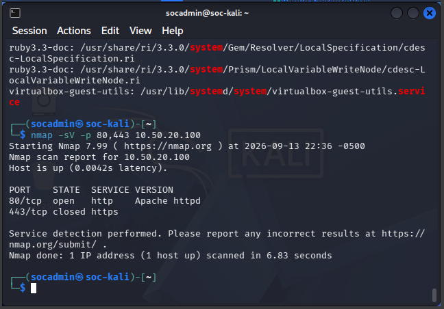
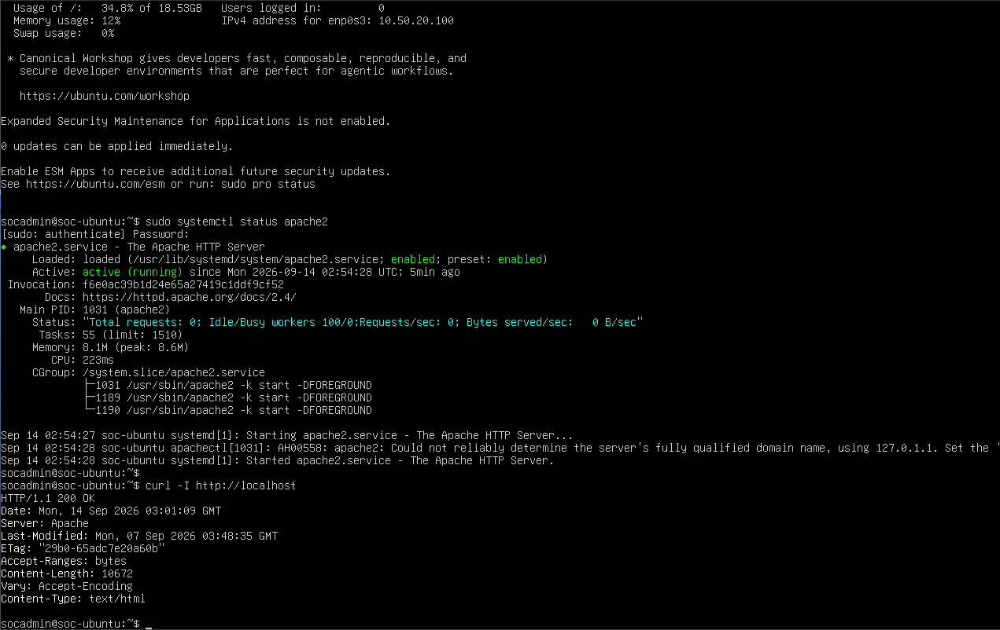
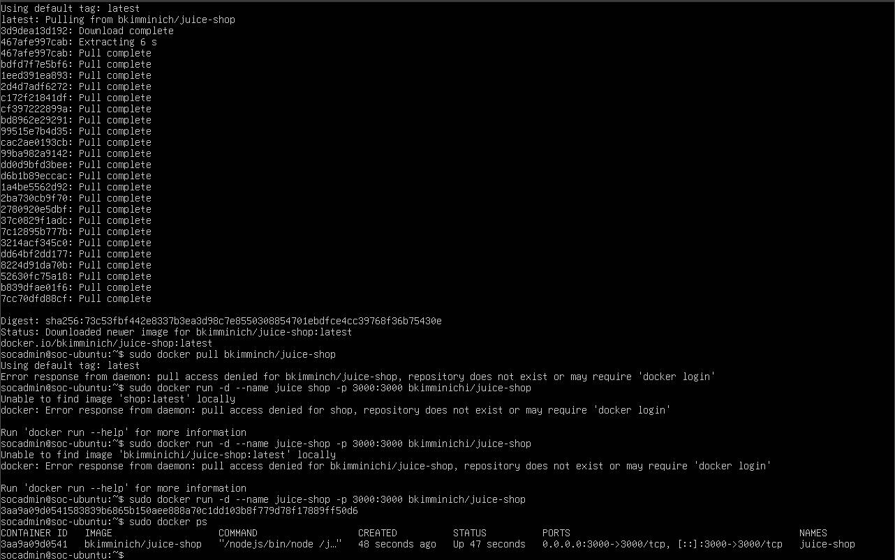
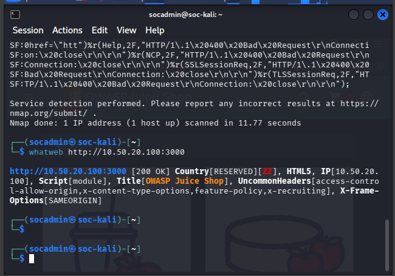
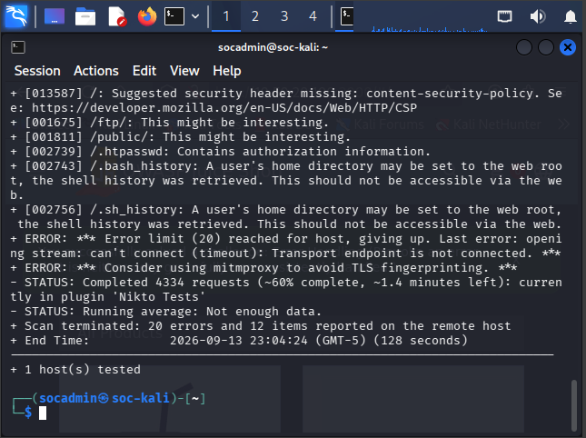
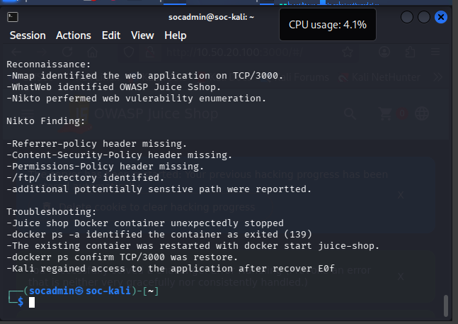

# 🌐 Phase 12 — Web Application Security Assessment

> **Objective:** Deploy a deliberately vulnerable web application in the DMZ and perform an authorized web application security assessment using service discovery, technology fingerprinting, vulnerability enumeration, troubleshooting, recovery, and validation.

[← Phase 11](phase-11-incident-response.md) | [🏠 Main Project](../README.md) | [Phase 13 →](phase-13-email-automation.md)

---

## 📑 Table of Contents

- [Phase Summary](#-phase-summary)
- [Overview](#-overview)
- [Assessment Architecture](#️-assessment-architecture)
- [Phase Objectives](#-phase-objectives)
- [Web Service Baseline](#-web-service-baseline)
- [Apache Service Validation](#-apache-service-validation)
- [OWASP Juice Shop](#-owasp-juice-shop)
- [Technology Fingerprinting](#-technology-fingerprinting)
- [Nikto Vulnerability Assessment](#-nikto-vulnerability-assessment)
- [Security Findings](#-security-findings)
- [Troubleshooting and Recovery](#-troubleshooting-and-recovery)
- [Commands Used](#-commands-used)
- [Lessons Learned](#-lessons-learned)
- [Skills Demonstrated](#-skills-demonstrated)
- [Evidence Summary](#-evidence-summary)
- [VirtualBox Snapshot](#-virtualbox-snapshot)
- [Phase Outcome](#-phase-outcome)
- [Next Phase](#️-next-phase)

---

# 📊 Phase Summary

| Category | Details |
|---|---|
| **Status** | ✅ Complete |
| **Analyst System** | SOC-Kali |
| **Analyst IP** | `10.10.10.103` |
| **Target System** | SOC-Ubuntu |
| **Target IP** | `10.50.20.100` |
| **Target Zone** | DMZ |
| **Web Server** | Apache |
| **Web Server Port** | TCP/80 |
| **Vulnerable Application** | OWASP Juice Shop |
| **Deployment** | Docker |
| **Application Port** | TCP/3000 |
| **Discovery Tool** | Nmap |
| **Fingerprinting Tool** | WhatWeb |
| **Vulnerability Scanner** | Nikto |
| **Primary Skill** | Web Application Security Assessment |
| **Status** | ✅ Completed |

---

# 📋 Overview

Phase 12 expanded the Enterprise Security Operations Lab into **web application security assessment**.

OWASP Juice Shop was deployed on SOC-Ubuntu as a deliberately vulnerable application for controlled security testing.

The assessment was performed from:

```text
SOC-Kali
10.10.10.103
```

against:

```text
SOC-Ubuntu
10.50.20.100
```

The target environment contained:

```text
SOC-Ubuntu
10.50.20.100
      │
      ├── Apache
      │     └── TCP/80
      │
      └── Docker
            │
            └── OWASP Juice Shop
                    │
                    └── TCP/3000
```

Multiple security tools were used to evaluate the target:

```text
Nmap
  +
WhatWeb
  +
Nikto
  +
Docker
  │
  ▼
Web Application Security Assessment
```

The phase also included troubleshooting when the Juice Shop service became unavailable.

---

# 🏗️ Assessment Architecture

```text
                     SOC-Kali
                   10.10.10.103
                        │
                        │
             Security Assessment
                        │
          ┌─────────────┼─────────────┐
          │             │             │
          ▼             ▼             ▼
        Nmap         WhatWeb         Nikto
          │             │             │
          └─────────────┼─────────────┘
                        │
                        ▼
                   SOC-Ubuntu
                  10.50.20.100
                        │
             ┌──────────┴──────────┐
             │                     │
             ▼                     ▼
          Apache                 Docker
          TCP/80                   │
                                   ▼
                           OWASP Juice Shop
                              TCP/3000
```

The assessment workflow was:

```text
Discovery
    │
    ▼
Service Enumeration
    │
    ▼
Technology Fingerprinting
    │
    ▼
Vulnerability Enumeration
    │
    ▼
Security Analysis
    │
    ▼
Troubleshooting
    │
    ▼
Service Recovery
    │
    ▼
Validation
    │
    ▼
Documentation
```

---

# 🎯 Phase Objectives

- [x] Establish a web-service baseline
- [x] Validate Apache on SOC-Ubuntu
- [x] Deploy OWASP Juice Shop
- [x] Host Juice Shop using Docker
- [x] Validate the Juice Shop container
- [x] Perform Nmap service enumeration
- [x] Identify exposed web services
- [x] Fingerprint Juice Shop with WhatWeb
- [x] Perform Nikto vulnerability enumeration
- [x] Review security findings
- [x] Identify web hardening opportunities
- [x] Troubleshoot Juice Shop availability
- [x] Recover the application
- [x] Validate application availability
- [x] Document assessment results

---

# 🔍 Web Service Baseline

Before performing deeper application testing, Nmap was used from SOC-Kali to establish a baseline of the services exposed by SOC-Ubuntu.

Target:

```text
10.50.20.100
```

The objective was to identify:

- Open ports
- Web services
- Service versions
- Application attack surface

The workflow was:

```text
SOC-Kali
    │
    ▼
Nmap
    │
    ▼
SOC-Ubuntu
10.50.20.100
    │
    ▼
Open Ports
    │
    ▼
Service Identification
```

## 📸 Evidence — Nmap Web-Service Baseline



The scan established the target's web-service baseline before additional assessment.

**Result:** ✅ Web-service baseline established.

---

# 🌐 Apache Service Validation

Apache was running on SOC-Ubuntu and provided the baseline HTTP service on:

```text
TCP/80
```

The service was validated before proceeding with application assessment.

```text
SOC-Kali
     │
     ▼
10.50.20.100
     │
     ▼
TCP/80
     │
     ▼
Apache
```

## 📸 Evidence — Apache Service Running



This confirmed that the Ubuntu web service was operational.

**Result:** ✅ Apache web service validated.

---

# 🧃 OWASP Juice Shop

OWASP Juice Shop was used as the intentionally vulnerable application for controlled web-security testing.

The application was hosted in Docker on SOC-Ubuntu.

```text
SOC-Ubuntu
10.50.20.100
      │
      ▼
Docker
      │
      ▼
OWASP Juice Shop
      │
      ▼
TCP/3000
```

Using a deliberately vulnerable application allowed security assessment techniques to be practiced without targeting an unauthorized external system.

---

# 🐳 Juice Shop Container Validation

The Docker environment was checked to confirm that the Juice Shop container was operational.

The application container provided the vulnerable target for:

- Technology fingerprinting
- HTTP analysis
- Vulnerability enumeration
- Security configuration review

## 📸 Evidence — Juice Shop Container Running



This confirmed that the Juice Shop Docker container was operational.

**Result:** ✅ OWASP Juice Shop container running.

---

# 🔬 Technology Fingerprinting

After confirming application availability, **WhatWeb** was used to fingerprint OWASP Juice Shop.

The objective was to identify information exposed through HTTP responses and application behavior.

```text
SOC-Kali
    │
    ▼
WhatWeb
    │
    ▼
OWASP Juice Shop
    │
    ▼
Technology Identification
```

Technology fingerprinting provides context before deeper security testing.

It can reveal information about:

- Web technologies
- HTTP behavior
- Application frameworks
- Server characteristics
- Security-related headers

## 📸 Evidence — WhatWeb Juice Shop Fingerprinting



**Result:** ✅ Juice Shop technology fingerprinting completed.

---

# 🛡️ Nikto Vulnerability Assessment

Nikto was used to perform automated vulnerability enumeration against the Juice Shop web environment.

The assessment workflow was:

```text
OWASP Juice Shop
      │
      ▼
    Nikto
      │
      ▼
HTTP Security Checks
      │
      ▼
Potential Findings
      │
      ▼
Analyst Review
```

Nikto was used to identify:

- Missing security headers
- Potential configuration weaknesses
- Interesting directories
- Potentially sensitive paths
- HTTP configuration issues

## 📸 Evidence — Nikto Juice Shop Results



**Result:** ✅ Nikto vulnerability enumeration completed.

---

# 🚨 Security Findings

The assessment identified several security observations and hardening opportunities.

These included:

| Finding | Assessment |
|---|---|
| Missing Content-Security-Policy | Security hardening opportunity |
| Missing Referrer-Policy | Security hardening opportunity |
| Missing Permissions-Policy | Security hardening opportunity |
| Missing Strict-Transport-Security | Relevant when HTTPS is implemented |
| `/ftp/` identified | Requires manual review |
| `/public/` identified | Requires manual review |
| Potential sensitive paths | Requires validation |
| `Access-Control-Allow-Origin: *` | Configuration should be reviewed |

The findings were categorized carefully.

```text
Scanner Finding
      │
      ▼
Analyst Review
      │
      ▼
Manual Validation
      │
      ▼
Determine Actual Impact
```

An automated scanner result was not automatically treated as a confirmed exploitable vulnerability.

## 📸 Evidence — Web Assessment Findings



**Result:** ✅ Assessment findings documented.

---

# ⚠️ Troubleshooting and Recovery

During the assessment, OWASP Juice Shop unexpectedly became unavailable.

This created an additional troubleshooting scenario.

The possible failure points included:

```text
Application Unavailable
        │
        ▼
Network Problem?
        │
        ▼
Ubuntu Problem?
        │
        ▼
Port Problem?
        │
        ▼
Docker Problem?
        │
        ▼
Container Problem?
        │
        ▼
Application Problem?
```

Docker inspection showed that the Juice Shop container had stopped.

Rather than rebuilding the application, the existing deployment was investigated and recovered.

The troubleshooting methodology was:

```text
Check Host
    │
    ▼
Check Network
    │
    ▼
Check Service
    │
    ▼
Check Docker
    │
    ▼
Check Container
    │
    ▼
Restart Application
    │
    ▼
Validate Service
```

After recovery, the application was validated before testing continued.

This reinforced an important operational principle:

```text
Container Running
       ≠
Application Validated
```

The actual application service must also be checked.

---

# 💻 Commands Used

Phase 12 used several tools for web application assessment.

## Nmap

Nmap was used to enumerate services exposed by:

```text
10.50.20.100
```

Purpose:

```text
Identify open ports and establish the target's
web-service baseline.
```

---

## WhatWeb

WhatWeb was used to fingerprint the Juice Shop web application.

Purpose:

```text
Identify technologies and information exposed
through the web application.
```

---

## Nikto

Nikto was used to perform automated web vulnerability enumeration.

Purpose:

```text
Identify potential web-server and application
security weaknesses requiring analyst review.
```

---

## Docker

Docker was used to host and manage OWASP Juice Shop.

Docker inspection was also used when the application unexpectedly became unavailable.

Purpose:

```text
Deploy, inspect, recover, and validate the
controlled vulnerable web application.
```

---

# 🔧 Troubleshooting Methodology

The availability issue demonstrated why web application troubleshooting should be performed by layers.

```text
Layer 1
Host Reachability
      │
      ▼
Layer 2
Network Connectivity
      │
      ▼
Layer 3
TCP Service
      │
      ▼
Layer 4
Docker
      │
      ▼
Layer 5
Container
      │
      ▼
Layer 6
Application
```

Instead of immediately changing configurations or rebuilding the application, each layer was checked independently.

This reduced unnecessary changes and preserved the existing deployment.

---

# 💡 Lessons Learned

## 1. Discovery Comes Before Vulnerability Testing

Nmap established the service baseline before deeper assessment.

This prevented assumptions about what services were exposed.

---

## 2. Multiple Tools Provide Different Perspectives

Each tool answered a different security question.

```text
Nmap
  │
  └── What services are exposed?

WhatWeb
  │
  └── What technologies are visible?

Nikto
  │
  └── What potential security weaknesses exist?

Docker
  │
  └── Is the application operational?
```

---

## 3. Automated Findings Require Analyst Validation

Nikto findings represent potential security issues.

They still require:

- Context
- Manual validation
- Risk analysis

A scanner result should not automatically be described as a confirmed vulnerability.

---

## 4. Application Availability Is Part of Security Testing

When Juice Shop became unavailable, the problem had to be diagnosed before assessment could continue.

Security testing depends on understanding the operational state of the target.

---

## 5. Troubleshoot Before Rebuilding

The existing container was investigated before creating a replacement.

This preserved the environment and avoided unnecessary changes.

---

## 6. Running Infrastructure Does Not Guarantee Application Health

Docker itself can be operational while an individual application container is stopped.

Likewise:

```text
Container Running
       ≠
Application Healthy
```

Application-level validation remains necessary.

---

## 7. Security Headers Provide Defensive Context

Missing security headers were documented as hardening opportunities rather than automatically being labeled critical vulnerabilities.

---

## 8. Interesting Paths Require Investigation

Paths such as:

```text
/ftp/
/public/
```

can be useful findings, but discovery alone does not establish security impact.

---

## 9. CORS Requires Context

The observed:

```text
Access-Control-Allow-Origin: *
```

configuration requires analysis based on application requirements and exposed resources.

---

## 10. Documentation Should Separate Evidence From Interpretation

A professional assessment should distinguish:

```text
Observed Evidence
       │
       ▼
Potential Finding
       │
       ▼
Validation
       │
       ▼
Security Impact
```

---

# 🧠 Skills Demonstrated

| Skill | Application |
|---|---|
| **Web Application Security** | Assessed an intentionally vulnerable application |
| **OWASP Juice Shop** | Used a controlled vulnerable target |
| **Nmap** | Established web-service baseline |
| **WhatWeb** | Fingerprinted web technologies |
| **Nikto** | Performed automated vulnerability enumeration |
| **HTTP Security** | Reviewed security headers and behavior |
| **Apache** | Validated the Ubuntu web service |
| **Docker** | Hosted and managed Juice Shop |
| **Container Troubleshooting** | Investigated application downtime |
| **Service Recovery** | Restored the vulnerable application |
| **Linux Administration** | Validated services on SOC-Ubuntu |
| **Finding Analysis** | Distinguished observations from confirmed vulnerabilities |
| **Troubleshooting** | Isolated failures by service layer |
| **Security Documentation** | Documented findings and evidence |

---

# 📸 Evidence Summary

The Phase 12 screenshots already stored in the repository are:

| # | Evidence | Screenshot |
|---|---|---|
| 1 | Apache Service Running | `phase12-apache-service-running.png` |
| 2 | Juice Shop Container Running | `phase12-juice-shop-container-running.png` |
| 3 | Nikto Juice Shop Results | `phase12-nikto-juice-shop-results.png` |
| 4 | Web Assessment Findings | `phase12-web-assessment-findings.png` |
| 5 | Nmap Web-Service Baseline | `phase12-web-service-baseline-nmap.png` |
| 6 | WhatWeb Juice Shop Fingerprinting | `phase12-whatweb-juice-shop.png` |

Since this document is located inside:

```text
docs/
```

the correct relative image path is:

```text
../images/<filename>
```

For example:

```markdown

```

No screenshot files need to be renamed or uploaded again.

---

# 💾 VirtualBox Snapshot

After completing the web application assessment and recovering the Juice Shop environment, the completed lab state was preserved with a VirtualBox snapshot.

## Snapshot VM

```text
SOC-Ubuntu
```

## Snapshot Name

```text
Phase 12 - Web Application Security Assessment Complete
```

## Snapshot Description

```text
Phase 12 completed.

OWASP Juice Shop deployed and validated on SOC-Ubuntu.

Completed:
- Apache service validation
- Nmap web-service baseline
- OWASP Juice Shop Docker validation
- WhatWeb technology fingerprinting
- Nikto vulnerability enumeration
- Web security findings analysis
- Juice Shop container troubleshooting
- Service recovery and validation

This snapshot preserves the completed Phase 12
web application security assessment environment.
```

> **Note:** The VirtualBox snapshot itself is a VM recovery checkpoint and is not stored as a PNG in the GitHub `images` directory. The screenshots above are the portfolio evidence of the completed Phase 12 configuration and assessment.

---

# 🏁 Phase Outcome

## ✅ Phase 12 Complete

Phase 12 successfully expanded the Enterprise Security Operations Lab into web application security assessment.

The final environment was:

```text
SOC-Kali
10.10.10.103
     │
     ├──── Nmap
     ├──── WhatWeb
     └──── Nikto
     │
     ▼
SOC-Ubuntu
10.50.20.100
     │
     ├──── Apache :80
     │
     └──── Docker
              │
              ▼
       OWASP Juice Shop
           TCP/3000
```

The assessment demonstrated:

- Web-service discovery
- Service enumeration
- Technology fingerprinting
- Vulnerability enumeration
- HTTP security analysis
- Docker application management
- Troubleshooting
- Service recovery
- Finding validation
- Security documentation

The complete Phase 12 workflow was:

```text
Discover
   │
   ▼
Enumerate
   │
   ▼
Fingerprint
   │
   ▼
Scan
   │
   ▼
Analyze
   │
   ▼
Troubleshoot
   │
   ▼
Recover
   │
   ▼
Validate
   │
   ▼
Document

   ✅
```

Phase 12 therefore connected:

**Network Discovery → Web Application Assessment → Vulnerability Analysis → Operational Troubleshooting → Recovery → Validation**

---

# ➡️ Next Phase

## Phase 13 — Python Security Automation & Automated SOC Email Alerting

Phase 13 extends the SOC environment with Python-based security automation.

The next phase includes:

- JSON security-event processing
- Python event analysis
- Severity classification
- Security reporting
- CSV export
- Gmail API
- OAuth 2.0
- Wazuh custom integration
- Automated SOC email alerts
- End-to-end alert validation

---

[← Phase 11](phase-11-incident-response.md) | [🏠 Back to Main Project](../README.md) | [Phase 13 →](phase-13-email-automation.md)

---

### Enterprise Security Operations Lab

**Web Application Security • OWASP Juice Shop • Nmap • WhatWeb • Nikto • Docker • Vulnerability Assessment • Troubleshooting**
