# 🤖 Phase 13 — Python Security Automation & Automated SOC Email Alerting

> **Objective:** Build a Python-based security automation workflow that processes structured security events, generates reports, integrates Wazuh with the Gmail API using OAuth 2.0, and automatically delivers SOC email notifications for qualifying Wazuh security events.

[← Phase 12](phase-12-web-security.md) | [🏠 Main Project](../README.md) | [Phase 14 →](phase-14-end-to-end-soc-response.md)

---

## 📑 Table of Contents

- [Phase Summary](#-phase-summary)
- [Overview](#-overview)
- [Automation Architecture](#️-automation-architecture)
- [Phase Objectives](#-phase-objectives)
- [Security Event Dataset](#-security-event-dataset)
- [JSON Validation](#-json-validation)
- [Python Security Event Analysis](#-python-security-event-analysis)
- [Security Report Generation](#-security-report-generation)
- [CSV Export](#-csv-export)
- [Gmail API Integration](#-gmail-api-integration)
- [OAuth 2.0 Configuration](#-oauth-20-configuration)
- [Gmail Send Scope](#-gmail-send-scope)
- [Gmail API Alert Test](#-gmail-api-alert-test)
- [Wazuh Email Integration](#-wazuh-email-integration)
- [Integration Permissions](#-integration-permissions)
- [Custom Wazuh Integration](#-custom-wazuh-integration)
- [Wazuh Integration Validation](#-wazuh-integration-validation)
- [Wazuh Gmail API Validation](#-wazuh-gmail-api-validation)
- [Automated Wazuh Email Alert](#-automated-wazuh-email-alert)
- [End-to-End SOC Email Validation](#-end-to-end-soc-email-validation)
- [Commands and Configuration](#-commands-and-configuration)
- [Troubleshooting](#-troubleshooting)
- [Security Considerations](#-security-considerations)
- [Lessons Learned](#-lessons-learned)
- [Skills Demonstrated](#-skills-demonstrated)
- [Evidence Summary](#-evidence-summary)
- [VirtualBox Snapshot](#-virtualbox-snapshot)
- [Phase Outcome](#-phase-outcome)
- [Next Phase](#️-next-phase)

---

# 📊 Phase Summary

| Category | Details |
|---|---|
| **Status** | ✅ Complete |
| **Primary Language** | Python 3 |
| **Security Data Format** | JSON |
| **Reporting Formats** | TXT / CSV |
| **SIEM/XDR** | Wazuh |
| **Wazuh Server** | SOC-Wazuh `10.10.10.102` |
| **Security Sources** | Wazuh / Suricata |
| **Email Provider** | Gmail |
| **Email Interface** | Gmail API |
| **Authentication** | OAuth 2.0 |
| **OAuth Scope** | `gmail.send` |
| **Wazuh Integration** | Custom Integration |
| **Alert Threshold** | Level 5+ |
| **Python Environment** | Dedicated Virtual Environment |
| **Primary Skill** | Security Automation |
| **Final Validation** | Automated SOC Email Successfully Delivered |

---

# 📋 Overview

Phase 13 introduced **Python security automation and automated SOC email alerting** into the Enterprise Security Operations Lab.

Previous phases established:

- Endpoint security monitoring
- Wazuh SIEM/XDR
- Suricata IDS
- Centralized logging
- Event correlation
- Vulnerability management
- Threat intelligence
- Incident response
- Web application security assessment

Phase 13 added an automation layer on top of those security capabilities.

The phase began by processing structured security events using Python.

```text
Security Events
      │
      ▼
JSON
      │
      ▼
Python
      │
      ├── Event Analysis
      ├── Severity Classification
      ├── Security Reporting
      └── CSV Export
```

The project was then extended into automated notification.

A custom Wazuh integration connected qualifying security events to Python, which used the Gmail API and OAuth 2.0 to deliver SOC email alerts.

The final architecture became:

```text
Security Event
      │
      ▼
Wazuh Detection
      │
      ▼
Wazuh Integratord
      │
      ▼
custom-phase13-email
      │
      ▼
Python Automation
      │
      ▼
Gmail API
      │
      ▼
OAuth 2.0
      │
      ▼
SOC Email Alert
```

This phase demonstrated how security telemetry can move beyond passive monitoring into an automated notification workflow.

---

# 🏗️ Automation Architecture

Phase 13 contained two related automation workflows.

## Security Event Analysis

```text
security_events.json
        │
        ▼
analyze_events.py
        │
        ├── Parse Events
        ├── Count Sources
        ├── Count Severities
        ├── Process Timestamps
        ├── Display Events
        └── Identify Alerts
        │
        ▼
Security Report
        │
        ▼
export_csv.py
        │
        ▼
CSV Security Report
```

## Automated SOC Notification

```text
                Security Events
                     │
          ┌──────────┴──────────┐
          │                     │
          ▼                     ▼
       Suricata               Wazuh
          │                     │
          └──────────┬──────────┘
                     │
                     ▼
               Wazuh Manager
              10.10.10.102
                     │
                     ▼
              Wazuh Integratord
                     │
                     ▼
          custom-phase13-email
                     │
                     ▼
           Python Automation
                     │
                     ▼
                 Gmail API
                     │
                     ▼
                  OAuth 2.0
                     │
                     ▼
              SOC Email Inbox
```

Together, these workflows demonstrated:

```text
Security Data Analysis
          +
Security Automation
          +
Automated Notification
```

---

# 🎯 Phase Objectives

- [x] Create structured security-event data
- [x] Store security events in JSON
- [x] Validate JSON syntax
- [x] Build a Python security-event analyzer
- [x] Count events by security source
- [x] Count events by severity
- [x] Process event timestamps
- [x] Display individual event information
- [x] Identify higher-priority security events
- [x] Generate a security report
- [x] Export security-event data to CSV
- [x] Enable the Gmail API
- [x] Configure OAuth 2.0
- [x] Apply least-privilege Gmail permissions
- [x] Use the `gmail.send` scope
- [x] Complete OAuth authorization
- [x] Validate Gmail API delivery independently
- [x] Create a dedicated Python environment
- [x] Protect the OAuth token
- [x] Create a custom Wazuh integration
- [x] Configure integration permissions
- [x] Configure Wazuh Integratord
- [x] Trigger Python automation from Wazuh
- [x] Send automated security notifications
- [x] Validate automated email delivery
- [x] Validate the complete end-to-end workflow
- [x] Document troubleshooting and lessons learned

---

# 📁 Security Event Dataset

A structured security-event dataset was created:

```text
security_events.json
```

The dataset contained five sample security events representing telemetry from:

```text
Suricata
Wazuh
```

The purpose of the JSON file was to separate:

```text
Security Data
```

from:

```text
Automation Logic
```

The workflow was:

```text
Security Events
      │
      ▼
security_events.json
      │
      ▼
Python
      │
      ▼
Analysis
```

Using JSON allowed the Python scripts to consume structured event information rather than relying on manually entered values.

---

# ✅ JSON Validation

Before processing the dataset, the JSON structure was validated.

This was important because malformed JSON would prevent Python from parsing the security events correctly.

The validation workflow was:

```text
Create JSON
    │
    ▼
Validate Syntax
    │
    ▼
Load into Python
    │
    ▼
Process Events
```

## 📸 Evidence — JSON Validation

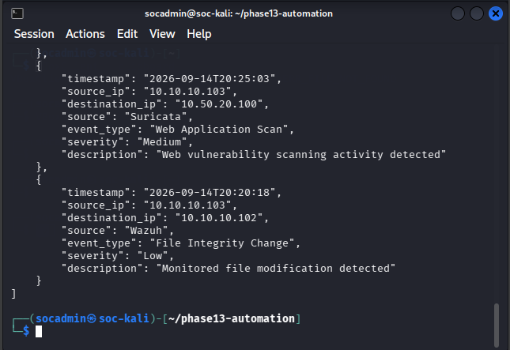

**Result:** ✅ Security-event JSON successfully validated.

---

# 🐍 Python Security Event Analysis

The primary analysis script was:

```text
analyze_events.py
```

The script processed events stored in:

```text
security_events.json
```

The Python automation performed operations including:

- Loading JSON security events
- Counting events by source
- Counting events by severity
- Processing timestamps
- Displaying individual event information
- Identifying events requiring additional attention

The workflow was:

```text
security_events.json
        │
        ▼
analyze_events.py
        │
        ├── Parse JSON
        ├── Count Sources
        ├── Count Severities
        ├── Process Timestamps
        ├── Display Events
        └── Identify Alerts
```

This demonstrated how Python can reduce repetitive manual security-event analysis.

## 📸 Evidence — Python Security Event Analysis

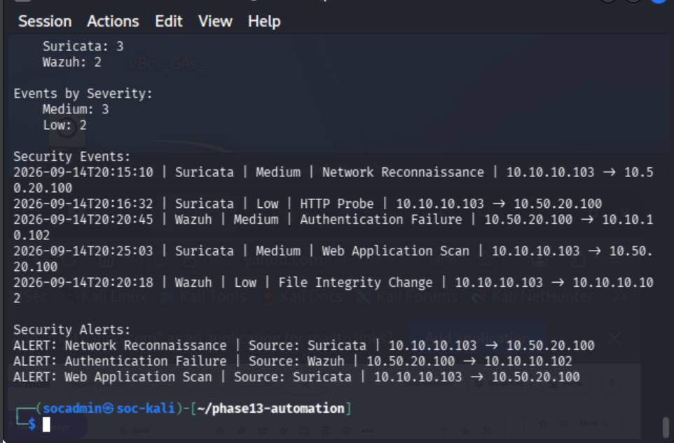

**Result:** ✅ Python successfully processed and categorized the security events.

---

# 📄 Security Report Generation

The Python analysis was extended to generate an analyst-readable security report.

The report file was:

```text
phase13-security-report.txt
```

The workflow became:

```text
JSON Events
    │
    ▼
Python Analysis
    │
    ▼
Security Report
```

This demonstrated how automated security analysis can generate reusable reporting output.

## 📸 Evidence — Security Report

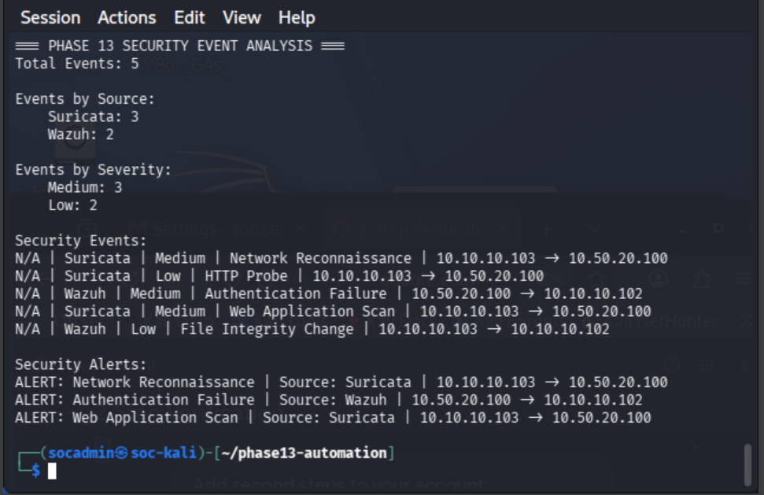

**Result:** ✅ Security report successfully generated.

---

# 📊 CSV Export

A second Python script was created:

```text
export_csv.py
```

The script exported the structured security-event information into:

```text
phase13-security-events.csv
```

The workflow was:

```text
security_events.json
        │
        ▼
export_csv.py
        │
        ▼
phase13-security-events.csv
```

CSV output makes security data easier to reuse in:

- Spreadsheet applications
- Data-analysis workflows
- Reporting systems
- Additional Python scripts
- Security metrics and dashboards

## 📸 Evidence — CSV Security Report

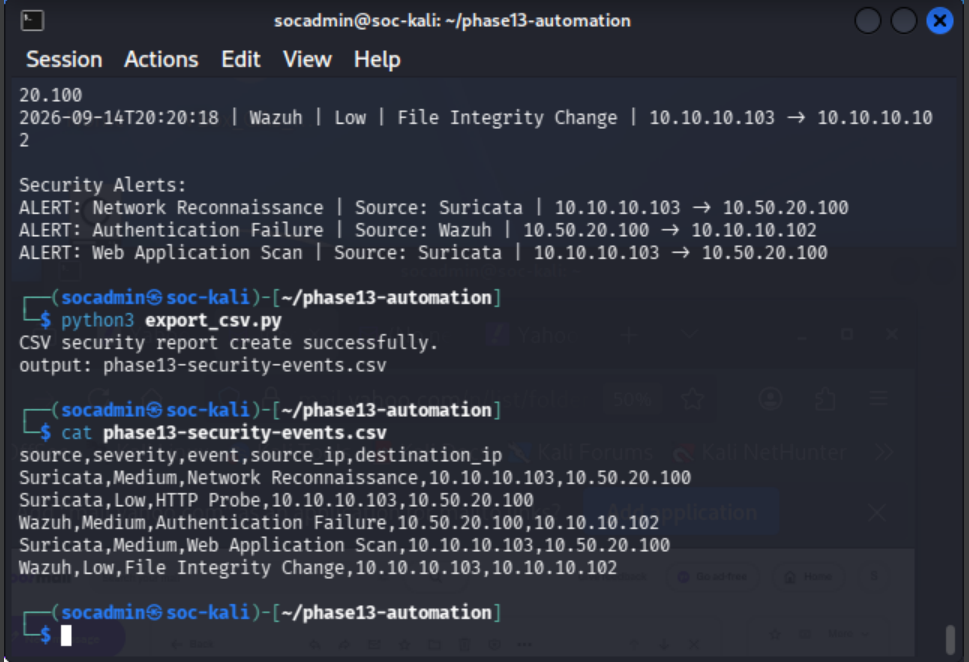

**Result:** ✅ Security events successfully exported to CSV.

---

# 📧 Gmail API Integration

The next stage extended the automation from local event processing into automated email notification.

Instead of storing a Gmail password or application password inside the automation, the project used:

```text
Gmail API
    +
OAuth 2.0
```

A Google Cloud project was configured:

```text
SOC Security Automation
```

The Gmail API was enabled for this project.

## 📸 Evidence — Gmail API Enabled

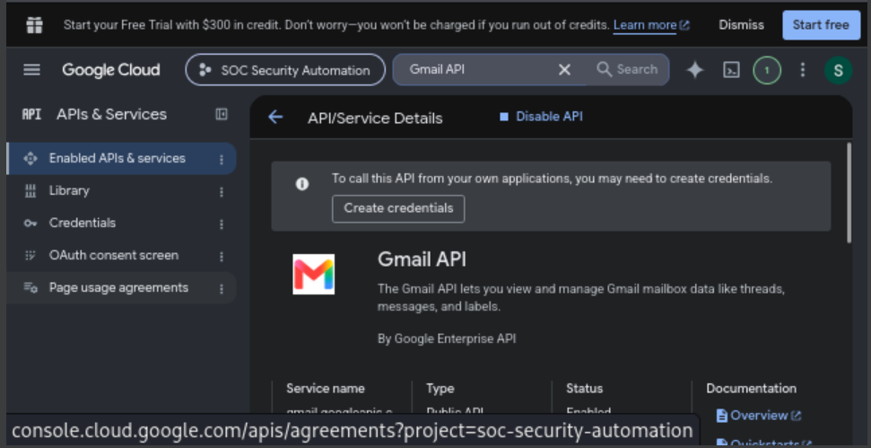

The Gmail API provided the interface through which Python could programmatically send the SOC notification.

**Result:** ✅ Gmail API enabled.

---

# 🔐 OAuth 2.0 Configuration

OAuth 2.0 was used to authorize the Python application.

This allowed the application to use Gmail API functionality without embedding the Gmail account password inside the script.

The authorization model was:

```text
Python Application
        │
        ▼
OAuth 2.0
        │
        ▼
Google Authorization
        │
        ▼
OAuth Token
        │
        ▼
Gmail API
```

The OAuth consent configuration was established for the security automation project.

During testing, the authorization flow used:

```python
flow.run_local_server(port=0)
```

The browser-based authentication process completed successfully after the account was added as an authorized test user.

The resulting OAuth token was then used by the automation for Gmail API authorization.

---

# 🔑 Gmail Send Scope

The integration followed the principle of least privilege.

The automation only needed to send email.

Therefore, the OAuth scope was restricted to:

```text
gmail.send
```

The permission model was:

```text
Required Function
       │
       ▼
Send SOC Alert
       │
       ▼
gmail.send
```

The application did not require broad mailbox-reading permissions.

## 📸 Evidence — Gmail OAuth Send Scope

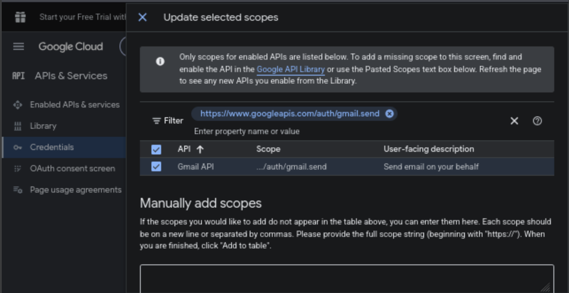

**Result:** ✅ Gmail API permission limited to email sending.

---

# 🧪 Gmail API Alert Test

Before integrating Gmail with Wazuh, email delivery was tested independently.

This was an important troubleshooting strategy because it separated:

```text
Python / Gmail Problem
```

from:

```text
Wazuh Integration Problem
```

The independent test validated:

```text
Python
   │
   ▼
OAuth Credentials
   │
   ▼
Gmail API
   │
   ▼
Email Delivery
```

## 📸 Evidence — Gmail API Alert Success

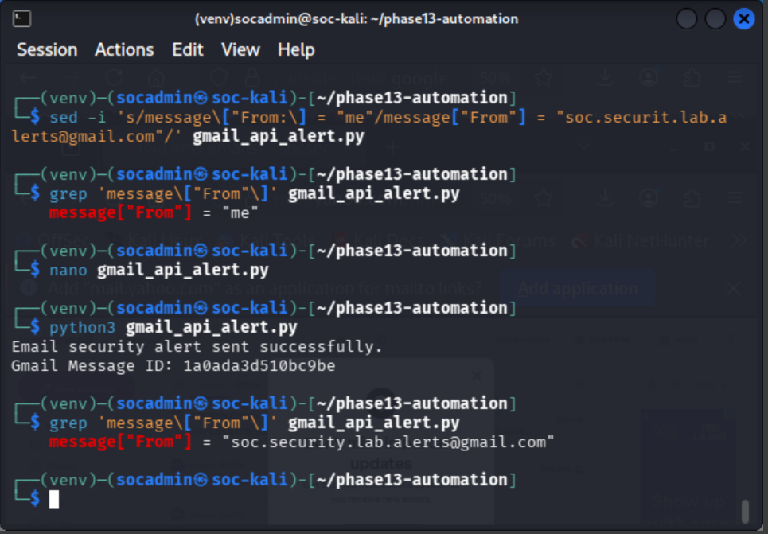

**Result:** ✅ Python successfully sent an email using Gmail API.

---

# 📬 Gmail Security Alert Received

The message was verified in the receiving mailbox.

## 📸 Evidence — Gmail Security Alert Received

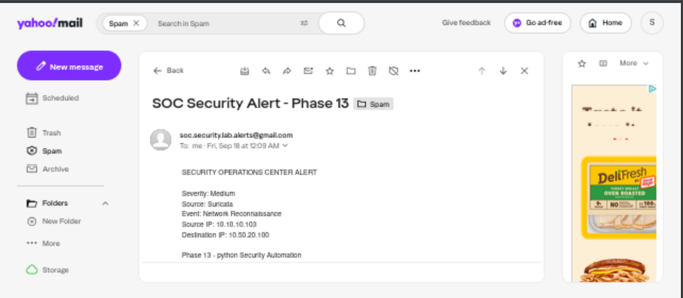

This independently confirmed that:

- OAuth authentication worked
- Gmail API access worked
- Python constructed the message
- Gmail accepted the API request
- The receiving mailbox received the message

At this point, Gmail API functionality was validated before introducing Wazuh into the workflow.

---

# 🔗 Wazuh Email Integration

After independently validating Gmail API delivery, the Python automation was connected to Wazuh.

The integration directory was:

```text
/var/ossec/integrations/phase13-email/
```

Important components included:

```text
gmail_api_alert.py
token.json
venv/
```

The components served different purposes:

```text
gmail_api_alert.py
        │
        └── Python email automation

token.json
        │
        └── OAuth authorization token

venv/
        │
        └── Dedicated Python environment
```

The custom Wazuh integration executable was:

```text
/var/ossec/integrations/custom-phase13-email
```

The Wazuh configuration was maintained in:

```text
/var/ossec/etc/ossec.conf
```

The completed integration path became:

```text
Wazuh
   │
   ▼
Integratord
   │
   ▼
Custom Executable
   │
   ▼
Python
   │
   ▼
Gmail API
```

---

# 🔐 Integration Permissions

The custom integration required the correct Linux ownership and executable permissions before Wazuh Integratord could invoke it successfully.

This was an important distinction because:

```text
Script Works Manually
        ≠
Script Works Through Wazuh
```

The execution chain involved:

```text
Wazuh Alert
     │
     ▼
Integratord
     │
     ▼
Custom Script
     │
     ▼
Linux Permissions
     │
     ▼
Python Environment
     │
     ▼
OAuth Token
```

The executable bit and integration permissions were validated as part of troubleshooting.

## 📸 Evidence — Wazuh Email Integration Permissions

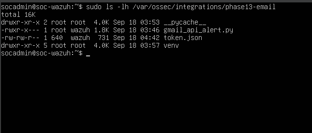

**Result:** ✅ Integration permissions and execution requirements validated.

---

# ⚙️ Custom Wazuh Integration

The custom executable used by Wazuh was:

```text
/var/ossec/integrations/custom-phase13-email
```

Its role was to bridge:

```text
Wazuh Integratord
```

with:

```text
Python Email Automation
```

The integration was configured in:

```text
/var/ossec/etc/ossec.conf
```

for qualifying Wazuh alerts.

The project used a Level 5+ threshold and JSON alert format.

Conceptually, the configuration followed:

```xml
<integration>
  <name>custom-phase13-email</name>
  <level>5</level>
  <alert_format>json</alert_format>
</integration>
```

The workflow became:

```text
Wazuh Alert
    │
    ▼
Alert Level Check
    │
    ▼
Integratord
    │
    ▼
custom-phase13-email
    │
    ▼
Python Automation
```

---

# 🔗 Wazuh Integration Validation

After configuring the custom executable and its permissions, the Wazuh-to-Python integration was tested.

This validation was important because manually executing the Python script only proved:

```text
Python → Gmail
```

It did not prove:

```text
Wazuh → Python
```

The integration test established:

```text
Wazuh
  │
  ▼
Integratord
  │
  ▼
Custom Integration
  │
  ▼
Python
```

## 📸 Evidence — Wazuh Email Integration Success

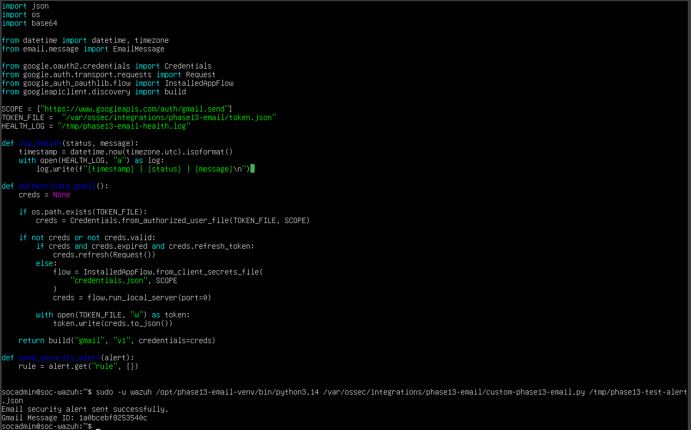

**Result:** ✅ Wazuh successfully invoked the custom email integration.

---

# 📧 Wazuh Gmail API Validation

The next validation confirmed that the Wazuh-triggered Python workflow could successfully communicate with Gmail.

The tested chain was:

```text
Wazuh
   │
   ▼
Custom Integration
   │
   ▼
Python
   │
   ▼
OAuth 2.0
   │
   ▼
Gmail API
```

## 📸 Evidence — Wazuh Gmail API Alert Success

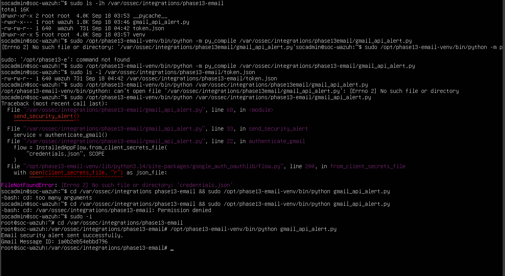

**Result:** ✅ Wazuh-triggered Gmail API workflow validated.

---

# 🔔 Automated Wazuh Email Alert

After validating the integration layers, Wazuh could automatically pass qualifying alerts into the Python notification workflow.

The process no longer required an analyst to manually execute the email script.

Instead:

```text
Security Event
      │
      ▼
Wazuh Detection
      │
      ▼
Automatic Integration
      │
      ▼
Python
      │
      ▼
Email Notification
```

## 📸 Evidence — Wazuh Automated Email Alert

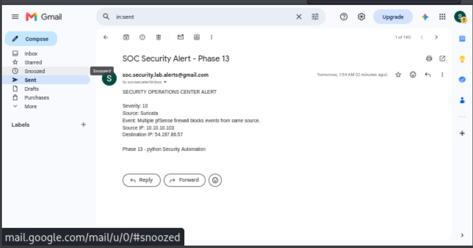

**Result:** ✅ Wazuh automation successfully reached the email notification stage.

---

# 📬 Automated Gmail Alert Validation

The resulting automated Gmail notification was successfully delivered.

## 📸 Evidence — Wazuh Automated Gmail Alert Success

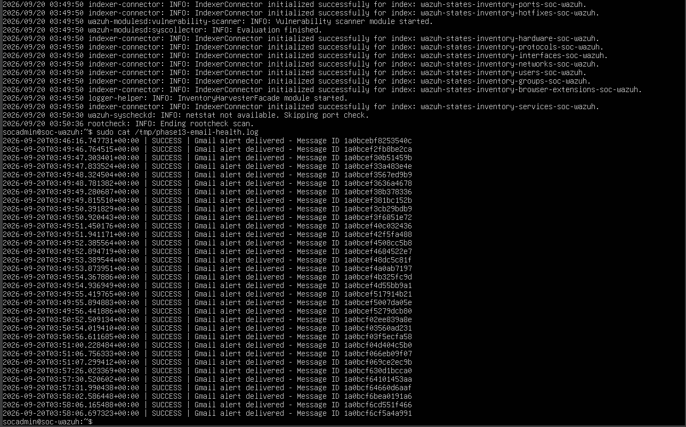

This demonstrated successful communication through:

```text
Wazuh
   ↓
Python
   ↓
OAuth
   ↓
Gmail API
   ↓
Mailbox
```

**Result:** ✅ Automated Wazuh-triggered Gmail notification delivered.

---

# 🔄 End-to-End SOC Email Validation

The final Phase 13 validation tested the complete automation pipeline.

```text
Security Event
      │
      ▼
Wazuh Detection
      │
      ▼
Wazuh Integratord
      │
      ▼
custom-phase13-email
      │
      ▼
Python Automation
      │
      ▼
OAuth 2.0
      │
      ▼
Gmail API
      │
      ▼
SOC Email Inbox

      ✅
```

The resulting SOC notification contained security-alert information passed through the integration.

## 📸 Evidence — Automated SOC Email Alert Delivery

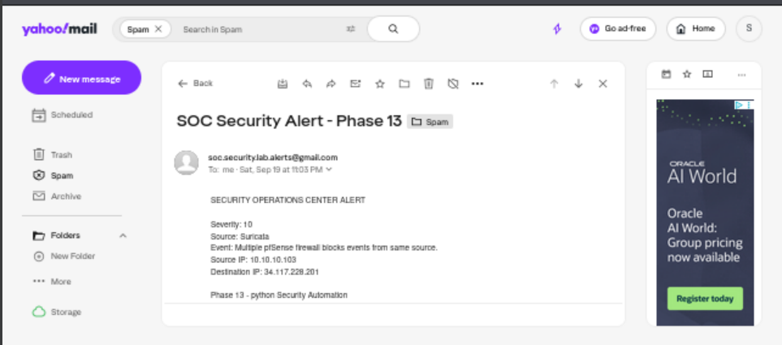

---

## 📸 Evidence — SOC Email Alert Received

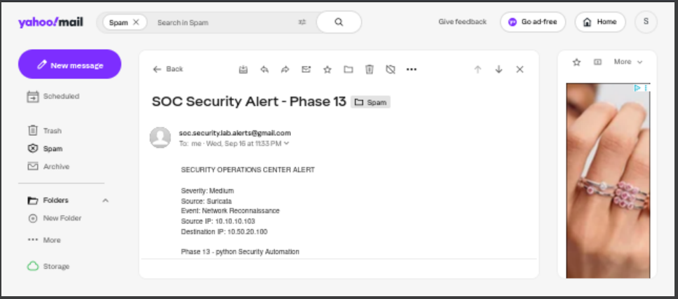

The successful delivery demonstrated that the individual components were operating together as one automated SOC notification pipeline.

**Result:** ✅ End-to-end automated SOC email alerting validated.

---

# 💻 Commands and Configuration

Phase 13 involved Python, JSON, Linux, Wazuh, OAuth, and Gmail API configuration.

## Security Event Dataset

```text
security_events.json
```

Purpose:

```text
Store structured Suricata and Wazuh security events
for Python processing.
```

---

## Python Analysis Script

```text
analyze_events.py
```

Purpose:

```text
Parse security events, count events by source and
severity, process timestamps, display event details,
and identify events requiring attention.
```

---

## CSV Export Script

```text
export_csv.py
```

Purpose:

```text
Export structured security-event information into CSV.
```

---

## Security Report

```text
phase13-security-report.txt
```

---

## CSV Report

```text
phase13-security-events.csv
```

---

## Wazuh Integration Directory

```text
/var/ossec/integrations/phase13-email/
```

Important components:

```text
gmail_api_alert.py
token.json
venv/
```

---

## Custom Wazuh Integration

```text
/var/ossec/integrations/custom-phase13-email
```

---

## Wazuh Configuration

```text
/var/ossec/etc/ossec.conf
```

Conceptual integration configuration:

```xml
<integration>
  <name>custom-phase13-email</name>
  <level>5</level>
  <alert_format>json</alert_format>
</integration>
```

---

## OAuth Authorization

The local OAuth authorization flow used:

```python
flow.run_local_server(port=0)
```

After successful browser authorization, the OAuth token could be reused by the Python automation.

---

## Gmail OAuth Scope

```text
gmail.send
```

Purpose:

```text
Allow the security automation to send email
without granting unnecessary mailbox permissions.
```

---

# 🔧 Troubleshooting

Phase 13 involved troubleshooting across several technologies.

The complexity of the integration made layered troubleshooting especially important.

---

## 1. Python Formatting and Logic

During development, Python formatting and f-string issues were corrected.

The development cycle followed:

```text
Write Code
    │
    ▼
Execute
    │
    ▼
Read Error
    │
    ▼
Correct Code
    │
    ▼
Retest
```

This reinforced the importance of validating each automation component incrementally.

---

## 2. OAuth 403 Access Denied

The initial OAuth authorization attempt returned:

```text
403 Access Denied
```

The OAuth consent configuration was reviewed.

The Gmail account was added as an authorized test user.

The flow then became:

```text
OAuth Request
     │
     ▼
403 Access Denied
     │
     ▼
Review OAuth Configuration
     │
     ▼
Add Test User
     │
     ▼
Retry Authentication
     │
     ▼
Authorization Successful
```

**Result:** OAuth authorization completed successfully.

---

## 3. OAuth Credential Handling

An early authentication-flow issue occurred around credential initialization.

The credential and authorization flow was corrected before Wazuh integration continued.

Testing Gmail independently proved especially useful because it prevented Wazuh from being incorrectly blamed for an OAuth problem.

---

## 4. Wazuh Integration Permissions

At one point the custom Wazuh integration produced no visible output.

The investigation checked:

```text
Integration File
      │
      ▼
Executable Bit
      │
      ▼
Permissions
      │
      ▼
Execution Context
      │
      ▼
Python Environment
      │
      ▼
OAuth Token
```

Correcting the execution environment and permissions allowed the integration to operate successfully.

---

## 5. Manual Execution vs Automated Execution

The email script successfully worked when executed manually.

However:

```text
Manual Success
      ≠
Wazuh Automation Success
```

Wazuh still needed permission to execute the integration and access the required environment.

Both workflows were therefore tested independently.

---

## 6. Layered Troubleshooting

The complete integration was divided into layers:

```text
Layer 1
JSON
   │
   ▼
Layer 2
Python
   │
   ▼
Layer 3
OAuth
   │
   ▼
Layer 4
Gmail API
   │
   ▼
Layer 5
Wazuh Integration
   │
   ▼
Layer 6
Automated Delivery
```

Each layer was validated before proceeding to the next.

This significantly reduced troubleshooting complexity.

---

# 🔐 Security Considerations

Security automation can create additional security risk if credentials or permissions are handled incorrectly.

Phase 13 therefore included several security controls.

---

## Least Privilege

The Gmail OAuth scope was limited to:

```text
gmail.send
```

The automation did not require permission to read the mailbox.

---

## OAuth Instead of Password Storage

The integration used:

```text
OAuth 2.0
```

instead of embedding an email account password directly inside the Python script.

---

## OAuth Token Protection

The integration used:

```text
token.json
```

for OAuth authorization.

This file should be treated as sensitive.

It should never be published to a public GitHub repository.

---

## Git Repository Protection

Credential files should be excluded from version control.

For example:

```gitignore
token.json
credentials.json
*.secret
```

The portfolio can demonstrate the integration architecture without exposing authentication material.

---

## Dedicated Python Environment

A dedicated Python environment helped isolate dependencies required by the email automation.

This reduced dependency conflicts with system Python packages.

---

## Integration Permissions

Only the permissions necessary for Wazuh to execute the integration should be granted.

Overly broad permissions should be avoided.

---

# 💡 Lessons Learned

## 1. JSON and Python Serve Different Roles

JSON stores structured information.

Python performs logic against that information.

```text
JSON
 │
 └── Data

Python
 │
 └── Logic / Automation
```

---

## 2. Automation Reduces Repetitive SOC Work

Python can automatically:

- Parse events
- Categorize events
- Count events
- Identify higher-priority events
- Generate reports
- Export data
- Trigger notifications

This allows analysts to spend more time investigating rather than manually processing repetitive information.

---

## 3. APIs Connect Independent Systems

The Gmail API allowed the Python automation to communicate programmatically with Gmail.

```text
Python
   │
   ▼
API
   │
   ▼
Gmail
```

---

## 4. OAuth and Gmail API Perform Different Functions

OAuth controls authorization.

The Gmail API performs the email operation.

```text
OAuth
  │
  └── Authorization

Gmail API
  │
  └── Email Operation
```

Understanding this distinction made troubleshooting easier.

---

## 5. Least Privilege Applies to API Integrations

The automation needed to send email.

It did not need broad mailbox access.

Therefore:

```text
gmail.send
```

was the appropriate scope.

---

## 6. Test Components Independently

The most effective implementation process was:

```text
Test JSON
    ↓
Test Python
    ↓
Test OAuth
    ↓
Test Gmail API
    ↓
Test Wazuh Integration
    ↓
Test Automated Delivery
```

Testing the entire system at once would have made troubleshooting significantly harder.

---

## 7. Linux Permissions Matter in Automation

A script that works for an administrator may fail when executed by a service.

The execution context matters.

This became especially important when Wazuh Integratord attempted to invoke the custom integration.

---

## 8. Manual Success Does Not Prove Automation

Successfully running:

```text
Python → Gmail
```

did not prove:

```text
Wazuh → Python → Gmail
```

Both had to be tested.

---

## 9. Wazuh Detection Does Not Prove Email Delivery

Likewise:

```text
Wazuh Alert Generated
        ≠
SOC Email Delivered
```

Every layer of the notification pipeline required validation.

---

## 10. End-to-End Testing Provides the Strongest Evidence

The strongest validation was:

```text
Security Event
      ↓
Wazuh
      ↓
Integratord
      ↓
Custom Integration
      ↓
Python
      ↓
OAuth
      ↓
Gmail API
      ↓
SOC Inbox
```

This demonstrated that all components worked together.

---

## 11. Credentials Should Never Be Published

OAuth tokens and client credentials provide access to external services.

They must remain outside public source-control repositories.

Portfolio documentation should show:

```text
Architecture
Configuration Method
Validation
Results
```

without publishing secrets.

---

## 12. Automation Does Not Replace Investigation

The automation performs:

```text
Detect
   ↓
Process
   ↓
Notify
```

The analyst still performs:

```text
Validate
   ↓
Investigate
   ↓
Respond
   ↓
Document
```

The automation improves response time but does not replace analyst judgment.

---

# 🧠 Skills Demonstrated

| Skill | Application |
|---|---|
| **Python** | Built security-event automation |
| **JSON** | Structured security-event data |
| **CSV** | Exported security reporting data |
| **Security Automation** | Automated processing and notification |
| **Wazuh** | Connected SIEM alerts to custom automation |
| **Wazuh Integratord** | Triggered external notification workflow |
| **Linux** | Managed directories, scripts, and permissions |
| **Gmail API** | Sent programmatic SOC notifications |
| **OAuth 2.0** | Implemented API authorization |
| **Least Privilege** | Limited Gmail access to `gmail.send` |
| **API Integration** | Connected Python automation with Gmail |
| **Python Virtual Environments** | Isolated automation dependencies |
| **Credential Security** | Protected OAuth tokens |
| **Alert Engineering** | Converted security events into notifications |
| **Troubleshooting** | Diagnosed Python, OAuth, permission, and integration issues |
| **End-to-End Testing** | Validated the complete automated workflow |
| **SOC Operations** | Improved security-event notification capability |

---

# 📸 Evidence Summary

Phase 13 contains **15 screenshots** covering the complete development, API, integration, and automation workflow.

| # | Evidence | Screenshot |
|---|---|---|
| 1 | JSON Validation | `phase13-json-validation.png` |
| 2 | Python Security Event Analysis | `phase13-python-security-event-analysis.png` |
| 3 | Security Report | `phase13-security-report.png` |
| 4 | CSV Security Report | `phase13-csv-security-report.png` |
| 5 | Gmail API Enabled | `phase13-gmail-api-enabled.png` |
| 6 | Gmail OAuth `gmail.send` Scope | `phase13-gmail-oauth-send-scope.png` |
| 7 | Gmail API Alert Test | `phase13-gmail-api-alert-success.png` |
| 8 | Gmail Security Alert Received | `phase13-gmail-security-alert-received.png` |
| 9 | Wazuh Integration Permissions | `phase13-wazuh-email-integration-permissions.png` |
| 10 | Wazuh Email Integration Success | `phase13-wazuh-email-integration-success.png` |
| 11 | Wazuh Gmail API Alert Success | `phase13-wazuh-gmail-api-alert-success.png` |
| 12 | Wazuh Automated Email Alert | `phase13-wazuh-automated-email-alert.png` |
| 13 | Wazuh Automated Gmail Alert Success | `phase13-wazuh-automated-gmail-alert-success.png` |
| 14 | Automated SOC Email Alert Delivery | `phase13-automated-soc-email-alert-delivery.png` |
| 15 | SOC Email Alert Received | `phase13-soc-email-alert-received.png` |

Because this document is located inside:

```text
docs/
```

all screenshot paths use:

```text
../images/<filename>
```

For example:

```markdown

```

The existing screenshot files do not need to be renamed.

---

# 💾 VirtualBox Snapshot

Phase 13 significantly modified SOC-Wazuh because the custom integration, Python environment, OAuth token, and Wazuh configuration were installed there.

The completed environment should therefore be preserved on:

```text
SOC-Wazuh
```

## Snapshot Name

```text
Phase 13 - Automated SOC Email Alerting Complete
```

## Snapshot Description

```text
Phase 13 completed.

Implemented Python security automation and automated
SOC email alerting.

Validated:
- JSON security-event processing
- Python security-event analysis
- TXT security reporting
- CSV security reporting
- Gmail API configuration
- OAuth 2.0 authorization
- gmail.send least-privilege scope
- Dedicated Python environment
- Protected OAuth token
- Wazuh email integration permissions
- Wazuh custom integration execution
- Wazuh Integratord configuration
- Gmail API communication
- Automated Wazuh email notification
- Automated SOC email delivery

Final pipeline:

Security Event
→ Wazuh Detection
→ Wazuh Integratord
→ custom-phase13-email
→ Python Automation
→ Gmail API / OAuth 2.0
→ SOC Email Alert
```

> **Note:** The VirtualBox snapshot is a VM recovery checkpoint. It does not need to appear as a PNG in the GitHub `images` directory unless a separate screenshot of the VirtualBox snapshot was intentionally captured.

---

# 🏁 Phase Outcome

## ✅ Phase 13 Complete

Phase 13 successfully transformed the Enterprise Security Operations Lab from a primarily monitoring-focused environment into an environment capable of **automated security-event processing and SOC notification**.

The first automation workflow demonstrated:

```text
Security Events
      │
      ▼
JSON
      │
      ▼
Python
      │
      ├── Analysis
      ├── Classification
      ├── Reporting
      └── CSV Export
```

The second workflow integrated automation directly with Wazuh:

```text
Security Event
      │
      ▼
Wazuh Detection
      │
      ▼
Wazuh Integratord
      │
      ▼
custom-phase13-email
      │
      ▼
Python Automation
      │
      ▼
OAuth 2.0
      │
      ▼
Gmail API
      │
      ▼
SOC Email Alert

      ✅
```

The phase demonstrated:

- Structured security-event processing
- JSON validation
- Python event analysis
- Automated security reporting
- CSV export
- API integration
- OAuth 2.0 authorization
- Least-privilege API permissions
- Wazuh custom integrations
- Linux permissions management
- Automated SOC notification
- Credential protection
- Layered troubleshooting
- End-to-end security automation validation

The final workflow was:

```text
Detect
   ↓
Process
   ↓
Analyze
   ↓
Integrate
   ↓
Notify
   ↓
Validate
```

This automation prepared the lab for the final phase, where the major security controls developed throughout the project are combined into a complete SOC incident-detection and response workflow.

---

# ➡️ Next Phase

## Phase 14 — End-to-End SOC Incident Detection, Correlation & Response

Phase 14 combines the major technologies and workflows developed throughout the Enterprise Security Operations Lab.

The final phase includes:

- Controlled Nmap reconnaissance
- Controlled SSH authentication failures
- Suricata detection
- Wazuh SSH detection
- Wazuh Level 10 correlation
- MITRE ATT&CK mapping
- Automated SOC notification capability
- DFIR-IRIS case management
- Asset documentation
- IOC documentation
- Incident timeline reconstruction
- Investigation tasks
- Containment assessment
- Remediation assessment
- Recovery assessment
- Formal incident closure

The final SOC workflow becomes:

```text
Generate
   ↓
Detect
   ↓
Correlate
   ↓
Notify
   ↓
Investigate
   ↓
Respond
   ↓
Document
   ↓
Close
```

Phase 14 demonstrates how the individual technologies implemented throughout the project operate together as an integrated security operations environment.

---

[← Phase 12](phase-12-web-security.md) | [🏠 Back to Main Project](../README.md) | [Phase 14 →](phase-14-end-to-end-soc-response.md)

---

### Enterprise Security Operations Lab

**Python • JSON • Wazuh • Security Automation • Gmail API • OAuth 2.0 • Automated SOC Alerting**
