# 🛡️ Phase 14 — End-to-End SOC Incident Detection, Correlation & Response

> **Objective:** Validate the complete Security Operations Center workflow by generating controlled reconnaissance and SSH authentication activity, detecting and correlating the activity with Suricata and Wazuh, reviewing automated SOC notification capability, investigating the incident in DFIR-IRIS, documenting evidence and response actions, and formally closing the case.

[← Phase 13](phase-13-email-automation.md) | [🏠 Main Project](../README.md)

---

## 📑 Table of Contents

- [Phase Summary](#-phase-summary)
- [Overview](#-overview)
- [End-to-End SOC Architecture](#️-end-to-end-soc-architecture)
- [Phase Objectives](#-phase-objectives)
- [Controlled Nmap Reconnaissance](#-controlled-nmap-reconnaissance)
- [Suricata Reconnaissance Detection](#-suricata-reconnaissance-detection)
- [Controlled SSH Authentication Test](#-controlled-ssh-authentication-test)
- [Wazuh SSH Detection](#-wazuh-ssh-detection)
- [Level 10 Event Correlation](#-level-10-event-correlation)
- [Rule 2502 JSON Validation](#-rule-2502-json-validation)
- [MITRE ATT&CK Mapping](#-mitre-attck-mapping)
- [SOC Email Notification Capability](#-soc-email-notification-capability)
- [DFIR-IRIS Incident Investigation](#-dfir-iris-incident-investigation)
- [Incident Assets](#-incident-assets)
- [Incident IOC](#-incident-ioc)
- [Incident Timeline](#-incident-timeline)
- [Incident Investigation Tasks](#-incident-investigation-tasks)
- [Incident Graph](#-incident-graph)
- [Containment and Remediation Assessment](#-containment-and-remediation-assessment)
- [Incident Closure](#-incident-closure)
- [Commands Used](#-commands-used)
- [Troubleshooting](#-troubleshooting)
- [Lessons Learned](#-lessons-learned)
- [Skills Demonstrated](#-skills-demonstrated)
- [Evidence Summary](#-evidence-summary)
- [VirtualBox Snapshot](#-virtualbox-snapshot)
- [Final SOC Workflow](#-final-soc-workflow)
- [Phase Outcome](#-phase-outcome)
- [Project Completion](#-project-completion)

---

# 📊 Phase Summary

| Category | Details |
|---|---|
| **Status** | ✅ Complete |
| **Attack System** | SOC-Kali |
| **Source IP** | `10.10.10.103` |
| **Target System** | SOC-Ubuntu |
| **Target IP** | `10.50.20.100` |
| **Network Detection** | Suricata |
| **SIEM/XDR** | Wazuh |
| **Authentication Detection** | Wazuh Rules 5710 / 5503 |
| **Correlation Rule** | Wazuh Rule 2502 |
| **Correlation Severity** | Level 10 |
| **MITRE ATT&CK Tactic** | Credential Access |
| **MITRE ATT&CK Technique** | Brute Force |
| **Case Management** | DFIR-IRIS |
| **IRIS Case** | Case #3 |
| **SOC ID** | `SOC-2026-002` |
| **Case Title** | Phase 14 - SSH Brute Force Incident |
| **Case Status** | Closed |
| **Close Date** | 2026-09-20 |
| **Compromise Identified** | No |
| **Final Result** | Controlled activity detected, correlated, investigated, documented, and closed |

---

# 📋 Overview

Phase 14 served as the final integration and validation phase of the Enterprise Security Operations Lab.

Rather than introducing another isolated security tool, this phase combined the technologies and processes implemented throughout the previous phases into a single SOC investigation.

The test began on:

```text
SOC-Kali
10.10.10.103
```

and targeted:

```text
SOC-Ubuntu
10.50.20.100
```

Controlled activity included:

```text
Nmap Reconnaissance
        +
SSH Authentication Failures
```

The resulting telemetry was detected and investigated across the environment.

The final workflow demonstrated:

```text
Generate Activity
       │
       ▼
Detect
       │
       ▼
Correlate
       │
       ▼
Review Notification Capability
       │
       ▼
Investigate
       │
       ▼
Document
       │
       ▼
Assess Response
       │
       ▼
Close Incident
```

Phase 14 therefore demonstrated the complete SOC lifecycle rather than a single security control.

---

# 🏗️ End-to-End SOC Architecture

The final lab workflow connected the major components developed throughout the project.

```text
                     SOC-Kali
                   10.10.10.103
                        │
          ┌─────────────┴─────────────┐
          │                           │
          ▼                           ▼
  Nmap Reconnaissance       SSH Authentication Test
          │                           │
          └─────────────┬─────────────┘
                        │
                        ▼
                    OPNsense
                        │
                        ▼
                    Suricata
                        │
                        ▼
                   SOC-Ubuntu
                  10.50.20.100
                        │
                        ▼
                      Wazuh
                        │
             ┌──────────┼──────────┐
             │          │          │
             ▼          ▼          ▼
          Rule 5710  Rule 5503  Rule 2502
                                  Level 10
                                     │
                                     ▼
                              MITRE ATT&CK
                                     │
                                     ▼
                         SOC Notification Capability
                                     │
                                     ▼
                                DFIR-IRIS
                                     │
                                     ▼
                             Incident Case #3
                             SOC-2026-002
                                     │
                      ┌──────────────┼──────────────┐
                      │              │              │
                      ▼              ▼              ▼
                   Assets           IOC          Timeline
                      │              │              │
                      └──────────────┼──────────────┘
                                     │
                                     ▼
                              Investigation
                                     │
                                     ▼
                         Response Assessment
                                     │
                                     ▼
                              Case Closure
```

This architecture demonstrated how network, endpoint, SIEM, automation, and incident-response technologies can work together.

---

# 🎯 Phase Objectives

- [x] Generate controlled reconnaissance from SOC-Kali
- [x] Scan SOC-Ubuntu with Nmap
- [x] Validate Suricata reconnaissance detection
- [x] Generate controlled SSH authentication failures
- [x] Detect SSH authentication activity with Wazuh
- [x] Identify Rule 5710 activity
- [x] Identify Rule 5503 activity
- [x] Trigger Level 10 correlation
- [x] Validate Wazuh Rule 2502
- [x] Validate the event in Wazuh JSON logs
- [x] Confirm source and destination systems
- [x] Review MITRE ATT&CK mapping
- [x] Review automated SOC notification capability
- [x] Create a DFIR-IRIS incident case
- [x] Document incident assets
- [x] Document source IOC
- [x] Build an incident timeline
- [x] Complete investigation tasks
- [x] Assess containment requirements
- [x] Assess remediation requirements
- [x] Assess recovery requirements
- [x] Confirm no unauthorized compromise
- [x] Complete final incident review
- [x] Formally close the case
- [x] Preserve final lab state

---

# 🔍 Controlled Nmap Reconnaissance

Phase 14 began with authorized reconnaissance from SOC-Kali.

Source:

```text
SOC-Kali
10.10.10.103
```

Target:

```text
SOC-Ubuntu
10.50.20.100
```

The controlled Nmap command was:

```bash
sudo nmap -sV 10.50.20.100
```

The service scan identified the target's exposed services.

Observed services included:

```text
22/tcp
OpenSSH 10.2p1 Ubuntu 2ubuntu3.6

80/tcp
Apache HTTP Server
```

The remaining scanned ports were closed.

The purpose was not simply to enumerate the target.

The scan created controlled network activity that could be traced through the security-monitoring environment.

The test workflow was:

```text
SOC-Kali
10.10.10.103
      │
      ▼
Nmap -sV
      │
      ▼
SOC-Ubuntu
10.50.20.100
      │
      ▼
Network Telemetry
```

## 📸 Evidence — Kali Reconnaissance

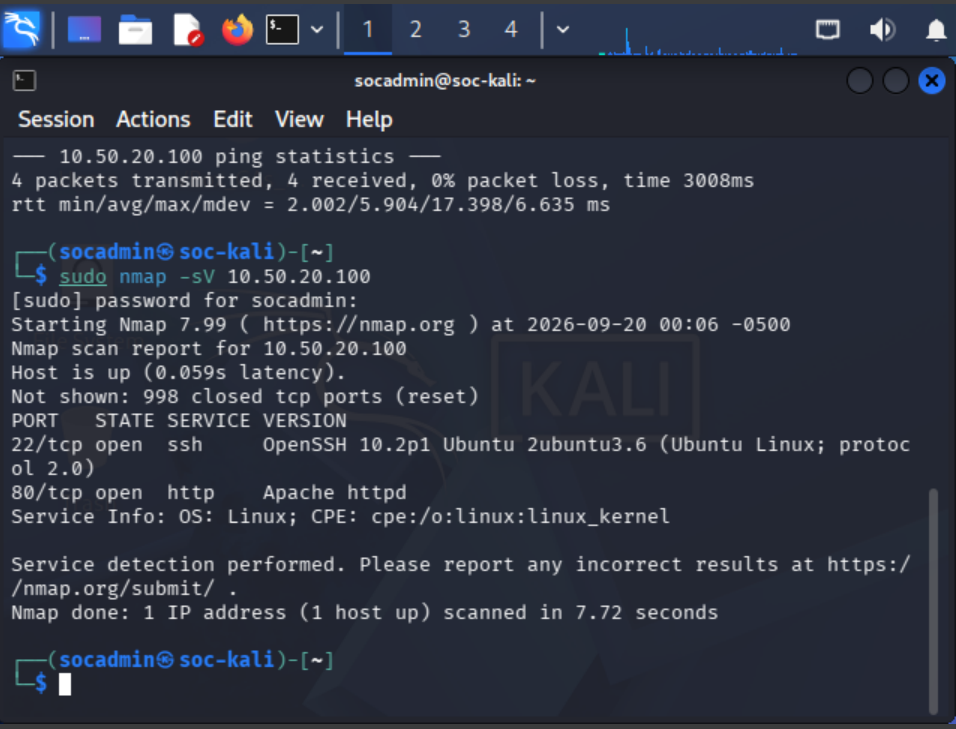

**Result:** ✅ Controlled reconnaissance successfully generated.

---

# 🛡️ Suricata Reconnaissance Detection

The reconnaissance traffic was visible to Suricata.

Suricata generated alerts associated with traffic from:

```text
10.10.10.103
```

to:

```text
10.50.20.100
```

Observed detections included:

```text
Internal Recon - Kali to Ubuntu
```

```text
Kali to Ubuntu Http Detection
```

and:

```text
ET SCAN Possible Nmap User-Agent Observed
```

This demonstrated network-layer visibility into the controlled reconnaissance.

The detection path was:

```text
SOC-Kali
10.10.10.103
      │
      ▼
Nmap Reconnaissance
      │
      ▼
OPNsense / Suricata
      │
      ▼
Reconnaissance Alert
```

## 📸 Evidence — Suricata Reconnaissance Detection

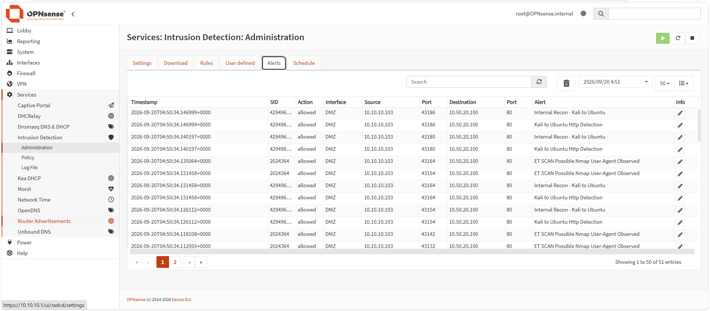

**Result:** ✅ Suricata detected the controlled reconnaissance.

---

# 🔐 Controlled SSH Authentication Test

After reconnaissance, controlled SSH authentication failures were generated from SOC-Kali against SOC-Ubuntu.

The command used was:

```bash
ssh phase14test@10.50.20.100
```

The intentionally invalid test account was:

```text
phase14test
```

Repeated authentication attempts produced:

```text
Permission denied
```

The test was intentionally controlled and performed only inside the lab.

The activity path was:

```text
SOC-Kali
10.10.10.103
      │
      ▼
SSH
phase14test
      │
      ▼
SOC-Ubuntu
10.50.20.100
      │
      ▼
Authentication Failure
```

## 📸 Evidence — Controlled SSH Authentication Failures

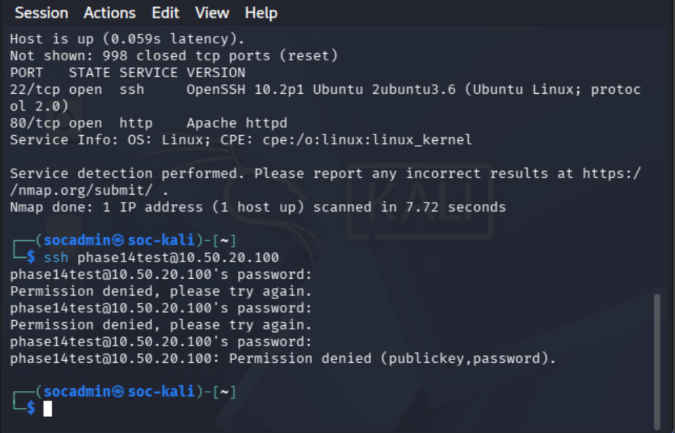

**Result:** ✅ Controlled failed-authentication telemetry generated.

---

# 🚨 Wazuh SSH Detection

Wazuh detected the SSH authentication activity generated against SOC-Ubuntu.

Two important authentication detections were observed.

## Rule 5710

```text
Rule: 5710
Level: 5
```

Description:

```text
sshd: Attempt to login using a non-existent user
```

This corresponded to:

```text
phase14test
```

---

## Rule 5503

```text
Rule: 5503
Level: 5
```

Description:

```text
PAM: User login failed.
```

These detections demonstrated that Wazuh could identify individual authentication failures on the Ubuntu endpoint.

## 📸 Evidence — Wazuh SSH Authentication Detection

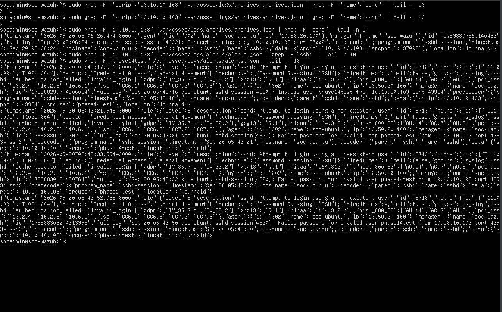

**Result:** ✅ Individual SSH authentication failures detected.

---

# 🔗 Kali-to-Ubuntu Event Correlation

The Wazuh event data confirmed the relationship between the source and target systems.

Source:

```text
SOC-Kali
10.10.10.103
```

Target:

```text
SOC-Ubuntu
10.50.20.100
```

This provided evidence that the authentication events originated from the expected controlled source.

## 📸 Evidence — Kali-to-Ubuntu Correlation

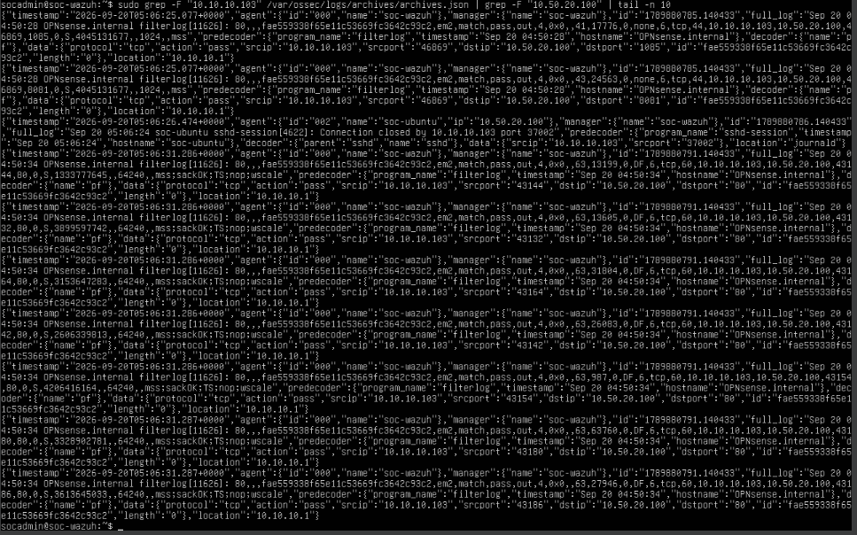

This step was important because identifying an authentication failure alone is not enough.

An analyst also needs to determine:

```text
Who initiated it?
        │
        ▼
What system was targeted?
        │
        ▼
What happened?
        │
        ▼
How severe is the activity?
```

**Result:** ✅ Source and destination correlation validated.

---

# 🔥 Level 10 Event Correlation

Repeated authentication failures resulted in a higher-level correlated Wazuh alert.

The important correlation event was:

```text
Rule ID: 2502
Level: 10
```

Description:

```text
syslog: User missed the password more than one time
```

This demonstrated the difference between:

```text
Individual Authentication Failure
```

and:

```text
Repeated Authentication Pattern
```

The correlation process was:

```text
Authentication Failure
        │
        ▼
Authentication Failure
        │
        ▼
Authentication Failure
        │
        ▼
Wazuh Correlation
        │
        ▼
Rule 2502
Level 10
```

## 📸 Evidence — Level 10 SSH Correlation

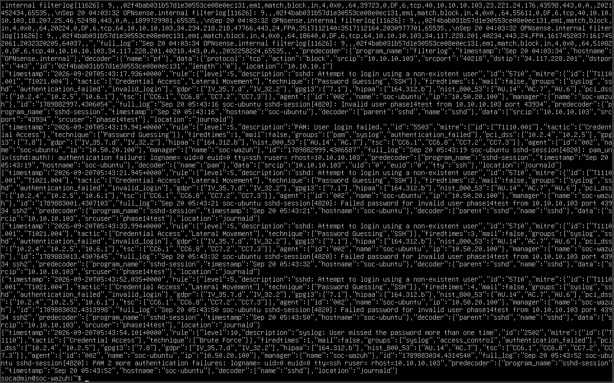

**Result:** ✅ Repeated authentication failures escalated into a Level 10 correlated alert.

---

# 🧾 Rule 2502 JSON Validation

The Rule 2502 event was validated directly in Wazuh's JSON alert data.

The command used was:

```bash
sudo grep 2502 /var/ossec/logs/alerts/alerts.json | tail -n 5
```

The JSON evidence confirmed information including:

```text
Rule ID: 2502
Level: 10
Agent: soc-ubuntu
Agent IP: 10.50.20.100
Source IP: 10.10.10.103
```

The authentication records contained PAM failure information and the source host:

```text
rhost=10.10.10.103
```

This provided raw log evidence supporting what was visible in the Wazuh interface.

## 📸 Evidence — Rule 2502 Level 10

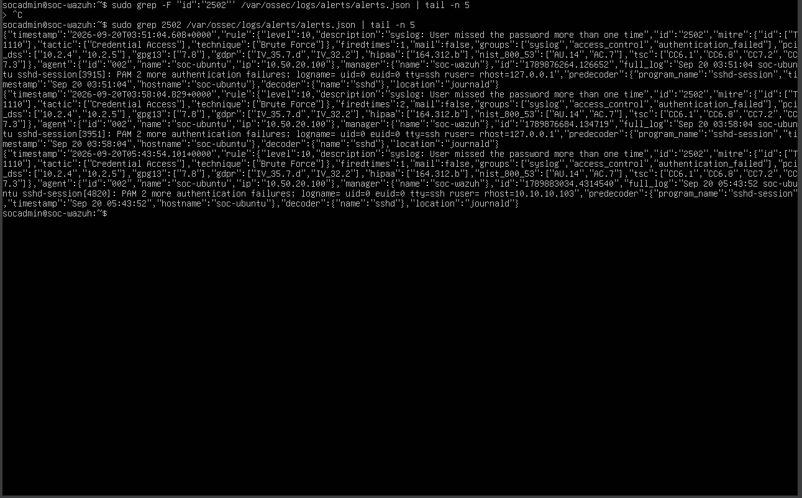

**Result:** ✅ Level 10 alert independently validated in Wazuh JSON logs.

---

# 🎯 MITRE ATT&CK Mapping

The correlated authentication activity was mapped to the MITRE ATT&CK framework.

The relevant behavior was associated with:

```text
Tactic:
Credential Access
```

and:

```text
Technique:
Brute Force
```

MITRE mapping adds behavioral context to security alerts.

Instead of seeing only:

```text
Authentication Failure
```

the analyst can interpret the activity as:

```text
Repeated Authentication Attempts
          │
          ▼
Credential Access Behavior
          │
          ▼
Brute Force
```

This provides a standardized language for communicating attacker behavior.

---

# 📧 SOC Email Notification Capability

Phase 13 established and validated the automated SOC email notification pipeline:

```text
Wazuh
   │
   ▼
Wazuh Integratord
   │
   ▼
custom-phase13-email
   │
   ▼
Python
   │
   ▼
Gmail API / OAuth 2.0
   │
   ▼
SOC Email
```

That notification capability remained part of the SOC architecture reviewed during Phase 14.

It is important to distinguish the two validation points:

```text
Phase 13
   │
   └── Proved automated Wazuh-to-email notification

Phase 14
   │
   └── Proved the controlled SSH incident detection,
       correlation, investigation, and closure workflow
```

The existing automated email evidence confirms that the notification capability works.

It is **not used here to claim that the specific Rule 2502 event shown in this Phase 14 investigation directly generated that particular email screenshot**.

This distinction keeps the portfolio evidence technically accurate.

---

# 🗂️ DFIR-IRIS Incident Investigation

After detecting and correlating the activity, the incident was formally investigated in DFIR-IRIS.

A new case was created:

```text
Case #3
```

Case title:

```text
Phase 14 - SSH Brute Force Incident
```

SOC identifier:

```text
SOC-2026-002
```

The case provided a central location for:

- Incident metadata
- Assets
- Indicators
- Timeline events
- Investigation notes
- Response tasks
- Final assessment
- Closure

The investigation workflow became:

```text
Wazuh Detection
       │
       ▼
Validate Evidence
       │
       ▼
Create IRIS Case
       │
       ▼
Document Assets
       │
       ▼
Document IOC
       │
       ▼
Build Timeline
       │
       ▼
Complete Tasks
       │
       ▼
Assess Response
       │
       ▼
Close Case
```

---

# 💻 Incident Assets

The two primary systems involved in the incident were documented in DFIR-IRIS.

## Source Asset

```text
Name: SOC-Kali
Type: Linux Computer
IP: 10.10.10.103
Compromised: No
```

## Target Asset

```text
Name: SOC-Ubuntu
Type: Linux Computer
IP: 10.50.20.100
Compromised: No
```

The investigation determined that neither asset had been compromised.

---

# 🔎 Incident IOC

The source IP was documented as an indicator associated with the controlled activity:

```text
10.10.10.103
```

Context:

```text
SOC-Kali
Controlled Security Testing Source
```

This demonstrates an important incident-response principle:

> An IOC must be interpreted in context.

In this investigation, the source IP was associated with intentionally generated lab activity rather than an unauthorized external attacker.

---

# 🕒 Incident Timeline

The DFIR-IRIS timeline reconstructed the major events of the investigation.

## Event 1 — Controlled SSH Authentication Test Initiated

```text
SOC-Kali
10.10.10.103
      │
      ▼
SSH authentication attempts
      │
      ▼
SOC-Ubuntu
10.50.20.100
```

---

## Event 2 — Wazuh Detects Repeated SSH Authentication Failures

Wazuh correlated the repeated authentication failures into:

```text
Rule 2502
Level 10
```

Source:

```text
10.10.10.103
```

Target:

```text
10.50.20.100
```

---

## Event 3 — Automated SOC Notification Capability Validation

The automated SOC notification capability developed in Phase 13 was reviewed as part of the complete SOC architecture.

This timeline entry documents the validated notification capability without asserting that the Phase 13 email screenshot was directly generated by this specific Rule 2502 event.

## 📸 Evidence — Incident Timeline


**Result:** ✅ Incident chronology documented.

---

# ✅ Incident Investigation Tasks

Five formal incident-response tasks were completed in DFIR-IRIS.

## Task 1

```text
Validate Wazuh SSH Authentication Alert
```

Purpose:

Confirm that the Wazuh authentication alert accurately represented the controlled SSH activity.

Status:

```text
Done
```

---

## Task 2

```text
Verify Automated SOC Email Notification
```

Purpose:

Confirm the automated SOC notification capability previously implemented and validated in Phase 13.

Status:

```text
Done
```

---

## Task 3

```text
Investigate SSH Authentication Source and Target
```

Purpose:

Validate:

```text
Source:
SOC-Kali
10.10.10.103

Target:
SOC-Ubuntu
10.50.20.100
```

Status:

```text
Done
```

---

## Task 4

```text
Assess Containment and Remediation Requirements
```

Purpose:

Determine whether the controlled activity resulted in unauthorized access or required security containment.

Finding:

```text
No unauthorized access occurred.
No system compromise was identified.
```

Status:

```text
Done
```

---

## Task 5

```text
Complete Final Incident Review and Closure
```

Purpose:

Review the evidence, confirm investigation findings, document the final disposition, and close the incident.

Status:

```text
Done
```

## 📸 Evidence — Completed IRIS Tasks

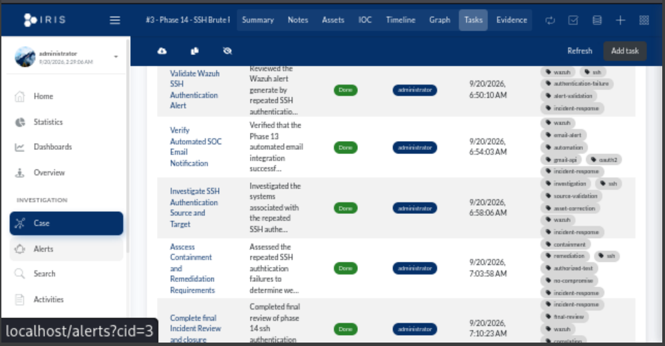

**Result:** ✅ All five investigation tasks completed.

---

# 🔗 Incident Graph

DFIR-IRIS was used to visualize the relationships among the incident entities.

The investigation linked:

```text
SOC-Kali
10.10.10.103
      │
      │ SSH Activity
      ▼
SOC-Ubuntu
10.50.20.100
      │
      ▼
Wazuh Detection
      │
      ▼
Incident Case
SOC-2026-002
```

## 📸 Evidence — Incident Graph

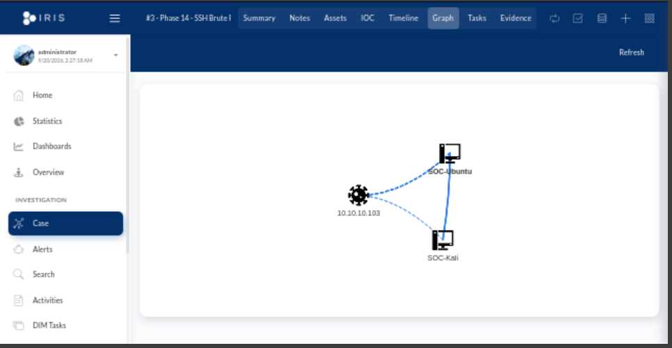

The graph provided a visual representation of the systems and evidence associated with the investigation.

---

# 🛠️ Containment and Remediation Assessment

A professional incident-response process should not automatically perform containment simply because an alert exists.

The analyst must first determine:

```text
Is the activity malicious?
        │
        ▼
Was access successful?
        │
        ▼
Was the system compromised?
        │
        ▼
Is containment required?
        │
        ▼
Is remediation required?
```

For this incident:

```text
Activity:
Authorized controlled security test

Unauthorized Access:
No

Compromise:
No

Containment Required:
No additional containment

Remediation Required:
No additional remediation

Recovery Required:
No additional recovery
```

This was important because unnecessary containment could disrupt a legitimate system.

The correct response was to document the activity, validate that no compromise occurred, and close the case.

---

# 🕐 Wazuh Timezone Troubleshooting

During validation, Wazuh timestamps required timezone correction so that event times aligned with the local investigation timeline.

The timezone was changed using:

```bash
sudo timedatectl set-timezone America/Chicago
```

The system was then validated to confirm the local timezone and synchronization state.

The final configuration reflected:

```text
America/Chicago
CDT
```

with time synchronization active.

This was important because timestamp accuracy affects:

- Event correlation
- Timeline reconstruction
- Incident documentation
- Cross-system log comparison
- Investigation accuracy

The troubleshooting lesson was:

```text
Correct Event
     +
Incorrect Time Context
     =
Difficult Investigation
```

Time synchronization and timezone configuration are therefore important parts of security operations.

---

# 🔒 Incident Closure

After reviewing the evidence and completing the response tasks, the incident was formally closed.

Case:

```text
#3 - Phase 14 - SSH Brute Force Incident
```

SOC ID:

```text
SOC-2026-002
```

Final status:

```text
Closed
```

Close date:

```text
2026-09-20
```

The final investigation determined:

```text
Controlled Activity:
Confirmed

Wazuh Detection:
Confirmed

Level 10 Correlation:
Confirmed

Source:
SOC-Kali
10.10.10.103

Target:
SOC-Ubuntu
10.50.20.100

Unauthorized Access:
No

System Compromise:
No

Additional Containment:
Not Required

Additional Remediation:
Not Required
```

## 📸 Evidence — IRIS Case Summary

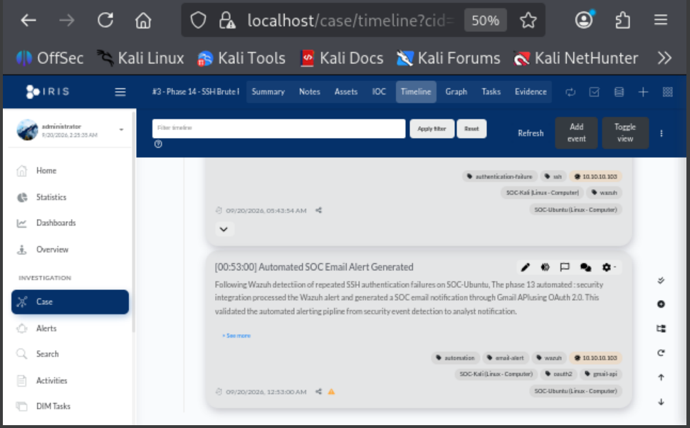

---

## 📸 Evidence — Closed Incident

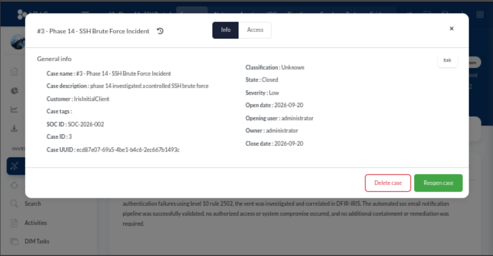

**Result:** ✅ Incident formally closed.

---

# 📝 Final Incident Summary

The final incident summary was:

```text
Phase 14 investigated a controlled SSH brute-force simulation
from SOC-Kali (10.10.10.103) to SOC-Ubuntu (10.50.20.100).

Wazuh detected the repeated authentication failures using
Level 10 Rule 2502, and the event was investigated and
correlated in DFIR-IRIS.

The automated SOC email notification pipeline was successfully
validated. No unauthorized access or system compromise occurred,
and no additional containment or remediation was required.
```

This represented the final disposition of the controlled incident.

---

# 💻 Commands Used

## Nmap Service Discovery

Executed from SOC-Kali:

```bash
sudo nmap -sV 10.50.20.100
```

Purpose:

```text
Generate controlled reconnaissance traffic and identify
services exposed by SOC-Ubuntu.
```

---

## Controlled SSH Authentication

Executed from SOC-Kali:

```bash
ssh phase14test@10.50.20.100
```

Purpose:

```text
Generate controlled failed SSH authentication activity
for Wazuh detection and correlation.
```

Repeated authentication failures were intentionally generated inside the isolated lab.

---

## Wazuh Rule 2502 Validation

Executed on SOC-Wazuh:

```bash
sudo grep 2502 /var/ossec/logs/alerts/alerts.json | tail -n 5
```

Purpose:

```text
Validate the correlated Level 10 Rule 2502 alert directly
from Wazuh JSON alert data.
```

---

## Wazuh Timezone Correction

```bash
sudo timedatectl set-timezone America/Chicago
```

Purpose:

```text
Align Wazuh event timestamps with the local incident
investigation timeline.
```

---

# 🔧 Troubleshooting

Phase 14 required correlation across multiple technologies.

This created several important troubleshooting considerations.

---

## 1. Individual Events vs Correlated Events

Initial authentication failures generated lower-level events such as:

```text
Rule 5710
Level 5
```

and:

```text
Rule 5503
Level 5
```

The repeated pattern later produced:

```text
Rule 2502
Level 10
```

This reinforced:

```text
Single Event
    ≠
Correlated Pattern
```

An analyst must understand both individual telemetry and higher-level correlation.

---

## 2. Validate Dashboard Findings Against Raw Logs

The Wazuh dashboard showed the correlated event.

The alert was also validated directly in:

```text
/var/ossec/logs/alerts/alerts.json
```

using:

```bash
sudo grep 2502 /var/ossec/logs/alerts/alerts.json | tail -n 5
```

This provided a second source of evidence.

---

## 3. Source and Destination Context Matter

An authentication failure by itself does not explain the entire incident.

The investigation confirmed:

```text
Source:
10.10.10.103

Destination:
10.50.20.100
```

This established the relationship between SOC-Kali and SOC-Ubuntu.

---

## 4. Timezone Accuracy Matters

Incorrect timezone interpretation can make events appear to occur at different times across systems.

Correcting SOC-Wazuh to:

```text
America/Chicago
```

made timeline interpretation easier and more accurate.

---

## 5. Detection Does Not Automatically Mean Compromise

The Level 10 alert represented suspicious repeated authentication behavior.

However, investigation showed:

```text
Successful Unauthorized Access:
No
```

Therefore:

```text
High-Severity Detection
        ≠
Confirmed Compromise
```

---

## 6. Automated Email Evidence Must Be Interpreted Correctly

Phase 13 independently proved the automated Wazuh-to-Gmail notification pipeline.

Phase 14 proved the SSH detection and incident-response workflow.

The project therefore demonstrates both capabilities without claiming unsupported causality between a particular Rule 2502 alert and an email screenshot captured during a separate validation.

---

# 💡 Lessons Learned

## 1. SOC Investigations Require Multiple Data Sources

No single security tool provided the entire incident picture.

```text
Suricata
   │
   └── Network activity

Wazuh
   │
   └── Endpoint authentication + correlation

MITRE ATT&CK
   │
   └── Behavioral context

DFIR-IRIS
   │
   └── Case management and response

Email Automation
   │
   └── Notification capability
```

---

## 2. Detection and Correlation Are Different

Individual authentication failures were detected first.

Wazuh then correlated repeated failures into a higher-severity event.

```text
Detect
   ↓
Correlate
   ↓
Prioritize
```

---

## 3. Raw Logs Are Important Evidence

Dashboards make events easier to investigate, but raw JSON logs provide direct evidence of what the SIEM recorded.

Both are valuable.

---

## 4. High Severity Does Not Automatically Mean Compromise

Rule 2502 reached:

```text
Level 10
```

but investigation still had to determine whether access succeeded.

No unauthorized access was identified.

---

## 5. Incident Response Requires Context

The source IP looked suspicious when viewed only as repeated SSH failures.

Investigation established that it belonged to:

```text
SOC-Kali
10.10.10.103
```

and was performing authorized controlled testing.

Context changed the final incident disposition.

---

## 6. Containment Should Be Evidence-Based

Containment was not performed simply because an alert existed.

The investigation determined whether containment was actually necessary.

This prevented unnecessary disruption.

---

## 7. Time Synchronization Is Critical

Security events from multiple systems must be correlated by time.

Incorrect timezone settings can create confusion during timeline reconstruction.

---

## 8. Case Management Creates Accountability

DFIR-IRIS transformed individual alerts into a structured investigation containing:

- Assets
- Indicators
- Timeline
- Tasks
- Evidence
- Findings
- Response decisions
- Closure

---

## 9. Automation Supports Analysts Rather Than Replacing Them

Phase 13 provided automated notification.

Phase 14 still required human analysis to determine:

```text
What happened?
Who generated it?
Was access successful?
Was anything compromised?
Is containment required?
Can the incident be closed?
```

---

## 10. End-to-End Validation Is Stronger Than Tool Validation

Testing each tool individually proved that the technology worked.

Phase 14 demonstrated that the overall SOC process worked.

```text
Generate
   ↓
Detect
   ↓
Correlate
   ↓
Investigate
   ↓
Respond
   ↓
Document
   ↓
Close
```

---

# 🧠 Skills Demonstrated

| Skill | Application |
|---|---|
| **SOC Operations** | Performed complete security investigation workflow |
| **Nmap** | Generated controlled reconnaissance |
| **SSH** | Generated controlled authentication telemetry |
| **Suricata** | Detected reconnaissance activity |
| **Wazuh** | Detected endpoint authentication events |
| **SIEM Correlation** | Correlated repeated failures into Rule 2502 |
| **Log Analysis** | Validated events using raw JSON |
| **MITRE ATT&CK** | Classified brute-force behavior |
| **Incident Response** | Investigated and documented controlled incident |
| **DFIR-IRIS** | Managed formal incident case |
| **IOC Analysis** | Documented and contextualized source IP |
| **Timeline Analysis** | Reconstructed incident chronology |
| **Case Management** | Completed structured response tasks |
| **Containment Analysis** | Determined containment was unnecessary |
| **Remediation Analysis** | Determined additional remediation was unnecessary |
| **Linux Administration** | Validated logs and system time |
| **Security Automation** | Incorporated validated notification capability |
| **Evidence Analysis** | Distinguished detection from compromise |
| **Documentation** | Produced complete incident record |

---

# 📸 Evidence Summary

Phase 14 contains the following evidence:

| # | Evidence | Screenshot |
|---|---|---|
| 1 | Controlled SSH Authentication Failures | `phase14-controlled-ssh-authentication-failures.png` |
| 2 | Kali Nmap Reconnaissance | `phase14-kali-reconnaissance-nmap.png` |
| 3 | Suricata Reconnaissance Detection | `phase14-suricata-reconnaissance-detection.png` |
| 4 | Wazuh SSH Authentication Detection | `phase14-wazuh-ssh-authentication-detection.png` |
| 5 | Kali-to-Ubuntu Wazuh Correlation | `phase14-wazuh-kali-ubuntu-correlation.png` |
| 6 | Wazuh Level 10 SSH Correlation | `phase14-wazuh-level10-ssh-correlation.png` |
| 7 | Wazuh Rule 2502 Level 10 Evidence | `phase14-wazuh-rule2502-level10-evidence.png` |
| 8 | IRIS Incident Timeline | `phase14-iris-incident-timeline.png` |
| 9 | IRIS Completed Tasks | `phase14-iris-completed-tasks.png` |
| 10 | IRIS Incident Graph | `phase14-iris-incident-graph.png` |
| 11 | IRIS Case Summary | `phase14-iris-case-summary.png` |
| 12 | IRIS Case Closed | `phase14-iris-case-closed.png` |

Because this document is stored under:

```text
docs/
```

the screenshot paths use:

```text
../images/<filename>
```

For example:

```markdown

```

---

# 💾 VirtualBox Snapshot

The final incident-response workflow was preserved after the investigation was completed.

## Snapshot VM

```text
SOC-Kali
```

## Snapshot Name

```text
Phase 14 - Incident Response Workflow Complete
```

## Snapshot Description

```text
Phase 14 completed.

Validated the end-to-end SOC incident detection,
correlation, investigation, and response workflow.

Completed:
- Controlled Nmap reconnaissance
- Controlled SSH authentication failures
- Suricata reconnaissance detection
- Wazuh SSH authentication detection
- Wazuh Rule 5710 validation
- Wazuh Rule 5503 validation
- Wazuh Rule 2502 Level 10 correlation
- Raw JSON alert validation
- MITRE ATT&CK mapping
- SOC notification capability review
- DFIR-IRIS Case #3
- SOC-2026-002
- Asset documentation
- IOC documentation
- Incident timeline
- Five completed response tasks
- Containment/remediation assessment
- Final incident review
- Formal case closure

No unauthorized access or system compromise occurred.
```

> **Note:** The VirtualBox snapshot is a VM recovery checkpoint and does not need to exist as a PNG in the GitHub `images` directory unless a separate screenshot was intentionally captured.

---

# 🔄 Final SOC Workflow

The completed Enterprise Security Operations Lab demonstrated the following end-to-end workflow:

```text
                    SECURITY ACTIVITY
                           │
                           ▼
                       SOC-Kali
                     10.10.10.103
                           │
             ┌─────────────┴─────────────┐
             │                           │
             ▼                           ▼
     Nmap Reconnaissance         SSH Authentication
             │                           │
             └─────────────┬─────────────┘
                           │
                           ▼
                       OPNsense
                           │
                           ▼
                       Suricata
                           │
                           ▼
                       SOC-Ubuntu
                      10.50.20.100
                           │
                           ▼
                         Wazuh
                           │
                ┌──────────┼──────────┐
                │          │          │
                ▼          ▼          ▼
             Detect     Correlate    MITRE
                           │
                           ▼
                  Security Alert
                           │
                           ▼
                 SOC Notification
                     Capability
                           │
                           ▼
                       DFIR-IRIS
                           │
                           ▼
                    Incident Case
                           │
              ┌────────────┼────────────┐
              │            │            │
              ▼            ▼            ▼
           Assets         IOC        Timeline
              │            │            │
              └────────────┼────────────┘
                           │
                           ▼
                     Investigation
                           │
                           ▼
                  Response Assessment
                           │
                           ▼
                    Documentation
                           │
                           ▼
                      Case Closed

                           ✅
```

This represented the final integration of the project's major security technologies.

---

# 🏁 Phase Outcome

## ✅ Phase 14 Complete

Phase 14 successfully validated the **end-to-end SOC incident detection, correlation, investigation, and response workflow**.

Controlled reconnaissance and SSH authentication activity were generated from:

```text
SOC-Kali
10.10.10.103
```

against:

```text
SOC-Ubuntu
10.50.20.100
```

Suricata detected reconnaissance activity.

Wazuh detected individual SSH authentication failures using Rules 5710 and 5503.

Repeated authentication failures were correlated into:

```text
Rule 2502
Level 10
```

The event was independently validated in:

```text
/var/ossec/logs/alerts/alerts.json
```

and mapped to MITRE ATT&CK Credential Access / Brute Force behavior.

The incident was then investigated in DFIR-IRIS as:

```text
Case #3
SOC-2026-002
Phase 14 - SSH Brute Force Incident
```

The investigation documented:

- Source asset
- Target asset
- Source IOC
- Incident timeline
- Wazuh evidence
- Five investigation tasks
- Containment assessment
- Remediation assessment
- Final disposition

The investigation determined:

```text
Unauthorized Access:
No

System Compromise:
No

Additional Containment:
Not Required

Additional Remediation:
Not Required
```

The incident was formally closed on:

```text
2026-09-20
```

The completed workflow was:

```text
Generate
   ↓
Detect
   ↓
Correlate
   ↓
Notify
   ↓
Investigate
   ↓
Assess
   ↓
Document
   ↓
Close

   ✅
```

---

# 🎓 Project Completion

## 🏆 Enterprise Security Operations Lab Complete

Phase 14 completes the Enterprise Security Operations Lab.

Across the project, the environment progressed from basic virtualization and network segmentation into an integrated security operations environment containing:

```text
VirtualBox
    │
    ▼
OPNsense Firewall
    │
    ▼
Network Segmentation
    │
    ▼
Windows + Linux Endpoint Monitoring
    │
    ▼
Wazuh SIEM/XDR
    │
    ▼
Suricata IDS
    │
    ▼
Security Monitoring & Correlation
    │
    ▼
Vulnerability Assessment
    │
    ▼
Python + PostgreSQL Security Automation
    │
    ▼
Threat Intelligence
    │
    ▼
Centralized Logging
    │
    ▼
DFIR-IRIS Incident Response
    │
    ▼
Web Application Security
    │
    ▼
Python + Gmail API SOC Automation
    │
    ▼
End-to-End SOC Incident Response
```

The project demonstrates practical experience across:

**Network Security • SIEM • IDS • Endpoint Monitoring • Detection Engineering • Log Analysis • Threat Hunting • Vulnerability Management • Threat Intelligence • Python Automation • APIs • OAuth 2.0 • Incident Response • Web Security • SOC Operations**

The final result is a portfolio environment demonstrating the complete lifecycle:

```text
BUILD
  ↓
MONITOR
  ↓
DETECT
  ↓
CORRELATE
  ↓
AUTOMATE
  ↓
INVESTIGATE
  ↓
RESPOND
  ↓
DOCUMENT
  ↓
IMPROVE
```

---

[← Phase 13](phase-13-email-automation.md) | [🏠 Back to Main Project](../README.md)

---

### Enterprise Security Operations Lab

**SOC Operations • Suricata • Wazuh • MITRE ATT&CK • DFIR-IRIS • Incident Response • Security Automation**
